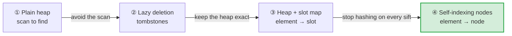
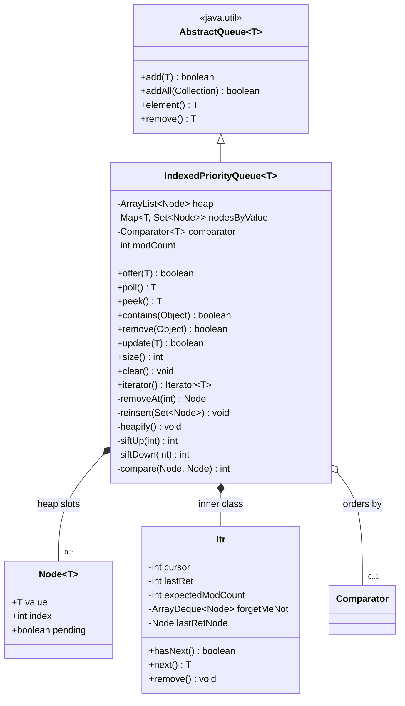
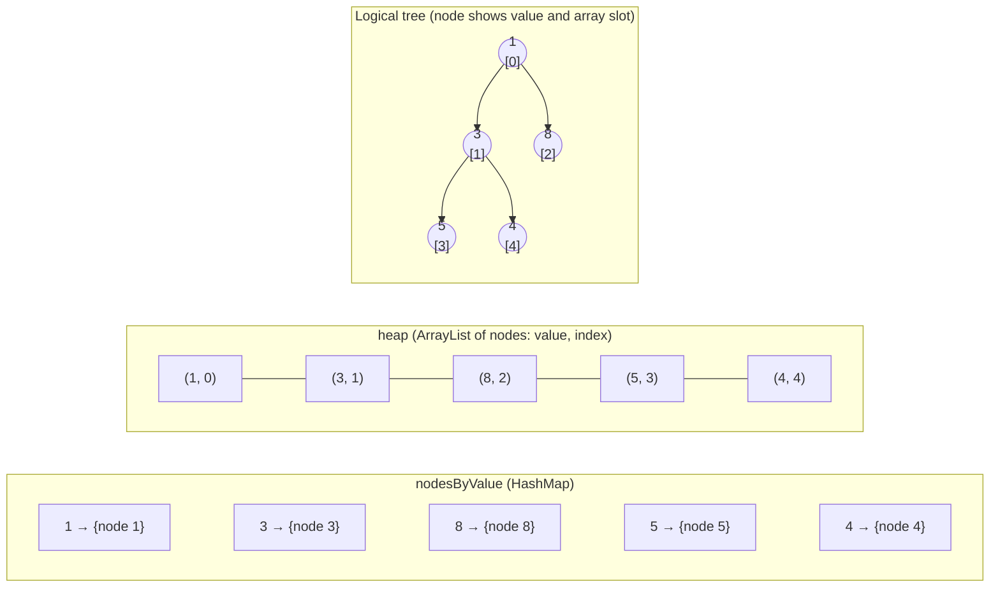
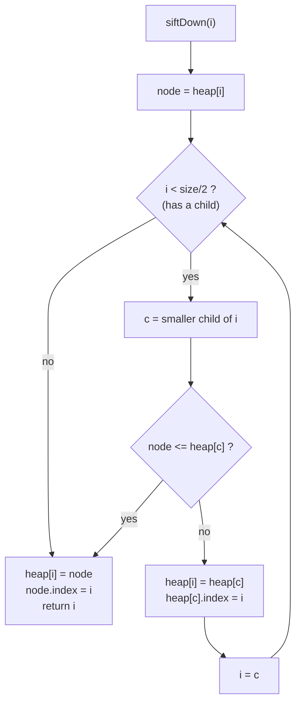
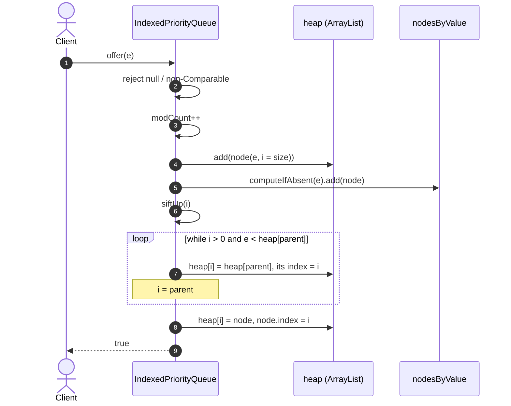
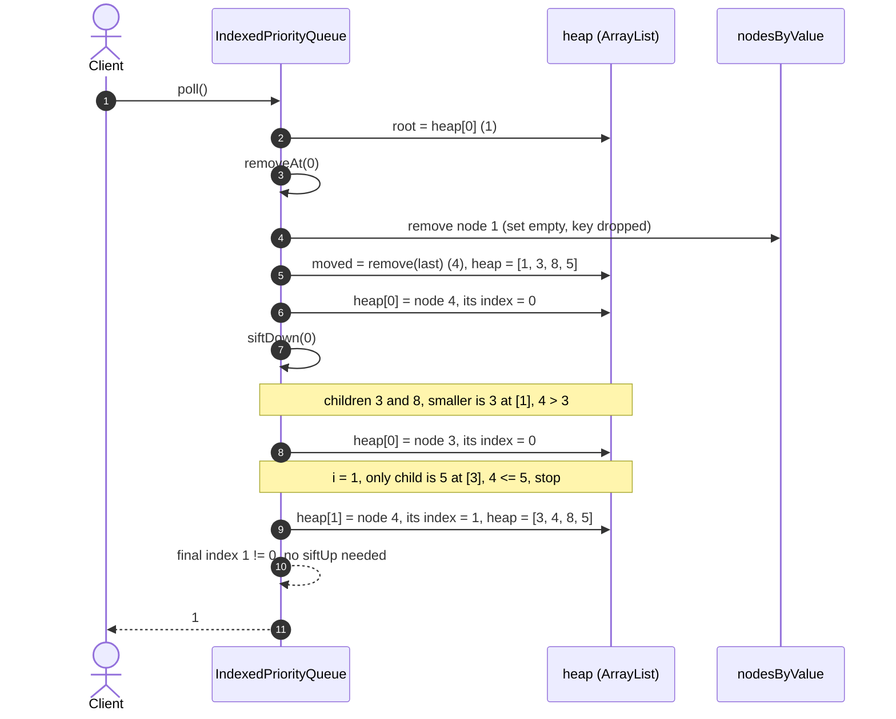
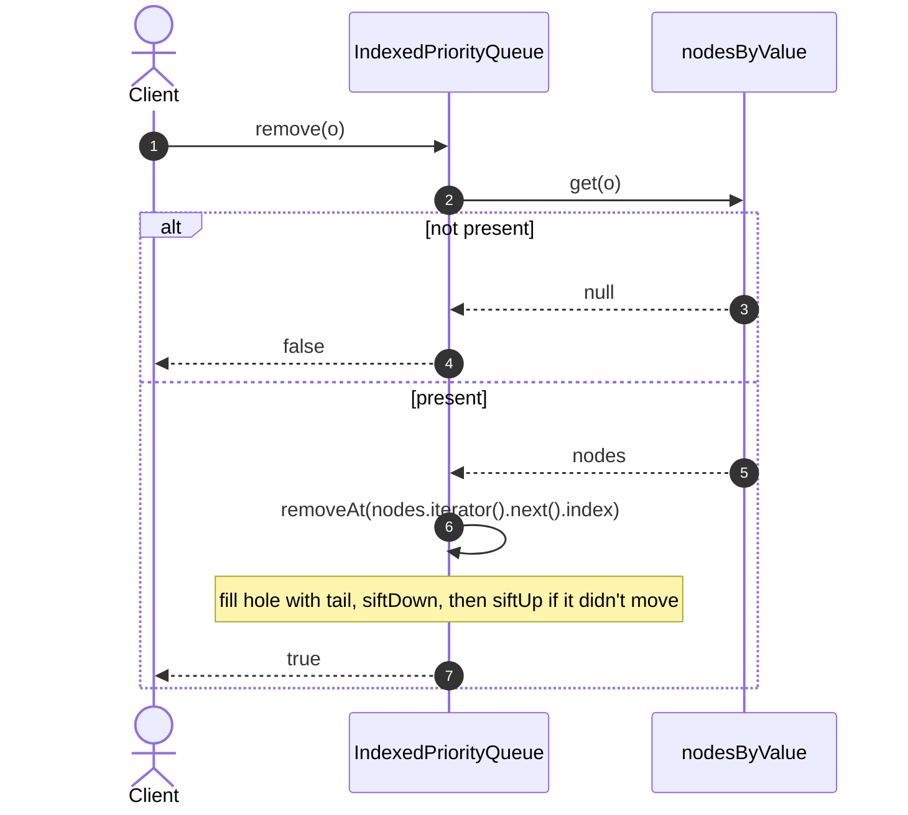
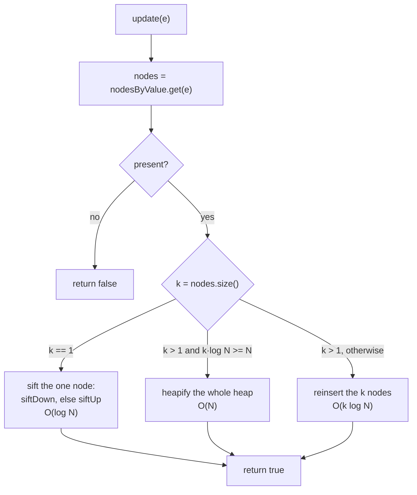
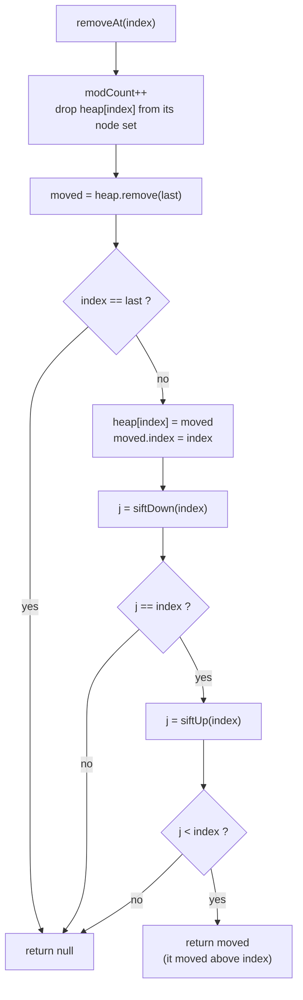
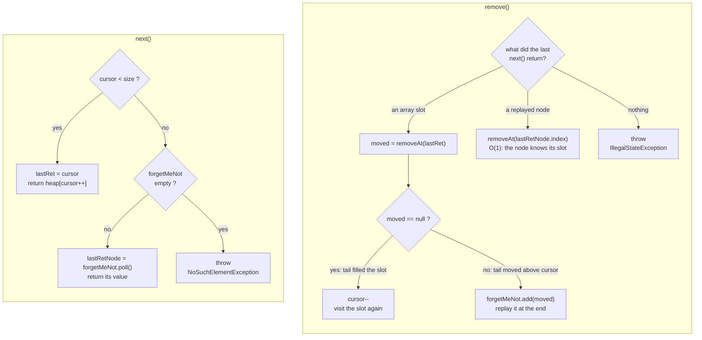

# IndexedPriorityQueue: a priority queue you can change your mind about

A binary min-heap that also knows **where every element is**. That makes `remove(e)` and
`update(e)` (re-prioritise) **O(log N)** and `contains(e)` **O(1)**. With
`java.util.PriorityQueue` those first two calls are **O(N)**.

**How to use this document**

- **Part 1, the interview playbook**: a 60-minute script. It covers what to say, what to draw and
  what to code, in order, with time boxes. Rehearse this part.
- **Part 2, the reference**: the full production design (duplicates, multi-copy `update`, the
  fail-fast iterator), with diagrams. Use it for deep dives and follow-up questions.

**Contents**

- [Part 1: Interview playbook (60 min)](#part-1-interview-playbook-60-min)
  - [The 30-second pitch](#the-30-second-pitch)
  - [Time plan](#time-plan)
  - [Phase 1: Clarify requirements (0–5)](#phase-1-clarify-requirements-05-min)
  - [Phase 2: Approaches and trade-offs (5–12)](#phase-2-approaches-and-trade-offs-512-min)
  - [Phase 3: API, data layout and invariants (12–17)](#phase-3-api-data-layout-and-invariants-1217-min)
  - [Phase 4: Code it (17–40)](#phase-4-code-it-1740-min)
  - [Phase 5: Walk through and test (40–47)](#phase-5-walk-through-and-test-4047-min)
  - [Phase 6: Deep dives and extensions (47–57)](#phase-6-deep-dives-and-extensions-4757-min)
  - [Phase 7: Wrap up (57–60)](#phase-7-wrap-up-5760-min)
  - [Likely questions with crisp answers](#likely-questions-with-crisp-answers)
  - [Pitfalls that cost points](#pitfalls-that-cost-points)
  - [One-screen cheat sheet](#one-screen-cheat-sheet)
- [Part 2: Reference design](#part-2-reference-design)
  - [Design approaches](#design-approaches), [Inside the chosen design](#inside-the-chosen-design),
    [Sifting](#sifting-moving-a-hole-instead-of-swapping), [Sequence diagrams](#sequence-diagrams)
  - [`update` with duplicates](#updatee-re-keying-in-place), [`removeAt`](#removeatindex-the-core-removal),
    [Iterator](#iterator), [Usage](#usage), [Testing](#how-it-is-tested)

---

# Part 1: Interview playbook (60 min)

## The 30-second pitch

> "A heap answers *what's next* in O(log N), but it can't answer *where is X*. So cancelling or
> re-prioritising an element means scanning the array, which is O(N). I keep the heap as it is
> and add an index from each element to its heap node. Each node records its own array slot, and
> every sift keeps that slot up to date. Finding an element becomes one hash lookup. Fixing the
> heap around it is one sift, so `remove` and `update` cost O(log N) and `contains` costs O(1).
> You need this whenever priorities change after insertion: timers, schedulers, Dijkstra's
> decrease-key, least-loaded balancing and LFU caches."

## Time plan

| Min | Phase | Output on the whiteboard | Goal |
|---|---|---|---|
| 0–5 | Clarify | requirements list, assumptions | Show that you scope before you build |
| 5–12 | Approaches | 4-row comparison, choice | Show that you know the trade-offs |
| 12–17 | API and layout | method list, tree/array/map drawing, 2 invariants | Agree on the contract before coding |
| 17–40 | Code | ~90 lines of Java | Working, readable code |
| 40–47 | Walk through and test | trace `poll` and `remove`, list of edge cases | Prove that it is correct |
| 47–57 | Deep dives | duplicates, concurrency, scale | Show seniority |
| 57–60 | Wrap up | summary of complexities and trade-offs | Finish clean |

**If you are running late:** skip `update` while coding (it is three lines once `resift` exists)
and say that you would add it. Never skip the walk-through.

## Phase 1: Clarify requirements (0–5 min)

Ask these questions, then state the assumption you will use if the interviewer leaves it to you:

| Question | Default assumption | Why it matters |
|---|---|---|
| Which operations? | `offer`, `poll`, `peek`, `contains`, `remove(e)`, `update(e)` | `remove` and `update` are the reason this exists |
| Min-heap or max-heap? | Min-heap, with an optional `Comparator` | A max-heap is just a reversed comparator |
| Duplicates (`equals` elements)? | **Unique** in the live code; duplicates come up as a deep dive | Duplicates make the index and `update` much harder |
| How does priority change? | The caller changes the element in place, then calls `update(e)` | Gives the **key-stability contract** (below) |
| Nulls? | Rejected | Avoids ambiguity, since `poll()` returns `null` when the queue is empty |
| Thread-safety? | Single-threaded; concurrency comes up as a deep dive | Keeps the core simple |
| Expected N and operation mix? | ~10⁶ elements, frequent cancels | Justifies the extra memory per element |

**State the key-stability contract out loud:**
> "`equals` and `hashCode` must not change while an element is queued, or the index can't find
> it. The *priority*, meaning whatever the comparator reads, may change, as long as `update` is
> called afterwards."

## Phase 2: Approaches and trade-offs (5–12 min)

Draw this table. Each row fixes the weakness of the row above it:

| # | Approach | `remove` / `update` | `contains` | Weakness |
|---|---|---|---|---|
| ① | Plain heap, scan to find | O(N) | O(N) | Every cancel is a full scan |
| ② | Lazy deletion (tombstones, re-push on change) | O(1) mark / O(log N) push | needs a side map | The heap fills with stale entries, and `poll` has to skip them |
| ③ | Heap + `Map<T, Integer>` slot map | O(log N) | O(1) | About 3 hash operations per sift **level** |
| ④ | **Heap of nodes that store their own index + `Map<T, Node>`** | **O(log N)** | **O(1)** | One small object per element |

**Then justify the choice:**
> "③ and ④ have the same big-O. ④ touches the hash map once per *call*, not once per sift
> *level*. When a node moves, I only write an `int` into the node. So the sift loop is pure array
> work, and a bad `hashCode` slows one lookup instead of every step."

**Alternatives to mention, so they don't come up as a surprise:**

- **`TreeSet` / `TreeMap` with a `(priority, id)` key**: O(log N) for everything, with sorted
  iteration for free. Re-keying is remove + re-add. The heap wins on constants: a contiguous
  array, O(1) `peek`, O(N) bulk build, and no rebalancing.
- **Lazy deletion** is the right call for Dijkstra when memory is plentiful and you don't need
  `contains`. It is simpler to write.
- **Timing wheels** (Kafka purgatory, Netty `HashedWheelTimer`) are better when priorities are
  times on a coarse integer grid: O(1) insert and cancel.

**Prior art, which shows that ④ is a production pattern:** the JDK's `ScheduledThreadPoolExecutor`
stores a `heapIndex` in each task so that `cancel` is O(log N). Netty's `DefaultPriorityQueue`
does the same through `PriorityQueueNode`. Redis sorted sets pair a hash map with a skip list for
the same reason.

## Phase 3: API, data layout and invariants (12–17 min)

**API:**

```java
class IndexedMinPQ<T> {
    IndexedMinPQ(Comparator<? super T> cmp)
    boolean offer(T e)      // O(log N)
    T       poll()          // O(log N)
    T       peek()          // O(1)
    boolean contains(T e)   // O(1) expected
    boolean remove(T e)     // O(log N)
    boolean update(T e)     // O(log N), call after e's priority changed
    int     size()
}
```

**Draw the three structures for `offer(5, 3, 8, 1, 4)`:**

```
 tree (implicit)          heap: ArrayList<Node>                nodes: HashMap<T, Node>
        1 [0]             [0]     [1]     [2]     [3]     [4]  1 -> (1,0)   3 -> (3,1)
       /     \            (1,0)   (3,1)   (8,2)   (5,3)   (4,4) 8 -> (8,2)   5 -> (5,3)
    3 [1]   8 [2]          Node = (value, index)               4 -> (4,4)
    /   \
 5 [3]  4 [4]             parent(i) = (i-1)/2   children = 2i+1, 2i+2   leaves: i >= size/2
```

**Two invariants. Write them down; every method has to preserve both:**

1. **Heap order:** for every `i > 0`, `heap[parent(i)] <= heap[i]`.
2. **Index consistency:** for every `i`, `heap[i].index == i`, and `nodes.get(heap[i].value) == heap[i]`.

> "I'll route every array write through one helper, `place(node, i)`, which sets both
> `heap[i]` and `node.index`. That way invariant 2 can't drift."

## Phase 4: Code it (17–40 min)

Write the code in this order, narrating as you go: fields → `place` → `siftUp` → `siftDown` →
`offer` / `peek` / `poll` → `removeAt` → `remove` → `update`. This version has been compiled and
fuzz-tested against a brute-force model.

```java
import java.util.*;

public class IndexedMinPQ<T> {
    private static final class Node<T> {
        final T value;
        int index;                       // always == this node's slot in heap
        Node(T value, int index) { this.value = value; this.index = index; }
    }

    private final List<Node<T>> heap = new ArrayList<>();
    private final Map<T, Node<T>> nodes = new HashMap<>();  // element -> its node
    private final Comparator<? super T> cmp;

    public IndexedMinPQ(Comparator<? super T> cmp) { this.cmp = cmp; }

    public int size()               { return heap.size(); }
    public boolean contains(T e)    { return nodes.containsKey(e); }
    public T peek()                 { return heap.isEmpty() ? null : heap.get(0).value; }

    public boolean offer(T e) {
        Objects.requireNonNull(e);
        if (nodes.containsKey(e)) return false;        // unique elements in this version
        Node<T> n = new Node<>(e, heap.size());
        heap.add(n);
        nodes.put(e, n);
        siftUp(n.index);
        return true;
    }

    public T poll() {
        if (heap.isEmpty()) return null;
        T top = heap.get(0).value;
        removeAt(0);
        return top;
    }

    public boolean remove(T e) {
        Node<T> n = nodes.get(e);
        if (n == null) return false;
        removeAt(n.index);
        return true;
    }

    /** Call after e's priority changed in place. */
    public boolean update(T e) {
        Node<T> n = nodes.get(e);
        if (n == null) return false;
        resift(n.index);
        return true;
    }

    private void removeAt(int i) {
        nodes.remove(heap.get(i).value);
        Node<T> tail = heap.remove(heap.size() - 1);
        if (i == heap.size()) return;                  // we removed the tail itself
        place(tail, i);
        resift(i);                                     // tail may need to go down OR up
    }

    private void resift(int i) {
        if (siftDown(i) == i) siftUp(i);
    }

    private int siftUp(int i) {
        Node<T> n = heap.get(i);
        while (i > 0) {
            int p = (i - 1) >>> 1;
            if (!less(n, heap.get(p))) break;          // parent <= n: done
            place(heap.get(p), i);                     // shift parent down into the hole
            i = p;
        }
        place(n, i);
        return i;
    }

    private int siftDown(int i) {
        Node<T> n = heap.get(i);
        int half = heap.size() >>> 1;                  // nodes at i >= half are leaves
        while (i < half) {
            int c = 2 * i + 1;
            if (c + 1 < heap.size() && less(heap.get(c + 1), heap.get(c))) c++;
            if (!less(heap.get(c), n)) break;          // n <= smaller child
            place(heap.get(c), i);                     // shift child up into the hole
            i = c;
        }
        place(n, i);
        return i;
    }

    private void place(Node<T> n, int i) { heap.set(i, n); n.index = i; }

    private boolean less(Node<T> a, Node<T> b) { return cmp.compare(a.value, b.value) < 0; }
}
```

**What to say while writing each piece:**

| Piece | Say this |
|---|---|
| `Node.index` | "The node carries its own position, so a sift updates an `int` instead of the map." |
| `place` | "This is the single choke point for invariant 2." |
| sift loops | "I move a *hole* instead of swapping pairs: one write per level, and the sifted node is written once at the end." |
| `half = size/2` | "Every index from `size/2` up is a leaf, so the loop stops there." |
| `siftDown` picks the smaller child | "Promoting the smaller child keeps the other subtree valid." |
| `removeAt` | "Fill the hole with the tail. The tail came from a *different* subtree, so it may need to go **down or up**." |
| `i == heap.size()` | "If I removed the last slot, there is no hole to fill." |
| `resift` | "`siftDown` returns the final index. If the node didn't move, it may still belong higher up." |
| `update` | "`update` is `resift` on a node I found in O(1). That's the whole reason for the index." |

## Phase 5: Walk through and test (40–47 min)

**Trace `poll()` on `[1, 3, 8, 5, 4]`:**

1. `top = 1`. Remove `1` from the map. Remove the tail `4`, so the heap is `[1, 3, 8, 5]`.
2. `place(4, 0)`, then `siftDown(0)`. The children are `3` and `8`, the smaller is `3`, and
   `3 < 4`, so `3` moves to slot 0.
3. At `i = 1` the only child is `5`. `4 <= 5`, so stop. `place(4, 1)` gives `[3, 4, 8, 5]`.
4. The final index (1) differs from the start (0), so no `siftUp` is needed. Return `1`.

**Show why `removeAt` needs `siftUp` too. Trace this on the board:**

```
heap = [1, 10, 2, 11, 12, 3, 4]        remove(11) at slot 3
tail 4 fills slot 3; its new parent is 10 (slot 1), and 4 < 10   →  siftDown is a no-op, siftUp is required
result: [1, 4, 2, 10, 12, 3]
```

> "The tail comes from the right subtree and lands in the left one. Nothing says it is bigger
> than its new ancestors."

**Edge cases to list, and how the code handles each:**

| Case | Handled by |
|---|---|
| `poll` / `peek` on an empty queue | return `null` |
| Removing the only element, or the last slot | the `i == heap.size()` early return |
| `remove` / `update` of an absent element | map miss → `false` |
| `offer(null)` | `Objects.requireNonNull` |
| Priority increased vs decreased | `resift` tries down, then up |
| Equal priorities | `less` is strict, so ties stop sifting (stable, no wasted moves) |

**How I'd test it:**

1. **Unit tests**: order of polls, comparator honoured, each edge case above.
2. **Model-based randomized test**: 2,000 rounds × 300 random `offer` / `poll` / `remove` /
   `update` operations, checked after every step against a brute-force list (min by scan).
   This is the test that catches index-consistency bugs.
3. **Invariant checker** (debug builds only): after each operation, assert heap order and
   `heap[i].index == i` for every slot.

## Phase 6: Deep dives and extensions (47–57 min)

Pick the topics the interviewer leans towards. Each one is a 2–3 minute answer.

### A. Duplicates (`equals` elements)

- Index `Map<T, Set<Node>>`. Use a `LinkedHashSet`, because a plain `HashSet` makes "any node"
  slow once it has shrunk. `offer`, `poll`, `remove` and `contains` touch one copy, so they stay
  O(log N).
- **The trap:** `update(e)` must re-key **all k copies**. Sifting them one at a time is
  **wrong**, because each sift compares against copies that are still out of place. The
  production version hit this bug, and a randomized property test caught it.
- **Fix (`reinsert`):** mark the k nodes `pending` (they compare smaller than everything) and
  float each one to the top. Pop the k nodes. Clear the marks and re-insert them by their new
  priority. Cost: O(k log N). If `k·log N ≥ N`, rebuild with Floyd's `heapify` in O(N)
  instead. Total: **O(min(k log N, N))**. See [Part 2](#updatee-re-keying-in-place).

### B. Concurrency

- The simplest option: guard every method with one `ReentrantLock`. Operations are O(log N), so
  the lock is held briefly. For a blocking `take()`, add a `Condition` (the same design as
  `PriorityBlockingQueue`).
- `PriorityBlockingQueue` itself still has O(N) `remove(Object)`.
- For high contention: `ConcurrentSkipListMap<(priority, seq), T>` plus a
  `ConcurrentHashMap<T, key>` gives lock-free O(log N) operations, with remove and re-insert
  replacing in-place `update`.
- Or **shard by key** into P independent queues; the consumer merges the P heads.

### C. Scale and memory

- Per element: one `Node` (~24 B) plus one `HashMap` entry (~32–48 B), on top of the element.
  At 10⁷ elements that is roughly 0.5–1 GB of overhead. Say this out loud.
- **If elements are dense ints `0..N-1`** (Dijkstra vertices): replace the map with an `int[]
  pos` array, as in Sedgewick's `IndexMinPQ`. No hashing and no node objects.
- **Distributed or durable** (a job scheduler across machines): Redis `ZADD` / `ZREM` / `ZRANGE`,
  which is this exact structure as a service, or a DB table indexed on `(run_at)` and polled with
  `SELECT … FOR UPDATE SKIP LOCKED`.

### D. Iteration

- Iterate in array order, which is **not** sorted, and make the iterator fail-fast with a
  `modCount`.
- `Iterator.remove()` is tricky: the tail node can jump above the cursor and get skipped. The
  fix, borrowed from `java.util.PriorityQueue`, is a `forgetMeNot` deque that replays those nodes
  at the end. See [Part 2](#iterator).

### E. Real use case: a job scheduler

Two queues: a **due queue** keyed by `nextRunAt` (cancel → `remove`, reschedule → `update`) and a
**timeout queue** keyed by `deadline`. A job that finishes in time is `remove`d, so the checker
only ever sees jobs that really timed out.

## Phase 7: Wrap up (57–60 min)

> "To recap: a binary heap of nodes, where each node knows its slot, plus a hash map from element
> to node. `offer`, `poll`, `remove` and `update` are O(log N), `peek` is O(1), `contains` is
> O(1) expected, and space is O(N) with one node and one map entry per element. The cost is
> memory and the key-stability contract. With more time I'd add duplicate support with the
> pending-reinsert `update`, a fail-fast iterator, and a lock or sharding for concurrency."

## Likely questions with crisp answers

| Question | Answer |
|---|---|
| Why not `PriorityQueue.remove(o)`? | It is O(N): a linear scan to find `o`. |
| Why store the index in the node instead of in `Map<T,Integer>`? | That map would be written at every sift level (~3 hash operations per level). An `int` write is far cheaper and cache-friendly. |
| Why does `removeAt` try both directions? | The tail comes from another subtree, so it can be smaller than its new parent or larger than its new children. |
| Why does `siftDown` return an index? | So that `resift` knows whether to try `siftUp`. |
| What breaks if the user changes `hashCode` while the element is queued? | The map lookup misses: `contains` lies and `remove` fails. That's why the contract exists. |
| What if the user changes the priority but forgets `update`? | Heap order silently breaks and `poll` can return the wrong element. That's the API's contract, so document it. |
| Is `update` O(log N) for an increase *and* a decrease? | Yes. One direction is a no-op and the other is at most the height. |
| Is it stable for equal priorities? | No heap is stable. Add a sequence number to the comparator if FIFO among ties matters. |
| Build from n items at once? | Append them all, then Floyd's `heapify`: O(N), not O(N log N). |
| Why `>>> 1` rather than `/ 2`? | It is the same for non-negative ints and is what the JDK uses. Either is fine. |
| Why a min-heap rather than a BST? | O(1) `peek`, contiguous memory, no rebalancing, O(N) build. A BST adds sorted iteration and range queries. |
| d-ary heap? | A 4-ary heap is shallower and more cache-friendly. `siftDown` compares more children per level. A good tuning answer. |

## Pitfalls that cost points

- Forgetting to update `node.index` on **every** move. Using `place()` everywhere prevents this.
- `removeAt` that only sifts down.
- Not handling "removed the last slot" (index out of bounds, or the node gets re-inserted).
- Removing from the map *after* reading the wrong slot. Read `heap.get(i)` first, then remove it.
- Making the element's priority part of `equals` / `hashCode`.
- Claiming O(1) `contains` without "expected, given a good `hashCode`".
- Spending more than 25 minutes coding. The walk-through and deep dives are where seniority shows.

## One-screen cheat sheet

```
PROBLEM   heap can't find X -> remove/update O(N)
IDEA      heap of Node(value, index) + HashMap<T, Node>;  place(n,i) keeps n.index == i
INVARIANT heap order;  heap[i].index == i;  map[value] == node
SIFT      move a hole, one write per level, return final index
REMOVEAT  map.remove; tail = pop last; if i == size return; place(tail,i); resift(i)
RESIFT    if (siftDown(i) == i) siftUp(i)
COST      offer/poll/remove/update O(log N) | peek O(1) | contains O(1) expected | space O(N)
CONTRACT  equals/hashCode stable while queued; priority may change, then call update(e)
TRAPS     dup copies -> pending float/pop/reinsert, O(min(k log N, N)); iterator -> forgetMeNot
PRIOR ART ScheduledThreadPoolExecutor.heapIndex, Netty DefaultPriorityQueue, Redis ZSET
NOT FOR   push/pop only (plain heap), sorted range (TreeMap), small int keys (bucket/timing wheel)
```

---

# Part 2: Reference design

The production implementation is
[`IndexedPriorityQueue.java`](src/main/java/com/salesforce/einstein/ds/queue/IndexedPriorityQueue.java), in
package `com.salesforce.einstein.ds.queue`. It extends
`AbstractQueue`, allows duplicates and has a fail-fast iterator. This part covers the full
design.

### Where it is used

| Domain | What changes | Operation that matters |
|---|---|---|
| **Job schedulers** and **timers** | jobs are cancelled or rescheduled | `remove`, `update` |
| **Timeout / deadline tracking** | most requests finish before their deadline | `remove` |
| **Shortest paths** (Dijkstra, A\*) and **minimum spanning trees** (Prim) | a cheaper route to a node is found ("decrease-key") | `update` |
| **Load balancers** (least connections / least load) | a server's load changes with every request | `update` |
| **Caches** (LFU eviction, TTL expiry) | an access bumps an entry's frequency; entries are deleted early | `update`, `remove` |
| **Discrete-event simulation** | future events are cancelled or moved | `remove`, `update` |
| **OS-style schedulers with priority aging** | waiting tasks slowly gain priority | `update` |
| **Live leaderboards / top-K** | a player's score changes | `update` |

### When *not* to use it

- **You only ever push and pop.** A plain heap is simpler and slightly faster, with no index to
  maintain.
- **You need sorted iteration or range queries.** Use a balanced tree (`TreeMap` / `TreeSet`).
- **Priorities are small integers.** Bucket queues or timing wheels can be faster.
- **Elements' `equals` / `hashCode` change while they are queued.** The index can't find them.

## Design approaches

There are four common ways to support "cancel" and "re-prioritise" on a heap. Each one fixes the
main weakness of the one before it.



### ① Plain heap with a linear scan

- **How:** find the element by scanning the array, then fix the heap around it.
- **Strength:** nothing extra to maintain.
- **Weakness:** every cancel or re-key is O(N).

### ② Lazy deletion (tombstones)

- **How:** mark the entry as dead. To re-key, mark the old entry dead and push a new one. Dead
  entries are skipped when they reach the top.
- **Strength:** simple, and every write is a plain O(log N) push.
- **Weakness:** the heap keeps stale entries, so it can grow far past its live size. `poll` may
  have to skip a run of dead entries, and `contains` still needs a separate map.
- **Seen in:** Python's `heapq` documentation recommends this pattern. Go's `container/heap` offers
  `Fix` and `Remove` by index, but leaves tracking the index to you.

### ③ Heap plus an element → slot map (the textbook indexed heap)

- **How:** a hash map records each element's array slot. Every move during a sift updates the map.
- **Strength:** the heap holds exactly the live elements; cancel and re-key are O(log N);
  `contains` is O(1).
- **Weakness:** every sift level costs about 3 hash operations. With duplicates, equal elements
  share one slot set, and re-keying *k* equal copies must search it: O(k log N + k²).

### ④ Self-indexing nodes plus an element → node map (the chosen design)

- **How:** each heap slot holds a small node that records its own index. The map points to nodes
  and changes only when an element enters or leaves the queue.
- **Strength:** sifts are pure array work, with one hash operation per call. Re-keying *k* equal
  copies is O(min(k log N, N)).
- **Weakness:** one small extra object per element.

### Side by side

| | ① Scan | ② Lazy deletion | ③ Slot map | ④ Self-indexing nodes |
|---|---|---|---|---|
| Cancel (`remove`) | O(N) | O(1) mark, paid later in `poll` | O(log N) | **O(log N)** |
| Re-key (`update`) | O(N) | O(log N) push | O(log N) | **O(log N)** |
| `contains` | O(N) | needs a side map | O(1) | **O(1)** |
| Heap size | live elements | live + stale | live elements | **live elements** |
| Hash operations per sift level | 0 | 0 | ~3 | **0** |
| Re-key *k* equal copies | O(N) | not applicable | O(k log N + k²) | **O(min(k log N, N))** |
| Extra memory | none | stale entries | a map entry per element | a map entry and a node per element |

Against Java's built-in `PriorityQueue`, which is approach ①:

| Operation | `java.util.PriorityQueue` | `IndexedPriorityQueue` |
|---|---|---|
| `offer` / `poll` | O(log N) | O(log N) |
| `peek` | O(1) | O(1) |
| `contains(Object)` | O(N) | **O(1)** |
| `remove(Object)` | O(N) | **O(log N)** |
| re-key an element | remove + re-add, O(N) | **`update(e)`, O(log N)** |

### What the chosen design costs

- **One hash operation per call, not per level.** Each heap slot holds a small node that records
  its own array index, so sifting is pure array work. The `HashMap` index is touched only when an
  element enters or leaves the queue (`offer`, `poll`, `remove`) or is looked up (`contains`,
  `update`). The heap work is a guaranteed O(log N); the single hash operation is *expected* O(1),
  given a reasonable `hashCode`. A poor `hashCode` slows that one lookup, not every sift step.
- **Duplicates.** Elements that are `equals` share one entry in the index. `offer`, `poll`,
  `remove` and `contains` touch only one copy, so they cost the same however many copies exist.
  `update(e)` must re-key **every** copy, because each may have a new priority. With *k* copies it
  costs **O(min(k log N, N))**: it re-inserts the *k* copies, or rebuilds the whole heap in O(N) once
  that is cheaper. With unique elements (*k* = 1), which is the normal case, `update` is O(log N).

## Inside the chosen design



| Field | Type | Role |
|---|---|---|
| `heap` | `ArrayList<Node<T>>` | The implicit binary tree. `heap[0]` holds the minimum. |
| `Node.index` | `int` | The node's current slot in `heap`, kept up to date by every move. |
| `nodesByValue` | `HashMap<T, LinkedHashSet<Node<T>>>` | element → the node of every equal element in the queue. A key is present **iff** its set is non-empty. |
| `comparator` | `Comparator<? super T>` or `null` | Ordering; `null` means natural ordering (elements must be `Comparable`, checked on `offer`). |
| `modCount` | `int` | Bumped on every structural change so iterators can fail fast. |

**Invariants:**
- For every `i`, `heap.get(i).index == i`. Every write into `heap` also sets the node's `index`.
- Each node in `heap` is in exactly one set: `nodesByValue.get(node.value)`. The set only changes
  when a node enters or leaves the queue, never during a sift.

### Why `LinkedHashSet<Node>` per key?

Duplicates are allowed, and equal elements share one set. The set needs O(1) `add` / `remove`
(on `offer` / `poll`) and O(1) "give me any node" for `remove(Object)`. A `TreeSet` costs O(log k)
per operation. A plain `HashSet` makes `iterator().next()` scan buckets, which gets slow once the
set has shrunk from a large size. `LinkedHashSet` is O(1) for all three. `Node` keeps identity
`equals` / `hashCode`, so equal elements still get distinct entries.

### Key-stability contract

`equals` / `hashCode` of an element must **not** change while it is in the queue, or the
`nodesByValue` lookup breaks. Its *priority* (what the comparator reads) may change, as long as
`update(element)` is called afterwards.

## How the heap maps onto the array

A complete binary tree is stored level by level in `heap`, with no child pointers:

| Relation | Index |
|---|---|
| parent of `i` | `(i - 1) >>> 1` |
| left child of `i` | `2i + 1` |
| right child of `i` | `2i + 2` |
| leaves | `i >= size / 2` (so `siftDown` loops only while `i < size >>> 1`) |

Example after `offer(5)`, `offer(3)`, `offer(8)`, `offer(1)`, `offer(4)`:



## Sifting: moving a hole instead of swapping

`siftUp` / `siftDown` don't swap pairs. Instead:

1. Take the node out of its slot (leaving a "hole").
2. Walk up or down, shifting each displaced neighbour one level into the hole and setting its
   `index` (one array write and one `int` write per level, no hashing).
3. Write the node into the final slot and set its `index` once.
4. Return the final index. `removeAt` uses it to tell whether the node moved, and which way.



## Sequence diagrams

### `offer(e)`



### `poll()` on the example array `[1, 3, 8, 5, 4]`



Only step 3 touched the `HashMap`. Every other step is array work.

### `remove(o)`



## `update(e)`: re-keying in place

The caller changes an element's priority in place, then calls `update`. `update` picks one of
three strategies by the number *k* of equal copies:



**Why not just sift each copy in turn?** When several copies change at once, sifting them one by
one is wrong. Each sift compares against the other changed copies, which are still out of place,
and can settle next to a priority that is about to move. The heap is then left out of order. An
earlier version of this queue had exactly this bug, and a randomised test caught it.

**`reinsert` never reads a changed priority until every changed node is out of the heap:**

1. **Float.** Mark each of the *k* nodes `pending`. `compare` treats a pending node as smaller than
   every other node, without reading its value. Sift each one up; the pending nodes end up in a
   connected region around the root, and the rest is still a valid heap.
2. **Pop.** Remove the root *k* times (fill with the tail, sift down). Each removed root is pending,
   and these sifts compare only unchanged values.
3. **Re-insert.** Clear `pending` and append each node again, sifting it up by its new priority.

Each phase is *k* sifts of O(log N). The nodes stay in `nodesByValue` throughout; only the array
changes.

## `removeAt(index)`: the core removal



The return value only matters to the iterator; `poll` and `remove(Object)` ignore it.

## Iterator

The iterator walks `heap` in array order, which is **not** sorted order. `Iterator.remove()` uses
the same technique as `java.util.PriorityQueue`:

- If the tail node filling the hole stays at or below the cursor, the cursor steps back one so
  that slot is visited again.
- If the tail node moves *above* the cursor (`removeAt` returned it), it would be skipped, so it
  goes into `forgetMeNot` and is returned after the array is used up. Removing it later is O(1),
  because the node knows its own index.
- Any change made outside the iterator bumps `modCount`, and the iterator then throws
  `ConcurrentModificationException`.



## Usage

```java
import com.salesforce.einstein.ds.queue.IndexedPriorityQueue;

// Natural ordering
IndexedPriorityQueue<Integer> q = new IndexedPriorityQueue<>();
q.addAll(List.of(5, 3, 8, 1, 4));
q.remove(8);        // O(log N), not O(N)
q.contains(3);      // O(1)
q.poll();           // 1

// Mutable priority: equality must not depend on the priority field
IndexedPriorityQueue<Task> tasks = new IndexedPriorityQueue<>(Comparator.comparingInt(t -> t.priority));
tasks.add(task);
task.priority = 0;  // change in place...
tasks.update(task); // ...then restore heap order in O(log N)
```

Not thread-safe. `null` elements are rejected.

## How it is tested

In [`IndexedPriorityQueueTest.java`](src/test/java/com/salesforce/einstein/ds/queue/IndexedPriorityQueueTest.java):

- **Unit tests:** ordering, custom comparators, duplicates, each `update` path, iterator removal
  (including replayed elements), and fail-fast iteration.
- **Reference comparison:** long random sequences of `offer` / `poll` / `remove` / `contains`, checked
  step by step against `java.util.PriorityQueue`.
- **Property fuzzing:** random re-prioritisations of equal copies, checking that every parent is
  ≤ its children after each `update`. This is what exposed the copy-by-copy sifting bug.
