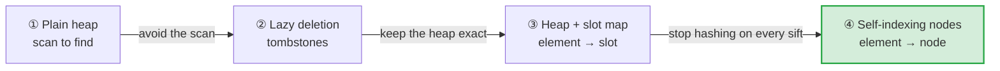
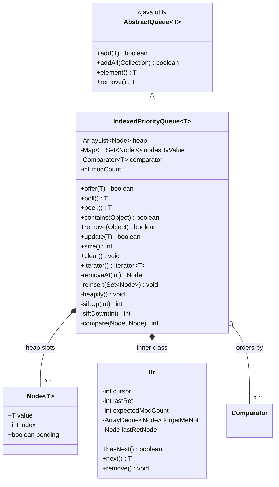
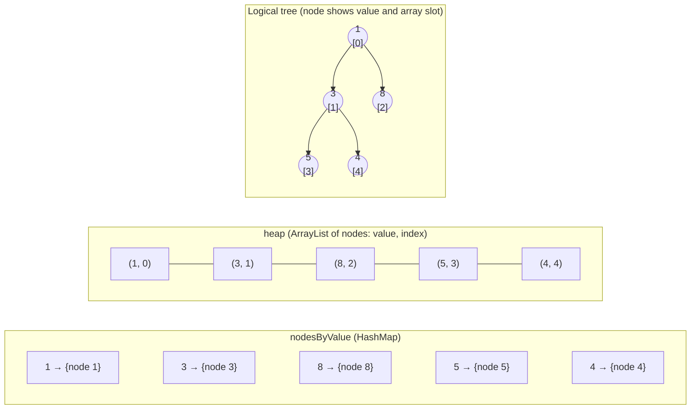
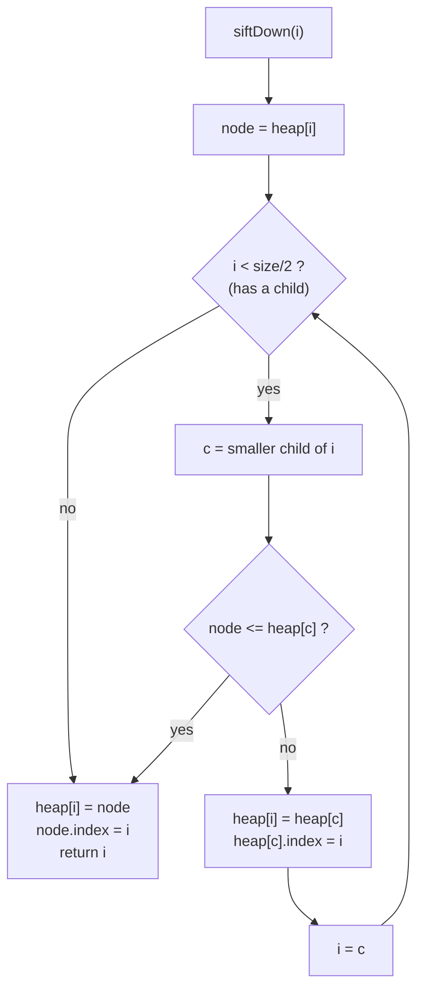
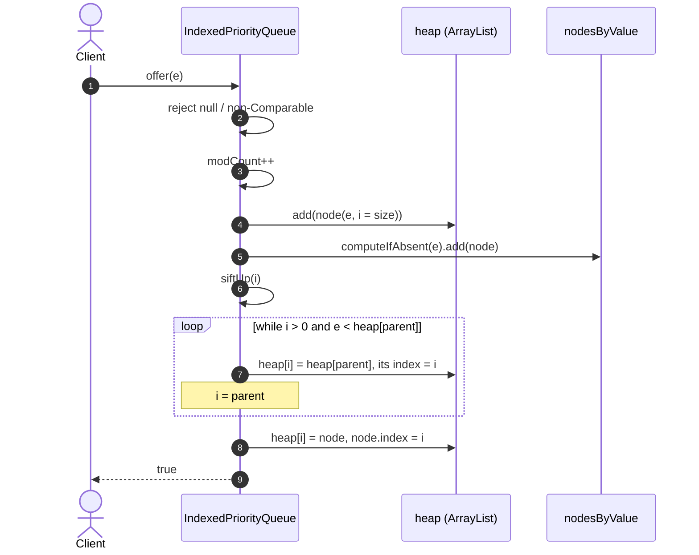
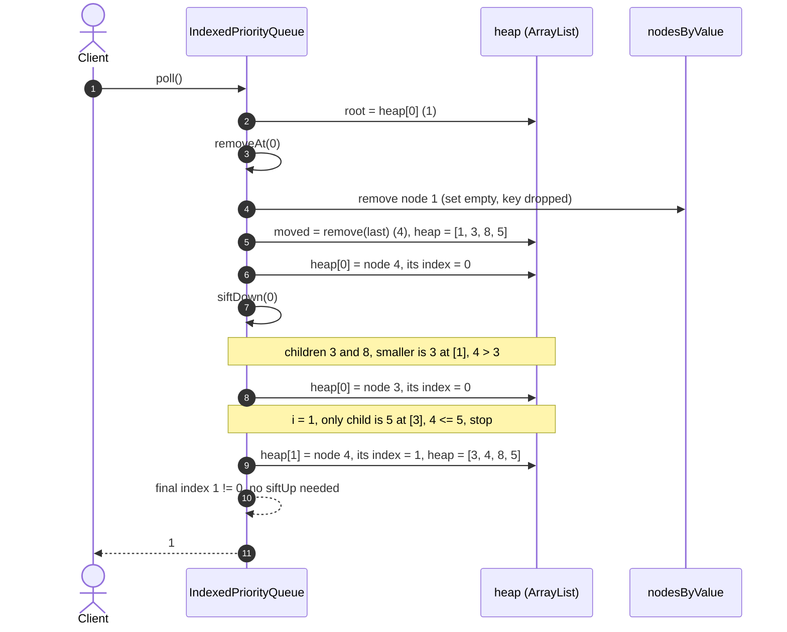
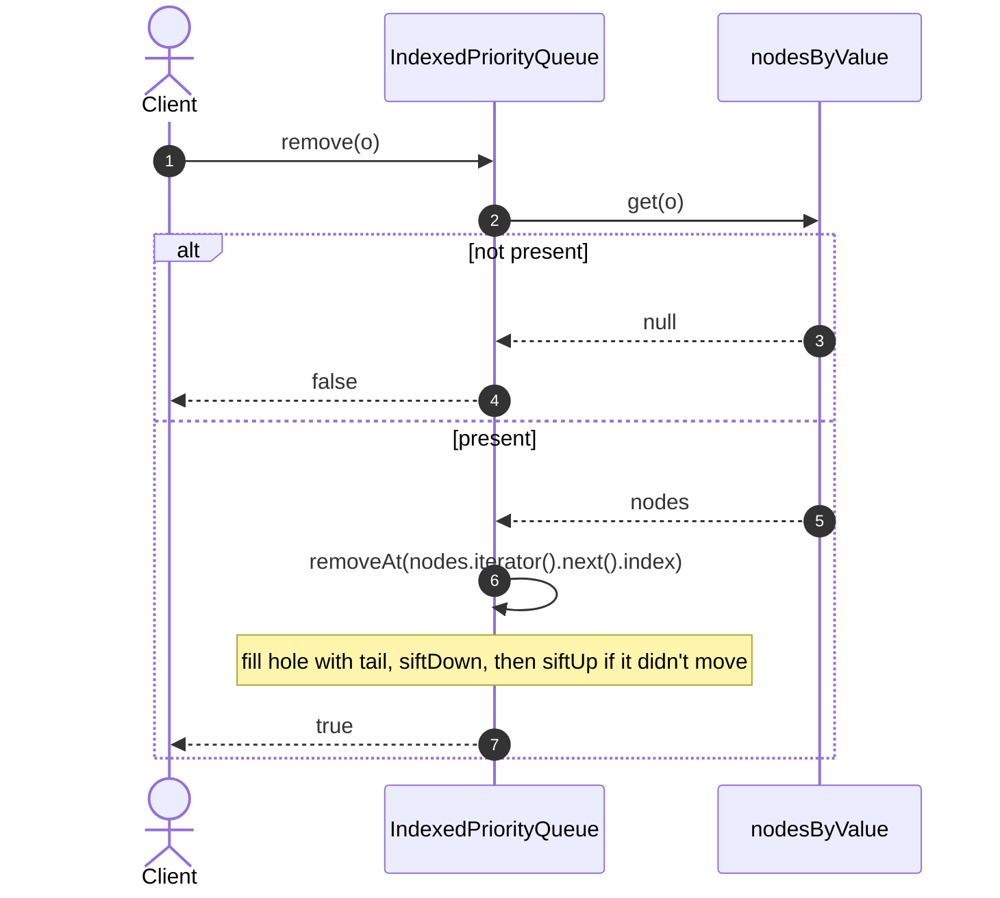
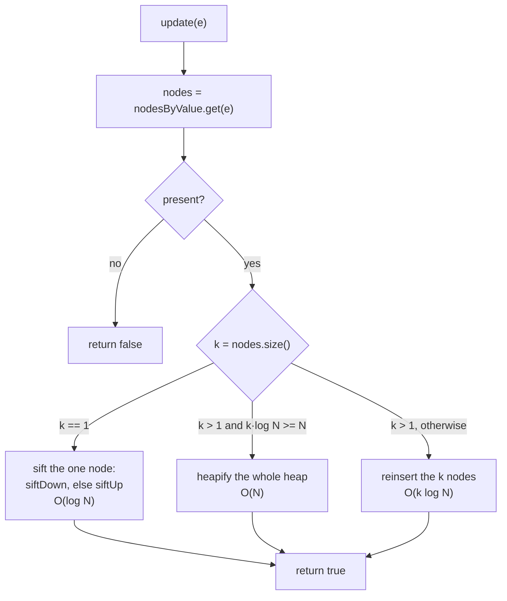
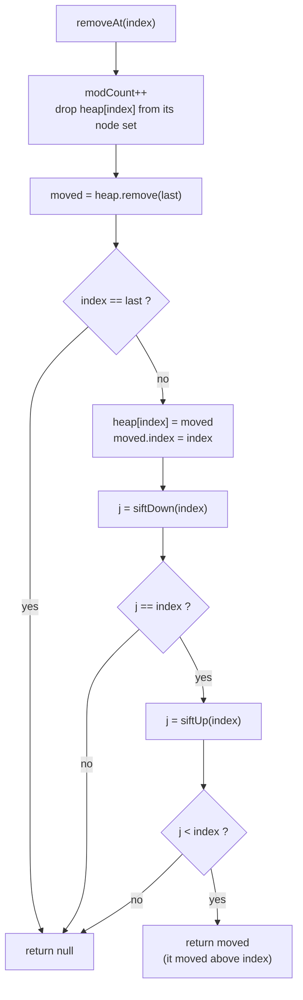
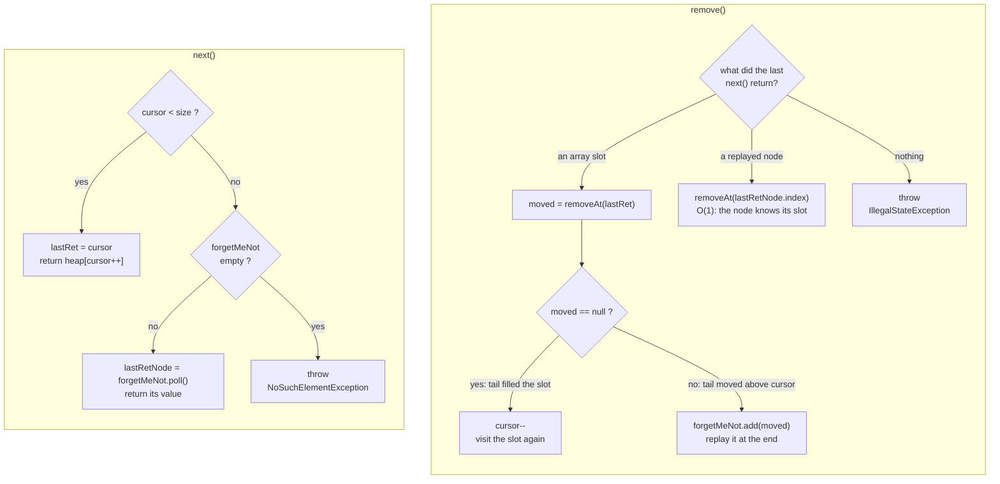

# IndexedPriorityQueue: a priority queue you can change your mind about

**Contents**

1. [Executive overview](#executive-overview): the problem, the idea, where it is used, when not to use it
2. [Design approaches](#design-approaches): four ways to build it, compared side by side
3. [Inside the chosen design](#inside-the-chosen-design): data layout, invariants, sifting
4. [Sequence diagrams](#sequence-diagrams): `offer`, `poll`, `remove`
5. [Re-keying with `update`](#updatee-re-keying-in-place), [removal](#removeatindex-the-core-removal) and [iteration](#iterator)
6. [Usage](#usage) and [testing](#how-it-is-tested)

## Executive overview

### The problem

A priority queue answers one question fast: *what comes next?* The earliest deadline, the
cheapest path, the most urgent job. Real systems also keep changing their minds:

- a user **cancels** a scheduled job;
- a request **finishes** before its timeout fires;
- a job is **rescheduled**, or a route turns out to be **cheaper** than first thought.

A standard binary heap, such as Java's `java.util.PriorityQueue`, has no fast answer to *"remove
this one"* or *"this one's priority changed"*. It doesn't know where an element sits, so it scans
the whole array to find it: **O(N)**.

### The idea

An **indexed** priority queue keeps the heap plus an index from each element to its slot. Finding
an element becomes a lookup, and fixing the heap around it takes one sift:

| | Plain heap | Indexed heap |
|---|---|---|
| What comes next? (`peek`, `poll`) | fast | fast |
| Is this element queued? (`contains`) | scans everything | **one lookup** |
| Cancel this element (`remove`) | scans everything | **about log₂ N steps** |
| Its priority changed (`update`) | remove and re-add: scans everything | **about log₂ N steps** |

**Why it matters at scale.** With 1 million queued items, cancelling one in a plain heap can
inspect all 1,000,000 of them. The indexed heap needs about 20 comparisons. When cancels and
re-prioritisations are frequent (timeouts, schedulers, graph search), that is the difference
between a hot path and a bottleneck.

### Where it is used

| Domain | What changes | Operation that matters |
|---|---|---|
| **Job schedulers** and **timers** | jobs are cancelled or rescheduled | `remove`, `update` |
| **Timeout / deadline tracking** | most requests finish before their deadline | `remove` |
| **Shortest paths** (Dijkstra, A\*) and **minimum spanning trees** (Prim) | a cheaper route to a node is found ("decrease-key") | `update` |
| **Load balancers** (least connections / least load) | a server's load changes with every request | `update` |
| **Caches** (LFU eviction, TTL expiry) | an access bumps an entry's frequency; entries are deleted early | `update`, `remove` |
| **Discrete-event simulation** | future events are cancelled or moved | `remove`, `update` |
| **OS-style schedulers with priority aging** | waiting tasks slowly gain priority | `update` |
| **Live leaderboards / top-K** | a player's score changes | `update` |

**Example: a job scheduler.** A scheduler needs two queues, and both depend on fast removal:

- the **due queue**, ordered by next run time. Cancelling a job is `remove`; rescheduling it is
  `update`;
- the **timeout queue**, ordered by deadline. A job that finishes in time is removed, so the
  timeout checker only ever sees jobs that really timed out.

### When *not* to use it

- **You only ever push and pop.** A plain heap is simpler and slightly faster, with no index to
  maintain.
- **You need sorted iteration or range queries.** Use a balanced tree (`TreeMap` / `TreeSet`).
- **Priorities are small integers.** Bucket queues or timing wheels can be faster.
- **Elements' `equals` / `hashCode` change while they are queued.** The index can't find them.

### Key takeaways

1. A heap is fast at *"what's next"* but blind to *"where is X"*.
2. Adding an element → slot index makes cancel and re-prioritise O(log N) instead of O(N).
3. Use it wherever priorities change after insertion: schedulers, timeouts, graph search, load
   balancing, caches.
4. The cost is a small node per element and one hash lookup per operation.

---

## Design approaches

There are four common ways to support "cancel" and "re-prioritise" on a heap. Each one fixes the
main weakness of the one before it.



### ① Plain heap with a linear scan

- **How:** find the element by scanning the array, then fix the heap around it.
- **Strength:** nothing extra to maintain.
- **Weakness:** every cancel or re-key is O(N).

### ② Lazy deletion (tombstones)

- **How:** mark the entry as dead. To re-key, mark the old entry dead and push a new one. Dead
  entries are skipped when they reach the top.
- **Strength:** simple, and every write is a plain O(log N) push.
- **Weakness:** the heap keeps stale entries, so it can grow far past its live size. `poll` may
  have to skip a run of dead entries, and `contains` still needs a separate map.
- **Seen in:** Python's `heapq` documentation recommends this pattern. Go's `container/heap` offers
  `Fix` and `Remove` by index, but leaves tracking the index to you.

### ③ Heap plus an element → slot map (the textbook indexed heap)

- **How:** a hash map records each element's array slot. Every move during a sift updates the map.
- **Strength:** the heap holds exactly the live elements; cancel and re-key are O(log N);
  `contains` is O(1).
- **Weakness:** every sift level costs about 3 hash operations. With duplicates, equal elements
  share one slot set, and re-keying *k* equal copies must search it: O(k log N + k²).

### ④ Self-indexing nodes plus an element → node map (the chosen design)

- **How:** each heap slot holds a small node that records its own index. The map points to nodes
  and changes only when an element enters or leaves the queue.
- **Strength:** sifts are pure array work, with one hash operation per call. Re-keying *k* equal
  copies is O(min(k log N, N)).
- **Weakness:** one small extra object per element.

### Side by side

| | ① Scan | ② Lazy deletion | ③ Slot map | ④ Self-indexing nodes |
|---|---|---|---|---|
| Cancel (`remove`) | O(N) | O(1) mark, paid later in `poll` | O(log N) | **O(log N)** |
| Re-key (`update`) | O(N) | O(log N) push | O(log N) | **O(log N)** |
| `contains` | O(N) | needs a side map | O(1) | **O(1)** |
| Heap size | live elements | live + stale | live elements | **live elements** |
| Hash operations per sift level | 0 | 0 | ~3 | **0** |
| Re-key *k* equal copies | O(N) | not applicable | O(k log N + k²) | **O(min(k log N, N))** |
| Extra memory | none | stale entries | a map entry per element | a map entry and a node per element |

Against Java's built-in `PriorityQueue`, which is approach ①:

| Operation | `java.util.PriorityQueue` | `IndexedPriorityQueue` |
|---|---|---|
| `offer` / `poll` | O(log N) | O(log N) |
| `peek` | O(1) | O(1) |
| `contains(Object)` | O(N) | **O(1)** |
| `remove(Object)` | O(N) | **O(log N)** |
| re-key an element | remove + re-add, O(N) | **`update(e)`, O(log N)** |

### What the chosen design costs

- **One hash operation per call, not per level.** Each heap slot holds a small node that records
  its own array index, so sifting is pure array work. The `HashMap` index is touched only when an
  element enters or leaves the queue (`offer`, `poll`, `remove`) or is looked up (`contains`,
  `update`). The heap work is a guaranteed O(log N); the single hash operation is *expected* O(1),
  given a reasonable `hashCode`. A poor `hashCode` slows that one lookup, not every sift step.
- **Duplicates.** Elements that are `equals` share one entry in the index. `offer`, `poll`,
  `remove` and `contains` touch only one copy, so they cost the same however many copies exist.
  `update(e)` must re-key **every** copy, because each may have a new priority. With *k* copies it
  costs **O(min(k log N, N))**: it re-inserts the *k* copies, or rebuilds the whole heap in O(N) once
  that is cheaper. With unique elements (*k* = 1), which is the normal case, `update` is O(log N).

## Inside the chosen design



| Field | Type | Role |
|---|---|---|
| `heap` | `ArrayList<Node<T>>` | The implicit binary tree. `heap[0]` holds the minimum. |
| `Node.index` | `int` | The node's current slot in `heap`, kept up to date by every move. |
| `nodesByValue` | `HashMap<T, LinkedHashSet<Node<T>>>` | element → the node of every equal element in the queue. A key is present **iff** its set is non-empty. |
| `comparator` | `Comparator<? super T>` or `null` | Ordering; `null` means natural ordering (elements must be `Comparable`, checked on `offer`). |
| `modCount` | `int` | Bumped on every structural change so iterators can fail fast. |

**Invariants:**
- For every `i`, `heap.get(i).index == i`. Every write into `heap` also sets the node's `index`.
- Each node in `heap` is in exactly one set: `nodesByValue.get(node.value)`. The set only changes
  when a node enters or leaves the queue, never during a sift.

### Why `LinkedHashSet<Node>` per key?

Duplicates are allowed, and equal elements share one set. The set needs O(1) `add` / `remove`
(on `offer` / `poll`) and O(1) "give me any node" for `remove(Object)`. A `TreeSet` costs O(log k)
per operation. A plain `HashSet` makes `iterator().next()` scan buckets, which gets slow once the
set has shrunk from a large size. `LinkedHashSet` is O(1) for all three. `Node` keeps identity
`equals` / `hashCode`, so equal elements still get distinct entries.

### Key-stability contract

`equals` / `hashCode` of an element must **not** change while it is in the queue, or the
`nodesByValue` lookup breaks. Its *priority* (what the comparator reads) may change, as long as
`update(element)` is called afterwards.

## How the heap maps onto the array

A complete binary tree is stored level by level in `heap`, with no child pointers:

| Relation | Index |
|---|---|
| parent of `i` | `(i - 1) >>> 1` |
| left child of `i` | `2i + 1` |
| right child of `i` | `2i + 2` |
| leaves | `i >= size / 2` (so `siftDown` loops only while `i < size >>> 1`) |

Example after `offer(5)`, `offer(3)`, `offer(8)`, `offer(1)`, `offer(4)`:



## Sifting: moving a hole instead of swapping

`siftUp` / `siftDown` don't swap pairs. Instead:

1. Take the node out of its slot (leaving a "hole").
2. Walk up or down, shifting each displaced neighbour one level into the hole and setting its
   `index` (one array write and one `int` write per level, no hashing).
3. Write the node into the final slot and set its `index` once.
4. Return the final index. `removeAt` uses it to tell whether the node moved, and which way.



## Sequence diagrams

### `offer(e)`



### `poll()` on the example array `[1, 3, 8, 5, 4]`



Only step 3 touched the `HashMap`. Every other step is array work.

### `remove(o)`



## `update(e)`: re-keying in place

The caller changes an element's priority in place, then calls `update`. `update` picks one of
three strategies by the number *k* of equal copies:



**Why not just sift each copy in turn?** When several copies change at once, sifting them one by
one is wrong. Each sift compares against the other changed copies, which are still out of place,
and can settle next to a priority that is about to move. The heap is then left out of order. An
earlier version of this queue had exactly this bug, and a randomised test caught it.

**`reinsert` never reads a changed priority until every changed node is out of the heap:**

1. **Float.** Mark each of the *k* nodes `pending`. `compare` treats a pending node as smaller than
   every other node, without reading its value. Sift each one up; the pending nodes end up in a
   connected region around the root, and the rest is still a valid heap.
2. **Pop.** Remove the root *k* times (fill with the tail, sift down). Each removed root is pending,
   and these sifts compare only unchanged values.
3. **Re-insert.** Clear `pending` and append each node again, sifting it up by its new priority.

Each phase is *k* sifts of O(log N). The nodes stay in `nodesByValue` throughout; only the array
changes.

## `removeAt(index)`: the core removal



The return value only matters to the iterator; `poll` and `remove(Object)` ignore it.

## Iterator

The iterator walks `heap` in array order, which is **not** sorted order. `Iterator.remove()` uses
the same technique as `java.util.PriorityQueue`:

- If the tail node filling the hole stays at or below the cursor, the cursor steps back one so
  that slot is visited again.
- If the tail node moves *above* the cursor (`removeAt` returned it), it would be skipped, so it
  goes into `forgetMeNot` and is returned after the array is used up. Removing it later is O(1),
  because the node knows its own index.
- Any change made outside the iterator bumps `modCount`, and the iterator then throws
  `ConcurrentModificationException`.



## Usage

```java
// Natural ordering
IndexedPriorityQueue<Integer> q = new IndexedPriorityQueue<>();
q.addAll(List.of(5, 3, 8, 1, 4));
q.remove(8);        // O(log N), not O(N)
q.contains(3);      // O(1)
q.poll();           // 1

// Mutable priority: equality must not depend on the priority field
IndexedPriorityQueue<Task> tasks = new IndexedPriorityQueue<>(Comparator.comparingInt(t -> t.priority));
tasks.add(task);
task.priority = 0;  // change in place...
tasks.update(task); // ...then restore heap order in O(log N)
```

Not thread-safe. `null` elements are rejected.

## How it is tested

- **Unit tests:** ordering, custom comparators, duplicates, each `update` path, iterator removal
  (including replayed elements), and fail-fast iteration.
- **Reference comparison:** long random sequences of `offer` / `poll` / `remove` / `contains`, checked
  step by step against `java.util.PriorityQueue`.
- **Property fuzzing:** random re-prioritisations of equal copies, checking that every parent is
  ≤ its children after each `update`. This is what exposed the copy-by-copy sifting bug.
