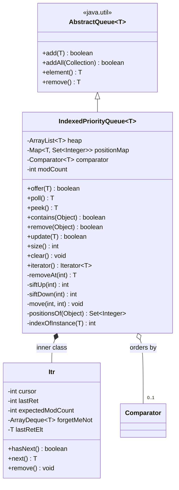
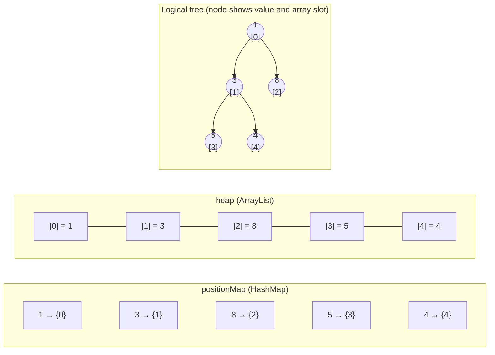
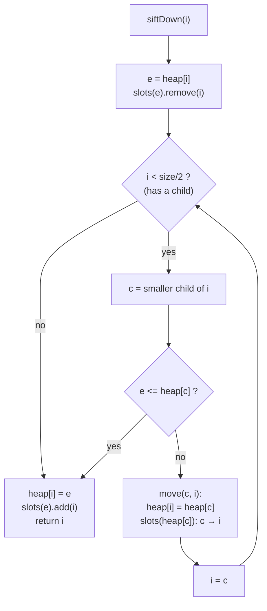
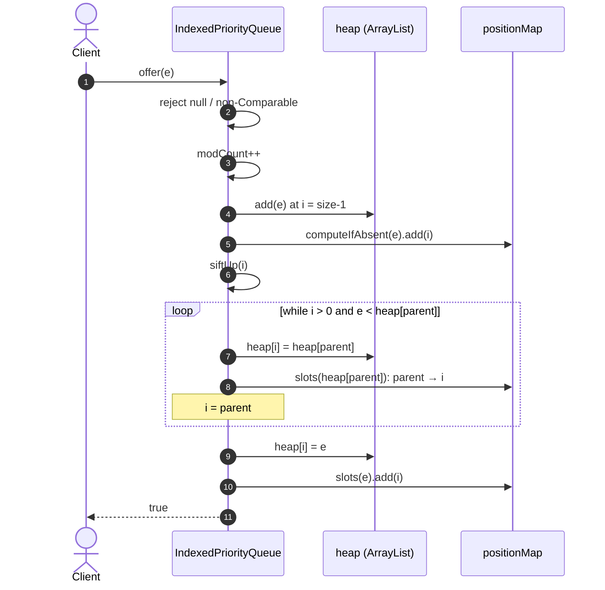
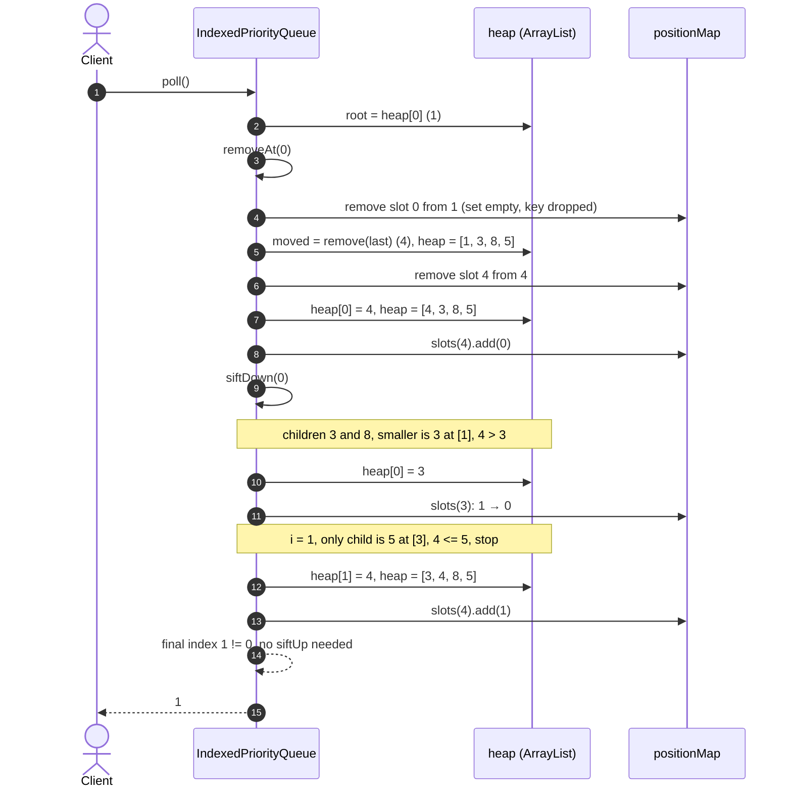
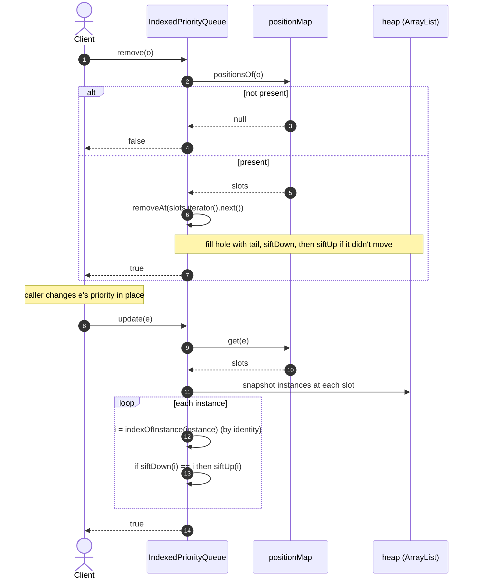
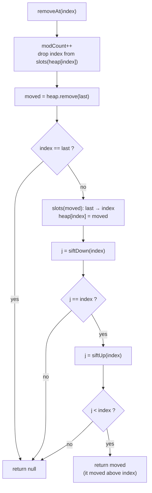
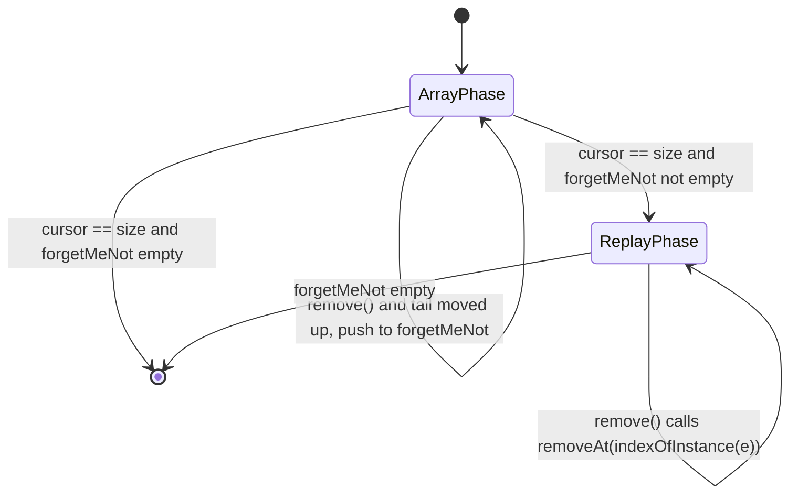

# IndexedPriorityQueue

`com.salesforce.einstein.ds.IndexedPriorityQueue<T>` is a binary **min-heap** that also keeps an
index from each element to its slot(s) in the heap array. That index turns the operations a plain
`java.util.PriorityQueue` does in O(N) — `remove(Object)`, `contains(Object)`, re-prioritising an
element — into O(log N) / O(1).

| Operation | `java.util.PriorityQueue` | `IndexedPriorityQueue` |
|---|---|---|
| `offer` / `poll` | O(log N) | O(log N) |
| `peek` | O(1) | O(1) |
| `contains(Object)` | O(N) | **O(1)** |
| `remove(Object)` | O(N) | **O(log N)** |
| re-key an element | remove + re-add, O(N) | **`update(e)`, O(log N)** |

Costs are expected-time (they rely on `HashMap`). With *k* equal copies of an element, `update` is
O(k log N + k²); everything else stays O(log N) regardless of duplicates.

## Design



The queue keeps two structures that must always agree:

| Field | Type | Role |
|---|---|---|
| `heap` | `ArrayList<T>` | The implicit binary tree. `heap[0]` is the minimum. |
| `positionMap` | `HashMap<T, LinkedHashSet<Integer>>` | element → every slot in `heap` holding an equal element. A key is present **iff** its set is non-empty. |
| `comparator` | `Comparator<? super T>` or `null` | Ordering; `null` means natural ordering (elements must be `Comparable`, checked on `offer`). |
| `modCount` | `int` | Bumped on every structural change so iterators can fail fast. |

**Invariant:** for every `i`, `positionMap.get(heap.get(i))` contains `i`, and nothing else is in
the map. Every method that touches `heap` updates `positionMap` in the same step.

### Why `LinkedHashSet<Integer>` per key?

Duplicates are allowed, and equal elements share one set. The set needs O(1) `add` / `remove`
(done at every sift step) and O(1) "give me any slot" for `remove(Object)`. A `TreeSet` costs
O(log k) per operation. A plain `HashSet` makes `iterator().next()` scan buckets, which gets slow
once the set has shrunk from a large size. `LinkedHashSet` is O(1) for all three.

### Key-stability contract

`equals` / `hashCode` of an element must **not** change while it is in the queue, or the
`positionMap` lookup breaks. Its *priority* (what the comparator reads) may change, as long as
`update(element)` is called afterwards.

## How the heap maps onto the array

A complete binary tree is stored level by level in `heap`, with no pointers:

| Relation | Index |
|---|---|
| parent of `i` | `(i - 1) >>> 1` |
| left child of `i` | `2i + 1` |
| right child of `i` | `2i + 2` |
| leaves | `i >= size / 2` (so `siftDown` loops only while `i < size >>> 1`) |

Example after `offer(5)`, `offer(3)`, `offer(8)`, `offer(1)`, `offer(4)`:



## Sifting: moving a hole instead of swapping

`siftUp` / `siftDown` don't swap pairs (that would be 4 index updates per level). Instead:

1. Detach the sifted element's slot from its position set.
2. Walk up/down, shifting each displaced neighbour one level with `move(from, to)`, which writes
   `heap[to]` and moves one index in that neighbour's set (2 updates per level).
3. Write the element into the final slot and add that slot to its set once.
4. Return the final index. `removeAt` uses it to tell whether the element moved, and which way.

The position set is left in `positionMap` while it is briefly empty, which avoids removing and
re-creating it on every sift. This also works when the sifted element and a neighbour are equal
and share one set.



## Sequence diagrams

### `offer(e)`



### `poll()` on the example array `[1, 3, 8, 5, 4]`



Resulting state:

| | [0] | [1] | [2] | [3] |
|---|---|---|---|---|
| `heap` | 3 | 4 | 8 | 5 |

`positionMap = {3 → {0}, 4 → {1}, 8 → {2}, 5 → {3}}`

### `remove(o)` and `update(e)`



`update` snapshots the instances first because equal-but-distinct objects share one set, and
sifting one of them reshuffles the slots of the others.

## `removeAt(index)`: the core removal



The return value only matters to the iterator; `poll` and `remove(Object)` ignore it.

## Iterator

The iterator walks `heap` in array order, which is **not** sorted order. `Iterator.remove()` uses
the same technique as `java.util.PriorityQueue`:

- If the tail element filling the hole stays at or below the cursor, the cursor steps back one so
  that slot is visited again.
- If the tail element moves *above* the cursor (`removeAt` returned it), it would be skipped, so it
  goes into `forgetMeNot` and is returned after the array is used up.
- Any change made outside the iterator bumps `modCount`, and the iterator then throws
  `ConcurrentModificationException`.



## Usage

```java
// Natural ordering
IndexedPriorityQueue<Integer> q = new IndexedPriorityQueue<>();
q.addAll(List.of(5, 3, 8, 1, 4));
q.remove(8);        // O(log N), not O(N)
q.contains(3);      // O(1)
q.poll();           // 1

// Mutable priority: equality must not depend on the priority field
IndexedPriorityQueue<Task> tasks = new IndexedPriorityQueue<>(Comparator.comparingInt(t -> t.priority));
tasks.add(task);
task.priority = 0;  // change in place...
tasks.update(task); // ...then restore heap order in O(log N)
```

Not thread-safe. `null` elements are rejected.

## Tests

`src/test/java/com/salesforce/einstein/ds/IndexedPriorityQueueTest.java` (JUnit 5) covers
ordering, comparators, duplicates, `update`, iterator removal and fail-fast behaviour, plus
randomised runs checked against `java.util.PriorityQueue`.

```bash
JAVA_HOME=<path-to-jdk-17> mvn test
```
