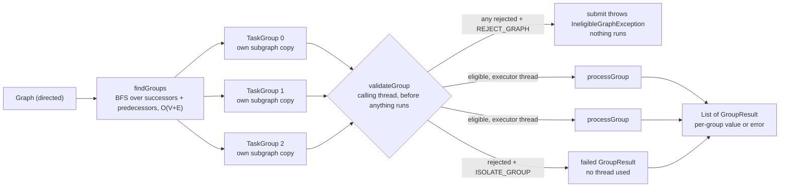
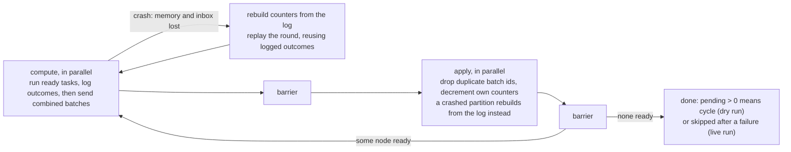

# graphexecutor: generic graphs, cycle-safe BFS/DFS, a group-parallel TaskExecutor, and its distributed form

Pure JDK (no third-party libraries; JUnit is test-scope only).

| Section | Package | Main types |
|---|---|---|
| [1. Graph](#1-graph) | `graph` | `Graph`, `AdjacencyGraph` |
| [2. BFS / DFS](#2-bfs--dfs-iterators-cycle-safe) | `graph` | `BfsIterator`, `DfsIterator` |
| [3. TaskExecutor](#3-taskexecutor) | `executor` | `TaskExecutor`, `TopologicalTaskExecutor` |
| [4. Scaling out](#4-scaling-out-distributed-package) | `distributed` | `DistributedTopologicalExecutor`, `CompletionLog` |

**Build and test** (JDK 17+; 65 tests: 21 graph, 11 traversal, 19 executor, 14 distributed):

```bash
cd graphexecutor
mvn test
```

## 1. Graph

Direction and weighting are two independent **properties of a graph instance**, not separate classes:

```java
Graph<String> g = Graph.directed();            // unweighted, unidirectional
Graph<String> g = Graph.undirected();          // unweighted, bidirectional
Graph<String> g = Graph.weightedDirected();    // weighted,   unidirectional
Graph<String> g = Graph.weightedUndirected();  // weighted,   bidirectional
g.isDirected(); g.isWeighted();
```

`Graph<T>` is the interface; `AdjacencyGraph<T>` (package-private) is the single implementation
behind all four factories. One class configured by two flags avoids a class per combination
(2 × 2 = 4 today, 8 with a third property).

| Operation | Semantics | Cost |
|---|---|---|
| `addNode(n)` | false if present | O(1) |
| `removeNode(n)` | also removes every incident edge | O(degree) |
| `updateNode(old, new)` | renames, moving every edge and weight; throws if `new` exists | O(degree) |
| `addEdge(a, b)` | **unweighted only**; adds missing endpoints; false if edge exists | O(1) |
| `addEdge(a, b, w)` | **weighted only**; false (weight kept) if edge exists | O(1) |
| `updateEdge(a, b, w)` | **weighted only**; false if no such edge | O(1) |
| `removeEdge(a, b)` | false if no such edge | O(1) |
| `edgeWeight(a, b)` | `Optional<Double>`: empty if unweighted or no such edge | O(1) |
| `successors` / `predecessors`, `outDegree` / `inDegree` | undirected: both are the neighbors / degree | O(1) |
| `subgraph(nodes)` | independent copy with the same properties and weights | O(V + E) |

Calling the other kind's edge method throws `UnsupportedOperationException`. So a weighted graph
*must* have a weight on every edge, and an unweighted graph never has one.

**Storage:** `Map<T, Map<T, Optional<Double>>>`. Weighted edges hold `Optional.of(w)`; unweighted
edges hold `Optional.empty()`, a shared singleton, so unweighted graphs pay nothing for it.

**The direction trick.** Each edge `a -> b` is written as `out[a][b]` and `in[b][a]`. Directed: `in`
is a separate reverse index (that's what makes `removeNode` O(degree)). Undirected: `in` *is* `out`,
so writing `in[b][a]` is exactly the mirror entry. Every method is written once and is correct for both.

`LinkedHashMap` everywhere, so traversal order is deterministic (insertion order).

## 2. BFS / DFS iterators (cycle-safe)

`TraversalIterator<T>` (template) → `BfsIterator<T>`, `DfsIterator<T>`.

- **Cycles:** a `visited` set; each node is returned once. O(V + E) time, O(V) space.
- **BFS** marks visited on *enqueue*, so a node never sits in the queue twice.
- **DFS** is iterative (no stack overflow on a 200k-node chain) and keeps a stack of *neighbor
  iterators*, giving the exact recursive preorder with stack depth = path length. The "push all
  neighbors" shortcut gets the sibling order backwards and can push one node many times.
- **Lazy** (`hasNext` computes one step), **fail-fast** (CME if the graph changes), and multi-root:
  `bfs()`/`dfs()` start a new tree at each unreached node, so they cover disconnected graphs.
- They take a `node -> neighbors` function, so they also work on *views* of a graph. The executor
  uses this to walk a directed graph's edges in both directions.

## 3. TaskExecutor



- **Input:** a directed graph (undirected is rejected), weighted or not; weights reach each group's copy.
- **Group = weakly connected component.** In `a -> c <- b`, a and b share c, so they are not
  independent. Strongly connected components would wrongly split them.
- **Template method:** `execute`/`submit` are final; subclasses implement `processGroup` and may
  override `validateGroup` and `findGroups`.
- **Snapshot before dispatch:** each group gets its own copy of its subgraph, made on the caller's
  thread. Workers never touch the shared (non-thread-safe) graph, and the caller may modify it as soon
  as `submit` returns.
- **Eligibility check up front:** `validateGroup` (overridable; default accepts everything) runs on
  every group on the caller's thread *before anything is dispatched*. What a rejection means is the
  `IneligibleGroupPolicy`:
  - `REJECT_GRAPH` (default): `submit` throws `IneligibleGraphException` listing every rejected group
    and its reason. Nothing runs, not even the eligible groups.
  - `ISOLATE_GROUP`: rejected groups get a failed `GroupResult` immediately, without using a thread;
    the rest run.
- **Failure isolation at run time:** an exception from `processGroup` becomes that group's
  `GroupResult`; the other groups finish.
- The executor does not own the thread pool: the caller sizes it and shuts it down.

`TopologicalTaskExecutor<T>` is a ready-made subclass where `a -> b` means "a before b". **A cycle makes
a group ineligible**: its `validateGroup` runs a dry run of Kahn's algorithm (counters only) and rejects a cyclic group with
`CycleDetectedException`, listing the nodes on a cycle or downstream of one (self-loops count as
cycles). With the default `REJECT_GRAPH`, any cycle anywhere means the graph is not executed. A task
that throws at run time skips the rest of its group. Subclasses that override `validateGroup` must
call `super.validateGroup` to keep the cycle check.

Reading the blocked nodes:

```java
catch (IneligibleGraphException e) {
    for (GroupResult<?, ?> r : e.rejected()) {
        if (r.error() instanceof CycleDetectedException cycle) {
            List<String> nodes = executor.blockedNodes(cycle);   // typed, checked against this executor
        }
    }
}
```

- Java forbids generic `Throwable` subclasses, so the exception can't be a `CycleDetectedException<T>`.
  Instead it records which executor raised it, and that executor's `blockedNodes(e)` returns a
  `List<T>`. Passing in an exception from a different executor throws `IllegalArgumentException`,
  so the cast is never unchecked in practice.
- `e.blocked()` returns the same nodes as a `List<?>`.
- **Serialization:** the blocked nodes are serialized with the exception (so the nodes must be
  `Serializable`, or writing fails with `NotSerializableException`). After deserialization,
  `blocked()` still works; `blockedNodes(e)` refuses because the executor link is not serialized.

The cycle check lives in the subclass, not the base class, because a cycle is only a problem when
edges mean ordering. An executor that treats edges as plain links can accept cyclic graphs.

**Parallel inside a group.** `new TopologicalTaskExecutor<>(groupPool, taskPool, policy)` runs a group's
independent tasks in parallel. A task is submitted the moment its last dependency finishes, which is
Kahn's ready set driven by completions. Details:

- Counters are one `AtomicIntegerArray` and the adjacency is `int[][]`.
- `taskPool` must differ from `groupPool`. Each group's coordinator blocks until its group finishes, so
  on a shared fixed pool the coordinators could occupy every thread and starve their own tasks.
- After a failure, nothing new is released. Tasks already running finish, and the group fails with the
  first error.
- The live run executes tasks as Kahn's releases them. No order is computed first and then walked
  again.

Isn't parallel Kahn's a bad idea? Only when the decrement *is* the work, as in sorting 1B edges on GPU
cores. Here each decrement follows a task that is orders of magnitude slower, so contention on the
counters is negligible.

## 4. Scaling out: `distributed` package

`DistributedTopologicalExecutor<T>` is Kahn's algorithm the way it scales past one machine:
bulk-synchronous rounds over partitions (the model Google's Pregel popularized). It is simulated in one JVM, with a partition as a unit of work on
the pool and an in-memory `Transport`. Each partition touches only its own state, so moving partitions
onto machines changes the transport, not the algorithm.

```java
DistributedTopologicalExecutor<String> executor = new DistributedTopologicalExecutor<>(
        pool, 8, Partitioner.greedy(0.1), IneligibleGroupPolicy.ISOLATE_GROUP) {
    @Override
    protected void executeTask(String task) throws Exception {
        // must be idempotent: a crash can make a task run twice
    }
};
RunReport<String> report = executor.execute(graph);
report.rounds();    // tasks completed per round
report.failed();    // task -> error
report.skipped();   // never ran: downstream of a failure
report.stats();     // edge cut, batches sent, duplicates dropped, recoveries, ...
```

| Concern | How | Class |
|---|---|---|
| No shared counters | Each node has one owner partition, the only writer of its in-degree counter. Others send it messages. | `Partition` |
| Partitioning | `Partitioner.hash()` is balanced but cuts about (k-1)/k of edges. `Partitioner.greedy(slack)` (LDG, streaming in BFS order) puts each node with its placed neighbors, under a capacity cap. | `Partitioner` |
| Messages | Per round, one `DecrementBatch` per (sender, receiver) holding `(v, -k)`, not k messages. 100 → 1 fan-in on 4 partitions is 100 decrements in ≤ 4 messages. | `DecrementBatch`, `Transport` |
| Groups | Label propagation: every node adopts the minimum label among its neighbors, with combined messages and O(diameter) rounds. No global BFS. | `LabelPropagation` |
| Placement | Groups up to `ceil(V/k)` nodes go *whole* onto the least-loaded partition (LPT bin packing). Bigger groups (the giant component) are *split by node* by the partitioner. | `GroupPlacement` |
| Cycles | A dry run of the same rounds with no tasks. Nodes that never reach 0 are on or after a cycle. `REJECT_GRAPH` throws `CyclicGraphException` (blocked nodes by group); `ISOLATE_GROUP` drops those groups. | `DistributedTopologicalExecutor` |
| Durable state | No checkpoints. A `CompletionLog` records each task's outcome (`DONE`/`FAILED`, round) *before* any decrement for it is sent. Counters, ready lists and inboxes are memory-only and disposable. | `CompletionLog`, `InMemoryCompletionLog` |
| Crash recovery | A partition that crashes mid-round loses all its memory, **inbox included**. Its replacement rebuilds its counters from the log and replays the round (up to 3 attempts). At the barrier it rebuilds again instead of applying its partial inbox. Only it recovers; the others keep their progress. | `Partition.crashAndRecover`, `rebuild` |
| Idempotency | A replay reuses logged outcomes instead of re-running them. A crash between running a task and logging it still runs it twice, so `executeTask` must be idempotent. | |
| Dedupe | A replay re-sends its batches, and the transport is at-least-once. Receivers drop a batch whose id `(sender, round)` they have already applied. | `Partition.apply` |

**Why no checkpoints:** a node's pending count is just its predecessors with no `DONE` outcome:

```
pending(v) = |{ u ∈ predecessors(v) : u has no DONE outcome }|
```

So the log is the only state worth keeping durably. Rebuilding costs O(edges into the partition's
nodes) log reads. Three rules make it correct:

- **Log before send:** the log never knows less than the messages say. So messages lost with a crashed
  inbox need no resending: the rebuild already counts them.
- **Rounds make reads consistent:** while round r runs, other partitions are still logging round-r
  outcomes. A rebuild "as of round r" reads only earlier rounds.
- **Outcomes are final:** recording twice keeps the first outcome. A replay reuses logged `DONE` and
  `FAILED` outcomes, so it re-sends exactly the batches the crashed attempt did.

Checkpoints are still the right tool when state can't be derived from completions, such as iterative
values like PageRank.

Why dedupe by batch id and not edge id: combining erases individual edges. A replay rebuilds the same
state from the log and reuses the logged outcomes, so it re-sends the same batch with the same id, and
one id covers every edge inside it. This is the same idea as an idempotent producer's sequence
numbers. Without dedupe, a counter is decremented twice and a task is released before its dependencies
finish. `apply` detects that and throws instead.

**Task failure vs. partition crash.** They are handled differently:

- A **task failure** is an exception from `executeTask`. It is logged as `FAILED`, and that task's
  dependants never get its decrement, so they are reported in `skipped`. The rest of the graph runs.
- A **crash** is an unchecked exception escaping the partition's round. It triggers rebuild and replay.
- A `FAILED` outcome logged before a crash is not retried by the replay, so the replay stays
  identical to the crashed attempt. The original exception object died with the partition, so
  `failed()` reports an `IllegalStateException` built from the message the log kept.

**Extension points** (all on `DistributedTopologicalExecutor`):

| Method | Default | Use |
|---|---|---|
| `executeTask(T) throws Exception` | abstract | The task. Declares `Exception` because it is user code (I/O, blocking); whatever it throws fails only that task. |
| `newCompletionLog()` | `InMemoryCompletionLog` | Plug in a durable store (a KV table, a compacted log topic). Must be thread-safe and durable before `record` returns. |
| `deliveriesPerSend()` | 1 | Above 1 simulates an at-least-once network; every copy beyond the first is dropped by dedupe. |
| `afterSend(partition, round, attempt)` | no-op | Fault injection: throw an unchecked exception to crash that partition mid-round, after it has sent some batches. |

Each round:



`RunReport` returns the nodes completed per round, failed and skipped nodes, rejected groups, and
`Stats`:

- groups, how many were placed whole, how many were split;
- edge cut;
- label, dry-run and live round counts;
- decrement edges and batches sent;
- duplicates dropped and recoveries.

Number of rounds = longest dependency chain + 1, not V. A wide, shallow DAG with 1B edges finishes in a
few rounds. A long chain cannot be parallelized by any algorithm.

What the simulation leaves out: a real network and a durable `CompletionLog` (override
`newCompletionLog()` to plug one in); distributed union-find
(fewer rounds than label propagation on long chains); asynchronous (barrier-free) execution; and
splitting the counter of a node with a huge in-degree.

**Further extensions:** cancellation and timeouts per group; incremental regrouping with union-find when
edges are only added.
