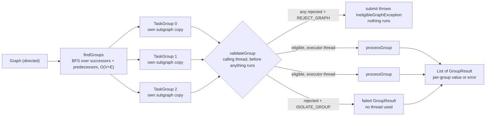
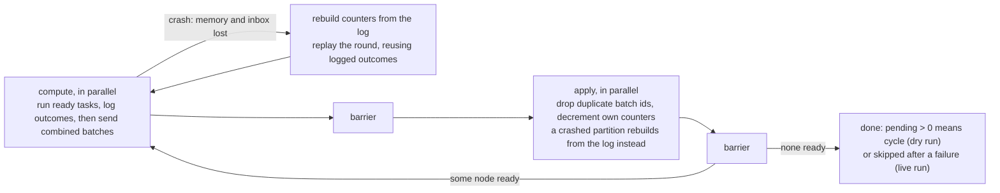
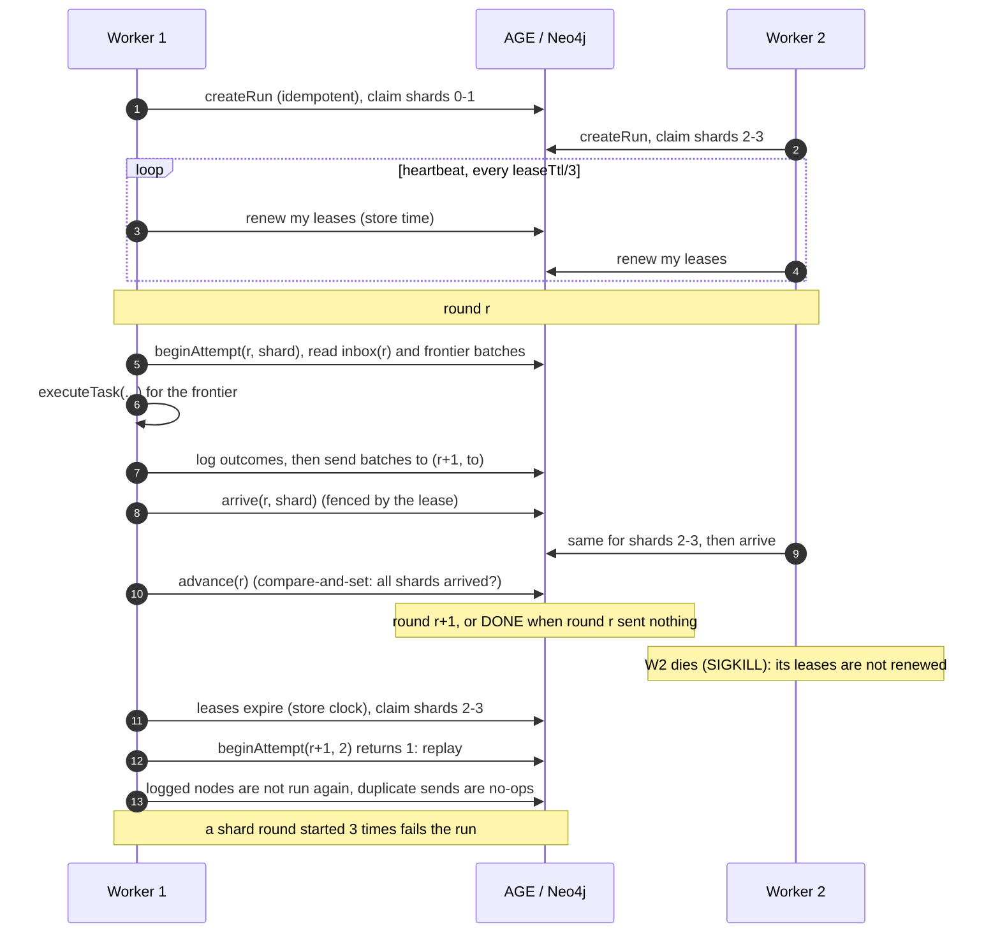

# graphexecutor: group-parallel TaskExecutors over `ds` graphs, and their distributed forms

Five modules under the `graphexecutor-parent` POM:

| Module | artifactId | What | Dependencies |
|---|---|---|---|
| `core` | `core` | sections 1 to 4: executors (one VM) and the cluster runtime's SPIs | `ds` (pure JDK); JUnit is test-scope only |
| [`graphexecutor-age`](graphexecutor-age/README.md) | `graphexecutor-age` | a graph in Apache AGE (PostgreSQL), processed by workers on many VMs | PostgreSQL JDBC driver |
| [`graphexecutor-neo4j`](graphexecutor-neo4j/README.md) | `graphexecutor-neo4j` | the same over Neo4j | Neo4j Java driver |
| [`graphexecutor-age-demo`](graphexecutor-age-demo/README.md) | `graphexecutor-age-demo` | a demo worker image and compose cluster over AGE, and the AGE ITs | `graphexecutor-age` |
| [`graphexecutor-neo4j-demo`](graphexecutor-neo4j-demo/README.md) | `graphexecutor-neo4j-demo` | the same over Neo4j | `graphexecutor-neo4j` |

The graphs the executors run over (`Graph`, cycle-safe BFS/DFS) are in the [`ds`](../ds/Graph.md) module,
package `ds.graph`.

| Section | Package | Main types |
|---|---|---|
| [1. TaskExecutor](#1-taskexecutor) | `executor` | `TaskExecutor`, `TopologicalTaskExecutor` |
| [2. Scaling out](#2-scaling-out-distributed-package) | `distributed`, `spi` | `DistributedTopologicalExecutor`, `CompletionLog` |
| [3. Traversal executors](#3-traversal-executors-reachability-not-dependency) | `executor`, `distributed` | `TraversalTaskExecutor`, `DistributedTraversalExecutor` |
| [4. Across machines](#4-across-machines-a-graph-in-a-database-workers-on-many-vms) | `spi`, `distributed` | `GraphStore`, `ClusterStore`, `Worker` |

**Build and test** (JDK 17+). `core` has 63 tests: 19 executor, 12 traversal executor, 14 distributed
topological, 10 distributed traversal and 8 worker; the 32 graph and BFS/DFS tests are in `ds`. `graphexecutor-age` has 4 unit
tests and `graphexecutor-neo4j` 13. The
`*IT`s are in the demo modules, because they run the demo's workers: 7 in each. They need Docker and are
skipped without it.

```bash
cd graphexecutor
mvn install          # unit tests, then the ITs (failsafe, after package: they build the worker image)
```

## 1. TaskExecutor



- **Input:** a directed graph (undirected is rejected), weighted or not; weights reach each group's copy.
- **Group = weakly connected component.** In `a -> c <- b`, a and b share c, so they are not
  independent. Strongly connected components would wrongly split them.
- **Template method:** `execute`/`submit` are final; subclasses implement `processGroup` and may
  override `validateGroup` and `findGroups`.
- **Snapshot before dispatch:** each group gets its own copy of its subgraph, made on the caller's
  thread. Workers never touch the shared (non-thread-safe) graph, and the caller may modify it as soon
  as `submit` returns.
- **Eligibility check up front:** `validateGroup` (overridable; default accepts everything) runs on
  every group on the caller's thread *before anything is dispatched*. What a rejection means is the
  `IneligibleGroupPolicy`:
  - `REJECT_GRAPH` (default): `submit` throws `IneligibleGraphException` listing every rejected group
    and its reason. Nothing runs, not even the eligible groups.
  - `ISOLATE_GROUP`: rejected groups get a failed `GroupResult` immediately, without using a thread;
    the rest run.
- **Failure isolation at run time:** an exception from `processGroup` becomes that group's
  `GroupResult`; the other groups finish.
- The executor does not own the thread pool: the caller sizes it and shuts it down.

`TopologicalTaskExecutor<T>` is a ready-made subclass where `a -> b` means "a before b". **A cycle makes
a group ineligible**: its `validateGroup` runs a dry run of Kahn's algorithm (counters only) and rejects a cyclic group with
`CycleDetectedException`, listing the nodes on a cycle or downstream of one (self-loops count as
cycles). With the default `REJECT_GRAPH`, any cycle anywhere means the graph is not executed. A task
that throws at run time skips the rest of its group. Subclasses that override `validateGroup` must
call `super.validateGroup` to keep the cycle check.

Reading the blocked nodes:

```java
catch (IneligibleGraphException e) {
    for (GroupResult<?, ?> r : e.rejected()) {
        if (r.error() instanceof CycleDetectedException cycle) {
            List<String> nodes = executor.blockedNodes(cycle);   // typed, checked against this executor
        }
    }
}
```

- Java forbids generic `Throwable` subclasses, so the exception can't be a `CycleDetectedException<T>`.
  Instead it records which executor raised it, and that executor's `blockedNodes(e)` returns a
  `List<T>`. Passing in an exception from a different executor throws `IllegalArgumentException`,
  so the cast is never unchecked in practice.
- `e.blocked()` returns the same nodes as a `List<?>`.
- **Serialization:** the blocked nodes are serialized with the exception (so the nodes must be
  `Serializable`, or writing fails with `NotSerializableException`). After deserialization,
  `blocked()` still works; `blockedNodes(e)` refuses because the executor link is not serialized.

The cycle check lives in the subclass, not the base class, because a cycle is only a problem when
edges mean ordering. An executor that treats edges as plain links can accept cyclic graphs.

**Parallel inside a group.** `new TopologicalTaskExecutor<>(groupPool, taskPool, policy)` runs a group's
independent tasks in parallel. A task is submitted the moment its last dependency finishes, which is
Kahn's ready set driven by completions. Details:

- Counters are one `AtomicIntegerArray` and the adjacency is `int[][]`.
- `taskPool` must differ from `groupPool`. Each group's coordinator blocks until its group finishes, so
  on a shared fixed pool the coordinators could occupy every thread and starve their own tasks.
- After a failure, nothing new is released. Tasks already running finish, and the group fails with the
  first error.
- The live run executes tasks as Kahn's releases them. No order is computed first and then walked
  again.

Isn't parallel Kahn's a bad idea? Only when the decrement *is* the work, as in sorting 1B edges on GPU
cores. Here each decrement follows a task that is orders of magnitude slower, so contention on the
counters is negligible.

## 2. Scaling out: `distributed` package

`DistributedTopologicalExecutor<T>` is Kahn's algorithm the way it scales past one machine:
bulk-synchronous rounds over partitions (the model Google's Pregel popularized). It is simulated in one JVM, with a partition as a unit of work on
the pool and an in-memory `Transport`. Each partition touches only its own state, so moving partitions
onto machines changes the transport, not the algorithm.

```java
DistributedTopologicalExecutor<String> executor = new DistributedTopologicalExecutor<>(
        pool, 8, Partitioner.greedy(0.1), IneligibleGroupPolicy.ISOLATE_GROUP) {
    @Override
    protected void executeTask(String task) throws Exception {
        // must be idempotent: a crash can make a task run twice
    }
};
RunReport<String> report = executor.execute(graph);
report.rounds();    // tasks completed per round
report.failed();    // task -> error
report.skipped();   // never ran: downstream of a failure
report.stats();     // edge cut, batches sent, duplicates dropped, recoveries, ...
```

| Concern | How | Class |
|---|---|---|
| No shared counters | Each node has one owner partition, the only writer of its in-degree counter. Others send it messages. | `Partition` |
| Partitioning | `Partitioner.hash()` is balanced but cuts about (k-1)/k of edges. `Partitioner.greedy(slack)` (LDG, streaming in BFS order) puts each node with its placed neighbors, under a capacity cap. | `Partitioner` |
| Messages | Per round, one `DecrementBatch` per (sender, receiver) holding `(v, -k)`, not k messages. 100 → 1 fan-in on 4 partitions is 100 decrements in ≤ 4 messages. | `DecrementBatch`, `Transport` |
| Groups | Label propagation: every node adopts the minimum label among its neighbors, with combined messages and O(diameter) rounds. No global BFS. | `LabelPropagation` |
| Placement | Groups up to `ceil(V/k)` nodes go *whole* onto the least-loaded partition (LPT bin packing). Bigger groups (the giant component) are *split by node* by the partitioner. | `GroupPlacement` |
| Cycles | A dry run of the same rounds with no tasks. Nodes that never reach 0 are on or after a cycle. `REJECT_GRAPH` throws `CyclicGraphException` (blocked nodes by group); `ISOLATE_GROUP` drops those groups. | `DistributedTopologicalExecutor` |
| Durable state | No checkpoints. A `CompletionLog` records each task's outcome (`DONE`/`FAILED`, round) *before* any decrement for it is sent. Counters, ready lists and inboxes are memory-only and disposable. | `CompletionLog`, `InMemoryCompletionLog` |
| Crash recovery | A partition that crashes mid-round loses all its memory, **inbox included**. Its replacement rebuilds its counters from the log and replays the round (up to 3 attempts). At the barrier it rebuilds again instead of applying its partial inbox. Only it recovers; the others keep their progress. | `Partition.crashAndRecover`, `rebuild` |
| Idempotency | A replay reuses logged outcomes instead of re-running them. A crash between running a task and logging it still runs it twice, so `executeTask` must be idempotent. | |
| Dedupe | A replay re-sends its batches, and the transport is at-least-once. Receivers drop a batch whose id `(sender, round)` they have already applied. | `Partition.apply` |

**Why no checkpoints:** a node's pending count is just its predecessors with no `DONE` outcome:

```
pending(v) = |{ u ∈ predecessors(v) : u has no DONE outcome }|
```

So the log is the only state worth keeping durably. Rebuilding costs O(edges into the partition's
nodes) log reads. Three rules make it correct:

- **Log before send:** the log never knows less than the messages say. So messages lost with a crashed
  inbox need no resending: the rebuild already counts them.
- **Rounds make reads consistent:** while round r runs, other partitions are still logging round-r
  outcomes. A rebuild "as of round r" reads only earlier rounds.
- **Outcomes are final:** recording twice keeps the first outcome. A replay reuses logged `DONE` and
  `FAILED` outcomes, so it re-sends exactly the batches the crashed attempt did.

Checkpoints are still the right tool when state can't be derived from completions, such as iterative
values like PageRank.

Why dedupe by batch id and not edge id: combining erases individual edges. A replay rebuilds the same
state from the log and reuses the logged outcomes, so it re-sends the same batch with the same id, and
one id covers every edge inside it. This is the same idea as an idempotent producer's sequence
numbers. Without dedupe, a counter is decremented twice and a task is released before its dependencies
finish. `apply` detects that and throws instead.

**Task failure vs. partition crash.** They are handled differently:

- A **task failure** is an exception from `executeTask`. It is logged as `FAILED`, and that task's
  dependants never get its decrement, so they are reported in `skipped`. The rest of the graph runs.
- A **crash** is an unchecked exception escaping the partition's round. It triggers rebuild and replay.
- A `FAILED` outcome logged before a crash is not retried by the replay, so the replay stays
  identical to the crashed attempt. The original exception object died with the partition, so
  `failed()` reports an `IllegalStateException` built from the message the log kept.

**Extension points** (all on `DistributedTopologicalExecutor`):

| Method | Default | Use |
|---|---|---|
| `executeTask(T) throws Exception` | abstract | The task. Declares `Exception` because it is user code (I/O, blocking); whatever it throws fails only that task. |
| `newCompletionLog()` | `InMemoryCompletionLog` | Plug in a durable store (a KV table, a compacted log topic). Must be thread-safe and durable before `record` returns. |
| `deliveriesPerSend()` | 1 | Above 1 simulates an at-least-once network; every copy beyond the first is dropped by dedupe. |
| `afterSend(partition, round, attempt)` | no-op | Fault injection: throw an unchecked exception to crash that partition mid-round, after it has sent some batches. |

Each round:



`RunReport` returns the nodes completed per round, failed and skipped nodes, rejected groups, and
`Stats`:

- groups, how many were placed whole, how many were split;
- edge cut;
- label, dry-run and live round counts;
- decrement edges and batches sent;
- duplicates dropped and recoveries.

Number of rounds = longest dependency chain + 1, not V. A wide, shallow DAG with 1B edges finishes in a
few rounds. A long chain cannot be parallelized by any algorithm.

What the simulation leaves out: a real network and a durable `CompletionLog` (override
`newCompletionLog()` to plug one in); distributed union-find
(fewer rounds than label propagation on long chains); asynchronous (barrier-free) execution; and
splitting the counter of a node with a huge in-degree.

**Further extensions:** cancellation and timeouts per group; incremental regrouping with union-find when
edges are only added.

## 3. Traversal executors: reachability, not dependency

The topological executors read an edge as a dependency. The edge points from the prerequisite to
the dependant:

| Statement | Edge | Who waits |
|---|---|---|
| A depends on B | `addEdge(B, A)` | A waits for B |
| compile before test | `addEdge(compile, test)` | test waits for compile |

Some workloads have edges that only mean "reachable from". Crawling a site's navigation is one:
`home -> about` means about is linked from home, not that about waits for home, and `about -> home`
is just as normal. For those, `TraversalTaskExecutor` and `DistributedTraversalExecutor` sit next to
the topological pair. Nothing about the topological pair changes.

| | Topological (`TopologicalTaskExecutor`, `DistributedTopologicalExecutor`) | Traversal (`TraversalTaskExecutor`, `DistributedTraversalExecutor`) |
|---|---|---|
| Edge B→A means | A depends on B, so A waits | A is reachable from B; nobody waits |
| Cycle | the group is ineligible | fine: each node runs once |
| When a node runs | after its longest dependency chain (Kahn's waves) | at its shortest distance from a root (BFS level) |
| A task fails | its dependants are skipped | nothing is blocked |
| Distributed message | decrement `(v, -k)`: not idempotent, dedupe is required | visit `{v}`: idempotent, dedupe only saves work |
| Rounds | longest chain + 1 | deepest shortest path + 1 (+ mark-only rounds past `maxDepth`) |

```java
new TraversalTaskExecutor<String>(groupPool, taskPool, IneligibleGroupPolicy.ISOLATE_GROUP) {
    @Override protected void executeTask(String node, int depth) { ... }
    @Override protected Object laneOf(String node) { return host(node); }      // one at a time per lane
    @Override protected Duration laneDelay() { return Duration.ofSeconds(1); } // gap within a lane
};
```

**Hooks** (the same on both):

| Hook | Default | Meaning |
|---|---|---|
| `executeTask(T, int depth)` | abstract | the work; whatever it throws fails only that node |
| `roots(Graph)` | nodes with no predecessors | where BFS starts |
| `startRootlessGroups()` | true | a group with no admitted root starts at its first admitted node (a cycle nothing points into still runs). False: the group is reported unreachable |
| `admit(T)` | all | a rejected node is neither run nor traversed through (`excluded`) |
| `maxDepth()` | unlimited | deeper nodes are reached but not run (`tooDeep`) |
| `laneOf(T)` | the node | nodes of one lane run one at a time |
| `laneDelay()` | 0 | the minimum gap between the starts of two tasks in a lane |

The result lists `completed`, `depth`, `failed`, `excluded`, `tooDeep` and `unreachable` (admitted,
but no root reaches it).

**Local** (`TraversalTaskExecutor`, a `TaskExecutor`, so it uses the same groups, policy and per-group
isolation): BFS through the admitted nodes gives each one its depth. Each lane then runs as a chain on
`taskPool`, with `CompletableFuture.delayedExecutor` for the gap, so no thread sleeps between tasks.
Lanes run concurrently; a failing task is recorded and its lane continues. The sequential constructor
runs the lanes one after another, in BFS order.

**Distributed** (`DistributedTraversalExecutor`): BFS in bulk-synchronous rounds, where round r runs
depth r. It keeps every feature of §2 that doesn't depend on reading edges as dependencies:

- the snapshot, `Partitioner` (plus `byKey`), `LabelPropagation` and `GroupPlacement`;
- combined messages: one `VisitBatch` per (sender, receiver, round);
- the `CompletionLog` as the only durable state, with log-before-send, round-consistent reads and
  first-outcome-wins;
- crash, rebuild and replay up to 3 attempts, where only the crashed partition recovers;
- dedupe by batch id;
- the `newCompletionLog`, `deliveriesPerSend` and `afterSend` hooks.

The frontier needs no checkpoint, for the same reason the counters didn't:

```
frontier(r) = { v owned, admitted, no outcome before r : r = 0 and v is a root,
                                                         or some predecessor has an outcome at r-1 }
```

Every visited node expands, including failed and too-deep ones (logged `SKIPPED`), so this rule
gives exactly what the inbox would have. BFS reaches a node first at its shortest depth, so the
first logged outcome is also the right one.

The extra hook is `placeGroupsWhole()` (default true). Set it false, with `Partitioner.byKey(lane)`,
and every node of a lane lives on one partition. Then "one task per lane at a time" holds across the
whole run with no coordination: that is how a crawler stays polite to each host.

Not applicable here: the cycle dry run, `IneligibleGroupPolicy` rejections and the over-decrement
guard. Nothing is ineligible and there are no counters.

## 4. Across machines: a graph in a database, workers on many VMs

Sections 2 and 3 simulate partitions in one JVM: the snapshot, the owner map and the transport are all
in memory. To process a graph larger than one VM, keep the graph in a database and run one `Worker` per
VM. Each worker streams only its own shards from the database, and the run's shared state goes through
the same database. The workers never talk to each other.

| Which executor | Graph | Where it runs |
|---|---|---|
| `TopologicalTaskExecutor`, `TraversalTaskExecutor` | `Graph<T>` in memory | one VM, threads |
| `DistributedTopologicalExecutor`, `DistributedTraversalExecutor` | `Graph<T>` in memory | one VM, simulated partitions |
| `Worker.topological(...)`, `Worker.traversal(...)` over `GraphStore<T>` | AGE or Neo4j | many VMs (or `InMemoryClusterStore` threads, in tests) |

The same executor subclass runs everywhere, with the same hooks and meaning. Only the SPIs are implemented
per store. They are in `core`'s `spi` package (pure JDK, interfaces only); `spi.memory` is the in-memory
backend, and the adapter modules are the database ones:

| SPI (`spi`) | Role | `spi.memory` | `graphexecutor-age` | `graphexecutor-neo4j` |
|---|---|---|---|---|
| `GraphStore<T>` | read-only, sharded, batched view: `nodes(shard, after, limit)` (keyset paging), `sources`, `successors(batch)`, `predecessors(batch)`, `inDegree(batch)` | `InMemoryGraphStore` | `AgeGraphStore` (Cypher via `cypher()`) | `Neo4jGraphStore` (`UNWIND $keys`) |
| `NodeCodec<T>` | a node to a string key and back | `NodeCodec.strings()`, `NodeCodec.of(…)` | the same | the same |
| `CompletionLog<T>` | outcomes, first one wins | `InMemoryCompletionLog` | `PostgresCompletionLog` (`ON CONFLICT DO NOTHING`) | `Neo4jCompletionLog` (`MERGE … ON CREATE SET`) |
| `ClusterStore` | run state, leases, messages, arrivals | `InMemoryClusterStore` | `PostgresClusterStore` (tables, `FOR UPDATE`) | `Neo4jClusterStore` (nodes, lock-then-check) |
| loader | writes a graph sharded the way the store reads it | (`InMemoryGraphStore.of` copies a `Graph`) | `AgeGraphLoader` | `Neo4jGraphLoader` |

`InMemoryGraphStore.of(graph, shards, shardOf)` is the in-memory store. It is used by the tests, and for
comparing a cluster run against the one-VM executors.

### The protocol

Rounds are bulk-synchronous, as in §2 and §3. Round r of a traversal runs depth r; round r of a
topological run runs the nodes whose last dependency ran in round r-1. Nothing is kept between rounds:
a shard round's input is the previous round's messages (in the `ClusterStore`) plus the outcomes in the
`CompletionLog`. So a shard can move to another worker at any round boundary, with no state handed over.



The rules, each enforced by the store:

- **Store time.** Lease expiry is compared against `now()` / `datetime()`, never a worker's clock. So clock
  skew cannot give one shard two owners.
- **Fenced arrivals.** `arrive` succeeds only for the worker that holds the shard's unexpired lease. A
  worker that was presumed dead (paused for GC, say) cannot finish a round its replacement now owns.
- **Idempotent writes.** A message is keyed by (run, round, from, to) and an arrival by (run, round,
  shard), so a replay's re-sends change nothing. The log keeps the first outcome per node.
- **No coordinator.** Any worker calls `advance` after its shards arrive. It is a compare-and-set on the
  round, so only the first call that finds every shard arrived moves the run on. There is no
  coordinator lease to lose.
- **Log before send.** This is §2's recovery rule. A replayed shard rebuilds from the log and does not
  rerun what was logged. `executeTask` must still be idempotent, because a task can run and then crash
  before its outcome is logged.
- **Attempts.** `beginAttempt` counts the starts of each (round, shard). The 3rd replay fails the run
  (`MAX_ATTEMPTS`), as a partition that keeps crashing does in one JVM.
- **Claiming.** A worker takes free shards up to `maxShards`. It takes more only when a shard has stayed
  free for a whole lease. So a dead worker's shards spread over the survivors.

Hooks run on every worker. They must be **deterministic**, giving the same answer on every machine, and
thread-safe: `admit`, `laneOf`, `maxDepth` and `roots`. Shards replace `GroupPlacement` here, so a hook
such as `laneOf` is honoured across machines only when it agrees with the shard function. That is why
the crawler shards by host (`GraphStore.byKey(host, shards)`).

### Running it

The adapter modules are libraries: no `main`, no image. A worker image comes from a module that depends on an
adapter and has its own `main`: its `src/main/docker/Dockerfile` copies the module's jar and `target/lib` (from
`copy-dependencies`, so the adapter and its driver), and runs that `main`. The `main` opens an
`AgeWorkerContext` or `Neo4jWorkerContext`, which reads the environment (database, `GRAPH`, `SHARDS`, `RUN_ID`,
`WORKER_ID`, `SHARDS_PER_WORKER`, `LEASE_TTL`, `POLL_INTERVAL`, `BATCH_SIZE`), builds its `Worker` from the
context's stores, and runs it. The demo modules are such modules: `DemoWorkerMain` runs the factory that
`WORKER_FACTORY` names, a random-graph traversal or dependency-ordered run that records every task. To run
your own executor, copy a demo module's POM and Dockerfile. (The web crawler uses only the stores: its
`adapter-graph-*` modules read sitemap graphs through `AgeGraphStore` and `Neo4jGraphStore`.)

```bash
mvn -q -pl graphexecutor/graphexecutor-age-demo -am package -DskipTests        # from System_Design
docker compose -f graphexecutor/graphexecutor-age-demo/docker/compose.yml up --scale worker=3
docker kill <one worker>        # the others take its shards over; the run still finishes
```

The demo modules' ITs do the same with Testcontainers. Each one starts the database and three worker containers, loads
a random graph, and SIGKILLs one worker while it is inside a task. It then checks four things:

- the run finishes;
- every node has the round a single process computes for it;
- `recoveries >= 1`;
- no node logged before the kill ran again.
