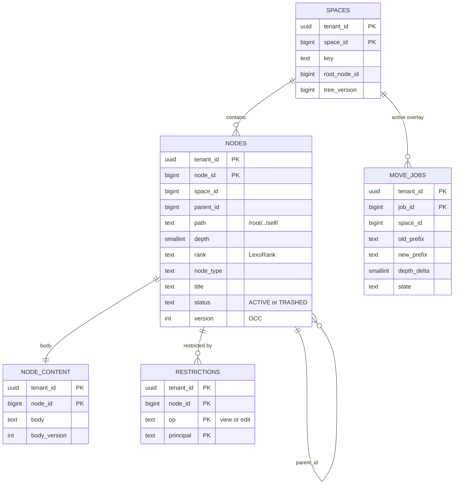
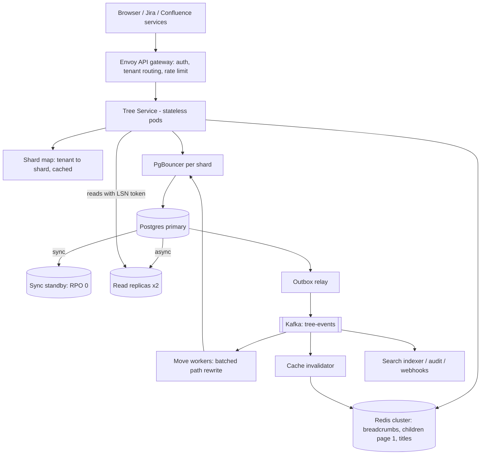
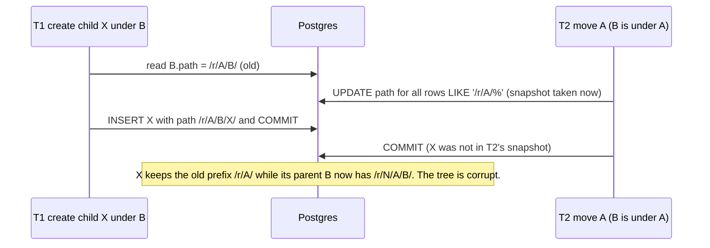
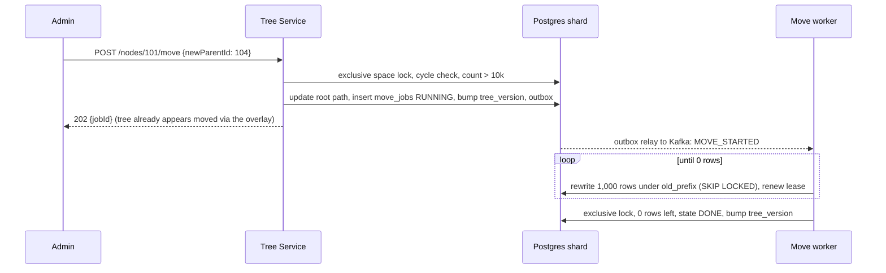

# Hierarchical Database System: Detailed Design

> **Interview prompt (Atlassian):** "Design a hierarchical database system." This is the store behind Confluence page
> trees (Space → Page → Child page) and Jira hierarchies (Epic → Story → Sub-task). It must support **high concurrent
> reads and writes**, and the answer must include the **data model**.
>
> The 60-minute speaking version is [`hierarchical-db-one-pager.html`](hierarchical-db-one-pager.html). This document is
> the deep version with SQL and Java snippets.

---

## 0. The answer in five sentences

1. Each node stores its **parent id**, which is the source of truth, plus a **materialized path** of ancestor ids
   (`/100/104/101/`) that serves as a read index.
2. Breadcrumbs are one primary-key lookup on the path ids, a subtree is one B-tree prefix range scan, and children are a
   keyset page on `(parent_id, rank)`.
3. All writes take one short transaction on the tenant's Postgres shard:
   - creates, edits and reorders take **no tree-wide lock**;
   - **moves** take an exclusive per-space lock, which removes the create-vs-move and move-vs-move races;
   - a move of up to 10k descendants is a single set-based `UPDATE`.
4. **Moves of more than 10k descendants** commit in milliseconds: they rewrite the root and record a **path-rewrite
   overlay** (`old_prefix → new_prefix`) that readers apply on the fly. A background job then rewrites the descendants
   in batches and removes the overlay. Readers are never wrong and never blocked.
5. Reads scale out through **async replicas with a read-your-writes LSN token** and a Redis cache whose keys carry a
   per-space `tree_version`, so one move invalidates a whole space's breadcrumbs with a single increment.

---

## 1. Requirements

### Functional
| # | Operation | Notes |
|---|---|---|
| F1 | Create node under a parent | Title, type, position among siblings |
| F2 | Get node | Metadata; the body lives in a separate content table |
| F3 | List children | Paged, in user-defined sibling order; lazy tree loading |
| F4 | Breadcrumbs / ancestors | Root → node; shown on every page view |
| F5 | Subtree | All descendants, optionally to depth N (export, page-tree sidebar, permission audits) |
| F6 | Move / re-parent a subtree | Within a space or across spaces; must never create a cycle |
| F7 | Reorder among siblings | Drag and drop |
| F8 | Rename / edit | High frequency |
| F9 | Trash / restore / purge a subtree | Confluence-style trash |
| F10 | Inherited restrictions | A view restriction on an ancestor hides the whole subtree |

### Non-functional
- **Reads far outnumber writes** (about 25:1). Breadcrumbs and children are on every page view.
- **Latency targets (p99):**
  - get / children / breadcrumb: under 20 ms;
  - subtree page: under 50 ms;
  - create or rename: under 50 ms;
  - small move: under 200 ms;
  - a big move is accepted within 200 ms and completes asynchronously.
- **Consistency:** strong for structure. A tree is never shown with a cycle, an orphan, or a node in two places. A
  writer reads their own writes. Other readers may lag by the replication delay, which is milliseconds.
- **High concurrency:**
  - thousands of concurrent creates and edits in one space (a big migration or an automation rule);
  - concurrent moves from many admins.
- **Multi-tenant isolation:** no query can cross tenants. Large tenants must not hurt small ones.
- **Availability:** 99.95%, with no data loss on failover (RPO = 0).

### Out of scope
- Full-text search: done by a downstream consumer.
- Page body versioning.
- Jira "issue links": these form a graph, not a tree.

---

## 2. Scale estimates

| Quantity | Estimate | Derivation |
|---|---|---|
| Tenants | 300k | Cloud sites |
| Nodes total | 5 B | Average 16k per tenant; long tail |
| Largest tenant | 200 M nodes | Gets its own shard |
| Largest space | 1 M nodes | Sets the "big move" ceiling |
| Depth | Typically 3–8, **hard limit 64** | The limit keeps `path` under the 2.7 KB B-tree entry limit |
| Read QPS (peak) | 500k | 50M DAU × ~100 tree reads/day, ×10 peak factor |
| Write QPS (peak) | 20k | Creates, edits and reorders |
| Moves | ~50/s | 99% move fewer than 100 descendants |
| Row size (`nodes`) | ~300 B | ids 40 B, path ~80 B, title ~60 B, rank ~10 B, misc |
| Metadata storage | 5 B × 300 B ≈ 1.5 TB, ×2 with indexes ≈ **3 TB** | Bodies are separate (tens of TB, object storage plus a content table) |
| Shards | 32 primaries, ~100 GB hot metadata each | Each fits in RAM; 32 vCPU / 256 GB |

**Why it works:**
- 20k writes/s over 32 shards is about 600 writes/s per shard, which is trivial.
- 500k reads/s at a 70% cache hit rate leaves 150k reads/s for the database. That is about 4.7k per shard, spread over
  the primary and 2 replicas: index lookups at about 0.1 ms each.

---

## 3. Choosing the tree model

| Model | Ancestors | Subtree | Move cost | Insert cost | Extra storage | Concurrency |
|---|---|---|---|---|---|---|
| **Adjacency list** (`parent_id`) | Recursive CTE, depth round trips inside the database | Recursive CTE, can't be range-scanned | **O(1)** | O(1) | none | excellent |
| **Materialized path** (`/1/4/12/`) | **O(1)**: parse the path, then a PK multi-get | **One B-tree range scan** | O(subtree) path rewrite | O(1) | ~80 B/row | good if moves are serialized |
| Nested sets (`lft`, `rgt`) | Range query | Range query | O(tree) renumber | **O(tree)** renumber | 16 B/row | terrible: every insert rewrites half the tree |
| Closure table (`ancestor, descendant, depth`) | Indexed join | Indexed join | O(subtree × depth) deletes and inserts | O(depth) rows | **N × avg depth rows** (≈ 30 B rows) | heavy write amplification |
| `ltree` (Postgres extension) | `@>` with GiST | `<@` with GiST | O(subtree) | O(1) | like a path | like a path |
| Graph DB (Neo4j) | Traversal | Traversal | O(1) | O(1) | separate cluster | no tenant-sharding story at 5 B nodes; a second system of record |

**Pick: adjacency list (truth) plus materialized path (index), in the same row.**
- `parent_id` makes children listing and integrity simple, and gives a second way to recover the path if a path is ever
  in doubt.
- `path` makes the hottest reads (breadcrumbs and subtree) single index operations.
- The materialized path's only weakness is that a move rewrites the subtree. Sections 8.4 and 8.5 bound that cost and
  make it concurrency-safe.

**Why `text` plus B-tree, not `ltree`:**
- A B-tree range scan (`path >= p AND path < p_upper`) is the cheapest index operation Postgres has, and it works on any
  managed Postgres.
- `ltree` with GiST also works, but GiST is larger and slower to update.

---

## 4. Data model (Postgres, inside each shard)

### 4.1 ER diagram



### 4.2 DDL

This is `src/main/resources/db/migration/postgresql/V1__init.sql`, as shipped.

```sql
-- One row per space (a Confluence space or a Jira project). Also the unit of move serialization.
CREATE TABLE spaces (
    tenant_id     uuid    NOT NULL,
    space_id      bigint  NOT NULL,
    key           text    NOT NULL,
    root_node_id  bigint  NOT NULL,
    tree_version  bigint  NOT NULL DEFAULT 0,      -- bumped by every move; part of the cache key
    PRIMARY KEY (tenant_id, space_id),
    UNIQUE (tenant_id, key)
);

-- The tree. Hot, narrow row: no body here.
CREATE TABLE nodes (
    tenant_id   uuid      NOT NULL,
    node_id     bigint    NOT NULL,                -- 64-bit Snowflake id (time | worker | seq), globally unique
    space_id    bigint    NOT NULL,
    parent_id   bigint,                            -- NULL only for a space root
    path        text      COLLATE "C" NOT NULL,    -- '/100/104/101/' : ancestors then self, '/'-terminated
    depth       smallint  NOT NULL CHECK (depth BETWEEN 0 AND 63),
    rank        text      COLLATE "C" NOT NULL,    -- LexoRank sibling order
    node_type   text      NOT NULL,                -- 'space', 'page', 'folder', 'epic', 'story', 'subtask'
    title       text      NOT NULL,
    status      text      NOT NULL DEFAULT 'ACTIVE' CHECK (status IN ('ACTIVE','TRASHED')),
    trashed_at  timestamptz,
    version     int       NOT NULL DEFAULT 1,      -- optimistic concurrency for edits
    created_by  text      NOT NULL,
    created_at  timestamptz NOT NULL DEFAULT now(),
    updated_at  timestamptz NOT NULL DEFAULT now(),
    PRIMARY KEY (tenant_id, node_id),
    FOREIGN KEY (tenant_id, parent_id) REFERENCES nodes (tenant_id, node_id) DEFERRABLE INITIALLY DEFERRED,
    CHECK (path LIKE '%/' || node_id || '/')        -- the path always ends with self
) WITH (fillfactor = 80);                          -- room for HOT updates of title/version/rank

-- Children in sibling order, keyset-paged. node_id breaks rank ties from concurrent inserts.
CREATE INDEX ix_nodes_children ON nodes (tenant_id, parent_id, rank, node_id);
-- Subtree = prefix range scan. COLLATE "C" makes byte order = prefix order.
CREATE INDEX ix_nodes_path     ON nodes (tenant_id, path);
-- The (small) set of trashed roots per space, used to hide trashed subtrees from subtree reads.
CREATE INDEX ix_nodes_trashed  ON nodes (tenant_id, space_id) WHERE status = 'TRASHED';

CREATE TABLE node_content (
    tenant_id    uuid   NOT NULL,
    node_id      bigint NOT NULL,
    body         text   NOT NULL,                  -- or a pointer to object storage for large bodies
    body_version int    NOT NULL DEFAULT 1,
    PRIMARY KEY (tenant_id, node_id)
);

-- Inherited restrictions: a row on an ancestor applies to every descendant.
CREATE TABLE restrictions (
    tenant_id  uuid   NOT NULL,
    node_id    bigint NOT NULL,
    op         text   NOT NULL CHECK (op IN ('view','edit')),
    principal  text   NOT NULL,                     -- 'user:42' or 'group:eng'
    PRIMARY KEY (tenant_id, node_id, op, principal)
);

-- Path-rewrite overlay for large moves (§8.5). At most one RUNNING job per space.
CREATE TABLE move_jobs (
    tenant_id    uuid     NOT NULL,
    job_id       bigint   NOT NULL,
    space_id     bigint   NOT NULL,
    root_node_id bigint   NOT NULL,
    old_prefix   text     COLLATE "C" NOT NULL,
    new_prefix   text     COLLATE "C" NOT NULL,
    depth_delta  smallint NOT NULL,
    state        text     NOT NULL CHECK (state IN ('RUNNING','DONE')),
    rows_done    bigint   NOT NULL DEFAULT 0,
    lease_owner  text,                              -- the worker currently rewriting batches
    lease_until  timestamptz,                       -- another worker may take over once this passes
    created_at   timestamptz NOT NULL DEFAULT now(),
    finished_at  timestamptz,
    PRIMARY KEY (tenant_id, job_id)
);
CREATE UNIQUE INDEX ux_move_jobs_one_running ON move_jobs (tenant_id, space_id) WHERE state = 'RUNNING';

-- Transactional outbox: written in the same transaction as the change, then relayed to Kafka.
CREATE TABLE outbox (
    seq        bigint GENERATED ALWAYS AS IDENTITY PRIMARY KEY,
    tenant_id  uuid   NOT NULL,
    event_type text   NOT NULL,                     -- NODE_CREATED, NODE_MOVED, NODE_UPDATED, NODE_TRASHED, ...
    payload    jsonb  NOT NULL,
    created_at timestamptz NOT NULL DEFAULT now()
);

-- One row. The relay holds it with FOR UPDATE SKIP LOCKED, so one pod relays a shard at a time.
CREATE TABLE outbox_relay_state (
    id          int    PRIMARY KEY CHECK (id = 1),
    relayed_seq bigint NOT NULL DEFAULT 0
);
INSERT INTO outbox_relay_state (id) VALUES (1);

-- Create is claimed by its key in the same transaction, so a retry either waits for the first attempt or replays it.
CREATE TABLE idempotency_keys (
    tenant_id    uuid   NOT NULL,
    key          text   NOT NULL,
    request_hash text   NOT NULL,                   -- a different body under the same key is rejected (422)
    node_id      bigint NOT NULL,
    created_at   timestamptz NOT NULL DEFAULT now(),
    PRIMARY KEY (tenant_id, key)
);
```

**Why each design choice:**
- **`tenant_id` leads every key.** Each query is a range inside one tenant, which gives isolation, locality and a clean
  unit for moving a tenant to another shard.
- **The path contains ids, not titles.** A rename touches one row. Ids never change, so only a move changes paths.
- **The path ends with `/`.** Without the trailing slash, prefix `/1/2` would wrongly match `/1/23/`.
- **Snowflake ids, not a per-shard sequence.** Paths stay valid when a tenant is moved to another shard. Ids are also
  roughly time-ordered, which keeps B-tree inserts local.
- **No `child_count` on the parent.** That counter would be a hot row on which every concurrent create under the same
  parent serializes. If the UI needs "has children", answer it with one index probe (`LIMIT 1`) on `ix_nodes_children`.
- **The body is split out.** Edits to the body don't bloat the hot tree row, and HOT updates stay possible.
- **The parent foreign key is `DEFERRABLE`.** Bulk imports can insert children before their parents within one
  transaction.
- **Idempotency keys are claimed, not cached.** `INSERT … ON CONFLICT DO NOTHING` runs in the create's own transaction,
  so a concurrent retry waits on the first attempt's row lock and then replays the node it created. The stored request
  hash turns "same key, different body" into a `422`.
- **`move_jobs` carries a lease.** The worker that holds `lease_owner` renews `lease_until` with every batch; a job whose
  lease ran out is claimable by any pod (§8.5).

### 4.3 Example rows (space `ENG`, root 100)

Real ids are 64-bit; small numbers are used here for readability.

| node_id | parent_id | path | depth | rank | title |
|---|---|---|---|---|---|
| 100 | – | `/100/` | 0 | `i` | Engineering |
| 101 | 100 | `/100/101/` | 1 | `i` | Architecture |
| 102 | 101 | `/100/101/102/` | 2 | `i` | ADR-001 |
| 103 | 101 | `/100/101/103/` | 2 | `r` | ADR-002 |
| 104 | 100 | `/100/104/` | 1 | `r` | Runbooks |
| 105 | 104 | `/100/104/105/` | 2 | `i` | On-call |

**Move 101 (Architecture) under 104 (Runbooks):**
- `old_prefix = /100/101/`, `new_prefix = /100/104/101/`, `depth_delta = +1`.
- The rows that change are those whose path starts with `/100/101/`: 101, 102 and 103.

| node_id | parent_id | path (after) | depth |
|---|---|---|---|
| 101 | **104** | `/100/104/101/` | 2 |
| 102 | 101 | `/100/104/101/102/` | 3 |
| 103 | 101 | `/100/104/101/103/` | 3 |

`parent_id` changes only on the moved root. Every descendant keeps its parent, and only its path prefix changes.

---

## 5. API

| Method and path | Purpose | Notes |
|---|---|---|
| `POST /v1/spaces/{space}/nodes` | Create | Body `{parentId, title, type, after?}`. `Idempotency-Key` header. Returns `201` with `ETag: "v1"` and `X-Read-Token` |
| `GET /v1/nodes/{id}` | Get | `?include=breadcrumbs` |
| `GET /v1/nodes/{id}/children?limit=50&cursor=…` | Children | Keyset cursor `(rank, node_id)`, never `OFFSET` |
| `GET /v1/nodes/{id}/ancestors` | Breadcrumbs | Root first |
| `GET /v1/nodes/{id}/descendants?depth=3&limit=500&cursor=…` | Subtree | Pre-order (path order); cursor = last path |
| `PATCH /v1/nodes/{id}` | Rename / edit | `If-Match: "v7"`. On a version mismatch, returns `412` |
| `POST /v1/nodes/{id}/move` | Move / reorder | `{newParentId, after?, before?}`. Returns `200` when small, `202 {jobId}` when large, `409` on a cycle, max depth or a running job |
| `POST /v1/nodes/{id}/trash` / `restore` | Trash / restore subtree | O(1) |
| `GET /v1/move-jobs/{jobId}` | Async move status | `rows_done`, `state` |

- Every response that follows a write carries `X-Read-Token: <commit LSN>`. Clients (the browser session) send it back
  on their next reads, which gives read-your-writes on replicas (§7.5).
- **Why an offset cursor is wrong here:**
  - `OFFSET 10000` reads and throws away 10k index entries;
  - concurrent inserts shift pages, so rows get skipped or duplicated.
  - A keyset cursor is O(limit) and stable.

---

## 6. High-level design



| Component | Role | Why this choice |
|---|---|---|
| Tree Service | Validation, locking, path maths, cache, replica routing | Stateless, scales horizontally |
| Postgres sharded by tenant | Source of truth: tree plus overlay plus outbox in one ACID transaction | Strong consistency and set-based updates; a space never spans shards |
| Patroni (or managed HA) | Primary plus sync standby, automatic failover | RPO 0 on failover |
| Async read replicas | Absorb read volume | Read-your-writes via LSN token |
| PgBouncer | Connection pooling (transaction mode) | Thousands of pods share ~200 server connections per shard |
| Redis | Hot breadcrumbs, children page 1, titles | Takes ~70% of reads; versioned keys mean cheap invalidation |
| Outbox → Kafka | Reliable events: search, audit, cache invalidation, move jobs | No dual-write; events are exactly as committed |
| Move workers | Batched rewrites for large moves | Keep user requests short |

---

## 7. Read paths

### 7.1 Breadcrumbs (F4): one index operation

The path already lists the ancestor ids, so there is no recursion.

```sql
-- :path is the node's effective path (after any overlay translation, §8.5)
SELECT a.node_id, a.title, a.depth, a.status
FROM   nodes a
WHERE  a.tenant_id = :tenant
AND    a.node_id = ANY (string_to_array(btrim(:path, '/'), '/')::bigint[])
ORDER  BY a.depth;
```

- At depth 8, this is 8 primary-key probes in one round trip.
- Any ancestor with `status = 'TRASHED'` means the node is in the trash. That is how trash is O(1) (§8.6).

### 7.2 Children (F3): keyset page

```sql
SELECT node_id, title, rank, node_type
FROM   nodes
WHERE  tenant_id = :tenant AND parent_id = :parent AND status = 'ACTIVE'
AND    (rank, node_id) > (:after_rank, :after_id)      -- omit on the first page
ORDER  BY rank, node_id
LIMIT  :limit;
```

This is an index-only range on `ix_nodes_children`.

### 7.3 Subtree (F5): prefix range scan, pre-order

```sql
-- p_upper = p with its last '/' (0x2F) replaced by '0' (0x30), so [p, p_upper) is exactly "starts with p".
SELECT node_id, parent_id, path, depth, title
FROM   nodes
WHERE  tenant_id = :tenant
AND    path >  :cursor_path           -- keyset paging; the first page passes :p, which excludes the root itself
AND    path <  :p_upper
AND    depth <= :root_depth + :max_depth
ORDER  BY path
LIMIT  :limit;
```

- `ORDER BY path` is a **depth-first pre-order traversal**, so the client can stream a tree outline.
- Sibling order within a parent is by id, not rank. The UI sorts each parent's children by `rank` client-side, or uses
  F3 for lazy expansion.
- `LIKE :p || '%'` also works with a `COLLATE "C"` index. The explicit range just makes the index usage obvious.

### 7.4 Permission check (F10)

```sql
-- Restrictions on any ancestor-or-self. The viewer must satisfy every restricted node on the path.
SELECT node_id, array_agg(principal) AS allowed
FROM   restrictions
WHERE  tenant_id = :tenant AND op = 'view'
AND    node_id = ANY (:path_ids)
GROUP  BY node_id;
```

- Access is granted if, for every returned node, the viewer's principals intersect `allowed`.
- For children and subtree lists, check the parent once, then fetch restrictions for the returned ids that have their
  own rows, which is a single `= ANY` probe.
- Results are cached per `(tenant, node, tree_version, user-groups-hash)`.

### 7.5 Replicas with read-your-writes

```java
/** Routes a read to a replica that has replayed the caller's last write; otherwise to the primary. */
final class ReplicaRouter {
    private final List<Replica> replicas;          // each tracks pg_last_wal_replay_lsn(), polled every 20 ms
    private final DataSource primary;

    DataSource forRead(Optional<Lsn> readToken) {
        for (Replica r : healthyByLowestLoad()) {
            if (readToken.isEmpty() || r.replayedLsn().compareTo(readToken.get()) >= 0) {
                return r.dataSource();
            }
        }
        return primary;                            // no replica is caught up yet: lag is ms, so this is rare
    }
}
```

- After a write, the Tree Service returns `pg_current_wal_lsn()` from the same connection as `X-Read-Token`.
- Readers without a token (other users) go to any healthy replica whose lag is under 1 s.
- Strict operations always read the primary: the move pre-flight, create validation and OCC.

### 7.6 Cache (Redis)

| Key | Value | Invalidated by |
|---|---|---|
| `bc:{t}:{space}:{tree_version}:{node}` | Ancestor id list | A move bumps `tree_version`, which retires every old key at once. TTL 1 h |
| `ch:{t}:{parent}:{tree_version}` | First page of children ids | `DEL` on create, trash or reorder under that parent; a move bumps the version |
| `ti:{t}:{node}` | `{title, version, status}` | `DEL` on rename or trash |
| `tv:{t}:{space}` | Current `tree_version` | `INCR` after a move commits; the outbox consumer re-asserts it |

- **Breadcrumbs store ids, not titles.** A rename then invalidates one `ti:` key instead of every descendant's
  breadcrumb.
- **The read path is one Redis pipeline:** `GET tv`, then `GET bc`, then `MGET ti:*`.
- **Consistency:** the cache can be stale for other users for the millisecond gap between commit and `INCR`. A request
  carrying a read token newer than the last move skips the cache, so writers always see their own moves.
- **Stampede control:** single-flight per key in the pod. A request whose `tree_version` is newer than the newest one
  in the cache recomputes once.

---

## 8. Write paths and concurrency

### 8.1 The lock matrix

There is one **per-space advisory lock**: shared for operations that read a parent's path, exclusive for operations
that rewrite paths.

| Operation | Space lock | Row-level protection | Typical duration |
|---|---|---|---|
| Create | **shared** | Parent read; idempotency key | 2 ms |
| Rename / edit body | none | OCC on `version` | 1 ms |
| Reorder within parent | none | OCC on the moved node | 1 ms |
| Trash / restore | none | OCC on the root | 1 ms |
| Move ≤ 10k descendants | **exclusive** | – | 5–150 ms |
| Large move: accept | **exclusive** | `ux_move_jobs_one_running` | 5 ms |
| Large move: batch | none | Row locks per 1,000-row batch | 20 ms per batch |
| Large move: finish | **exclusive** | – | 2 ms |

- **Shared locks don't conflict with each other.** 10k concurrent creates in one space never wait for each other. They
  wait only while a move holds the exclusive lock, which takes milliseconds.
- **The lock key is per space,** so moves in different spaces run in parallel. A cross-space move locks both spaces in
  ascending `space_id` order, so two such moves can't deadlock.
- Every transaction sets `SET LOCAL lock_timeout = '2s'`. On timeout the API returns `409 Retry-After: 1`.
- **Why advisory locks:** `SELECT … FROM spaces FOR SHARE` would also work, but thousands of concurrent share-lockers
  on one row create MultiXact churn. Advisory locks live in shared memory and don't touch the row.

### 8.2 Why creates need the shared lock: the create-vs-move race

Suppose there's no space lock and only a row lock on the parent:



- Under `READ COMMITTED`, T2's `UPDATE` re-checks only the rows it found. A row inserted after its snapshot is
  invisible to it.
- A `FOR SHARE` lock on B fixes only one of the two orderings.
- **Fix:** with the shared/exclusive space lock, T1 and T2 can't overlap.

### 8.3 Why moves need the exclusive lock: the concurrent-cycle race

- Admin 1 moves A under B, and admin 2 moves B under A.
- Each pre-flight check passes on its own snapshot: B isn't under A yet, and A isn't under B yet. Both commit, and A and
  B become each other's ancestors.
- **Fix:** the exclusive per-space lock serializes moves. The second move then sees the first one's result and fails
  the cycle check with `409`.

### 8.4 Move: the synchronous path (≤ 10k descendants)

```java
public MoveResult move(Tenant t, long nodeId, long newParentId, RankHint hint, Lsn readToken) {
    return tx.inTransaction(conn -> {
        Node node   = nodes.get(conn, t, nodeId);                     // primary
        Node parent = nodes.get(conn, t, newParentId);
        locks.exclusive(conn, t, sortedSpaces(node.spaceId(), parent.spaceId()));

        // Re-read under the lock: what we read before locking may be stale.
        node   = nodes.get(conn, t, nodeId);
        parent = nodes.get(conn, t, newParentId);
        String oldPrefix = overlay.effectivePath(conn, t, node);      // §8.5: honours a RUNNING job, if any
        String parentPath = overlay.effectivePath(conn, t, parent);

        if (parentPath.startsWith(oldPrefix)) throw new Conflict("cycle: target is inside the moved subtree");
        String newPrefix = parentPath + nodeId + "/";
        int depthDelta = (parent.depth() + 1) - node.depth();
        if (nodes.maxDepthUnder(conn, t, oldPrefix) + depthDelta > 63) throw new Conflict("max depth 64");
        if (overlay.hasRunningJob(conn, t, parent.spaceId(), node.spaceId())) throw new Conflict("move in progress, retry");

        String rank = LexoRank.between(hint.beforeRank(), hint.afterRank());
        long size = nodes.countUnder(conn, t, oldPrefix, SYNC_LIMIT + 1);   // LIMIT 10001 probe
        if (size <= SYNC_LIMIT) {
            nodes.rewritePrefix(conn, t, oldPrefix, newPrefix, depthDelta, parent.spaceId()); // one UPDATE
            nodes.reparent(conn, t, nodeId, newParentId, rank);
            spaces.bumpTreeVersion(conn, t, node.spaceId(), parent.spaceId());
            outbox.add(conn, t, "NODE_MOVED", Map.of("node", nodeId, "old", oldPrefix, "new", newPrefix));
            return MoveResult.done(currentLsn(conn));
        }
        long jobId = overlay.start(conn, t, node, parent, oldPrefix, newPrefix, depthDelta, rank); // §8.5
        return MoveResult.accepted(jobId, currentLsn(conn));
    });
}
```

```sql
-- rewritePrefix: one set-based statement. Paths contain only digits and '/', so LIKE needs no escaping.
UPDATE nodes
SET    path       = :new_prefix || substr(path, length(:old_prefix) + 1),
       depth      = depth + :depth_delta,
       space_id   = :new_space_id,
       updated_at = now()
WHERE  tenant_id = :tenant
AND    path LIKE :old_prefix || '%';

-- reparent: only the moved root changes parent and rank.
UPDATE nodes SET parent_id = :new_parent, rank = :rank, version = version + 1
WHERE  tenant_id = :tenant AND node_id = :node_id;
```

10k rows of about 300 B is roughly 3 MB of WAL. That's well under 200 ms, and creates in the space wait at most that
long.

### 8.5 Move: the asynchronous path (> 10k descendants) with a path-rewrite overlay

**The problem:**
- Rewriting 1M rows in one transaction takes tens of seconds. It holds the exclusive lock throughout, bloats WAL, and
  replicas lag.
- If we rewrite in batches without care, readers see half-moved trees.

**The solution:**

1. **Accept (exclusive lock, ~5 ms):**
   - update only the moved root (its path, parent and rank);
   - insert a `move_jobs` row `RUNNING(old_prefix, new_prefix, depth_delta)`;
   - bump `tree_version`, write the outbox, commit, and return `202 {jobId}`.
2. **Every read translates paths through the overlay:**
   - if a row's stored path starts with `old_prefix`, its effective path is `new_prefix + rest`;
   - the overlay is one tiny row per space, cached in the pod and invalidated by `tree_version`;
   - so every reader sees the tree **fully moved** from the moment the transaction in step 1 commits.
3. **Workers rewrite the descendants in batches, with no space lock:**
   - each batch is one short transaction: `WITH batch AS (… ORDER BY path LIMIT 1000 FOR UPDATE SKIP LOCKED) UPDATE …`,
     which also renews the job's lease;
   - rewritten rows leave the `old_prefix` range, so the loop needs no cursor;
   - a row locked by a concurrent edit is skipped and picked up by a later batch.
4. **Finish (exclusive lock, ~2 ms):**
   - confirm that no rows match `old_prefix` (if some were skipped, release the lock and loop again);
   - set `state = DONE`, bump `tree_version`, write `MOVE_COMPLETED`, commit.

**Large moves stay inside one space.** The overlay is one rule per space; a subtree over the sync limit that would also
change `space_id` returns `409` ("too large to move across spaces"). Small subtrees can cross spaces synchronously, with
both spaces locked in id order.

```sql
-- One batch (MoveJobWorker). Repeat until it updates 0 rows.
WITH batch AS (
    SELECT node_id FROM nodes
    WHERE  tenant_id = :tenant AND path LIKE :old_prefix || '%'
    ORDER  BY path
    LIMIT  1000
    FOR UPDATE SKIP LOCKED                     -- don't queue behind a user editing one of these rows
)
UPDATE nodes n
SET    path  = :new_prefix || substr(n.path, length(:old_prefix) + 1),
       depth = n.depth + :depth_delta
FROM   batch
WHERE  n.tenant_id = :tenant AND n.node_id = batch.node_id;
```

```java
/** Rewrites a large moved subtree in short batches; resumable after a crash because progress is the data itself. */
final class MoveJobWorker {
    void run(Tenant t, MoveJob job) {
        while (true) {
            int n = tx.inTransaction(c -> nodes.rewriteBatch(c, t, job, 1_000));
            if (n > 0) { jobs.addProgress(t, job.id(), n); throttle.pauseIfReplicaLagAbove(Duration.ofSeconds(1)); continue; }
            boolean finished = tx.inTransaction(c -> {
                locks.exclusive(c, t, List.of(job.spaceId()));
                if (nodes.countUnder(c, t, job.oldPrefix(), 1) > 0) return false;   // a SKIP LOCKED row was left
                jobs.markDone(c, t, job.id());
                spaces.bumpTreeVersion(c, t, job.spaceId());
                outbox.add(c, t, "MOVE_COMPLETED", Map.of("job", job.id()));
                return true;
            });
            if (finished) return;
        }
    }
}
```

**Reads while a job is RUNNING:** at most one job per space, prefixes `o` (old) and `w` (new).

```sql
-- Effective path of one row
CASE WHEN starts_with(path, :o) THEN :w || substr(path, length(:o) + 1) ELSE path END

-- Subtree of prefix :p = rows whose *effective* path starts with :p
SELECT ... FROM nodes
WHERE tenant_id = :t AND path LIKE :p || '%'
  AND NOT (starts_with(path, :o) AND NOT starts_with(:w, :p))   -- un-migrated rows that now live elsewhere
UNION ALL
SELECT ... FROM nodes
WHERE tenant_id = :t AND path LIKE :o || '%'
  AND starts_with(:w, :p) AND NOT starts_with(:o, :p);          -- un-migrated rows that now live under :p
```

**Writes while a job is RUNNING:**
- **Creates** compute the child path from the parent's *effective* path, so new rows are born correct.
- **Edits and trash** don't touch paths.
- **Another move in the same space** returns `409 Retry-After`. Large moves are rare, and this keeps the overlay to
  exactly one rule.

**Crash safety:**
- The job's state is in the database, and its "cursor" is simply "rows still matching `old_prefix`".
- The worker is started by the relayed `MOVE_STARTED` event, and a periodic sweep (every second) claims any RUNNING job
  whose lease (30 s) has expired: `UPDATE move_jobs … FROM (SELECT … FOR UPDATE SKIP LOCKED)`. A pod that dies mid-job
  is replaced within one lease; batches are idempotent, so nothing is done twice.



### 8.6 Create, edit, reorder and trash

```java
public Node create(Tenant t, long spaceId, CreateRequest req, String idemKey) {
    return tx.inTransaction(conn -> {
        Optional<Node> replay = idempotency.lookup(conn, t, idemKey);
        if (replay.isPresent()) return replay.get();

        locks.shared(conn, t, spaceId);                       // pg_advisory_xact_lock_shared
        Node parent = nodes.get(conn, t, req.parentId());
        if (parent.spaceId() != spaceId || parent.depth() >= 63) throw new BadRequest("bad parent");
        if (ancestors.anyTrashed(conn, t, parent)) throw new Conflict("parent is in trash");
        typeRules.checkAllowedChild(parent.type(), req.type()); // e.g. a subtask only under a story

        long id = snowflake.next();
        String path = overlay.effectivePath(conn, t, parent) + id + "/";
        String rank = LexoRank.between(req.afterRank(), req.beforeRank()); // null, null means append (see below)
        Node n = nodes.insert(conn, t, id, spaceId, parent.id(), path, parent.depth() + 1, rank, req);
        outbox.add(conn, t, "NODE_CREATED", n.toEvent());
        idempotency.save(conn, t, idemKey, n);
        return n;                                             // the caller sends the commit LSN as X-Read-Token
    });
}
```

```sql
-- Advisory lock key: a 64-bit hash of (tenant, space). Shared for create, exclusive for move; released at commit.
SELECT pg_advisory_xact_lock_shared(hashtextextended(:tenant::text || ':' || :space_id, 0));
SELECT pg_advisory_xact_lock       (hashtextextended(:tenant::text || ':' || :space_id, 0));

-- Rename / edit: OCC, no tree lock. 0 rows updated means 412 Precondition Failed.
UPDATE nodes SET title = :title, version = version + 1, updated_at = now()
WHERE  tenant_id = :tenant AND node_id = :id AND version = :expected_version;

-- Trash is O(1): one row. Descendants are hidden because reads check the ancestor ids on the path (§7.1).
UPDATE nodes SET status = 'TRASHED', trashed_at = now(), version = version + 1
WHERE  tenant_id = :tenant AND node_id = :id AND version = :expected_version;
-- Purge (after 30 days) is a batched DELETE by path prefix, run by the same worker framework as moves.
```

- **Append** uses the last sibling's rank (`ORDER BY rank DESC LIMIT 1` on `ix_nodes_children`) as `afterRank`.
- **Concurrent appends** may compute the same rank. That's fine: `(rank, node_id)` is still a total order, with no lock
  on the parent.
- **Subtree reads while there are trashed nodes:** add
  `AND NOT (string_to_array(btrim(path,'/'),'/')::bigint[] && :trashed_ids)`.
  - `:trashed_ids` is the space's small set of trashed roots, cached per space.
  - It uses ids, not prefixes, so a later move can't invalidate it.

### 8.7 Sibling order: LexoRank

Jira orders issues with LexoRank. Here, a rank is a base-36 string, and a node's position is any string strictly
between its neighbours.

```java
/** Base-36 fractional ranks. Never emits a trailing '0', so there is always room between two ranks. */
final class LexoRank {
    private static final String DIGITS = "0123456789abcdefghijklmnopqrstuvwxyz";
    private static final int BASE = DIGITS.length();

    /** A rank strictly between lo and hi. Null means an open end. Requires lo < hi. */
    static String between(String lo, String hi) {
        if (lo != null && hi != null && lo.compareTo(hi) >= 0) throw new IllegalArgumentException(lo + " >= " + hi);
        StringBuilder out = new StringBuilder();
        for (int i = 0; ; i++) {
            int a = lo != null && i < lo.length() ? DIGITS.indexOf(lo.charAt(i)) : 0;
            int b = hi != null && i < hi.length() ? DIGITS.indexOf(hi.charAt(i)) : BASE;
            if (a == b) { out.append(DIGITS.charAt(a)); continue; }    // shared prefix
            int mid = (a + b) / 2;
            if (mid > a) return out.append(DIGITS.charAt(mid)).toString();
            out.append(DIGITS.charAt(a));                               // adjacent digits: go one level deeper,
            hi = null;                                                  // where the upper bound is open
        }
    }
}
// between(null, null) = "i"; between("i", "r") = "m"; between("a5", "b") = "ak"; between("a", "a5") = "a2"
```

- **Appends and prepends don't take the midpoint.** Halving towards an open end would add a digit every few appends.
  Instead an open end steps the neighbour by one at 6 digits: `between("i", null) = "i00001"`, then `"i00002"`, and
  `between(null, "i") = "hzzzzz"`. That is about 60 million appends before a key grows, and only when the digits run
  out does it fall back to the midpoint (`between("zzzzzz", null) = "zzzzzzi"`).
- Ranks grow about one character per repeated insert at the *same middle* spot.
- Concurrent appends under the shared lock may compute the same rank. That is allowed: `node_id` breaks the tie, so the
  order is still total and nobody waits.
- If a parent's ranks exceed 32 characters, a background job rebalances that parent's children to evenly spaced short
  ranks. It's one parent, a few thousand rows, using OCC per row.

### 8.8 Hot spots and how they're avoided

| Hot spot | Avoided by |
|---|---|
| Counter on the parent (`child_count`) | Not stored. `has_children` comes from a `LIMIT 1` index probe |
| One row locked by every create (`spaces FOR SHARE`) | Shared advisory lock, held in memory, no row writes |
| A popular page's breadcrumb read 10k times/s | Redis plus single-flight; versioned keys |
| A bulk import of 1M pages into one space | Batched `INSERT` of 1k rows per transaction under the shared lock; the deferrable FK allows children-first ordering |
| Many concurrent moves in one space | Serialized per space. They're each short (≤ 150 ms), and large moves are async |
| The B-tree right edge on inserts | Time-ordered Snowflake ids append to the PK's right edge, which is a cheap, cache-hot page in Postgres. `ix_nodes_path` and `ix_nodes_children` inserts spread across parents |

---

## 9. Sharding, replication and scale-out

- **Shard key: `tenant_id`.**
  - A tenant, and therefore every space, lives on one shard, so a move is always a single-shard ACID transaction.
  - The shard map (tenant → shard) is a small table in a control database, cached in pods with a 30 s TTL plus a push
    on change.
- **Rebalancing:** move a tenant with logical replication, then a short write fence, then flip the map. Snowflake ids
  make paths portable across shards.
- **Whales** (tenants with more than 50M nodes) get dedicated shards. They can't be split further, since their largest
  space is about 1M nodes, which is fine on one shard.
- **Replication:**
  - a sync standby in another AZ (RPO 0, failover under 30 s via Patroni);
  - 2+ async replicas for reads;
  - the LSN token gives read-your-writes.
- **Why not Spanner or CockroachDB by default:**
  - they'd give auto-sharding and serializable transactions, but cost several ms more per write;
  - our access pattern is already tenant-local, so manual tenant sharding gives single-node transactions;
  - they're the right choice if a tenant must be active in several regions at once.

---

## 10. Failure modes

| Failure | Effect | Handling |
|---|---|---|
| Primary dies | Writes fail for under 30 s | Patroni promotes the sync standby with no data loss. Clients retry with the same `Idempotency-Key` |
| Replica lags | Stale reads for others | The router drops replicas with lag over 1 s. Token holders fall back to the primary |
| Redis down | Higher database load | Reads go to replicas. Cache-aside means correctness is unaffected; a pod-level circuit breaker applies |
| Move worker crash | The job pauses with the overlay still active | The tree is still correct for readers. Another pod's sweep claims the job once its 30 s lease expires |
| Outbox relay down | Search and audit lag | The outbox grows; alert on `max(created_at)` age; the relay resumes from its last seq |
| Lock timeout (a move waits on a long create batch) | `409 Retry-After` | Bulk imports commit every 1k rows, so the lock is never held for long |
| Path or parent drift (a bug) | Wrong breadcrumbs | A nightly verifier recomputes paths from `parent_id` with a recursive CTE per space and repairs mismatches |

**Key metrics to watch:**
- p99 per endpoint;
- advisory-lock wait time;
- running move jobs and their `rows_done` rate;
- replica replay lag;
- cache hit rate;
- outbox age;
- nodes exceeding depth 32 (an early warning before the depth limit).

---

## 11. Trade-offs and extensions

- **Closure table instead of a path:**
  - you'd pick it when ancestor queries need ad-hoc joins (for example "all pages restricted under X") and moves are
    almost never made;
  - it costs about 6× the rows and O(subtree × depth) work per move.
- **Graph database:** the right tool when the data is a **graph**, such as Jira issue links (blocks / relates). A tree
  with tenant-scoped prefix queries doesn't need it.
- **Deeper Jira hierarchies:**
  - Initiative → Epic → Story → Sub-task are typed levels;
  - `typeRules` validates the allowed parent/child types at create and move time.
- **Archiving cold spaces:** move them to a cheaper shard tier, with the same schema.
- **Multi-region:** home each tenant in one region and fence writes elsewhere. Active-active is where you'd adopt
  Spanner or Cockroach.

---

## 12. The 60-minute walkthrough

| Minutes | Cover | Section |
|---|---|---|
| 0–5 | Clarify the use cases (Confluence tree, Jira levels), the operations and the non-functional requirements | §1 |
| 5–10 | Scale estimates, read/write ratio, depth limit | §2 |
| 10–20 | Tree-model comparison, then the pick; DDL and example rows | §3, §4 |
| 20–30 | API (keyset, If-Match, 202 for moves), HLD diagram | §5, §6 |
| 30–45 | Concurrency deep dive: lock matrix, the two races, sync move, async overlay move | §8 |
| 45–52 | Read scale: replicas plus LSN token, versioned cache | §7.5, §7.6 |
| 52–60 | Sharding, failure modes, trade-offs | §9–§11 |
