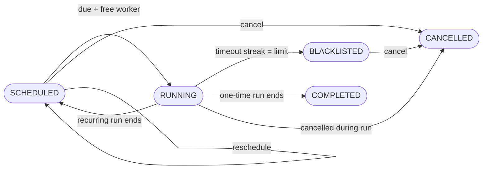
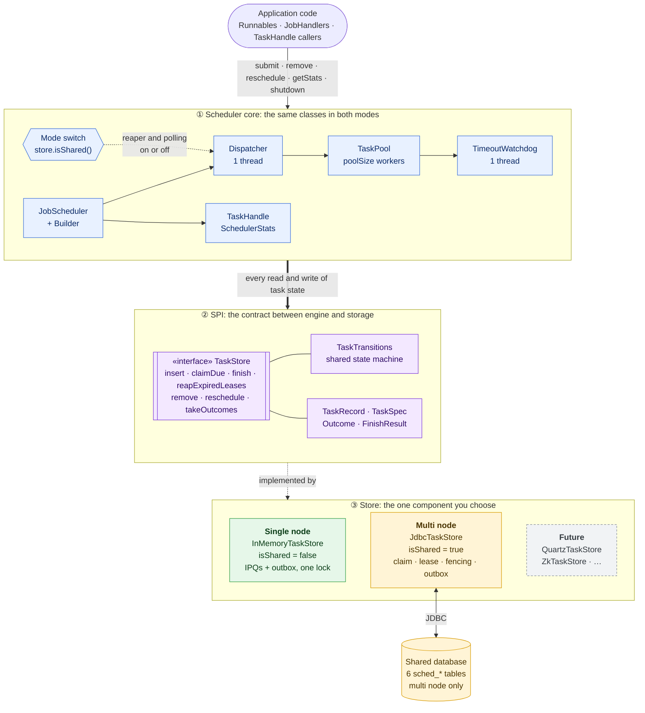
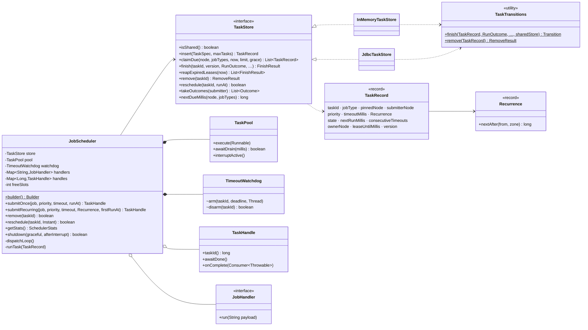
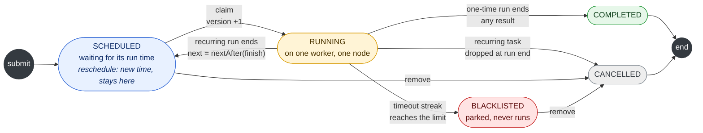
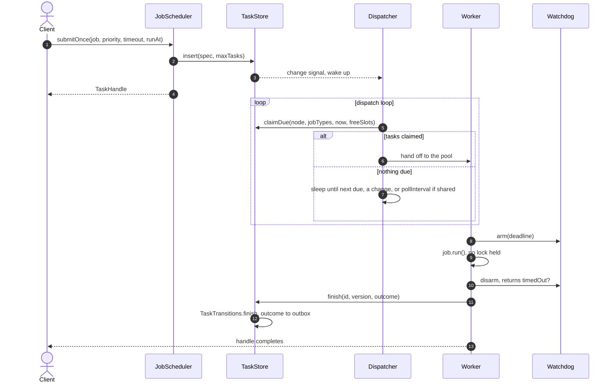
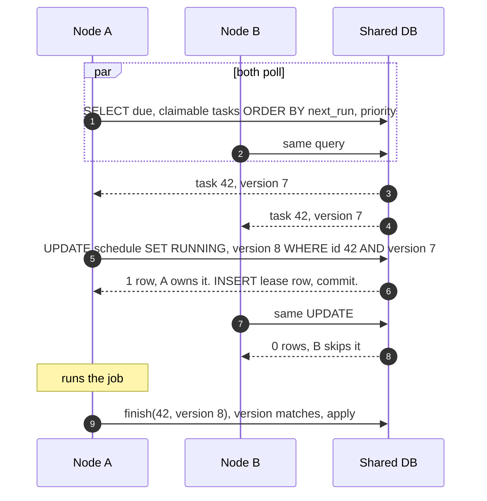
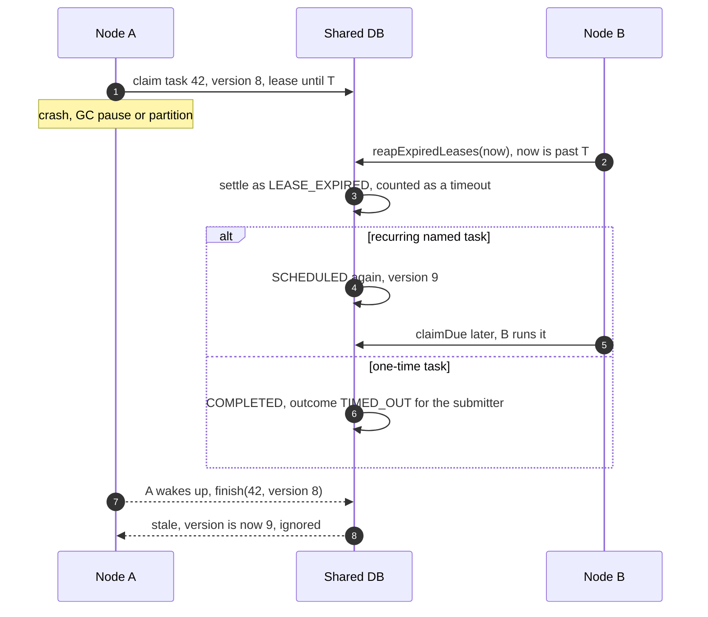

# JobScheduler: low-level design

A job scheduler in plain Java that runs **one-time and recurring jobs** with **priorities and
timeouts** on a fixed worker pool. The same code runs on **one node** (state in memory) or on **many
nodes** (state in a shared database). The only thing that changes between the two is one pluggable
component, the `TaskStore`.

**How to use this document**

- **Part 1, the interview playbook**: a 60-minute script. It covers what to say, what to draw and
  what to code, in order, with time boxes. Rehearse this part.
- **Part 2, the reference design**: requirements, architecture, lifecycle, flows, data model and
  guarantees of the real implementation. Use it for deep dives and follow-up questions.
- **[docs/DESIGN-DETAILED.md](docs/DESIGN-DETAILED.md)**: every edge case, the DDL, consistency
  proofs, the runbook and the SPI guide.

**Contents**

- [Part 1: Interview playbook (60 min)](#part-1-interview-playbook-60-min)
  - [The 30-second pitch](#the-30-second-pitch)
  - [Time plan](#time-plan)
  - [Phase 1: Clarify requirements (0–5)](#phase-1-clarify-requirements-05-min)
  - [Phase 2: Entities, API and lifecycle (5–10)](#phase-2-entities-api-and-lifecycle-510-min)
  - [Phase 3: Single-node design (10–17)](#phase-3-single-node-design-1017-min)
  - [Phase 4: Code the core (17–38)](#phase-4-code-the-core-1738-min)
  - [Phase 5: Prove it is correct (38–43)](#phase-5-prove-it-is-correct-3843-min)
  - [Phase 6: Scale to many nodes (43–55)](#phase-6-scale-to-many-nodes-4355-min)
  - [Phase 7: Trade-offs and wrap up (55–60)](#phase-7-trade-offs-and-wrap-up-5560-min)
  - [From the whiteboard to the real code](#from-the-whiteboard-to-the-real-code)
  - [Likely questions with crisp answers](#likely-questions-with-crisp-answers)
  - [Pitfalls that cost points](#pitfalls-that-cost-points)
  - [One-screen cheat sheet](#one-screen-cheat-sheet)
- [Part 2: Reference design](#part-2-reference-design)
  - [1. Requirements](#1-requirements) · [2. Core idea](#2-core-idea-one-engine-pluggable-store) ·
    [3. Components](#3-component-diagram) · [4. Architecture](#4-architecture-single-node-vs-multi-node)
  - [5. Classes](#5-classes) · [6. Lifecycle](#6-task-lifecycle) · [7. Key flows](#7-key-flows) ·
    [8. Data model](#8-data-model-multi-node)
  - [9. Concurrency](#9-concurrency-and-guarantees) · [10. Trade-offs](#10-design-decisions-and-trade-offs) ·
    [11. API](#11-api-and-usage) · [12. Extensibility](#12-extensibility) · [13. Build and test](#13-build-and-test)

---

# Part 1: Interview playbook (60 min)

## The 30-second pitch

> "I split the scheduler into an **engine** and a **store**. The engine has one dispatcher thread
> that sleeps until the next task is due, a fixed pool of workers, and a watchdog that interrupts
> runs past their timeout. The store holds task state and hands out due tasks atomically. On one
> node the store is an in-memory priority queue ordered by due time, then priority, with O(log N)
> cancel and reschedule. On many nodes it is a shared database. A claim is a compare-and-set on a
> `version` column, which also works as a fencing token, and a lease lets another node take over
> when one dies. Both stores apply the same state-machine rules, so the engine never knows how many
> nodes exist."

## Time plan

| Min | Phase | On the whiteboard | Goal |
|---|---|---|---|
| 0–5 | Clarify | requirements and scale numbers | Scope before you build |
| 5–10 | Entities, API, lifecycle | `Task` fields, 5 methods, state diagram | Agree on the contract |
| 10–17 | Single-node design | threads + data structures diagram, 3 key decisions | Show the shape before coding |
| 17–38 | Code | ~150 lines of Java | Working, thread-safe code |
| 38–43 | Prove it | 5 concurrency arguments, one trace | Show that you reason about races |
| 43–55 | Scale out | store SPI, claim SQL, lease, fencing | Show distributed-systems depth |
| 55–60 | Wrap up | trade-off summary, what's next | Finish clean |

**If the interviewer wants more high-level design (HLD) than low-level design (LLD):** cut Phase 4 to
a 10-minute skeleton (fields, `dispatch`, `finish`) and give Phase 6 25 minutes.

**If you are running late:** skip `reschedule` and `shutdown` while coding and say you would add
them; each is about 10 lines. Never skip Phase 5.

## Phase 1: Clarify requirements (0–5 min)

Ask these, then state the assumption you'll use if the interviewer leaves it to you:

| Question | Default assumption | Why it matters |
|---|---|---|
| One-time, recurring, or both? | Both. Recurring = every *n* seconds, minutes, hours, days, months or years | Recurring brings overlap, drift and calendar math |
| What does priority mean? | Order among tasks that are **due at the same time**: earlier due time first, then higher priority, then FIFO | Avoids starvation. Discuss the alternative later |
| Timeouts? | Per task. On expiry, interrupt the worker | Java can't kill a thread, so timeouts are cooperative |
| A recurring job keeps timing out? | Blacklist it after `maxConsecutiveTimeouts` in a row | Protects the pool from a stuck job |
| Can runs of one recurring job overlap? | **Never**: require `timeout < period` | Simplifies everything downstream |
| Cancel / reschedule? | Yes, by task id, for pending, running or blacklisted tasks | Needs O(log N) removal, not a heap scan |
| Concurrency bound? | Fixed pool of `poolSize` workers, plus a `maxTasks` cap on live tasks | Back-pressure |
| Results? | A handle the caller can wait on or attach a callback to | Like a `Future`, without the framework |
| One node or many? | **Start with one, design so many is a store swap** | Sets up Phase 6 |
| Allowed libraries? | Raw `Thread`, `ReentrantLock` and `Condition`; no `ScheduledExecutorService` | A common interview constraint |
| Scale? | ~10⁵ live tasks, ~10³ runs/s per node | One lock is fine at this size |

**Out of scope, out loud:** force-killing a job that ignores interrupts (needs one process per
job), exactly-once side effects across nodes (handlers must be idempotent), and leader election.

## Phase 2: Entities, API and lifecycle (5–10 min)

**API (single node):**

```java
long    submit(Runnable job, int priority, long runAt, long timeoutMs, long periodMs) // periodMs 0 = one-time
boolean cancel(long id)                  // pending: gone now; running: dropped when the run ends
boolean reschedule(long id, long runAt)  // pending tasks only
void    shutdown()
// production adds: TaskHandle (await / onComplete), getStats(), calendar Recurrence, named job types
```

**Entity:**

```
Task { id, job, priority, timeoutMs, periodMs,     ← fixed at submit
       runAt, deadline, worker, timedOut,          ← change per run
       consecutiveTimeouts, cancelled }            ← change across runs
```

**Lifecycle. Draw this and keep it on the board:**



> "Every arrow out of RUNNING is decided by a single function, `finish(task, outcome)`. In
> production that function is pure (`TaskTransitions`), so every store applies the same rules."

## Phase 3: Single-node design (10–17 min)

**Draw the threads and data structures:**

```
                submit / cancel / reschedule (any thread)
                               │  lock + wake.signal()
                               ▼
  ┌──────────────── one ReentrantLock guards everything ────────────────┐
  │ due      : TreeSet<Task> by (runAt, -priority, id)    waiting        │
  │ running  : TreeSet<Task> by (deadline, id)            armed timeouts │
  │ byId     : HashMap<id, Task>                          every live task│
  │ handoff  : ArrayDeque<Task>                           ≤ poolSize     │
  └─────────────────────────────────────────────────────────────────────┘
        ▲  1 fire timeouts: interrupt worker       │ work.signal()
        │  2 hand off due tasks while busy < pool   ▼
   Dispatcher (1 thread)                    Workers (poolSize threads)
   sleeps until min(next due,               take → arm deadline → run job
   next deadline) or a signal               OUTSIDE the lock → finish()
```

**Three decisions to state and justify:**

| Decision | Why | Alternative |
|---|---|---|
| **Ordered set keyed by `(runAt, -priority, id)`**, not `PriorityQueue` | Cancel and reschedule must find a task: O(log N) with `TreeSet` or an indexed heap, O(N) with `PriorityQueue` | Lazy deletion: leaves stale entries and complicates reschedule |
| **One dispatcher sleeping on a `Condition` with a timeout** | No busy polling. Wakes exactly when work is due or something changed | One timer thread per task: doesn't scale. Polling every *x* ms: latency vs CPU |
| **Next recurring run computed from the *finish* time** (fixed delay) | With `timeout < period`, runs can never overlap, and a slow job back-pressures itself | Fixed rate: start times don't drift, but runs can pile up after a stall |

> "In the real code the ready queue is the `IndexedPriorityQueue` from [../ds](../ds/README.md),
> the same O(log N) cancel and re-key with heap constants. On the whiteboard `TreeSet` gives the
> same complexity with no extra code."

## Phase 4: Code the core (17–38 min)

Write it in this order, narrating as you go: `Task` → comparators and fields → `submit` →
`dispatch` → `work` → `finish` → `cancel` → `reschedule` → `shutdown`. This version has been
compiled and tested (ordering, recurring runs, cancel during a run, timeout interrupts,
blacklisting, no leaked interrupts, the pool bound).

```java
import java.util.*;
import java.util.concurrent.RejectedExecutionException;
import java.util.concurrent.TimeUnit;
import java.util.concurrent.locks.Condition;
import java.util.concurrent.locks.ReentrantLock;
import java.util.function.LongSupplier;

public final class MiniScheduler {
    private static final class Task {
        final long id;
        final Runnable job;
        final int priority;                        // higher runs first among equally due tasks
        final long timeoutMs, periodMs;            // periodMs == 0: one-time
        long runAt, deadline;
        Thread worker;                             // set while running
        boolean cancelled, timedOut;
        int timeouts;                              // consecutive

        Task(long id, Runnable job, int priority, long runAt, long timeoutMs, long periodMs) {
            this.id = id; this.job = job; this.priority = priority;
            this.runAt = runAt; this.timeoutMs = timeoutMs; this.periodMs = periodMs;
        }
    }

    private static final Comparator<Task> BY_DUE = Comparator.<Task>comparingLong(t -> t.runAt)
            .thenComparingInt(t -> -t.priority).thenComparingLong(t -> t.id);
    private static final Comparator<Task> BY_DEADLINE = Comparator.<Task>comparingLong(t -> t.deadline)
            .thenComparingLong(t -> t.id);

    private final ReentrantLock lock = new ReentrantLock();
    private final Condition wake = lock.newCondition();     // dispatcher: something changed
    private final Condition work = lock.newCondition();     // workers: handoff is non-empty
    private final TreeSet<Task> due = new TreeSet<>(BY_DUE);           // waiting to run
    private final TreeSet<Task> running = new TreeSet<>(BY_DEADLINE);  // armed timeouts
    private final Map<Long, Task> byId = new HashMap<>();              // every live task
    private final ArrayDeque<Task> handoff = new ArrayDeque<>();       // dispatcher -> workers
    private final int poolSize, maxTimeouts;
    private final LongSupplier clock;
    private int busy;                                       // handed off or running, <= poolSize
    private long nextId;
    private boolean stopped;

    public MiniScheduler(int poolSize, int maxTimeouts, LongSupplier clock) {
        this.poolSize = poolSize; this.maxTimeouts = maxTimeouts; this.clock = clock;
        start(this::dispatch, "dispatcher");
        for (int i = 0; i < poolSize; i++) start(this::work, "worker-" + i);
    }

    public long submit(Runnable job, int priority, long runAt, long timeoutMs, long periodMs) {
        if (periodMs > 0 && timeoutMs >= periodMs)
            throw new IllegalArgumentException("timeout must be < period, so runs never overlap");
        lock.lock();
        try {
            if (stopped) throw new RejectedExecutionException("stopped");
            Task t = new Task(++nextId, job, priority, runAt, timeoutMs, periodMs);
            byId.put(t.id, t);
            due.add(t);
            wake.signal();
            return t.id;
        } finally { lock.unlock(); }
    }

    /** Pending: gone now. Running: dropped when the run ends. */
    public boolean cancel(long id) {
        lock.lock();
        try {
            Task t = byId.remove(id);
            if (t == null) return false;
            t.cancelled = true;
            due.remove(t);
            wake.signal();
            return true;
        } finally { lock.unlock(); }
    }

    /** Only a pending task can move. */
    public boolean reschedule(long id, long runAt) {
        lock.lock();
        try {
            Task t = byId.get(id);
            if (t == null || !due.remove(t)) return false;  // remove BEFORE changing the sort key
            t.runAt = runAt;
            due.add(t);
            wake.signal();
            return true;
        } finally { lock.unlock(); }
    }

    public void shutdown() {
        lock.lock();
        try {
            stopped = true;
            wake.signalAll();
            work.signalAll();
        } finally { lock.unlock(); }
    }

    private void dispatch() {
        lock.lock();
        try {
            while (!stopped) {
                long now = clock.getAsLong();
                while (!running.isEmpty() && running.first().deadline <= now) {   // 1. fire timeouts
                    Task t = running.pollFirst();
                    t.timedOut = true;
                    t.worker.interrupt();
                }
                while (busy < poolSize && !due.isEmpty() && due.first().runAt <= now) { // 2. hand off
                    handoff.add(due.pollFirst());
                    busy++;
                    work.signal();
                }
                long next = Long.MAX_VALUE;                                         // 3. sleep
                if (busy < poolSize && !due.isEmpty()) next = due.first().runAt;
                if (!running.isEmpty()) next = Math.min(next, running.first().deadline);
                if (next == Long.MAX_VALUE) wake.await();
                else wake.awaitNanos(TimeUnit.MILLISECONDS.toNanos(next - now));
            }
        } catch (InterruptedException e) {
            // nothing interrupts the dispatcher; exit
        } finally { lock.unlock(); }
    }

    private void work() {
        while (true) {
            Task t;
            lock.lock();
            try {
                while (handoff.isEmpty() && !stopped) work.await();
                if (stopped) return;
                t = handoff.poll();
                t.worker = Thread.currentThread();
                t.timedOut = false;
                t.deadline = clock.getAsLong() + t.timeoutMs;
                running.add(t);                    // arm the timeout
                wake.signal();                     // the dispatcher may need to wake sooner
            } catch (InterruptedException e) {
                continue;
            } finally { lock.unlock(); }

            try { t.job.run(); } catch (Throwable ignored) { }   // a real handle would record it
            finish(t);
        }
    }

    private void finish(Task t) {
        lock.lock();
        try {
            running.remove(t);                     // disarm; no-op if the timeout already fired
            t.worker = null;
            Thread.interrupted();                  // clear a late interrupt before the next job
            busy--;
            t.timeouts = t.timedOut ? t.timeouts + 1 : 0;
            boolean again = t.periodMs > 0 && !t.cancelled && !stopped && t.timeouts < maxTimeouts;
            if (again) {
                t.runAt = clock.getAsLong() + t.periodMs;      // fixed delay: from the finish time
                due.add(t);
            } else {
                byId.remove(t.id);                 // done, cancelled or blacklisted
            }
            wake.signal();
        } finally { lock.unlock(); }
    }

    private static void start(Runnable body, String name) {
        Thread th = new Thread(body, name);
        th.setDaemon(true);
        th.start();
    }
}
```

**What to say while writing each piece:**

| Piece | Say this |
|---|---|
| `BY_DUE` with `id` last | "The `id` makes the order total. Without it, `TreeSet` treats two tasks due at the same time with the same priority as duplicates and silently drops one." |
| `LongSupplier clock` | "Injectable, so tests can control time." |
| `submit` validates `timeout < period` | "This one check is what guarantees that runs never overlap." |
| `dispatch` step 1 | "Timeouts first, so a stuck job is interrupted even when the pool is full." |
| `dispatch` step 2, `busy < poolSize` | "`busy` counts handed-off *and* running tasks, so `handoff` never holds more than `poolSize`." |
| `dispatch` step 3 | "Sleep until the earliest due time or deadline. Any change signals `wake`, so I'm never late." |
| `t.job.run()` outside the lock | "User code never runs under my lock, so a slow job can't stall submit or cancel, and can't deadlock." |
| `finish` → `Thread.interrupted()` | "A timeout can fire just as the job returns. I clear the flag under the lock, so it can't leak into the next job on this worker." |
| `finish` re-adds the task | "This is the only place a recurring task goes back into `due`, so at most one run per task is ever in flight." |
| `reschedule` removes first | "A `TreeSet` locates entries by their sort key, so changing the key while the task is inside corrupts it." |

## Phase 5: Prove it is correct (38–43 min)

Give one sentence for each property, then trace one scenario.

| Property | Argument |
|---|---|
| **No lost wake-ups** | Every state change and the dispatcher's check-then-sleep happen under the same lock, and `await` releases it atomically. A signal sent before the dispatcher sleeps is seen by its check; one sent after wakes it. |
| **Timeout verdict is never lost** | Firing (`running.pollFirst`, `timedOut = true`) and disarming (`running.remove`) both run under the lock, so exactly one of them takes the entry. `finish` reads `timedOut` under the same lock. |
| **No interrupt leaks into the next job** | The dispatcher interrupts a worker only while its task is in `running`, under the lock. `finish` removes it and clears the flag under that lock, so no later interrupt can target this run. |
| **No overlap, ever** | A recurring task is in `due` or running, never both. It returns to `due` only in `finish`, after its run ended. |
| **Pool bound holds** | Only the dispatcher increments `busy`, and only while `busy < poolSize`. Only `finish` decrements it. |
| **No deadlock** | One lock, and no job code runs while holding it. (Production adds locks in a fixed order: scheduler → pool, scheduler → store.) |

**Trace: pool of 1, A (priority 1) and B (priority 5) both due at *t*, timeout 50 ms, B hangs:**

1. The dispatcher wakes at *t*. `due.first()` is B (higher priority), so B goes to `handoff` and `busy = 1`.
2. The pool is full, so A stays in `due`. The worker arms B with `deadline = t+50` and signals `wake`.
3. The dispatcher sleeps until `t+50`, the only armed deadline. It doesn't use A's due time, because no worker is free.
4. At `t+50`: B is in `running` and past its deadline. `timedOut = true` and the worker is interrupted.
5. B's `sleep` throws, the job returns, and `finish(B)` clears the interrupt and sets `busy = 0`.
   `timeouts` is now 1, so a recurring B is re-queued at `now + period`. It signals `wake`.
6. The dispatcher hands A to the now-free worker.

**How I'd test it:** inject a fake clock for deterministic ordering and timeout tests. Run the same
scheduler suite against every store (production runs one abstract suite against both stores, plus
a store contract suite). Add a stress test that checks `max concurrency ≤ poolSize` and that no run
overlaps.

## Phase 6: Scale to many nodes (43–55 min)

**Step 1: find the seam (2 min).** Draw a box around the four structures from Phase 3:

> "Everything the dispatcher and workers touch is task *state*. If I put it behind an interface,
> `TaskStore`, the engine stays the same, and a shared store makes it a cluster."

```
TaskStore:  insert · claimDue(node, now, limit) · finish(id, version, outcome)
            remove · reschedule · reapExpiredLeases(now) · takeOutcomes(submitter)
            InMemoryTaskStore (one node)  |  JdbcTaskStore (many nodes, one database)
```

**Step 2: walk through the five problems a shared store must solve, in order (8 min):**

| # | Problem | Solution | SQL / mechanism |
|---|---|---|---|
| 1 | **Two nodes claim the same task** | Optimistic compare-and-set on a `version` column | `UPDATE schedule SET state='RUNNING', version=version+1 WHERE id=? AND version=? AND state='SCHEDULED'`: 1 row means you own it, 0 rows means skip |
| 2 | **The claiming node dies mid-run** | A **lease**: `lease_until = now + timeout + leaseGrace`. Every node's dispatcher reaps expired leases | The reaper settles the run as a timeout through the same `finish` path. A recurring task is re-scheduled; a one-time task completes as `TIMED_OUT` |
| 3 | **The "dead" node was only paused** (GC, partition) and later writes its result | **Fencing**: `finish(id, version)` applies only if the version still matches | The reaper bumped the version, so the late write is rejected as stale |
| 4 | **Cluster-wide `maxTasks`** | A counter row | `UPDATE meta SET val=val+1 WHERE name='live' AND val < ?` |
| 5 | **The caller's handle is on node A, but the task ran on B** | An **outbox**: the outcome row is addressed to the submitter node | A's dispatcher calls `takeOutcomes(A)` on every pass and completes its handles |

**Also mention:**
- **Seeing other nodes' work:** with no cross-node signal, the dispatcher's sleep is capped at
  `pollInterval` (500 ms by default). Local changes still wake it immediately.
- **Job routing:** a `Runnable` can't be serialized, so it is **pinned** to its node. A **named job
  type** plus a String payload runs on any node that registered a handler for it, and survives its
  submitter.
- **Data model:** the hot `schedule` table (indexed on `(state, next_run_ms)`) is kept separate from
  the immutable `task` row, the large `payload` and the `lease` row, so a claim scans narrow rows.
  See [§8](#8-data-model-multi-node).

**Step 3: state the guarantees honestly (2 min):**

| | Single node | Multi node |
|---|---|---|
| One-time task | At most once | At most once. A run whose node died is reported as timed out, **not retried** |
| Recurring overlap | Never | Never, unless a run outlives its lease. The result is fenced, but **side effects are not**, so handlers must be idempotent |
| Durability | None | Named tasks are as durable as the database |
| Clock | One clock | NTP-synced; skew must stay below `leaseGrace` |

Diagrams for the race and the failover are in [§7.2](#72-multi-node-two-nodes-race-for-the-same-task)
and [§7.3](#73-multi-node-a-node-dies-mid-run).

## Phase 7: Trade-offs and wrap up (55–60 min)

**Name three trade-offs you made deliberately:**

1. **At-most-once over at-least-once** for one-time jobs: we prefer "never run twice" for
   non-idempotent work. Retrying is a policy you could add on top.
2. **Polling the database over push notifications**: no leader, no ZooKeeper, no RPC between nodes.
   The cost is up to `pollInterval` of latency for work submitted on another node.
3. **Lease = timeout + grace, never renewed**: simple, and a run can't legitimately outlive its
   timeout. The cost: `leaseGrace` must cover GC pauses and clock skew.

> "To recap: one dispatcher that sleeps until the next deadline, a fixed pool of workers, and
> timeouts enforced by interrupting the worker. All state sits behind a `TaskStore`. In memory it
> is an indexed priority queue with O(log N) cancel and reschedule. In a database, a claim is a
> compare-and-set on a version that doubles as the fencing token, with leases for failover and an
> outbox for results. Next I'd add retries with backoff for idempotent jobs, `SKIP LOCKED` claims
> on PostgreSQL, and metrics on scheduling lag."

## From the whiteboard to the real code

| Whiteboard (`MiniScheduler`) | Production | Why it differs |
|---|---|---|
| `TreeSet` ready queue | `IndexedPriorityQueue` in `InMemoryTaskStore` | Same O(log N); heap constants, O(1) peek |
| Dispatcher fires timeouts | Separate `TimeoutWatchdog` thread with its own IPQ of deadlines | A slow store call can't delay a timeout |
| `ArrayDeque` handoff + `work()` | `TaskPool`: raw threads, a `busy[]` flag per worker | Supports precise drain and interrupt at shutdown |
| `long` id returned | `TaskHandle`: `awaitDone`, `onComplete`, `getError` | Callers need the result |
| `periodMs` | `Recurrence(unit, amount)` with `ZonedDateTime` math | Jan 31 + 1 month = Feb 28; DST-correct days |
| Blacklisted = dropped | `BLACKLISTED` state, still counted, removable | Visible to operators |
| `finish` logic inline | Pure `TaskTransitions.finish`, shared by every store | Identical rules in every backend |
| One class owns state | `TaskStore` SPI: in-memory or JDBC | Multi-node with no engine changes |
| `shutdown` just stops | Bounded escalation: drain → interrupt → abandon, then hand named tasks to other nodes | Always returns within a time limit |

## Likely questions with crisp answers

| Question | Answer |
|---|---|
| Why not `ScheduledThreadPoolExecutor`? | It covers single-node, one-time and fixed-rate/delay work, but not priority among due tasks, blacklisting, calendar months or multi-node. Interviews usually forbid it anyway. Its `DelayedWorkQueue` uses the same idea: a heap whose entries know their index. |
| Why can't you stop a job that ignores interrupts? | `Thread.stop` is unsafe (it releases locks mid-update) and has thrown `UnsupportedOperationException` since JDK 20. The only hard kill is a separate process per job. |
| Priority only breaks ties on due time. Isn't that weak? | It is deliberate: a strict "highest priority first among all due tasks" can **starve** low-priority work under load. If wanted, use priority first plus **aging** (effective priority grows with wait time). |
| Fixed rate or fixed delay? | Fixed delay, computed from the finish time. It can't overlap and it back-pressures. Fixed rate keeps a wall-clock cadence but needs a skip or coalesce policy after a stall. |
| What happens to runs missed during downtime? | On restart, overdue tasks have `next_run ≤ now`, so each runs **once** immediately, then resumes its cadence. Missed runs are coalesced, not replayed. |
| Why compare-and-set rather than `SELECT … FOR UPDATE SKIP LOCKED`? | CAS is portable and lock-free, and the version doubles as the fencing token. `SKIP LOCKED` is faster under contention on PostgreSQL or MySQL 8; it could be another store. |
| Why does the version double as a fencing token? | Every claim and every reap increments it. A node holding an old version can't prove it still owns the run, so its `finish` is rejected. |
| Lease renewal (heartbeats)? | Not needed: the lease covers `timeout + grace`, and a run past its timeout is interrupted anyway. Renewal adds writes and failure modes. |
| Thundering herd on polling? | N nodes × 2 polls/s is cheap with the `(state, next_run_ms)` index. For more scale, add jitter, claim in batches (`limit = freeSlots`), or shard tasks by `hash(id) mod S` with per-shard ownership. |
| The database is a single point of failure? | Use an HA primary with a standby. With the database down, nodes keep running in-flight jobs and retry store calls. No new claims happen until it returns. |
| How do you test concurrency? | An injectable clock, the same suite on both stores, a store contract test suite, and a multi-node test with several schedulers sharing one H2 database. |
| Complexity? | In memory: submit, cancel and reschedule O(log N), next-due O(1). In the database: a claim is one indexed range scan plus one single-row update per task. |
| DST and time zones? | Days, months and years use `ZonedDateTime` in the scheduler's zone, so "1 day" is a calendar day (23 or 25 hours across DST) and Jan 31 + 1 month = Feb 28. Seconds, minutes and hours are fixed durations. Because the next run is computed from the *finish* time, start times drift by the run length; anchoring to a cron-style wall-clock schedule fixes that. |

## Pitfalls that cost points

- Running the job **while holding the lock**, which serializes the pool and invites deadlock.
- A `TreeSet` comparator without a unique tiebreaker, which silently drops tasks.
- Mutating `runAt` while the task is inside a `TreeSet` or heap.
- `if (cond) await()` instead of `while (cond) await()`. Spurious wake-ups are real.
- Forgetting to clear the interrupt flag between jobs on a reused worker.
- Re-queueing a recurring task at **claim** time instead of at finish, which allows overlap.
- Saying "exactly once" for a distributed scheduler. Say "at most once, plus idempotent handlers".
- Spending more than 21 minutes coding. Phases 5 and 6 are where seniority shows.

## One-screen cheat sheet

```
PITCH      engine (dispatcher + pool + watchdog) over a pluggable TaskStore (memory | shared DB)
ORDER      (runAt, -priority, id)          id = total order, FIFO among equal tasks
STRUCTURES due: ordered set | running: by deadline | byId: map | handoff: deque ≤ poolSize
DISPATCH   lock; fire expired deadlines → interrupt; hand off due while busy<pool;
           await(min(next due if free slot, next deadline)) — signals on every change
WORKER     take → arm deadline → run OUTSIDE lock → finish
FINISH     disarm; clear interrupt; busy--; streak = timedOut ? +1 : 0;
           recurring && !cancelled && streak<max → runAt = now+period (fixed delay) else drop
NO OVERLAP timeout < period  +  re-queue only in finish
MULTI NODE claim  = UPDATE … version=version+1 WHERE id=? AND version=?   (CAS + fencing token)
           lease  = now + timeout + grace; any node reaps → settled as timeout
           fence  = finish(id, version) rejected if version moved
           outbox = outcome row for the submitter; maxTasks = counter row WHERE val < max
GUARANTEE  at most once; handlers idempotent; clock skew < leaseGrace
TRADE-OFFS at-most-once > retry | DB polling > push | fixed lease > heartbeat
```

---

# Part 2: Reference design

The design of the real implementation, the depth you'd draw on for follow-up questions.

## 1. Requirements

### 1.1 Functional: both modes

| # | Requirement |
|---|---|
| F1 | Submit a **one-time** job to run at a given time. |
| F2 | Submit a **recurring** job: every *n* SECOND, MINUTE, HOUR, DAILY, MONTHLY or YEARLY. |
| F3 | Months and years use **calendar math**, so Jan 31 + 1 month = Feb 28. |
| F4 | Each job has a **priority**. Due jobs run in this order: earliest due time, then higher priority, then FIFO. |
| F5 | Each run has a **timeout**. On expiry the worker is interrupted. A one-time job then fails with `TimeoutException`; a recurring job moves on to its next run. |
| F6 | Runs of the same recurring job **never overlap**: the timeout must be shorter than the interval. |
| F7 | A recurring job that times out `maxConsecutiveTimeouts` times in a row is **blacklisted** and never runs again. |
| F8 | **Remove** a task by id, whether it is pending, running or blacklisted. |
| F9 | **Reschedule** a pending task to a new time. |
| F10 | Each submit returns a **handle** the caller can wait on, poll, or attach a callback to. |
| F11 | **Stats**: a consistent snapshot of gauges and counters. |
| F12 | **Bounded shutdown**: drain, then interrupt, then give up, and always return within a time limit. |

### 1.2 Functional: added in multi-node mode

| # | Requirement |
|---|---|
| M1 | **Same API and behaviour.** F1–F12 hold unchanged. The mode is chosen only by which store is plugged in. |
| M2 | **Exclusive claim:** each due run is executed by exactly one node. |
| M3 | **Failover:** if a node dies mid-run, another node takes the task over after its lease expires. |
| M4 | **Fencing:** a node that lost its claim can't overwrite the task's result. |
| M5 | **Cluster-wide `maxTasks`** limit. |
| M6 | A handle completes on the **submitting** node, wherever the task ran. |
| M7 | **Job routing:** a `Runnable` is pinned to its node. A *named job type* runs on any node that registered a handler for it. |

### 1.3 Non-functional

- **No executor framework:** built from raw `Thread`, `ReentrantLock`/`Condition` and `volatile`
  fields only. No third-party runtime dependencies; JDBC uses only `java.sql`.
- **Complexity:** in memory, submit, remove and reschedule are O(log N) and peeking at the next task
  is O(1) (an `IndexedPriorityQueue`). In the database, a claim is one indexed range scan.
- **Thread-safe, deadlock-free, no lost wake-ups.** The clock is injectable, so tests are deterministic.
- **Multi node:** nodes coordinate only through the store, with no leader and no node-to-node RPC.
  Work submitted on another node is noticed within `pollInterval` (500 ms by default).

### 1.4 Out of scope

Force-killing a job that ignores interrupts (that needs one process per job), exactly-once side
effects across nodes (handlers must be idempotent), leader election and sharding.

---

## 2. Core idea: one engine, pluggable store

Split the scheduler into **what runs jobs** and **where task state lives**:

| Part | Responsibility | Changes between modes? |
|---|---|---|
| **Engine** (`JobScheduler`, Dispatcher, `TaskPool`, `TimeoutWatchdog`, `TaskHandle`) | Decide when to run, run on a worker, enforce timeouts, complete handles | **No** |
| **Rules** (`TaskTransitions`) | Pure functions that compute the next state when a run ends or a task is removed | **No** |
| **Store** (`TaskStore` SPI) | Keep tasks, claim due ones atomically, apply transitions, hold outcomes | **Yes**: `InMemoryTaskStore` or `JdbcTaskStore` |

Multi-node support is therefore *a store that is shared*. Every store method is atomic, and
claims carry a **version** (the fencing token), so the engine never needs to know how many nodes exist.

---

## 3. Component diagram

Layers ① and ② are the same classes in both modes. Layer ③ is the one choice you make.



**How one design serves both use cases.** The engine reads `store.isShared()` once, at
construction. These are the only behaviours that differ:

| Behaviour | Single node (`isShared` = false) | Multi node (`isShared` = true) |
|---|---|---|
| Default `nodeId` | `"local"` | `node-<random>` (set a stable one) |
| Lease reaper | Off: the process *is* the lease | Runs on every dispatcher pass |
| Dispatcher sleep | Until the next due task or a local change | Also capped at `pollInterval`, to see other nodes' work |
| Unregistered job type at submit | Rejected | Accepted: another node may run it |
| Recurring task when its node stops | Dropped | Named: kept for the other nodes. Pinned `Runnable`: removed. |

Claims, fencing, capacity and outcomes use the **same SPI calls** in both modes. The in-memory store
simply can never lose a claim.

---

## 4. Architecture: single node vs multi node

### 4.1 Single node: embedded in one JVM

The numbers trace one task.


### 4.2 Multi node: many JVMs, one shared database

Every node runs the **same code**, each with its own `JobScheduler` and `JdbcTaskStore`, all pointed
at one database. A node runs a task only if the task is pinned to it or the node registered the
task's job type. That lets you add worker-only nodes such as C.


### 4.3 What changes between the two

| Concern | Single node | Multi node |
|---|---|---|
| Task state | Heap: IPQs indexed by task id | Six tables in a shared database |
| Survives a restart | No | Named tasks: yes. `Runnable`s: no (pinned to their JVM). |
| Claim | Pop the queue head under the store lock | `UPDATE … SET RUNNING, version+1 WHERE version = ?` + a lease row |
| Runner dies | Everything dies with it | The lease expires and another node reaps it as a timeout |
| Stale result | Impossible | Rejected by the version check (fencing) |
| `maxTasks` | Map size | A counter row: `UPDATE … SET val = val+1 WHERE val < max` |
| Handle completion | Local outbox | Outcome row addressed to the submitter, which polls it |
| Seeing new work | Immediate signal | Local: immediate. Remote: within `pollInterval`. |
| Clock | One clock | NTP-synced; skew must be under `leaseGrace` |

---

## 5. Classes



`InMemoryTaskStore` keeps a ready queue and a blacklist, both `IndexedPriorityQueue`s
([../ds](../ds/README.md)), behind one lock. `JdbcTaskStore` runs each method in one database transaction.

---

## 6. Task lifecycle



**Key:** blue, yellow and red are **live** states: the task is in the store and counts toward
`maxTasks` (a blacklisted task too, until it is removed). Green and grey are **terminal**: the task
is removed and its outcome goes to the submitting node.

The states and rules are the same in both modes, because both stores use `TaskTransitions`. What
differs is **what triggers** each transition and **where the state is kept**.

### 6.1 Single node (`InMemoryTaskStore`)

| Transition | Trigger | Store effect | Handle |
|---|---|---|---|
| → SCHEDULED | `submitOnce` / `submitRecurring` | Added to the ready IPQ; capacity +1 | Returned to the caller |
| SCHEDULED → SCHEDULED | `reschedule(id, time)` | Key changed in place, IPQ `update()` (O(log N)) | — |
| SCHEDULED → RUNNING | Due, and a worker is free | Polled from the ready IPQ; version +1 | — |
| RUNNING → SCHEDULED | A recurring run ends (success, exception, or timeout below the limit) | Back in the ready IPQ at `nextAfter(finish time)`. A timeout increments the streak; anything else resets it. | Stays open |
| RUNNING → BLACKLISTED | A recurring run times out and the streak reaches `maxConsecutiveTimeouts` | Moved to the blacklist IPQ; still counts toward `maxTasks` | `TimeoutException` |
| RUNNING → COMPLETED | A one-time run ends in any way | Removed; capacity −1; outcome to the local outbox | `null`, the job's exception, or `TimeoutException` |
| RUNNING → CANCELLED | A recurring run ends after `remove` was called, or the scheduler is shutting down | Removed; capacity −1 | `CancellationException` |
| SCHEDULED → CANCELLED | `remove(id)` | Removed from the ready IPQ; capacity −1 | `CancellationException` |
| BLACKLISTED → CANCELLED | `remove(id)` | Removed from the blacklist IPQ; capacity −1 | Already completed |

### 6.2 Multi node (`JdbcTaskStore`)

| Transition | Trigger | Store effect | Handle |
|---|---|---|---|
| → SCHEDULED | Submit on any node | Rows in `task`, `task_payload` and `task_schedule`; the `live` counter +1 if below `maxTasks` | Returned on the submitting node |
| SCHEDULED → SCHEDULED | `reschedule` from **any node** | `next_run_ms` updated; version +1 | — |
| SCHEDULED → RUNNING | Due, a worker is free, and this node may run it (pinned here, or a registered job type) | `UPDATE … WHERE version = ?` wins on **exactly one node**; version +1; a `task_lease` row is inserted | — |
| RUNNING → SCHEDULED | A recurring run ends, **or another node reaps its expired lease** (counts as a timeout) | `task_schedule` updated; lease row deleted. Any eligible node may claim the next run. | Stays open |
| RUNNING → BLACKLISTED | Timeout or lease expiry, and the streak reaches the limit | Lease row deleted; still counts toward `maxTasks` | `TimeoutException`, on the submitter |
| RUNNING → COMPLETED | A one-time run ends, **or its lease expired because its node died** (never retried) | `DELETE task` cascades to all rows; `live` −1; `sched_outcome` row for the submitter | Completes on the **submitter**: `null`, `JobFailedException` if it failed on another node, or `TimeoutException` |
| RUNNING → CANCELLED | A recurring run ends after `remove`; **a pinned `Runnable`'s node stops, or its lease expires** (no other node can run it) | Rows deleted; `live` −1; outcome row | `CancellationException`, on the submitter |
| RUNNING → SCHEDULED (node stopping) | A **named** recurring task's node shuts down gracefully | Kept, for the other nodes to run | Closed on the stopping node only; the task lives on |
| SCHEDULED / BLACKLISTED → CANCELLED | `remove(id)` from **any node** | Rows deleted; `live` −1; outcome row | `CancellationException` on the submitter, unless already completed |
| Late finish from a node that lost its lease | That node wakes up after a GC pause or partition | **Rejected**: the version no longer matches | — |

---

## 7. Key flows

### 7.1 Submit, claim, run, complete (both modes)



### 7.2 Multi node: two nodes race for the same task



### 7.3 Multi node: a node dies mid-run



---

## 8. Data model (multi node)

The data is split by **how often each part changes**, so the hot path touches only narrow rows.
Deleting a task row cascades to the rest.

```mermaid
erDiagram
    sched_task ||--o| sched_task_payload : "optional"
    sched_task ||--|| sched_task_schedule : "queue state"
    sched_task ||--o| sched_task_lease : "only while RUNNING"
    sched_task ||..o| sched_outcome : "after it ends, no FK"

    sched_task {
        BIGINT task_id PK
        VARCHAR job_type
        VARCHAR pinned_node "NULL = any node"
        VARCHAR submitter_node
        INT priority
        BIGINT timeout_ms
        VARCHAR rec_unit "NULL = one-time"
    }
    sched_task_payload {
        BIGINT task_id PK
        VARCHAR payload
    }
    sched_task_schedule {
        BIGINT task_id PK
        VARCHAR state
        BIGINT next_run_ms
        INT consecutive_timeouts
        BIGINT version "fencing token"
    }
    sched_task_lease {
        BIGINT task_id PK
        VARCHAR owner_node
        BIGINT lease_until_ms
    }
    sched_outcome {
        BIGINT task_id PK
        VARCHAR submitter_node
        VARCHAR kind
    }
    sched_meta {
        VARCHAR name PK "live, schema_version"
        BIGINT val
    }
```



| Table | Written | Why it's separate |
|---|---|---|
| `sched_task` | Once, at submit | The immutable definition, never rewritten |
| `sched_task_payload` | Once, at submit | Can be large, so it's kept out of the claim scan |
| `sched_task_schedule` | On every claim and finish | The hot queue, indexed on `(state, next_run_ms)` |
| `sched_task_lease` | On claim, deleted at run end | The reaper scans only running tasks (index on `lease_until_ms`) |
| `sched_outcome` | When a task ends | The outbox to the submitter; it outlives the task |
| `sched_meta` | On insert and on terminal transitions | Cluster-wide `live` counter (`maxTasks`) and the schema version |

The claim, which is the heart of the multi-node design:

```sql
UPDATE sched_task_schedule SET state = 'RUNNING', version = version + 1
 WHERE task_id = ? AND version = ? AND state = 'SCHEDULED';   -- 1 row: we own it. 0 rows: someone else does.
INSERT INTO sched_task_lease (task_id, owner_node, lease_until_ms, claimed_ms)
SELECT task_id, ?, ? + timeout_ms, ? FROM sched_task WHERE task_id = ?;
```

The full DDL, the indexes and schema versioning are in the
[detailed doc](docs/DESIGN-DETAILED.md#data-model-multi-vm).

---

## 9. Concurrency and guarantees

**Threads on each node:** 1 dispatcher, `poolSize` workers, 1 watchdog, all daemon threads.

| Concern | How it's handled |
|---|---|
| Scheduler state | One `ReentrantLock` plus a `Condition` the dispatcher waits on |
| Lost wake-ups | Every change sets `changed = true` and signals under the lock. The dispatcher sleeps only if it's still false. |
| Deadlocks | Fixed lock order (scheduler → pool, scheduler → store). Listeners run outside the store lock. No lock is held while a job runs. |
| Timeouts | The watchdog keeps an IPQ of deadlines and interrupts the worker. The worker clears its interrupt flag before the next job. |
| Store atomicity | In memory: one lock. JDBC: one transaction per method, with row locks taken in a fixed order. |

| Guarantee | Single node | Multi node |
|---|---|---|
| One-time execution | At most once | At most once. A run whose node died is reported as timed out, not retried. |
| Recurring overlap | Never | Never, unless a run outlives its lease (GC pause, partition). Its result is fenced off, but side effects are not, so **handlers must be idempotent**. |
| Handle completion | Exactly once | Exactly once, on the submitter, if it stays alive with the same `nodeId` |
| Durability | None | Named tasks are as durable as the database |

---

## 10. Design decisions and trade-offs

| Decision | Why | Alternative considered |
|---|---|---|
| Pluggable `TaskStore` SPI with one shared engine | One codebase and one test suite for both modes. New backends need no engine change. | Two separate schedulers: duplicated logic that drifts apart |
| State-change rules as pure functions (`TaskTransitions`) | Every store behaves identically, and the rules are unit-testable | Each store implements the rules itself: subtle divergence |
| Optimistic claim with `version` (compare-and-set) | No long-held locks; the version doubles as the fencing token | `SELECT … FOR UPDATE SKIP LOCKED`: faster under contention but not portable. Could be a future store. |
| Lease = `timeout + leaseGrace`, never renewed | Simple; a run can't legitimately outlive its timeout | Heartbeat renewal: more writes and more failure modes |
| Coordinate only through the database (polling) | No leader, no membership protocol, no RPC | ZooKeeper or Redis pub/sub for push wake-ups: lower latency, another system to run |
| One-time tasks fail rather than retry after a crash | Prefer "not run twice" for non-idempotent work | At-least-once retry: needs idempotency everywhere |
| Recurring next run computed from the **finish** time | Guarantees no overlap and back-pressure on slow jobs | Fixed rate: start times don't drift, but runs can pile up |
| Runnables pinned, named types routable | A lambda can't be serialized safely; a type name plus a String payload can | Serializing closures: fragile and unsafe |
| `IndexedPriorityQueue` for the ready queue, blacklist and deadlines | O(log N) remove and reschedule by id, which a `PriorityQueue` can't do | `TreeSet` with re-insert: works, but more allocation |

---

## 11. API and usage

```java
// Single node: the default in-memory store
JobScheduler s = new JobScheduler(4 /*poolSize*/, 1_000 /*maxTasks*/, 3 /*maxConsecutiveTimeouts*/,
        new SchedulerClock.SystemClock(ZoneId.of("UTC")));
TaskHandle h = s.submitOnce(() -> System.out.println("hi"), 10, Duration.ofSeconds(2), Instant.now());
s.submitRecurring(this::report, 0, Duration.ofMinutes(1), new Recurrence(RecurrenceUnit.MINUTE, 15), Instant.now());

// Multi node: the same code on every node, plus a shared store
JobScheduler s = JobScheduler.builder()
        .nodeId(System.getenv("POD_NAME"))                 // unique and stable
        .store(new JdbcTaskStore(dataSource).createSchema())
        .maxTasks(100_000)                                 // cluster-wide
        .registerJob("send-invoice", id -> invoices.send(id))   // idempotent handler
        .build();
s.submitOnce("send-invoice", "INV-1042", 5, Duration.ofSeconds(20), Instant.now());  // any node may run it
```

| Method | Purpose |
|---|---|
| `submitOnce` / `submitRecurring` (a `Runnable`, or a job type plus payload) | Schedule a job; returns a `TaskHandle` |
| `remove(id)` / `reschedule(id, time)` | Cancel a task, or move a pending one to a new time. Works from any node. |
| `getStats()` | Gauges (pending, running, blacklisted, idle workers, capacity left) and counters |
| `shutdown(graceful, afterInterrupt)` | Bounded shutdown; returns `true` if every run finished |
| `TaskHandle.awaitDone()` / `onComplete(cb)` / `getError()` | Wait for or observe the result |

Full signatures, exceptions and builder options are in the [detailed doc](docs/DESIGN-DETAILED.md#public-api).

---

## 12. Extensibility

A new backend implements `TaskStore`, reuses `TaskTransitions`, and passes the shared contract test
suite. It lives in its own module, so the core stays dependency-free.

| Concept | JDBC (provided) | ZooKeeper | Quartz bridge |
|---|---|---|---|
| Exclusive claim | `UPDATE … WHERE version = ?` | `setData(path, data, expectedVersion)` | Quartz fires a trigger on one node |
| Lease | Lease row, reaped by any node | Ephemeral znode, gone with the session | Fired-trigger row plus cluster check-in |
| Fencing token | `version` column | znode version | Version in the `JobDataMap` |
| Wake-up | Polling | Watches | The Quartz fire itself |

The [detailed doc](docs/DESIGN-DETAILED.md#extending-the-spi-quartz-zookeeper-other-schedulers)
covers the store-writer checklist and the Quartz and ZooKeeper designs.

---

## 13. Build and test

```bash
mvn -pl scheduler -am test
```

81 tests. The same scheduler suite runs against both stores (`InMemoryJobSchedulerTest`, and
`JdbcJobSchedulerTest` on H2), alongside store contract tests, unit tests for `TaskTransitions` and
`Recurrence`, and a multi-node test (`ClusterJobSchedulerTest`: several schedulers sharing one database).
