# JobScheduler

`com.salesforce.einstein.scheduler` is a job scheduler written in plain Java. It runs one-time and
recurring jobs on a fixed pool of worker threads, enforces a timeout for each run, and automatically
parks recurring jobs that keep timing out.

The same scheduler runs in two modes. Only the **task store** behind it changes:

| Mode | Store | Where tasks live | Use it when |
|---|---|---|---|
| **Single VM** (default) | `InMemoryTaskStore` | Inside the process, in [`IndexedPriorityQueue`](../ds/README.md)s | One process owns the work; nothing needs to survive a restart. |
| **Multi VM** | `JdbcTaskStore` (or any shared `TaskStore`) | A database shared by every node | Several processes share the work; tasks must survive a node dying. |

Both modes use the same engine (dispatcher, worker pool, timeout watchdog), the same state machine
(`TaskTransitions`) and the same public API. The multi-VM mode only *adds* behaviour: claims, leases,
failover and cluster-wide limits. Every base requirement below holds in both modes, and the test suite
runs the same scheduler tests against both stores.

The store is a small SPI (`spi.TaskStore`). The scheduler is fully custom: there's no Quartz,
db-scheduler or Temporal underneath. A ZooKeeper-, Quartz- or other database-backed store can be
plugged in later by implementing the same interface and passing the same contract tests (see
[Extending the SPI](#extending-the-spi-quartz-zookeeper-other-schedulers)).

## Requirements

### Functional — base (both modes)

| # | Requirement | Where |
|---|---|---|
| F1 | Submit a **one-time** job to run at a given `Instant`. | `submitOnce` |
| F2 | Submit a **recurring** job that repeats every *n* SECOND / MINUTE / HOUR / DAILY / MONTHLY / YEARLY. | `submitRecurring`, `Recurrence` |
| F3 | Month and year steps use calendar arithmetic. For example, Jan 31 + 1 month = Feb 28; it is not a fixed number of milliseconds. | `Recurrence.nextAfter` |
| F4 | Every job has a **priority** (higher runs first). Due jobs are ordered by **earliest run time**, then **higher priority**, then **submission order** (FIFO). When fewer workers are free than jobs are due, the free workers go to the **highest-priority** due jobs, because the dispatcher claims at most `freeSlots` tasks, taken from the head of that order. | `TaskRecord.SCHEDULE_ORDER`, `TaskStore.claimDue` |
| F5 | Every run has a **timeout**. When it expires, the worker thread is interrupted and the run counts as timed out. What happens next depends on the type of task: a **one-time** task finishes, its handle completes with `TimeoutException`, and it is never retried; a **recurring** task has its timeout counter incremented and is rescheduled, or blacklisted (F7). | `TimeoutWatchdog`, `TaskTransitions.finish` |
| F6 | A recurring job must **finish before its next run is due**. Its runs never overlap. This is enforced two ways: (a) at submit time, the timeout must be **shorter than the shortest possible interval**, so a run is interrupted before the next one could be due; (b) while a run is in progress the task is `RUNNING` in the store and can't be claimed. Only once the run ends is it set back to `SCHEDULED`, with the next run time computed from when it finished. | `submitRecurring`, `claimDue`, `TaskTransitions.finish` |
| F7 | After `maxConsecutiveTimeouts` timeouts in a row, a recurring job is **blacklisted**: it moves to the blacklist and never runs again. Only **timeouts** count toward this limit; a run that throws an exception does not, and any run that doesn't time out resets the counter to 0. The counter is stored on the task and changed only by an atomic `finish` in the store. A task never runs concurrently with itself (F6), so when many tasks time out at the same time, each one's count stays exact. A task leaves the blacklist only through `remove()`. There is no API to un-blacklist a task, and blacklisted tasks don't expire. | `TaskTransitions.finish` |
| F8 | **Remove** a task by id. A pending task is cancelled immediately. A running recurring task is dropped once its current run ends. A blacklisted task is discarded. | `remove`, `TaskTransitions.remove` |
| F9 | **Reschedule** a pending task to a new time (O(log N) in the in-memory store). | `reschedule` → `TaskStore.reschedule` |
| F10 | Every submission returns a **handle** that the caller can wait on, poll, or attach a callback to. | `TaskHandle` |
| F11 | Expose a **consistent snapshot** of gauges and counters. | `getStats` → `SchedulerStats` |
| F12 | **Bounded shutdown**: drain running jobs, interrupt those that are still running, give up on any that ignore the interrupt, then complete every handle that is still open with `CancellationException`. The call always returns within `graceful + afterInterrupt`, plus store round-trips. | `shutdown` |

### Functional — multi VM (added by a shared store)

| # | Requirement | Where |
|---|---|---|
| M1 | **Same API, same behaviour.** The mode is chosen only by the store given to the builder. F1–F12 hold unchanged. | `JobScheduler.builder().store(...)` |
| M2 | **Exclusive claim:** each due task is run by exactly one node at a time. | `claimDue`: conditional `UPDATE … WHERE version = ? AND state = 'SCHEDULED'` |
| M3 | **Lease and failover:** a claim is a lease that lasts `timeout + leaseGrace`. If its owner disappears (crash, long GC pause, network partition), any node **reaps** the expired lease. The reap counts as a **timeout** (`LEASE_EXPIRED`), so F5 and F7 apply as normal. A one-time task completes with `TimeoutException`. A recurring named task is rescheduled for any node to run. | `reapExpiredLeases`, `RunOutcome.LEASE_EXPIRED` |
| M4 | **Fencing:** the task's `version` at claim time is the run's fencing token. A finish from a node whose lease was already reaped is ignored. | `finish(taskId, version, …)` → `FinishResult.stale()` |
| M5 | **Cluster-wide capacity:** `maxTasks` bounds live tasks across all nodes. | counter row `UPDATE … SET val = val + 1 WHERE val < ?` |
| M6 | **Handles complete wherever the task ran.** Outcomes go to an outbox addressed to the submitting node, which completes the handle. A failure on another node completes it with `JobFailedException`, whose message is the remote exception's `toString()`. | `takeOutcomes`, `drainOutcomes` |
| M7 | **Job routing:** a `Runnable` can't leave its JVM, so it is **pinned** to the submitting node. A **named job type** (`registerJob(type, handler)` + a String payload) can run on any node that registered that type. | `TaskSpec.pinnedNode`, `claimDue` filter |
| M8 | **Remove / reschedule from any node.** A remove issued on another node completes the submitter's handle. | `remove`, `reschedule` |
| M9 | **A node can leave gracefully.** On shutdown, its named recurring tasks are kept for the other nodes to run. Its pinned `Runnable` tasks are removed, because no other node could run them. | `TaskTransitions.finish(nodeStopping, shared)`, `shutdown` |
| M10 | **Pluggable storage.** All persistence goes through `TaskStore`. All state-change rules are in `TaskTransitions` (pure functions), so every backend behaves the same. | `spi` package, `TaskStoreContractTest` |

### Non-functional and constraints

| # | Requirement |
|---|---|
| N1 | **No executor framework.** The scheduler uses no `Timer`, `ScheduledExecutorService`, `ScheduledThreadPoolExecutor`, `ThreadPoolExecutor`/`Executors`, `DelayQueue`, `Future`, `CompletableFuture` or `Semaphore`. It is built only from raw `Thread`s, `ReentrantLock`/`Condition`, `volatile` fields and plain counters guarded by a lock. Worker capacity is a `freeSlots` counter, not a `Semaphore`. Results are delivered through `TaskHandle`, which is built on a lock and condition. The main code has **no third-party dependencies**: `JdbcTaskStore` uses only `java.sql`/`javax.sql`, and you supply the `DataSource` (with H2 only in tests). |
| N2 | **Two independent limits:** `maxTasks` caps how many tasks are tracked (pending + running + blacklisted; cluster-wide with a shared store), and `poolSize` caps how many run at once on each node. |
| N3 | In the in-memory store, submit, remove and reschedule are **O(log N)**, and peeking at the next due task is O(1). In the JDBC store they are indexed single-row statements (index on `(state, next_run_ms)`). |
| N4 | **Thread safety:** each node's scheduler state is guarded by one lock. Every store method is atomic: the in-memory store has its own lock, which also guards its IPQs (they aren't thread-safe), and the JDBC store runs each method in a single transaction. |
| N5 | **No deadlocks:** locks are always taken in the order scheduler → pool or scheduler → store. Store change listeners run after the store lock is released, and no lock is held while a job runs. |
| N6 | **Testable time:** the clock is injected (`SchedulerClock`), so recurrence math can be tested deterministically. |
| N7 | **No overflow:** waits are capped at one hour per sleep, so a task far in the future cannot overflow `awaitNanos`. The cost is that the dispatcher wakes up once an hour while it waits. |
| N8 | **Reuse `IndexedPriorityQueue` for all three ordered structures** in single-VM mode: the in-memory store's ready queue and blacklist, and the watchdog's deadline queue. |
| N9 | **Key stability (the IPQ contract):** `equals`/`hashCode` use only the immutable `taskId` (`InMemoryTaskStore.Entry`, `Deadline`). The scheduling key is a mutable field that the comparator reads. `reschedule` changes only that field and then calls `update()`. |
| N10 | **No lost wake-ups:** every change that could make work available (a slot freed, a task inserted, removed or rescheduled) sets `changed = true` and signals the dispatcher under the scheduler lock. The dispatcher clears `changed` before each pass and only sleeps if it's still false. |
| N11 | **Interrupts are cleared between tasks:** after each job the worker clears its interrupt flag (`Thread.interrupted()`), so an interrupt from the watchdog that arrives late doesn't carry over into the worker's next task. |
| N12 | **Daemon threads:** every scheduler thread is a daemon thread, so a task that was given up on never keeps the JVM from exiting. |
| N13 | **Multi VM — clocks:** run times and leases use each node's wall clock, so nodes must be NTP-synced, and `leaseGrace` must cover the worst skew plus the time a job takes to react to an interrupt. |
| N14 | **Multi VM — store outages:** if a store call fails, the dispatcher logs it and retries after `pollInterval`. If a finish fails, the claim is left to expire, and the reaper settles it (M3). |
| N15 | **Multi VM — latency:** local changes wake the dispatcher immediately. Changes made on other nodes are seen within `pollInterval` (500 ms by default). |

### Behavioural notes

These follow from the current implementation and are worth knowing as a caller:

- **A run that ignores its interrupt can go past the timeout**, but in single-VM mode it still doesn't
  overlap the next run. The next run is only scheduled once this one returns, so it is delayed rather
  than run at the same time.
- **Multi VM: a run that outlives its lease *can* overlap.** If a run ignores its interrupt for
  longer than `leaseGrace`, or its node is paused or partitioned, another node reaps the lease. A
  recurring named task may then start its next run elsewhere while the old run is still going. The
  old run's result is fenced off (M4), but its side effects aren't, so **job handlers should be
  idempotent**. One-time tasks are never re-run: a reaped one-time task completes as timed out.
- **Recurring runs are spaced from when the previous run finishes**, not on a fixed rate. The
  next run is `recurrence.nextAfter(now)`, computed after the current run ends, so start times
  drift by however long each run takes.
- A recurring run that **throws** is not reported anywhere. It counts as `completed`, resets the
  timeout counter, and the task is rescheduled as normal.
- A **recurring task's handle completes only once**: when the task is removed, blacklisted, or
  cancelled by shutdown. Individual runs do not complete it.
- A **blacklisted task still counts toward `maxTasks`** until you `remove()` it. Its handle has
  already completed with a `TimeoutException`.
- `remove()` on a **running one-time task** returns `true`, but the run still finishes, and the
  handle gets that run's actual result.
- **At shutdown, every handle still open completes with `CancellationException("scheduler shutdown")`**.
  That includes tasks given up on and tasks still pending. In single-VM mode the pending tasks never
  run. In multi-VM mode, named tasks this node submitted **keep running in the cluster**: the handle
  is just this node's view of them, and it closes.
- **Some counters overlap on purpose, because each one counts an event.** A successful recurring run
  increments both `completed` and `rescheduled`. A run that times out and is then removed
  increments both `timedOut` and `cancelled`.
- Timeouts are enforced by **interrupting the worker thread**. A job that ignores interrupts keeps
  running. It is still recorded as timed out, and at shutdown it is given up on (its threads are
  daemon threads).
- **Multi VM: use a stable `nodeId` per node.** Outcomes are addressed to the submitter's `nodeId`.
  If a node restarts under a new id, outcomes of tasks it submitted earlier stay in the outbox table.
  Pinned tasks it left behind are removed at graceful shutdown, or dropped when their lease expires.

### Out of scope

- **Force-killing uncooperative jobs.** The JVM can't safely kill a thread (`Thread.stop` is unsafe).
  The only real way to do it is to run each job in a separate process and call
  `Process.destroyForcibly()`. That isn't done here.
- An un-blacklist API, expiry of blacklisted tasks, and a listener that fires after every recurring run.
- Exactly-once side effects in multi-VM mode (see the note on idempotent handlers), and durability
  of `Runnable` tasks (they're in-process objects, by definition).
- Leader election, sharding or a push channel between nodes. Nodes coordinate only through the store.

## Single VM vs multi VM: how it fits together

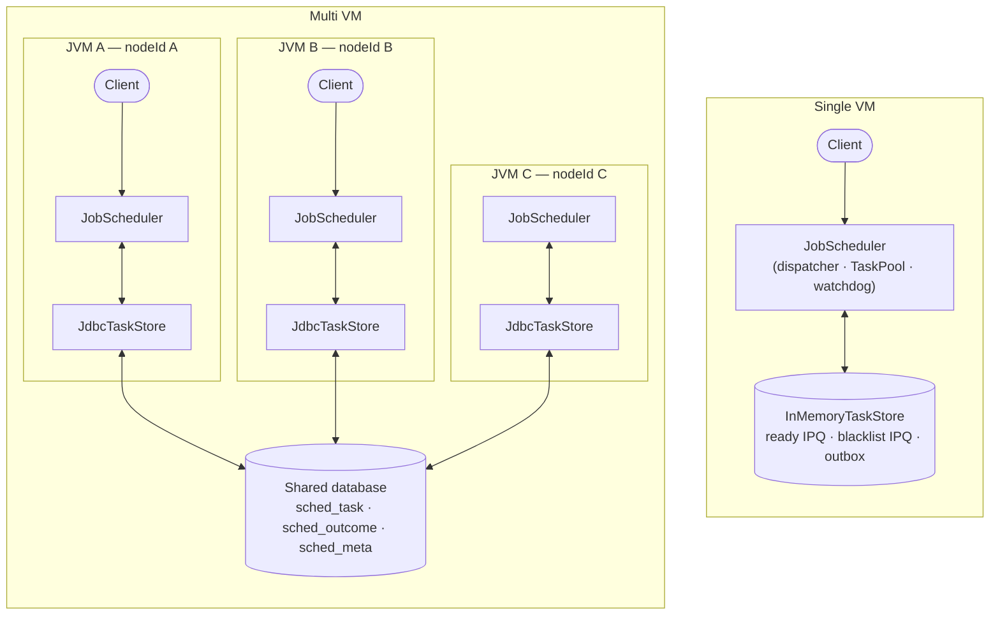

What the multi-VM mode adds on top of single VM, and where:

| Concern | Single VM (`InMemoryTaskStore`) | Multi VM (`JdbcTaskStore`) |
|---|---|---|
| Who may run a task | This node | Exactly one claiming node (M2) |
| Claim | Remove the head from the ready IPQ | Conditional `UPDATE` on `version` |
| Lease | None (`Long.MAX_VALUE`): the process is the lease | `now + timeout + leaseGrace`, reaped by any node |
| Fencing | Version check, which never fails in practice | Version check, which rejects late finishes |
| Capacity | `byId.size()` | Counter row, cluster-wide |
| Outcome delivery | Outbox in memory | `sched_outcome` table, per submitter |
| Wake-up | Store change listener | Listener for local changes, plus polling for remote ones |
| `Runnable` jobs | Run here | Pinned to the submitting node |
| Named job types | Must be registered here | Run on any node that registered the type |
| Node shutdown | Recurring tasks dropped | Named recurring tasks continue on other nodes |

## Shared state: what lives where, and how it stays consistent

### Ownership

There are two kinds of state:

- **Task state** is the source of truth for every task: its schedule, its state, who owns the current run, and the result waiting for the submitter. It lives **only in the store**. In multi-VM mode every node has its own store instance, but they all read and write the same data.
- **Node-local state** belongs to a single node: open handles, `Runnable` objects, worker slots and counters. It lives in each node's `JobScheduler` and is never shared. If a node dies, this state dies with it, and the task state in the store is still enough for the other nodes to carry on.

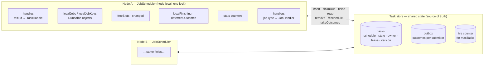

| State | Lives in | Written by | If the node dies |
|---|---|---|---|
| Task schedule, priority, recurrence, zone, blacklist limit | store | `insert`; `reschedule`; `finish` (next run) | Kept. Any node can run the task if it's unpinned. |
| `state`, `consecutiveTimeouts`, `removalRequested` | store | Only through `TaskTransitions`, inside one store transaction | Kept |
| `ownerNode`, `leaseUntilMillis`, `version` | store | `claimDue` (claim); `finish`/reap (release) | The lease expires and another node reaps the run (M3) |
| Outcomes for the submitter | store outbox | Any node's `finish`/`remove`/reap | Kept until the submitter (same `nodeId`) collects them |
| Live-task count | store counter | `insert` (+1) and terminal transitions (−1), in the same transaction as the task row | Kept, so it's always exact |
| `TaskHandle`s | node | `submit*`; completed by `resolve` | Lost. The caller's process is gone too. |
| `Runnable` objects (`localJobs`) | node | `submit*(Runnable…)` | Lost. That's why such tasks are pinned and then dropped (M7, M9). |
| `freeSlots`, `changed`, stats counters | node | The node's dispatcher and workers, under its lock | Lost. They're only meaningful while the node runs. |
| `JobHandler` registry | node | The builder | Each node declares which types it can run |

### The JDBC schema

`JdbcTaskStore.createSchema()` creates three tables. `sched_` is the default prefix, set by `tablePrefix`:

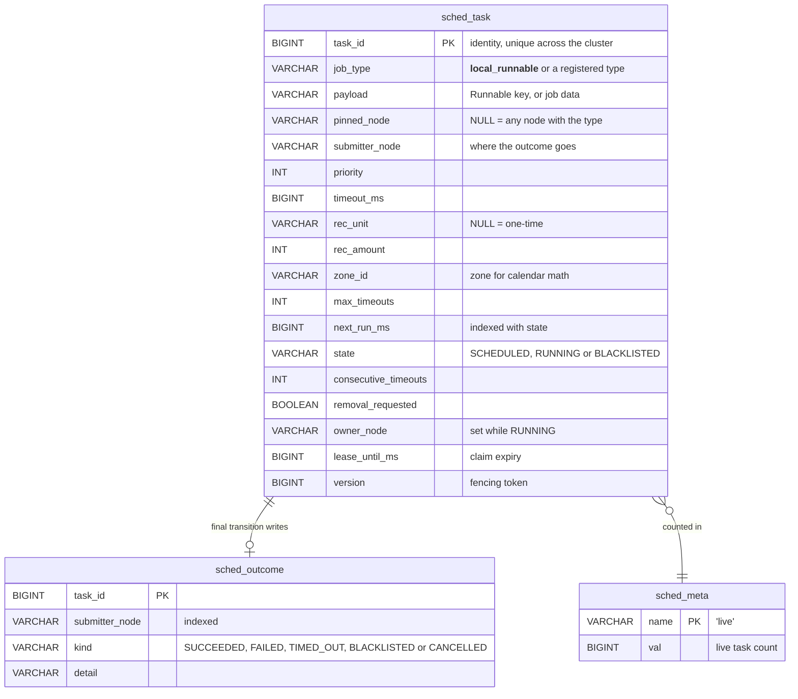

Terminal tasks (`COMPLETED`, `CANCELLED`) are **deleted**, so `sched_task` only holds live tasks:
pending, running and blacklisted. There's no foreign key between the tables: the outcome row
outlives the task row.

### Each operation is one atomic step

| Operation | What happens in one transaction (JDBC) | In-memory equivalent |
|---|---|---|
| `insert` | `UPDATE meta SET val = val + 1 WHERE val < maxTasks`. If no row is updated, throw `RejectedExecutionException`. Otherwise `INSERT` the task. | `byId.size()` check, then `ready.offer`, under the store lock |
| `claimDue` | ① Read due candidates in `SCHEDULE_ORDER`, filtered by pin and job type, `FETCH FIRST limit`. ② For each candidate, in its own transaction, run `UPDATE … SET RUNNING, owner, lease, version+1 WHERE task_id = ? AND version = ? AND state = 'SCHEDULED'`. Zero rows means another node won it. | `ready.remove()` while the head is due |
| `finish` | `SELECT … FOR UPDATE`, then check `RUNNING` and the version, then `TaskTransitions.finish`. Then either `UPDATE` the row, or `DELETE` it and decrement the counter. Then `INSERT` the outcome, if there is one. | Same checks; `place()` + `publish()` |
| `reapExpiredLeases` | Read `RUNNING` rows with `lease_until_ms < now`, then call `finish(id, version, LEASE_EXPIRED)` for each. The version check makes sure only one node reaps a lease. | Never needed (returns empty) |
| `remove` | `SELECT … FOR UPDATE`, then `TaskTransitions.remove`, then write as for `finish` | Same, under the lock |
| `reschedule` | `UPDATE … SET next_run_ms, version+1 WHERE state = 'SCHEDULED'` | `ready.update` |
| `takeOutcomes` | Read the outbox rows for this submitter, then `DELETE` exactly those rows by id | Drain the submitter's deque |
| `counts` | `SELECT state, COUNT(*) … GROUP BY state` | IPQ sizes |

### Invariants and what keeps them true

| # | Invariant | Kept by |
|---|---|---|
| I1 | At most one live claim per task | The conditional `UPDATE` in `claimDue` (compare-and-set on `version` and `state`) |
| I2 | Only the current claim can settle a run | `finish` checks the version under a row lock. A stale owner gets `FinishResult.stale()`. |
| I3 | `live == number of task rows` and `live ≤ maxTasks` | The counter changes in the same transaction as the insert or delete of the task row |
| I4 | Every state change follows the same rules on every backend | Stores call `TaskTransitions` instead of re-implementing the rules |
| I5 | Each outcome is delivered once, to its submitter | It's written in the transaction that settles the task, and read and deleted in one `takeOutcomes` transaction |
| I6 | A removal requested during a run doesn't break the run's fencing token | `withRemovalRequested()` keeps the version. The run's `finish` then drops the task. |
| I7 | A pinned task only runs on its node | The `claimDue` filter `pinned_node = me` |

### Races and how each one ends

| Race | Resolution |
|---|---|
| Two nodes pick the same candidate | Both run the conditional `UPDATE`. The second waits on the row lock, re-checks `version`, updates 0 rows and skips the task. |
| The owner finishes just as another node reaps the expired lease | Both lock the row first. Whichever is second sees a different version (or no row) and becomes a no-op. |
| `remove()` on node B while node A is running the task | B sets `removal_requested`, keeping the version. A's `finish` applies and cancels the task. Its outcome goes to the submitter. |
| An outcome arrives before `submit` has registered the handle | `submit` holds the node lock from `insert` until `handles.put`, and `resolve` takes that same lock |
| A local run's outcome is drained from the outbox before the worker resolves it | The worker marks the id in `localFinishing`. The dispatcher sees that and parks the outcome in `deferredOutcomes`. The worker then resolves with the **real exception**, not a `JobFailedException`. |
| A node's clock is ahead or behind | Leases include `leaseGrace` (N13). Run times are absolute epoch millis, so skew only shifts when a node thinks a task is due. |

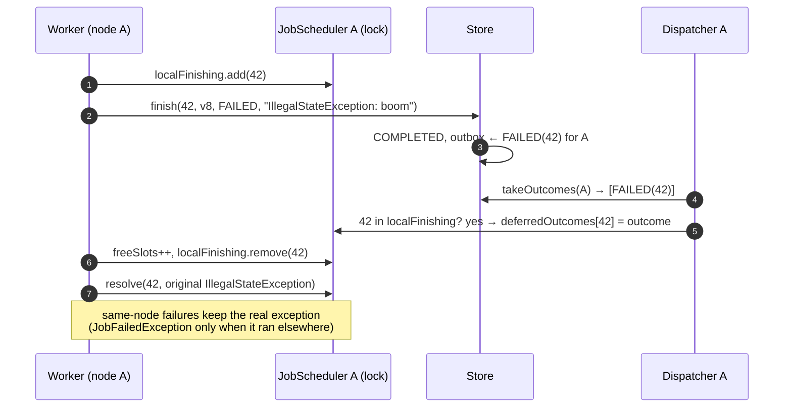

### Failure matrix (multi VM)

| Failure | What happens |
|---|---|
| A node crashes mid-run | Its lease expires after `timeout + leaseGrace`, and another node reaps it as `LEASE_EXPIRED`. A recurring named task is rescheduled. A one-time task completes as timed out. A pinned task is dropped. |
| A node pauses (long GC) or is partitioned, then comes back | As above. Its late `finish` is fenced off. The job's side effects aren't, so handlers should be idempotent. |
| A node shuts down gracefully | It stops claiming and drains its runs. Recurring named tasks go back to `SCHEDULED` for the other nodes. Its pinned tasks are removed. |
| The database is briefly unavailable | Store calls throw `TaskStoreException`. The dispatcher logs and retries every `pollInterval`. A `finish` that fails leaves the claim to expire, and the reaper settles it. |
| The submitter dies before collecting an outcome | The outcome stays in the outbox. A restart with the same `nodeId` collects it, though it has no handle left to complete. |

## Block diagram

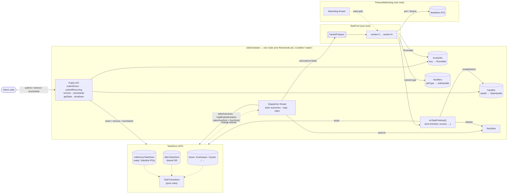

Each node has three kinds of thread, and each component has its own lock:

| Thread (single VM / node *X*) | Count | Runs user code? | Lock it takes |
|---|---|---|---|
| `scheduler-dispatcher` / `scheduler-X-dispatcher` | 1 | No | scheduler lock, briefly; store and pool calls are made without it |
| `scheduler-pool-worker-i` / `scheduler-X-pool-worker-i` | `poolSize` | **Yes** (with no lock held) | pool, watchdog, store and scheduler locks, but never more than one at a time |
| `scheduler-watchdog` / `scheduler-X-watchdog` | 1 | No | watchdog lock |

## Class diagram

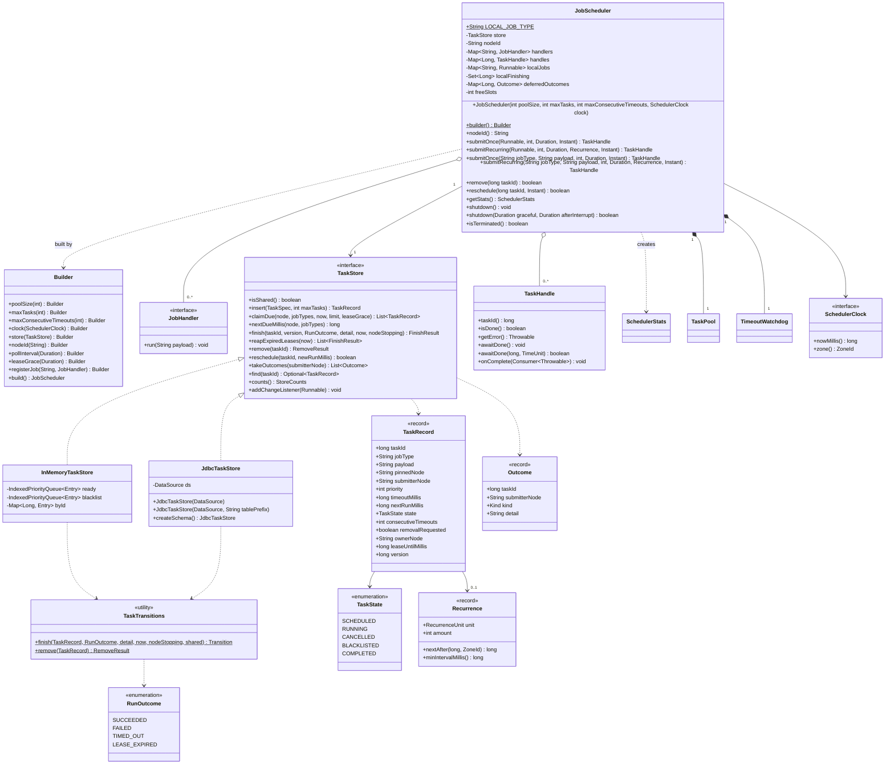

### Task lifecycle

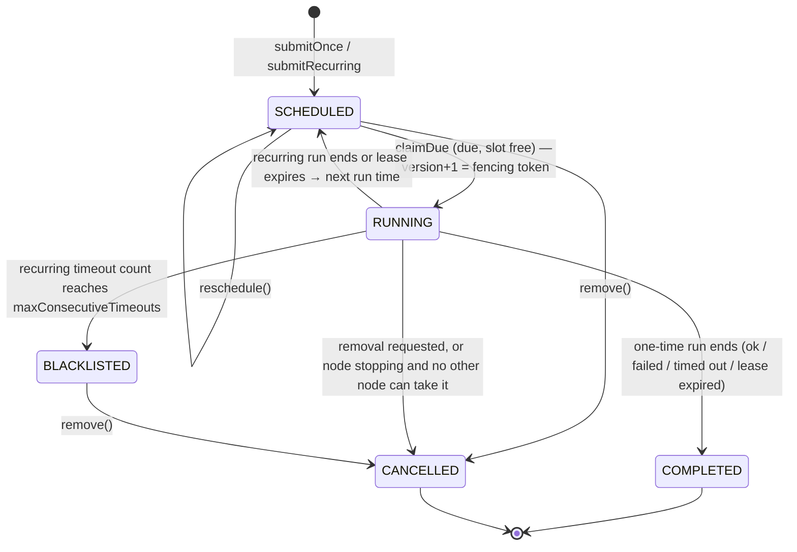

Terminal tasks are deleted from the store, which frees their `maxTasks` slot. Their outcome waits in
the outbox until the submitter collects it.

## Sequence diagrams

### Submit → claim → run → complete (one-time task, both modes)

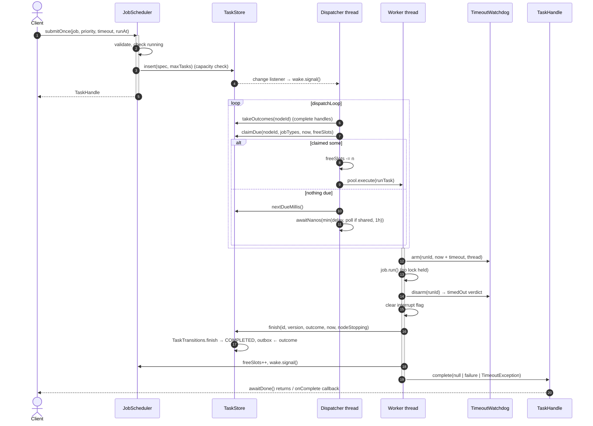

### Timeout and blacklisting (recurring task)

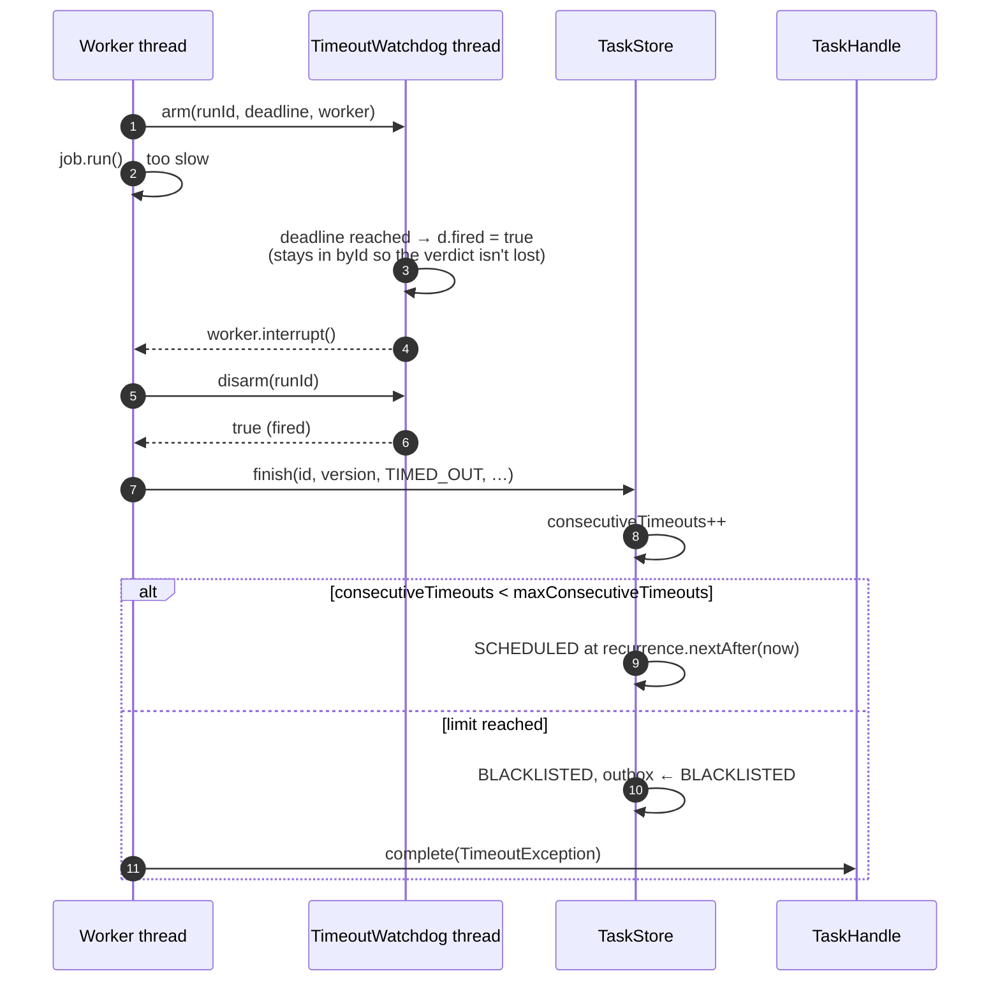

### Multi VM: exclusive claim and fencing

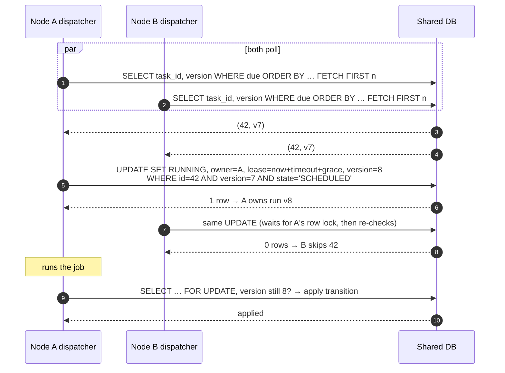

### Multi VM: crash, lease expiry and failover

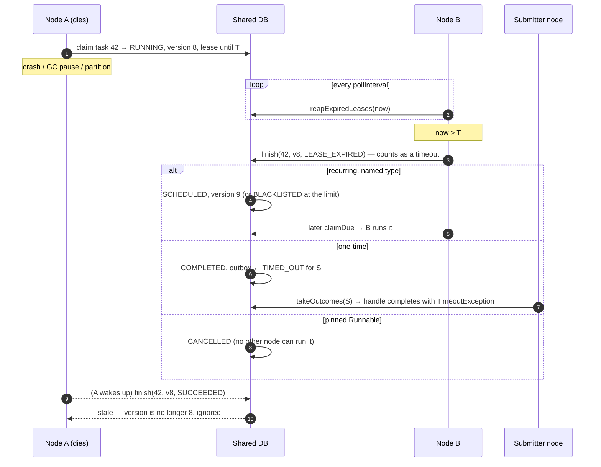

### Remove and reschedule

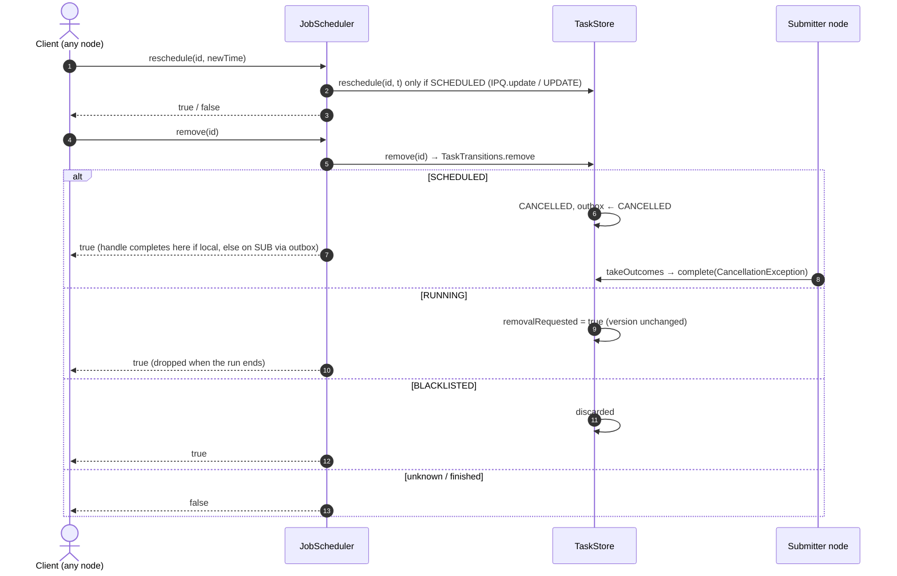

### Bounded shutdown

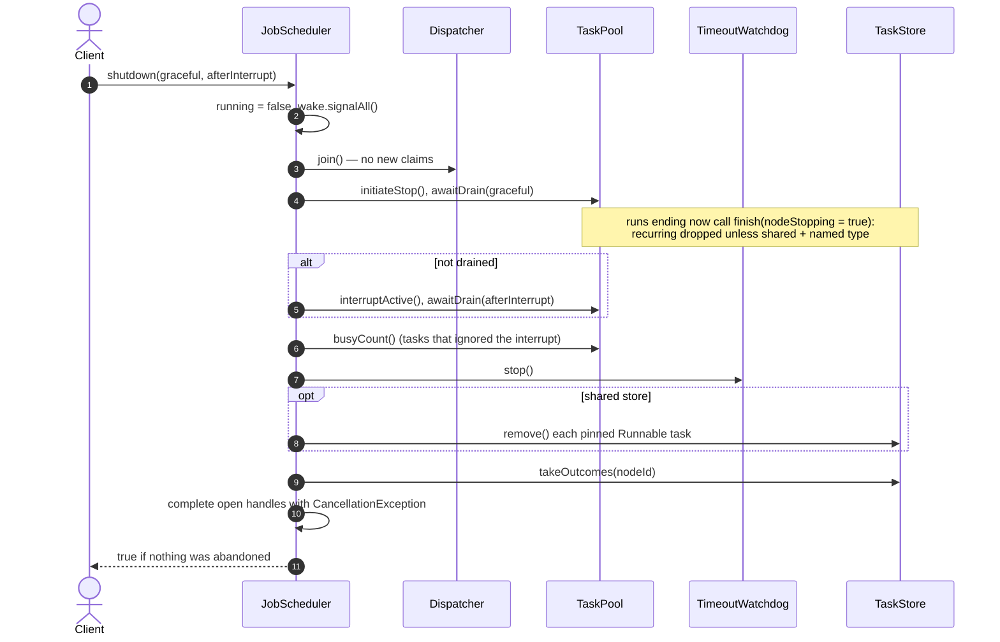

## Public API

### `JobScheduler`: single VM (unchanged)

```java
public JobScheduler(int poolSize, int maxTasks, int maxConsecutiveTimeouts, SchedulerClock clock)
```

| Parameter | Meaning | Constraint |
|---|---|---|
| `poolSize` | Worker threads, i.e. the maximum number of runs at once | `> 0` |
| `maxTasks` | Maximum tracked tasks (pending + running + blacklisted) | `> 0` |
| `maxConsecutiveTimeouts` | Consecutive timeouts before a recurring task is blacklisted | `> 0` |
| `clock` | Time source | non-null |

This is the same as `JobScheduler.builder()…build()` with the default `InMemoryTaskStore`. The constructor
starts the dispatcher, `poolSize` workers and the watchdog thread. All of them are daemon threads.

### `JobScheduler.builder()`: both modes

| Option | Default | Notes |
|---|---|---|
| `poolSize(int)` | CPU count | `> 0` |
| `maxTasks(int)` | 10 000 | `> 0`; cluster-wide with a shared store, so give every node the same value |
| `maxConsecutiveTimeouts(int)` | 3 | `> 0`; recorded on each task when it's submitted |
| `clock(SchedulerClock)` | `SystemClock(ZoneId.systemDefault())` | The zone is recorded on each task for calendar math |
| `store(TaskStore)` | `new InMemoryTaskStore()` | A shared store switches on multi-VM mode. An in-memory store serves one scheduler only. |
| `nodeId(String)` | `"local"`, or `node-<random>` with a shared store | Must be unique per node, and should be stable across restarts |
| `pollInterval(Duration)` | 500 ms | Multi VM: how quickly other nodes' changes are noticed |
| `leaseGrace(Duration)` | 30 s | Multi VM: lease = timeout + grace. It must cover the time to react to an interrupt, plus clock skew. |
| `registerJob(String type, JobHandler h)` | none | Lets this node run tasks of `type`. Duplicates and the reserved `LOCAL_JOB_TYPE` are rejected. |

### Methods

| Method | Returns | Throws | Notes |
|---|---|---|---|
| `submitOnce(Runnable job, int priority, Duration timeout, Instant runAt)` | `TaskHandle` | `NullPointerException` (job/runAt), `IllegalArgumentException` (timeout ≤ 0 or null), `RejectedExecutionException` (shut down or at `maxTasks`) | A `runAt` in the past means run as soon as possible. Runs on this node (pinned). |
| `submitRecurring(Runnable job, int priority, Duration timeout, Recurrence rec, Instant firstRunAt)` | `TaskHandle` | As above, but a null `timeout` or `rec` throws `NullPointerException`; `IllegalArgumentException` if `timeout ≥ rec.minIntervalMillis()` | The handle completes only on remove, blacklist or shutdown. |
| `submitOnce(String jobType, String payload, int priority, Duration timeout, Instant runAt)` | `TaskHandle` | As for the `Runnable` version, plus `IllegalArgumentException` for the reserved type, or for an unregistered type with a non-shared store | Runs on any node that registered `jobType`. |
| `submitRecurring(String jobType, String payload, int priority, Duration timeout, Recurrence rec, Instant firstRunAt)` | `TaskHandle` | As above | Survives the submitting node (M9). |
| `remove(long taskId)` | `boolean` | — | `true` if the task was found and pending, running or blacklisted. Works from any node. |
| `reschedule(long taskId, Instant newTime)` | `boolean` | `NullPointerException` (newTime) | `true` only if the task is currently `SCHEDULED`. |
| `getStats()` | `SchedulerStats` | — | Task gauges come from one store read; worker gauges and counters come from this node, read under its lock. |
| `nodeId()` | `String` | — | This node's identity in the store. |
| `shutdown()` | `void` | — | Same as `shutdown(30s, 5s)`, but the result is discarded. |
| `shutdown(Duration graceful, Duration afterInterrupt)` | `boolean` | — | `true` if every running task finished; `false` if some were given up on. Safe to call more than once. |
| `isTerminated()` | `boolean` | — | `true` once shutdown has completed. |

### `TaskHandle`

| Method | Description |
|---|---|
| `long taskId()` | The id to pass to `remove` and `reschedule` (unique across the cluster). |
| `boolean isDone()` | Whether the handle has completed. |
| `Throwable getError()` | `null` on success. Otherwise: `TimeoutException` (timed out, lease expired or blacklisted); `CancellationException` (removed or shutdown); the exception the job threw (same node); or `JobFailedException` (thrown on another node). |
| `void awaitDone()` | Blocks until the handle completes. |
| `boolean awaitDone(long timeout, TimeUnit unit)` | Blocks for up to `timeout`; returns `false` if it timed out first. |
| `void onComplete(Consumer<Throwable> listener)` | Runs once with the error (or `null`), outside any scheduler lock. If the handle is already done, it runs immediately. |

### `JobHandler` and `JobFailedException`

```java
@FunctionalInterface
public interface JobHandler { void run(String payload) throws Exception; }   // should be idempotent (multi VM)

public final class JobFailedException extends RuntimeException { ... }      // message = remote exception's toString()
```

### `Recurrence` (record) and `RecurrenceUnit`

```java
public record Recurrence(RecurrenceUnit unit, int amount)   // amount > 0, unit non-null
public enum RecurrenceUnit { SECOND, MINUTE, HOUR, DAILY, MONTHLY, YEARLY }
```

### `SchedulerClock`

```java
public interface SchedulerClock {
    long nowMillis();
    ZoneId zone();

    record SystemClock(ZoneId zone) implements SchedulerClock { ... }   // wall clock
    final class ManualClock implements SchedulerClock {                   // for deterministic tests
        public ManualClock(long startMillis, ZoneId zone);
        public void advance(long deltaMillis);
    }
}
```

The dispatcher and watchdog wait on real time, so advancing a `ManualClock` does not wake them.
Use `ManualClock` for recurrence math, and `SystemClock` with short durations for end-to-end
tests.

### `SchedulerStats`

An immutable snapshot with public final fields:

| Gauges | Counters (since start, this node) |
|---|---|
| `nodeId` | `submitted`: accepted by `submit*` on this node |
| `pending`: scheduled, not running (store-wide) | `completed`: runs that didn't time out (one-time: and didn't throw) |
| `running`: running on this node (`poolSize - idleWorkers`) | `timedOut`: runs that exceeded their timeout, including reaped leases |
| `clusterRunning`: claimed on any node (store-wide) | `rescheduled`: recurring tasks put back after a run |
| `blacklisted`: in the blacklist (store-wide) | `cancelled`: removed or dropped |
| `poolSize`, `idleWorkers` | `failed`: one-time runs that threw |
| `capacity` (`maxTasks`), `used`, `remaining` | `reclaimed`: expired leases this node settled (multi VM) |

The invariants are `used == pending + clusterRunning + blacklisted`, `running == poolSize - idleWorkers`
and `remaining == capacity - used`. In single-VM mode, `clusterRunning` equals `running` except for the
moment between a claim and the hand-off to a worker.

### The store SPI (`com.salesforce.einstein.scheduler.spi`)

| Type | Role |
|---|---|
| `TaskStore` | The interface, listed in the class diagram. Its Javadoc states the contract. |
| `TaskSpec` | What a submission asks for (job type, payload, pin, submitter, priority, timeout, recurrence, zone, blacklist limit, first run). |
| `TaskRecord` | An immutable snapshot of a stored task, including `ownerNode`, `leaseUntilMillis` and `version` (the fencing token). |
| `TaskTransitions` | The state machine as pure functions. Stores call these instead of re-implementing the rules. |
| `RunOutcome`, `Outcome`, `FinishResult`, `RemoveResult`, `StoreCounts`, `TaskState` | Value types used by the methods above. |
| `TaskStoreException` | An unchecked wrapper for backend failures. |

The **contract** every store must meet:

1. Every method is atomic.
2. `claimDue` is **exclusive**: no task is returned to two callers until it's settled. It claims in
   `SCHEDULE_ORDER`, and only tasks pinned to the caller, or unpinned tasks whose type is in
   `jobTypes`. A non-shared store may ignore the filter, because only one node ever uses it.
3. `finish` is **fenced**: it applies only if the task is `RUNNING` and its version is unchanged.
   Otherwise it returns `FinishResult.stale()`.
4. All state changes go through `TaskTransitions`, so every backend behaves the same.
5. `insert` enforces `maxTasks` over all live tasks in the store. Terminal tasks don't count.
6. Every `Outcome` is delivered **exactly once**, through `takeOutcomes(submitterNode)`.
7. Change listeners fire for local changes, after the store's locks are released.
8. `isShared()` is true if other processes can see the same tasks. That switches on reaping and
   polling, and lets tasks be handed over at shutdown.

## Usage

### Single VM

```java
JobScheduler scheduler = new JobScheduler(
        4,      // poolSize
        1_000,  // maxTasks
        3,      // maxConsecutiveTimeouts
        new SchedulerClock.SystemClock(ZoneId.of("UTC")));

// One-time, high priority, in 5 seconds
TaskHandle once = scheduler.submitOnce(
        () -> System.out.println("hello"), 10, Duration.ofSeconds(2), Instant.now().plusSeconds(5));
once.onComplete(err -> System.out.println(err == null ? "ok" : "failed: " + err));

// Every 15 minutes, starting now
TaskHandle report = scheduler.submitRecurring(
        this::buildReport, 0, Duration.ofMinutes(1),
        new Recurrence(RecurrenceUnit.MINUTE, 15), Instant.now());

scheduler.reschedule(once.taskId(), Instant.now());   // run it now instead
scheduler.remove(report.taskId());                    // stop the recurring job

System.out.println(scheduler.getStats());
boolean clean = scheduler.shutdown(Duration.ofSeconds(10), Duration.ofSeconds(2));
```

### Multi VM

Run the same code on every node. Point each node at the same database, give each one a unique,
stable `nodeId`, and register the job types it can run:

```java
DataSource ds = /* pooled DataSource for the shared DB, e.g. HikariCP over PostgreSQL */;

JobScheduler scheduler = JobScheduler.builder()
        .nodeId(System.getenv("POD_NAME"))                         // unique, stable per node
        .poolSize(8)
        .maxTasks(100_000)                                         // cluster-wide
        .store(new JdbcTaskStore(ds).createSchema())               // idempotent; or use your migrations
        .leaseGrace(Duration.ofSeconds(30))
        .registerJob("send-invoice", invoiceId -> invoices.send(invoiceId))   // idempotent!
        .registerJob("nightly-report", ignored -> reports.build())
        .build();

// Durable, runs on whichever node claims it first, and survives this node:
scheduler.submitRecurring("nightly-report", null, 0, Duration.ofMinutes(30),
        new Recurrence(RecurrenceUnit.DAILY, 1), tonightAt2am);
TaskHandle h = scheduler.submitOnce("send-invoice", "INV-1042", 5, Duration.ofSeconds(20), Instant.now());

// Still fine: a Runnable is pinned to this node.
scheduler.submitOnce(() -> cache.warm(), 0, Duration.ofSeconds(5), Instant.now());
```

To move a single-VM deployment to multi VM:
1. Turn each `Runnable` that must survive a restart, or be shared, into a `registerJob` type with a
   String payload (an id or JSON).
2. Make those handlers idempotent.
3. Pass a `JdbcTaskStore` to the builder.

Nothing else changes.

## Extending the SPI (Quartz, ZooKeeper, other schedulers)

There are two extension points. Neither needs a change to `JobScheduler`:

| Extension point | Decides | Provided | Examples of new ones |
|---|---|---|---|
| `spi.TaskStore` | **Where task state lives** and how nodes coordinate | `InMemoryTaskStore` (single VM), `JdbcTaskStore` (multi VM) | Quartz job store bridge, ZooKeeper, Redis, DynamoDB, a `SKIP LOCKED` PostgreSQL store |
| `JobHandler` (via `builder().registerJob`) | **What code runs** for a named job type | — | Anything your application does |

The engine (dispatcher, pool, watchdog, handles, stats) is always ours. A store only stores and
coordinates. It never runs jobs, measures timeouts or computes recurrences. So F1–F12 behave the
same on every backend.

Put adapters for third-party systems in **their own Maven module** (e.g. `scheduler-quartz`,
`scheduler-zookeeper`). That keeps the core free of runtime dependencies (N1).

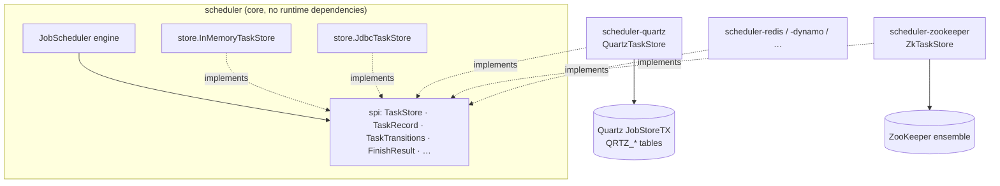

### Writing a store: checklist

1. **Pick `isShared()`.** Return `true` if more than one `JobScheduler` instance can see the same
   tasks. That turns on polling, lease reaping, the shutdown hand-over and cross-node outcomes.
2. **Store `TaskRecord` fields as they are.** Keep every field the record has. `version` is the
   fencing token: bump it on claim, settle and `reschedule`, but **not** on `withRemovalRequested()`.
3. **Make each method one atomic step**, as in [Each operation is one atomic step](#each-operation-is-one-atomic-step):
   - `insert`: check capacity and insert together.
   - `claimDue`: compare-and-set `SCHEDULED → RUNNING` on `version`. Honour the pin and job-type
     filter and `TaskRecord.SCHEDULE_ORDER`.
   - `finish`/`remove`: read the row under a lock or a CAS, call **`TaskTransitions`**, then write
     the new record and the outcome together. Delete the task if `after().state().isTerminal()`.
   - `reapExpiredLeases`: call your own `finish(id, version, LEASE_EXPIRED, …)` for each expired claim.
   - `takeOutcomes`: return and delete the submitter's outcomes in one step.
4. **Signal changes.** Call the change listeners after local writes. Remote changes are found by
   polling, or pushed sooner: ZooKeeper watches, PostgreSQL `LISTEN/NOTIFY`, a Quartz trigger.
5. **Wrap backend errors** in `TaskStoreException`. The engine logs them and retries on the next poll.
6. **Run the tests** (see [the test hierarchy](#test-hierarchy)).

Skeleton of the part every store shares: settle a run through `TaskTransitions` and persist the
result atomically.

```java
public final class MyTaskStore implements TaskStore {
    @Override public boolean isShared() { return true; }

    @Override
    public FinishResult finish(long taskId, long version, RunOutcome result, String detail,
                               long nowMillis, boolean nodeStopping) {
        return backend.atomically(tx -> {                        // a transaction, a CAS loop, a ZK multi-op…
            TaskRecord r = tx.readForUpdate(taskId);
            if (r == null || r.state() != TaskState.RUNNING || r.version() != version)
                return FinishResult.stale();                     // fenced: someone else owns this run now
            TaskTransitions.Transition t =
                    TaskTransitions.finish(r, result, detail, nowMillis, nodeStopping, isShared());
            if (t.after().state().isTerminal()) tx.deleteAndReleaseCapacity(taskId);
            else                                tx.write(t.after());
            if (t.outcome() != null) tx.appendOutcome(t.outcome());   // outbox for t.outcome().submitterNode()
            return new FinishResult(true, t.after(), t.outcome());
        });
    }

    @Override
    public RemoveResult remove(long taskId) {
        return backend.atomically(tx -> {
            TaskRecord r = tx.readForUpdate(taskId);
            if (r == null) return new RemoveResult(RemoveResult.Kind.NOT_FOUND, null, null);
            RemoveResult rr = TaskTransitions.remove(r);         // SCHEDULED → CANCELLED, BLACKLISTED → dropped, RUNNING → DEFERRED
            /* persist rr.after() and rr.outcome() exactly like finish */
            return rr;
        });
    }
    // insert, claimDue, nextDueMillis, reapExpiredLeases, reschedule, takeOutcomes, find, counts,
    // addChangeListener: see JdbcTaskStore for a complete reference implementation.
}
```

### Test hierarchy

A new store gets the whole behavioural test suite by adding two or three small subclasses:

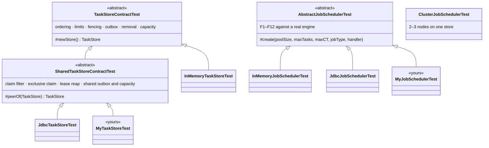

Copy `ClusterJobSchedulerTest` for the multi-node scenarios (exactly once, failover, hand-over).

### How the main backends map onto the contract

| Concept | JDBC (provided) | ZooKeeper (sketch) | Quartz bridge (sketch) |
|---|---|---|---|
| Task | Row in `sched_task` | Znode `/sched/tasks/<id>` holding the serialized record | Durable `JobDetail` (record in the `JobDataMap`) + one `SimpleTrigger` |
| Ids | Identity column | Sequential znode name | Our own counter (Quartz keys are strings) |
| Exclusive claim | `UPDATE … WHERE version = ?` | `setData(path, data, expectedVersion)`. The znode version is the fencing token. | Quartz fires each trigger on exactly one node (`QRTZ_LOCKS` row lock) |
| Lease | `lease_until_ms`, reaped by any node | Ephemeral `/sched/claims/<id>`. It disappears with the owner's session. | `QRTZ_FIRED_TRIGGERS` + cluster check-in. Recovery re-fires the job. |
| Fencing | `version` column | Znode `version` / `stat` | `version` in the `JobDataMap`, `@PersistJobDataAfterExecution` |
| Capacity | Counter row with `val < max` | Counter znode with a versioned `setData` | Count query or counter row in the same transaction as `scheduleJob` |
| Outbox | `sched_outcome` table | `/sched/outcomes/<submitter>/<id>` children | Own table (Quartz has no result channel) |
| Change signal | Polling | Watches on `/sched/tasks` and `/sched/outcomes/<me>` | The Quartz fire itself |
| Ordering | `ORDER BY next_run_ms, priority DESC, task_id` | Sort children client-side (or bucket by due time) | Trigger `nextFireTime` + `priority` |

### Quartz in detail

Quartz is a scheduler itself, so the bridge has to settle **who decides when a task is due**. The
design below lets Quartz do clustering, durable triggers and misfire recovery, while our engine
keeps running, timing and settling the jobs. That way F1–F12 still hold.

- **Push turned into pull.** Quartz *pushes*: it calls `Job.execute` on its own thread. Our engine
  *pulls*: it calls `claimDue`. A `BridgeJob` reads the record and puts it in the adapter's
  hand-off queue. Then it fires the change listener and **blocks until our `finish` for that run**.
  `claimDue` takes records off the queue (up to `limit`, filtered by job type and pin).
  `nextDueMillis` returns `Long.MAX_VALUE`, because the Quartz fire is the wake-up.
- **The blocked Quartz thread is the lease.** While the job "executes" in Quartz, its
  `QRTZ_FIRED_TRIGGERS` row marks the claim. If the node dies, Quartz cluster recovery
  (`org.quartz.jobStore.isClustered=true`, `JobBuilder.requestRecovery(true)`) re-fires the job on
  another node with `context.isRecovering() == true`. The bridge turns that into
  `finish(id, version, LEASE_EXPIRED, …)` instead of a normal run. That's M3, and timeout counting
  and blacklisting still apply. `reapExpiredLeases` returns nothing; recovery does that job.
- **Fencing.** The bridge keeps `version` in the `JobDataMap` and marks the bridge job
  `@PersistJobDataAfterExecution @DisallowConcurrentExecution`. `finish` reloads the `JobDetail` in
  a `JobStoreTX` transaction and compares versions, so a late finish from a dead node is still stale.
- **Recurrence stays ours.** Don't map `Recurrence` to a repeating Quartz trigger: Quartz repeats
  from the *start* time and can overlap runs. Each task has a **one-shot** `SimpleTrigger`. `finish`
  computes `TaskTransitions.finish(…)`. If the result is `SCHEDULED`, it calls `rescheduleJob` with
  a new one-shot trigger at `after().nextRunMillis()`. That keeps finish-relative spacing, calendar
  months in the task's zone, and no overlap (F6).
- **Priority.** `TriggerBuilder.withPriority(priority)`. Quartz breaks ties on equal fire times by
  priority, the same as `SCHEDULE_ORDER`.
- **Remove/reschedule.** A pending task becomes `deleteJob` / `rescheduleJob`. A running task gets
  `removalRequested` in the `JobDataMap`, applied by its `finish` (I6).
- **Misfires** (Quartz fires late after downtime): use `withMisfireHandlingInstructionFireNow()`.
  This matches our "run as soon as possible if overdue" behaviour.
- **Thread counts.** Set `org.quartz.threadPool.threadCount` to at least our `poolSize`. A Quartz
  thread is parked for every run in progress.

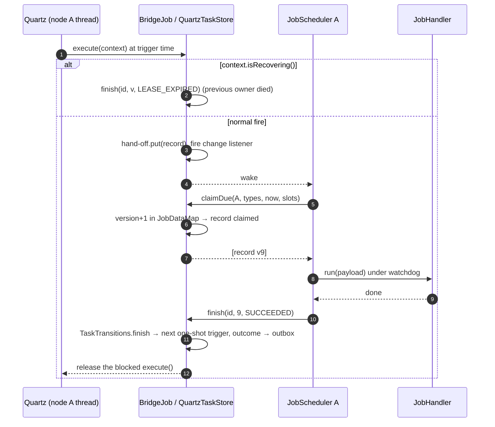

### ZooKeeper in detail

- **Layout:** `/sched/tasks/<id>` (record), `/sched/claims/<id>` (ephemeral, data = `nodeId`),
  `/sched/outcomes/<submitter>/<id>`, `/sched/live` (counter).
- **Claim:** `multi(check(task, v), setData(task, claimedRecord, v), create(claim, EPHEMERAL))`.
  The multi is atomic, so only one node wins. The znode version works as `version` for fencing.
- **Lease:** the ephemeral claim disappears when the owner's session expires. Every node watches
  `/sched/claims`. A deleted claim for a task that's still `RUNNING` is reaped through `finish(…, LEASE_EXPIRED)`.
  Keep `lease_until` in the record too, so a node that wakes up after its session is gone is fenced.
- **Signals:** watches on `/sched/tasks` and on its own outcome folder replace polling. Re-register
  each watch after it fires, as usual in ZooKeeper.
- **Scale:** ZooKeeper isn't a bulk store. Use it for up to tens of thousands of tasks and keep the
  payloads small (under about 1 MB per znode). For more, use JDBC.

### Other schedulers

- **db-scheduler, JobRunr:** both already own the polling and execution loop. Wrapping them as a
  `TaskStore` would duplicate our engine. Either use them directly instead of this library, or
  borrow their table design for a JDBC-style `TaskStore`.
- **Temporal / Cadence:** these are workflow engines. They're a poor fit for a `TaskStore`, but a
  `JobHandler` can *start* a workflow. Our scheduler then handles timing and Temporal handles execution.
- **PostgreSQL-specific store:** subclass or copy `JdbcTaskStore`. Add
  `FOR UPDATE SKIP LOCKED` to the candidate query and `LISTEN/NOTIFY` for change signals.
  **MySQL** needs `LIMIT` and `AUTO_INCREMENT` versions of two statements.

## Build and test

`scheduler` depends on the `ds` module. JUnit 5 comes from the parent pom; H2 is a test-only dependency.

```bash
JAVA_HOME=<path-to-jdk-17> mvn -pl scheduler -am test
```

77 tests, all of them run (none skipped): 20 per `AbstractJobSchedulerTest` subclass, 13 in
`JdbcTaskStoreTest`, 8 in `InMemoryTaskStoreTest`, 8 in `ClusterJobSchedulerTest`, 5 in
`TaskTransitionsTest` and 3 in `RecurrenceTest`. The abstract contract classes don't run by
themselves. Each concrete subclass runs every test it inherits.

| Test class | Store(s) | Covers |
|---|---|---|
| `RecurrenceTest` | — | Recurrence math (also with `ManualClock`), validation, overflow |
| `AbstractJobSchedulerTest` → `InMemoryJobSchedulerTest`, `JdbcJobSchedulerTest` | Both | The base requirements F1–F12, run unchanged against each store: argument validation and capacity, priority order, one-time success/failure/timeout, recurring reschedule and blacklist, remove while pending and while running, `reschedule`, graceful/default/bounded shutdown (including handles of abandoned tasks), stats invariants, named job types. The in-memory run uses the original 4-arg constructor. |
| `spi.TaskTransitionsTest` | — | The state machine as pure functions |
| `spi.TaskStoreContractTest` → `store.InMemoryTaskStoreTest` | Both | The store contract: ordering, limits, fencing, outbox, removal of each state, capacity |
| `spi.SharedTaskStoreContractTest` (extends the above) → `store.JdbcTaskStoreTest` | Shared stores | Also: claim filtering by pin and job type, exclusive claims between peers, lease reaping, outbox addressed to the submitter, store-wide capacity |
| `ClusterJobSchedulerTest` | JDBC, 2–3 nodes on one database | Exactly-once across nodes, remote failure → `JobFailedException`, pinning of `Runnable`s, job-type routing, remove from another node, cluster-wide `maxTasks`, crash → lease expiry → failover with a fenced stale finish, node shutdown handing over recurring tasks |
