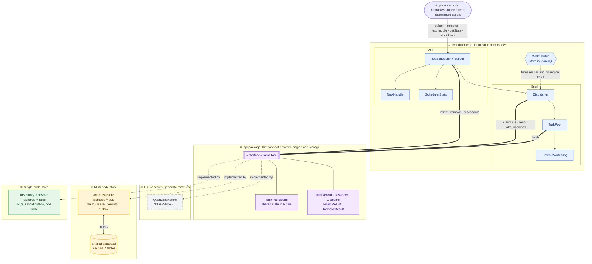
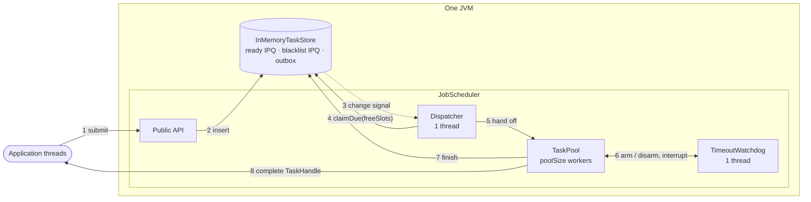
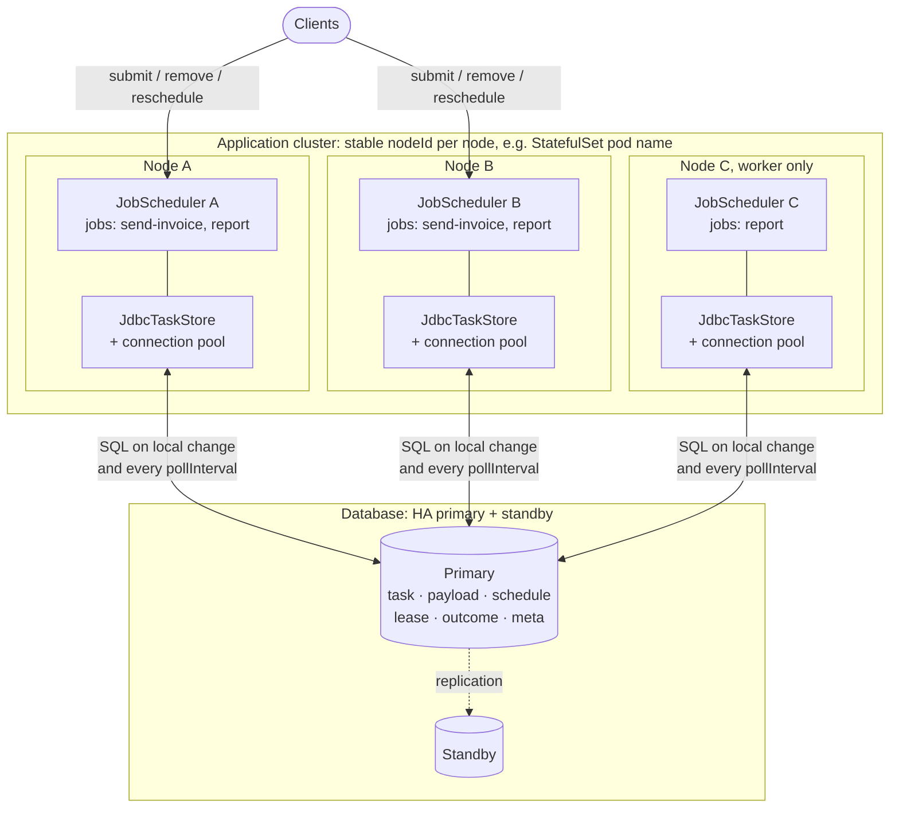
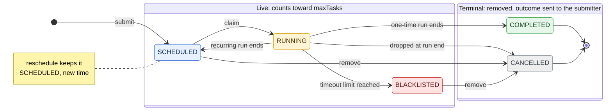
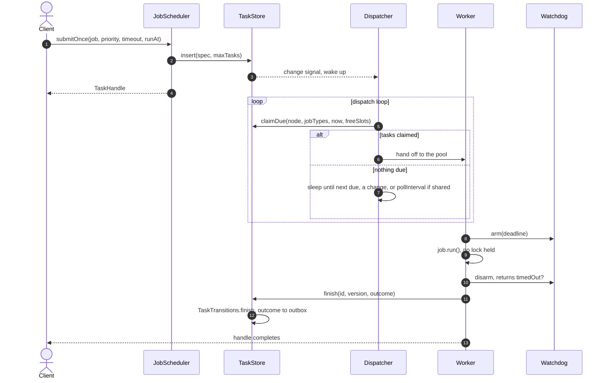
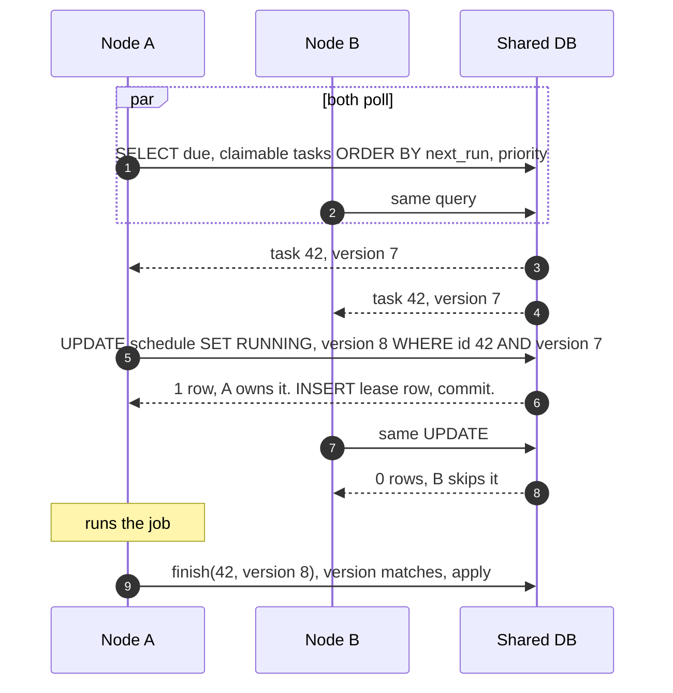
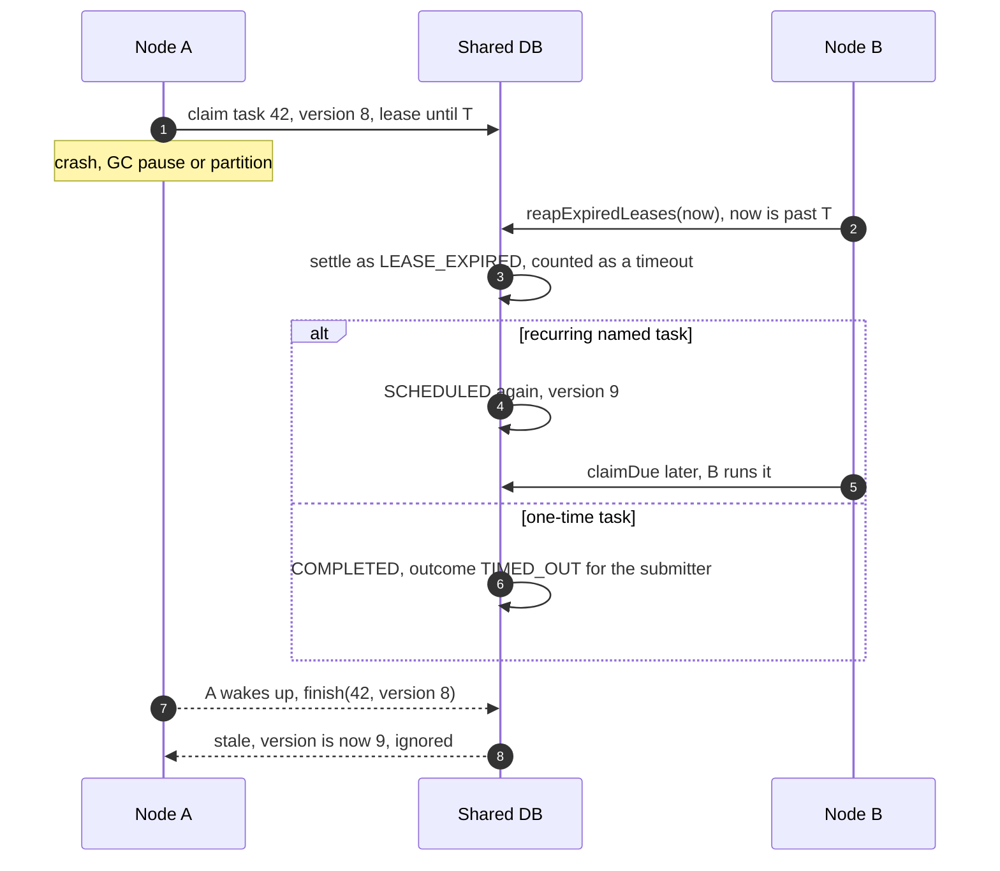
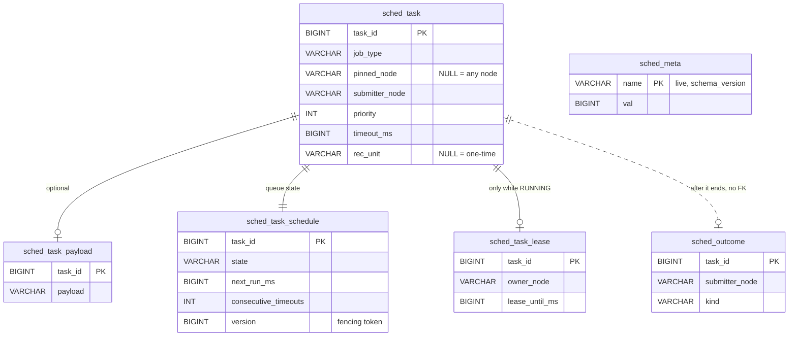

# JobScheduler: low-level design

A job scheduler in plain Java that runs **one-time and recurring jobs** with **priorities and
timeouts** on a fixed worker pool. The same code runs on **one node** (state in memory) or on **many
nodes** (state in a shared database). The only thing that changes between the two is one pluggable
component, the `TaskStore`.

> This page is the design summary, the length you would present in an LLD interview. The full
> reference (every edge case, DDL, consistency proofs, runbook, SPI guide) is
> [docs/DESIGN-DETAILED.md](docs/DESIGN-DETAILED.md).

## Contents

- [1. Requirements](#1-requirements)
   - [1.1 Functional: both modes](#11-functional-both-modes)
   - [1.2 Functional: added in multi-node mode](#12-functional-added-in-multi-node-mode)
   - [1.3 Non-functional](#13-non-functional)
   - [1.4 Out of scope](#14-out-of-scope)
- [2. Core idea: one engine, pluggable store](#2-core-idea-one-engine-pluggable-store)
- [3. Component diagram](#3-component-diagram)
- [4. Architecture: single node vs multi node](#4-architecture-single-node-vs-multi-node)
   - [4.1 Single node: embedded in one JVM](#41-single-node-embedded-in-one-jvm)
   - [4.2 Multi node: many JVMs, one shared database](#42-multi-node-many-jvms-one-shared-database)
   - [4.3 What changes between the two](#43-what-changes-between-the-two)
- [5. Classes](#5-classes)
- [6. Task lifecycle](#6-task-lifecycle)
   - [6.1 Single node (`InMemoryTaskStore`)](#61-single-node-inmemorytaskstore)
   - [6.2 Multi node (`JdbcTaskStore`)](#62-multi-node-jdbctaskstore)
- [7. Key flows](#7-key-flows)
   - [7.1 Submit, claim, run, complete (both modes)](#71-submit-claim-run-complete-both-modes)
   - [7.2 Multi node: two nodes race for the same task](#72-multi-node-two-nodes-race-for-the-same-task)
   - [7.3 Multi node: a node dies mid-run](#73-multi-node-a-node-dies-mid-run)
- [8. Data model (multi node)](#8-data-model-multi-node)
- [9. Concurrency and guarantees](#9-concurrency-and-guarantees)
- [10. Design decisions and trade-offs](#10-design-decisions-and-trade-offs)
- [11. API and usage](#11-api-and-usage)
- [12. Extensibility](#12-extensibility)
- [13. Build and test](#13-build-and-test)

---

## 1. Requirements

### 1.1 Functional: both modes

| # | Requirement |
|---|---|
| F1 | Submit a **one-time** job to run at a given time. |
| F2 | Submit a **recurring** job: every *n* SECOND, MINUTE, HOUR, DAILY, MONTHLY or YEARLY. |
| F3 | Months and years use **calendar math**, so Jan 31 + 1 month = Feb 28. |
| F4 | Each job has a **priority**. Due jobs run in this order: earliest due time, then higher priority, then FIFO. |
| F5 | Each run has a **timeout**. On expiry the worker is interrupted. A one-time job then fails with `TimeoutException`; a recurring job moves on to its next run. |
| F6 | Runs of the same recurring job **never overlap**: the timeout must be shorter than the interval. |
| F7 | A recurring job that times out `maxConsecutiveTimeouts` times in a row is **blacklisted** and never runs again. |
| F8 | **Remove** a task by id, whether it is pending, running or blacklisted. |
| F9 | **Reschedule** a pending task to a new time. |
| F10 | Each submit returns a **handle** the caller can wait on, poll, or attach a callback to. |
| F11 | **Stats**: a consistent snapshot of gauges and counters. |
| F12 | **Bounded shutdown**: drain, then interrupt, then give up, and always return within a time limit. |

### 1.2 Functional: added in multi-node mode

| # | Requirement |
|---|---|
| M1 | **Same API and behaviour.** F1–F12 hold unchanged. The mode is chosen only by which store is plugged in. |
| M2 | **Exclusive claim:** each due run is executed by exactly one node. |
| M3 | **Failover:** if a node dies mid-run, another node takes the task over after its lease expires. |
| M4 | **Fencing:** a node that lost its claim can't overwrite the task's result. |
| M5 | **Cluster-wide `maxTasks`** limit. |
| M6 | A handle completes on the **submitting** node, wherever the task ran. |
| M7 | **Job routing:** a `Runnable` is pinned to its node. A *named job type* runs on any node that registered a handler for it. |

### 1.3 Non-functional

- **No executor framework:** built from raw `Thread`, `ReentrantLock`/`Condition` and `volatile`
  fields only. No third-party runtime dependencies; JDBC uses only `java.sql`.
- **Complexity:** in memory, submit, remove and reschedule are O(log N) and peeking at the next task
  is O(1) (an `IndexedPriorityQueue`). In the database, a claim is one indexed range scan.
- **Thread-safe, deadlock-free, no lost wake-ups.** The clock is injectable, so tests are deterministic.
- **Multi node:** nodes coordinate only through the store, with no leader and no node-to-node RPC.
  Work submitted on another node is noticed within `pollInterval` (500 ms by default).

### 1.4 Out of scope

Force-killing a job that ignores interrupts (that needs one process per job), exactly-once side
effects across nodes (handlers must be idempotent), leader election and sharding.

---

## 2. Core idea: one engine, pluggable store

Split the scheduler into **what runs jobs** and **where task state lives**:

| Part | Responsibility | Changes between modes? |
|---|---|---|
| **Engine** (`JobScheduler`, Dispatcher, `TaskPool`, `TimeoutWatchdog`, `TaskHandle`) | Decide when to run, run on a worker, enforce timeouts, complete handles | **No** |
| **Rules** (`TaskTransitions`) | Pure functions that compute the next state when a run ends or a task is removed | **No** |
| **Store** (`TaskStore` SPI) | Keep tasks, claim due ones atomically, apply transitions, hold outcomes | **Yes**: `InMemoryTaskStore` or `JdbcTaskStore` |

Multi-node support is therefore *a store that is shared*. Every store method is atomic, and
claims carry a **version** (the fencing token), so the engine never needs to know how many nodes exist.

---

## 3. Component diagram

Layers ① and ② are the same classes in both modes. Layer ③ is the one choice you make.



**How one design serves both use cases.** The engine reads `store.isShared()` once, at
construction. These are the only behaviours that differ:

| Behaviour | Single node (`isShared` = false) | Multi node (`isShared` = true) |
|---|---|---|
| Default `nodeId` | `"local"` | `node-<random>` (set a stable one) |
| Lease reaper | Off: the process *is* the lease | Runs on every dispatcher pass |
| Dispatcher sleep | Until the next due task or a local change | Also capped at `pollInterval`, to see other nodes' work |
| Unregistered job type at submit | Rejected | Accepted: another node may run it |
| Recurring task when its node stops | Dropped | Named: kept for the other nodes. Pinned `Runnable`: removed. |

Claims, fencing, capacity and outcomes use the **same SPI calls** in both modes. The in-memory store
simply can never lose a claim.

---

## 4. Architecture: single node vs multi node

### 4.1 Single node: embedded in one JVM

The numbers trace one task.



### 4.2 Multi node: many JVMs, one shared database

Every node runs the **same code**, each with its own `JobScheduler` and `JdbcTaskStore`, all pointed
at one database. A node runs a task only if the task is pinned to it or the node registered the
task's job type. That lets you add worker-only nodes such as C.



### 4.3 What changes between the two

| Concern | Single node | Multi node |
|---|---|---|
| Task state | Heap: IPQs indexed by task id | Six tables in a shared database |
| Survives a restart | No | Named tasks: yes. `Runnable`s: no (pinned to their JVM). |
| Claim | Pop the queue head under the store lock | `UPDATE … SET RUNNING, version+1 WHERE version = ?` + a lease row |
| Runner dies | Everything dies with it | The lease expires and another node reaps it as a timeout |
| Stale result | Impossible | Rejected by the version check (fencing) |
| `maxTasks` | Map size | A counter row: `UPDATE … SET val = val+1 WHERE val < max` |
| Handle completion | Local outbox | Outcome row addressed to the submitter, which polls it |
| Seeing new work | Immediate signal | Local: immediate. Remote: within `pollInterval`. |
| Clock | One clock | NTP-synced; skew must be under `leaseGrace` |

---

## 5. Classes


`InMemoryTaskStore` keeps a ready queue and a blacklist, both `IndexedPriorityQueue`s
([../ds](../ds/README.md)), behind one lock. `JdbcTaskStore` runs each method in one database transaction.

---

## 6. Task lifecycle



The states and rules are the same in both modes, because both stores use `TaskTransitions`. What
differs is **what triggers** each transition and **where the state is kept**.

### 6.1 Single node (`InMemoryTaskStore`)

| Transition | Trigger | Store effect | Handle |
|---|---|---|---|
| → SCHEDULED | `submitOnce` / `submitRecurring` | Added to the ready IPQ; capacity +1 | Returned to the caller |
| SCHEDULED → SCHEDULED | `reschedule(id, time)` | Key changed in place, IPQ `update()` (O(log N)) | — |
| SCHEDULED → RUNNING | Due, and a worker is free | Polled from the ready IPQ; version +1 | — |
| RUNNING → SCHEDULED | A recurring run ends (success, exception, or timeout below the limit) | Back in the ready IPQ at `nextAfter(finish time)`. A timeout increments the streak; anything else resets it. | Stays open |
| RUNNING → BLACKLISTED | A recurring run times out and the streak reaches `maxConsecutiveTimeouts` | Moved to the blacklist IPQ; still counts toward `maxTasks` | `TimeoutException` |
| RUNNING → COMPLETED | A one-time run ends in any way | Removed; capacity −1; outcome to the local outbox | `null`, the job's exception, or `TimeoutException` |
| RUNNING → CANCELLED | A recurring run ends after `remove` was called, or the scheduler is shutting down | Removed; capacity −1 | `CancellationException` |
| SCHEDULED → CANCELLED | `remove(id)` | Removed from the ready IPQ; capacity −1 | `CancellationException` |
| BLACKLISTED → CANCELLED | `remove(id)` | Removed from the blacklist IPQ; capacity −1 | Already completed |

### 6.2 Multi node (`JdbcTaskStore`)

| Transition | Trigger | Store effect | Handle |
|---|---|---|---|
| → SCHEDULED | Submit on any node | Rows in `task`, `task_payload` and `task_schedule`; the `live` counter +1 if below `maxTasks` | Returned on the submitting node |
| SCHEDULED → SCHEDULED | `reschedule` from **any node** | `next_run_ms` updated; version +1 | — |
| SCHEDULED → RUNNING | Due, a worker is free, and this node may run it (pinned here, or a registered job type) | `UPDATE … WHERE version = ?` wins on **exactly one node**; version +1; a `task_lease` row is inserted | — |
| RUNNING → SCHEDULED | A recurring run ends, **or another node reaps its expired lease** (counts as a timeout) | `task_schedule` updated; lease row deleted. Any eligible node may claim the next run. | Stays open |
| RUNNING → BLACKLISTED | Timeout or lease expiry, and the streak reaches the limit | Lease row deleted; still counts toward `maxTasks` | `TimeoutException`, on the submitter |
| RUNNING → COMPLETED | A one-time run ends, **or its lease expired because its node died** (never retried) | `DELETE task` cascades to all rows; `live` −1; `sched_outcome` row for the submitter | Completes on the **submitter**: `null`, `JobFailedException` if it failed on another node, or `TimeoutException` |
| RUNNING → CANCELLED | A recurring run ends after `remove`; **a pinned `Runnable`'s node stops, or its lease expires** (no other node can run it) | Rows deleted; `live` −1; outcome row | `CancellationException`, on the submitter |
| RUNNING → SCHEDULED (node stopping) | A **named** recurring task's node shuts down gracefully | Kept, for the other nodes to run | Closed on the stopping node only; the task lives on |
| SCHEDULED / BLACKLISTED → CANCELLED | `remove(id)` from **any node** | Rows deleted; `live` −1; outcome row | `CancellationException` on the submitter, unless already completed |
| Late finish from a node that lost its lease | That node wakes up after a GC pause or partition | **Rejected**: the version no longer matches | — |

---

## 7. Key flows

### 7.1 Submit, claim, run, complete (both modes)



### 7.2 Multi node: two nodes race for the same task



### 7.3 Multi node: a node dies mid-run



---

## 8. Data model (multi node)

The data is split by **how often each part changes**, so the hot path touches only narrow rows.
Deleting a task row cascades to the rest.



| Table | Written | Why it's separate |
|---|---|---|
| `sched_task` | Once, at submit | The immutable definition, never rewritten |
| `sched_task_payload` | Once, at submit | Can be large, so it's kept out of the claim scan |
| `sched_task_schedule` | On every claim and finish | The hot queue, indexed on `(state, next_run_ms)` |
| `sched_task_lease` | On claim, deleted at run end | The reaper scans only running tasks (index on `lease_until_ms`) |
| `sched_outcome` | When a task ends | The outbox to the submitter; it outlives the task |
| `sched_meta` | On insert and on terminal transitions | Cluster-wide `live` counter (`maxTasks`) and the schema version |

The claim, which is the heart of the multi-node design:

```sql
UPDATE sched_task_schedule SET state = 'RUNNING', version = version + 1
 WHERE task_id = ? AND version = ? AND state = 'SCHEDULED';   -- 1 row: we own it. 0 rows: someone else does.
INSERT INTO sched_task_lease (task_id, owner_node, lease_until_ms, claimed_ms)
SELECT task_id, ?, ? + timeout_ms, ? FROM sched_task WHERE task_id = ?;
```

The full DDL, the indexes and schema versioning are in the
[detailed doc](docs/DESIGN-DETAILED.md#data-model-multi-vm).

---

## 9. Concurrency and guarantees

**Threads on each node:** 1 dispatcher, `poolSize` workers, 1 watchdog, all daemon threads.

| Concern | How it's handled |
|---|---|
| Scheduler state | One `ReentrantLock` plus a `Condition` the dispatcher waits on |
| Lost wake-ups | Every change sets `changed = true` and signals under the lock. The dispatcher sleeps only if it's still false. |
| Deadlocks | Fixed lock order (scheduler → pool, scheduler → store). Listeners run outside the store lock. No lock is held while a job runs. |
| Timeouts | The watchdog keeps an IPQ of deadlines and interrupts the worker. The worker clears its interrupt flag before the next job. |
| Store atomicity | In memory: one lock. JDBC: one transaction per method, with row locks taken in a fixed order. |

| Guarantee | Single node | Multi node |
|---|---|---|
| One-time execution | At most once | At most once. A run whose node died is reported as timed out, not retried. |
| Recurring overlap | Never | Never, unless a run outlives its lease (GC pause, partition). Its result is fenced off, but side effects are not, so **handlers must be idempotent**. |
| Handle completion | Exactly once | Exactly once, on the submitter, if it stays alive with the same `nodeId` |
| Durability | None | Named tasks are as durable as the database |

---

## 10. Design decisions and trade-offs

| Decision | Why | Alternative considered |
|---|---|---|
| Pluggable `TaskStore` SPI with one shared engine | One codebase and one test suite for both modes. New backends need no engine change. | Two separate schedulers: duplicated logic that drifts apart |
| State-change rules as pure functions (`TaskTransitions`) | Every store behaves identically, and the rules are unit-testable | Each store implements the rules itself: subtle divergence |
| Optimistic claim with `version` (compare-and-set) | No long-held locks; the version doubles as the fencing token | `SELECT … FOR UPDATE SKIP LOCKED`: faster under contention but not portable. Could be a future store. |
| Lease = `timeout + leaseGrace`, never renewed | Simple; a run can't legitimately outlive its timeout | Heartbeat renewal: more writes and more failure modes |
| Coordinate only through the database (polling) | No leader, no membership protocol, no RPC | ZooKeeper or Redis pub/sub for push wake-ups: lower latency, another system to run |
| One-time tasks fail rather than retry after a crash | Prefer "not run twice" for non-idempotent work | At-least-once retry: needs idempotency everywhere |
| Recurring next run computed from the **finish** time | Guarantees no overlap and back-pressure on slow jobs | Fixed rate: start times don't drift, but runs can pile up |
| Runnables pinned, named types routable | A lambda can't be serialized safely; a type name plus a String payload can | Serializing closures: fragile and unsafe |
| `IndexedPriorityQueue` for the ready queue, blacklist and deadlines | O(log N) remove and reschedule by id, which a `PriorityQueue` can't do | `TreeSet` with re-insert: works, but more allocation |

---

## 11. API and usage

```java
// Single node: the default in-memory store
JobScheduler s = new JobScheduler(4 /*poolSize*/, 1_000 /*maxTasks*/, 3 /*maxConsecutiveTimeouts*/,
        new SchedulerClock.SystemClock(ZoneId.of("UTC")));
TaskHandle h = s.submitOnce(() -> System.out.println("hi"), 10, Duration.ofSeconds(2), Instant.now());
s.submitRecurring(this::report, 0, Duration.ofMinutes(1), new Recurrence(RecurrenceUnit.MINUTE, 15), Instant.now());

// Multi node: the same code on every node, plus a shared store
JobScheduler s = JobScheduler.builder()
        .nodeId(System.getenv("POD_NAME"))                 // unique and stable
        .store(new JdbcTaskStore(dataSource).createSchema())
        .maxTasks(100_000)                                 // cluster-wide
        .registerJob("send-invoice", id -> invoices.send(id))   // idempotent handler
        .build();
s.submitOnce("send-invoice", "INV-1042", 5, Duration.ofSeconds(20), Instant.now());  // any node may run it
```

| Method | Purpose |
|---|---|
| `submitOnce` / `submitRecurring` (a `Runnable`, or a job type plus payload) | Schedule a job; returns a `TaskHandle` |
| `remove(id)` / `reschedule(id, time)` | Cancel a task, or move a pending one to a new time. Works from any node. |
| `getStats()` | Gauges (pending, running, blacklisted, idle workers, capacity left) and counters |
| `shutdown(graceful, afterInterrupt)` | Bounded shutdown; returns `true` if every run finished |
| `TaskHandle.awaitDone()` / `onComplete(cb)` / `getError()` | Wait for or observe the result |

Full signatures, exceptions and builder options are in the [detailed doc](docs/DESIGN-DETAILED.md#public-api).

---

## 12. Extensibility

A new backend implements `TaskStore`, reuses `TaskTransitions`, and passes the shared contract test
suite. It lives in its own module, so the core stays dependency-free.

| Concept | JDBC (provided) | ZooKeeper | Quartz bridge |
|---|---|---|---|
| Exclusive claim | `UPDATE … WHERE version = ?` | `setData(path, data, expectedVersion)` | Quartz fires a trigger on one node |
| Lease | Lease row, reaped by any node | Ephemeral znode, gone with the session | Fired-trigger row plus cluster check-in |
| Fencing token | `version` column | znode version | Version in the `JobDataMap` |
| Wake-up | Polling | Watches | The Quartz fire itself |

The [detailed doc](docs/DESIGN-DETAILED.md#extending-the-spi-quartz-zookeeper-other-schedulers)
covers the store-writer checklist and the Quartz and ZooKeeper designs.

---

## 13. Build and test

```bash
mvn -pl scheduler -am test
```

81 tests. The same scheduler suite runs against both stores (`InMemoryJobSchedulerTest`, and
`JdbcJobSchedulerTest` on H2), alongside store contract tests, unit tests for `TaskTransitions` and
`Recurrence`, and a multi-node test (`ClusterJobSchedulerTest`: several schedulers sharing one database).
