# JobScheduler: detailed design reference

> The interview-style summary is in [../README.md](../README.md). This file is the full reference:
> every requirement, the DDL, the consistency analysis, the operational runbook and the SPI guide.

`com.salesforce.einstein.scheduler` is a job scheduler written in plain Java. It runs one-time and
recurring jobs on a fixed pool of worker threads, enforces a timeout for each run, and automatically
parks recurring jobs that keep timing out.

The same scheduler runs in two modes. Only the **task store** behind it changes:

| Mode | Store | Where tasks live | Use it when |
|---|---|---|---|
| **Single VM** (default) | `InMemoryTaskStore` | Inside the process, in [`IndexedPriorityQueue`](../../ds/README.md)s | One process owns the work; nothing needs to survive a restart. |
| **Multi VM** | `JdbcTaskStore` (or any shared `TaskStore`) | A database shared by every node | Several processes share the work; tasks must survive a node dying. |

Both modes use the same engine (dispatcher, worker pool, timeout watchdog), the same state machine
(`TaskTransitions`) and the same public API. The multi-VM mode only *adds* behaviour: claims, leases,
failover and cluster-wide limits. Every base requirement below holds in both modes, and the test suite
runs the same scheduler tests against both stores.

The store is a small SPI (`spi.TaskStore`). The scheduler is fully custom: there's no Quartz,
db-scheduler or Temporal underneath. A ZooKeeper-, Quartz- or other database-backed store can be
plugged in later by implementing the same interface and passing the same contract tests (see
[Extending the SPI](#extending-the-spi-quartz-zookeeper-other-schedulers)).

### How to read this document

| If you want to… | Read |
|---|---|
| Know what it does and guarantees | [Requirements](#requirements), [Delivery guarantees](#delivery-guarantees-and-failure-handling) |
| Understand the design | [Architecture](#architecture), [Data model](#data-model-multi-vm), [Shared state and consistency](#shared-state-and-consistency), [Key flows](#key-flows-sequence-diagrams) |
| Use it | [Public API](#public-api), [Usage](#usage) |
| Run it in production | [Production readiness](#production-readiness): checklist, configuration, capacity, observability, runbook, security, limitations |
| Plug in another backend | [Extending the SPI](#extending-the-spi-quartz-zookeeper-other-schedulers) |

## Requirements

### Functional — base (both modes)

| # | Requirement | Where |
|---|---|---|
| F1 | Submit a **one-time** job to run at a given `Instant`. | `submitOnce` |
| F2 | Submit a **recurring** job that repeats every *n* SECOND / MINUTE / HOUR / DAILY / MONTHLY / YEARLY. | `submitRecurring`, `Recurrence` |
| F3 | Month and year steps use calendar arithmetic. For example, Jan 31 + 1 month = Feb 28; it is not a fixed number of milliseconds. | `Recurrence.nextAfter` |
| F4 | Every job has a **priority** (higher runs first). Due jobs are ordered by **earliest run time**, then **higher priority**, then **submission order** (FIFO). When fewer workers are free than jobs are due, the free workers go to the **highest-priority** due jobs, because the dispatcher claims at most `freeSlots` tasks, taken from the head of that order. | `TaskRecord.SCHEDULE_ORDER`, `TaskStore.claimDue` |
| F5 | Every run has a **timeout**. When it expires, the worker thread is interrupted and the run counts as timed out. What happens next depends on the type of task: a **one-time** task finishes, its handle completes with `TimeoutException`, and it is never retried; a **recurring** task has its timeout counter incremented and is rescheduled, or blacklisted (F7). | `TimeoutWatchdog`, `TaskTransitions.finish` |
| F6 | A recurring job must **finish before its next run is due**. Its runs never overlap. This is enforced two ways: (a) at submit time, the timeout must be **shorter than the shortest possible interval**, so a run is interrupted before the next one could be due; (b) while a run is in progress the task is `RUNNING` in the store and can't be claimed. Only once the run ends is it set back to `SCHEDULED`, with the next run time computed from when it finished. | `submitRecurring`, `claimDue`, `TaskTransitions.finish` |
| F7 | After `maxConsecutiveTimeouts` timeouts in a row, a recurring job is **blacklisted**: it moves to the blacklist and never runs again. Only **timeouts** count toward this limit; a run that throws an exception does not, and any run that doesn't time out resets the counter to 0. The counter is stored on the task and changed only by an atomic `finish` in the store. A task never runs concurrently with itself (F6), so when many tasks time out at the same time, each one's count stays exact. A task leaves the blacklist only through `remove()`. There is no API to un-blacklist a task, and blacklisted tasks don't expire. | `TaskTransitions.finish` |
| F8 | **Remove** a task by id. A pending task is cancelled immediately. A running recurring task is dropped once its current run ends. A blacklisted task is discarded. | `remove`, `TaskTransitions.remove` |
| F9 | **Reschedule** a pending task to a new time (O(log N) in the in-memory store). | `reschedule` → `TaskStore.reschedule` |
| F10 | Every submission returns a **handle** that the caller can wait on, poll, or attach a callback to. | `TaskHandle` |
| F11 | Expose a **consistent snapshot** of gauges and counters. | `getStats` → `SchedulerStats` |
| F12 | **Bounded shutdown**: drain running jobs, interrupt those that are still running, give up on any that ignore the interrupt, then complete every handle that is still open with `CancellationException`. The call always returns within `graceful + afterInterrupt`, plus store round-trips. | `shutdown` |

### Functional — multi VM (added by a shared store)

| # | Requirement | Where |
|---|---|---|
| M1 | **Same API, same behaviour.** The mode is chosen only by the store given to the builder. F1–F12 hold unchanged. | `JobScheduler.builder().store(...)` |
| M2 | **Exclusive claim:** each due task is run by exactly one node at a time. | `claimDue`: conditional `UPDATE … WHERE version = ? AND state = 'SCHEDULED'` |
| M3 | **Lease and failover:** a claim is a lease that lasts `timeout + leaseGrace`. If its owner disappears (crash, long GC pause, network partition), any node **reaps** the expired lease. The reap counts as a **timeout** (`LEASE_EXPIRED`), so F5 and F7 apply as normal. A one-time task completes with `TimeoutException`. A recurring named task is rescheduled for any node to run. | `reapExpiredLeases`, `RunOutcome.LEASE_EXPIRED` |
| M4 | **Fencing:** the task's `version` at claim time is the run's fencing token. A finish from a node whose lease was already reaped is ignored. | `finish(taskId, version, …)` → `FinishResult.stale()` |
| M5 | **Cluster-wide capacity:** `maxTasks` bounds live tasks across all nodes. | counter row `UPDATE … SET val = val + 1 WHERE val < ?` |
| M6 | **Handles complete wherever the task ran.** Outcomes go to an outbox addressed to the submitting node, which completes the handle. A failure on another node completes it with `JobFailedException`, whose message is the remote exception's `toString()`. | `takeOutcomes`, `drainOutcomes` |
| M7 | **Job routing:** a `Runnable` can't leave its JVM, so it is **pinned** to the submitting node. A **named job type** (`registerJob(type, handler)` + a String payload) can run on any node that registered that type. | `TaskSpec.pinnedNode`, `claimDue` filter |
| M8 | **Remove / reschedule from any node.** A remove issued on another node completes the submitter's handle. | `remove`, `reschedule` |
| M9 | **A node can leave gracefully.** On shutdown, its named recurring tasks are kept for the other nodes to run. Its pinned `Runnable` tasks are removed, because no other node could run them. | `TaskTransitions.finish(nodeStopping, shared)`, `shutdown` |
| M10 | **Pluggable storage.** All persistence goes through `TaskStore`. All state-change rules are in `TaskTransitions` (pure functions), so every backend behaves the same. | `spi` package, `TaskStoreContractTest` |

### Non-functional and constraints

| # | Requirement |
|---|---|
| N1 | **No executor framework.** The scheduler uses no `Timer`, `ScheduledExecutorService`, `ScheduledThreadPoolExecutor`, `ThreadPoolExecutor`/`Executors`, `DelayQueue`, `Future`, `CompletableFuture` or `Semaphore`. It is built only from raw `Thread`s, `ReentrantLock`/`Condition`, `volatile` fields and plain counters guarded by a lock. Worker capacity is a `freeSlots` counter, not a `Semaphore`. Results are delivered through `TaskHandle`, which is built on a lock and condition. The main code has **no third-party dependencies**: `JdbcTaskStore` uses only `java.sql`/`javax.sql`, and you supply the `DataSource` (with H2 only in tests). |
| N2 | **Two independent limits:** `maxTasks` caps how many tasks are tracked (pending + running + blacklisted; cluster-wide with a shared store), and `poolSize` caps how many run at once on each node. |
| N3 | In the in-memory store, submit, remove and reschedule are **O(log N)**, and peeking at the next due task is O(1). In the JDBC store they are primary-key statements, and claims use the `(state, next_run_ms)` index on `sched_task_schedule` (see [Data model](#data-model-multi-vm)). |
| N4 | **Thread safety:** each node's scheduler state is guarded by one lock. Every store method is atomic: the in-memory store has its own lock, which also guards its IPQs (they aren't thread-safe), and the JDBC store runs each method in a single transaction. |
| N5 | **No deadlocks:** locks are always taken in the order scheduler → pool or scheduler → store. Store change listeners run after the store lock is released, and no lock is held while a job runs. |
| N6 | **Testable time:** the clock is injected (`SchedulerClock`), so recurrence math can be tested deterministically. |
| N7 | **No overflow:** waits are capped at one hour per sleep, so a task far in the future cannot overflow `awaitNanos`. The cost is that the dispatcher wakes up once an hour while it waits. |
| N8 | **Reuse `IndexedPriorityQueue` for all three ordered structures** in single-VM mode: the in-memory store's ready queue and blacklist, and the watchdog's deadline queue. |
| N9 | **Key stability (the IPQ contract):** `equals`/`hashCode` use only the immutable `taskId` (`InMemoryTaskStore.Entry`, `Deadline`). The scheduling key is a mutable field that the comparator reads. `reschedule` changes only that field and then calls `update()`. |
| N10 | **No lost wake-ups:** every change that could make work available (a slot freed, a task inserted, removed or rescheduled) sets `changed = true` and signals the dispatcher under the scheduler lock. The dispatcher clears `changed` before each pass and only sleeps if it's still false. |
| N11 | **Interrupts are cleared between tasks:** after each job the worker clears its interrupt flag (`Thread.interrupted()`), so an interrupt from the watchdog that arrives late doesn't carry over into the worker's next task. |
| N12 | **Daemon threads:** every scheduler thread is a daemon thread, so a task that was given up on never keeps the JVM from exiting. |
| N13 | **Multi VM — clocks:** run times and leases use each node's wall clock, so nodes must be NTP-synced, and `leaseGrace` must cover the worst skew plus the time a job takes to react to an interrupt. |
| N14 | **Multi VM — store outages:** if a store call fails, the dispatcher logs it and retries after `pollInterval`. If a finish fails, the claim is left to expire, and the reaper settles it (M3). |
| N15 | **Multi VM — latency:** local changes wake the dispatcher immediately. Changes made on other nodes are seen within `pollInterval` (500 ms by default). |

### Behavioural notes

These follow from the current implementation and are worth knowing as a caller:

- **A run that ignores its interrupt can go past the timeout**, but in single-VM mode it still doesn't
  overlap the next run. The next run is only scheduled once this one returns, so it is delayed rather
  than run at the same time.
- **Multi VM: a run that outlives its lease *can* overlap.** If a run ignores its interrupt for
  longer than `leaseGrace`, or its node is paused or partitioned, another node reaps the lease. A
  recurring named task may then start its next run elsewhere while the old run is still going. The
  old run's result is fenced off (M4), but its side effects aren't, so **job handlers should be
  idempotent**. One-time tasks are never re-run: a reaped one-time task completes as timed out.
- **Recurring runs are spaced from when the previous run finishes**, not on a fixed rate. The
  next run is `recurrence.nextAfter(now)`, computed after the current run ends, so start times
  drift by however long each run takes.
- A recurring run that **throws** is not reported anywhere. It counts as `completed`, resets the
  timeout counter, and the task is rescheduled as normal.
- A **recurring task's handle completes only once**: when the task is removed, blacklisted, or
  cancelled by shutdown. Individual runs do not complete it.
- A **blacklisted task still counts toward `maxTasks`** until you `remove()` it. Its handle has
  already completed with a `TimeoutException`.
- `remove()` on a **running one-time task** returns `true`, but the run still finishes, and the
  handle gets that run's actual result.
- **At shutdown, every handle still open completes with `CancellationException("scheduler shutdown")`**.
  That includes tasks given up on and tasks still pending. In single-VM mode the pending tasks never
  run. In multi-VM mode, named tasks this node submitted **keep running in the cluster**: the handle
  is just this node's view of them, and it closes.
- **Some counters overlap on purpose, because each one counts an event.** A successful recurring run
  increments both `completed` and `rescheduled`. A run that times out and is then removed
  increments both `timedOut` and `cancelled`.
- Timeouts are enforced by **interrupting the worker thread**. A job that ignores interrupts keeps
  running. It is still recorded as timed out, and at shutdown it is given up on (its threads are
  daemon threads).
- **Multi VM: use a stable `nodeId` per node.** Outcomes are addressed to the submitter's `nodeId`.
  If a node restarts under a new id, outcomes of tasks it submitted earlier stay in the outbox table.
  Pinned tasks it left behind are removed at graceful shutdown, or dropped when their lease expires.

### Out of scope

- **Force-killing uncooperative jobs.** The JVM can't safely kill a thread (`Thread.stop` is unsafe).
  The only real way to do it is to run each job in a separate process and call
  `Process.destroyForcibly()`. That isn't done here.
- An un-blacklist API, expiry of blacklisted tasks, and a listener that fires after every recurring run.
- Exactly-once side effects in multi-VM mode (see the note on idempotent handlers), and durability
  of `Runnable` tasks (they're in-process objects, by definition).
- Leader election, sharding or a push channel between nodes. Nodes coordinate only through the store.

## Architecture

### Design principles

1. **One engine, swappable state.** Dispatching, timeouts and handles always run in our code. Only
   *where task state lives* changes between modes (the `TaskStore` SPI).
2. **The store is the only shared thing.** Nodes never talk to each other. They coordinate only
   through atomic operations on the store. There's no leader, no gossip and no inter-node RPC.
3. **One set of rules.** Every state change is computed by `TaskTransitions` (pure functions), so
   the in-memory and JDBC stores can't behave differently.
4. **Fence, don't trust.** Every run carries a version, its fencing token. A node that lost its claim
   can't overwrite the result.
5. **Fail towards "not run twice".** A one-time task whose node died is reported as timed out, not
   re-run. A recurring task just moves on to its next run.

### Component view: one codebase, two modes

The mode is decided by **one choice: which `TaskStore` component the scheduler is built with.**
Layers ① and ② are the same classes in both modes. Layer ③ is what you swap.

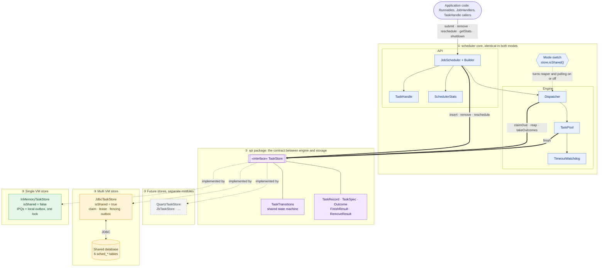

| Layer | Components | Single VM | Multi VM |
|---|---|---|---|
| ① Core | `JobScheduler`, `Builder`, `TaskHandle`, `SchedulerStats`, Dispatcher, `TaskPool`, `TimeoutWatchdog` | Same | Same |
| ② SPI | `TaskStore`, `TaskTransitions`, the value records | Same | Same |
| ③ Store | One implementation per scheduler | `InMemoryTaskStore` (the default, or the 4-arg constructor) | `JdbcTaskStore` over a shared `DataSource`, via `builder().store(…)` |

The engine reads `store.isShared()` once, at construction, and switches these behaviours:

| Behaviour | `isShared() == false` (single VM) | `isShared() == true` (multi VM) | Code |
|---|---|---|---|
| Default `nodeId` | `"local"` | `node-<random>` (set your own stable id) | `JobScheduler(Builder)` |
| Named job of an unregistered type | Rejected at submit | Accepted: another node may run it | `submitNamed` |
| Lease reaper | Off: the process is the lease | Runs on every dispatcher pass | `dispatchLoop` → `reap` |
| Dispatcher sleep | Until the next due task, or a local change | Capped at `pollInterval`, to see other nodes' changes | `dispatchLoop` |
| Recurring task when its node stops | Dropped | Named: kept for the other nodes. Pinned: dropped. | `TaskTransitions.finish(…, sharedStore)` |
| At shutdown | Open handles cancelled | Plus: this node's pinned `Runnable` tasks are removed from the store | `shutdown` |

Nothing else branches on the mode. Claims, fencing, capacity and the outbox go through the same
SPI calls either way. The in-memory store simply can't lose a claim.

### Deployment view: single VM

Everything is in one JVM. The numbers show one task's path.

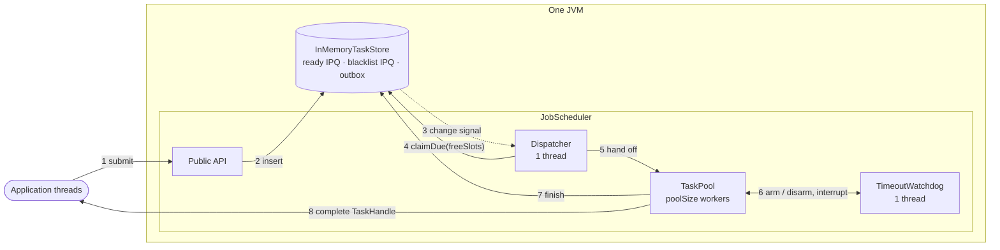

### Deployment view: multi VM

Every node runs the same code with its own `JobScheduler` and `JdbcTaskStore`, all pointed at one
database. A node can run a task only if the task is **pinned** to it (a `Runnable` submitted there)
or the node **registered the task's job type**. Nodes don't need to be identical: node C below is a
worker that doesn't take client traffic.

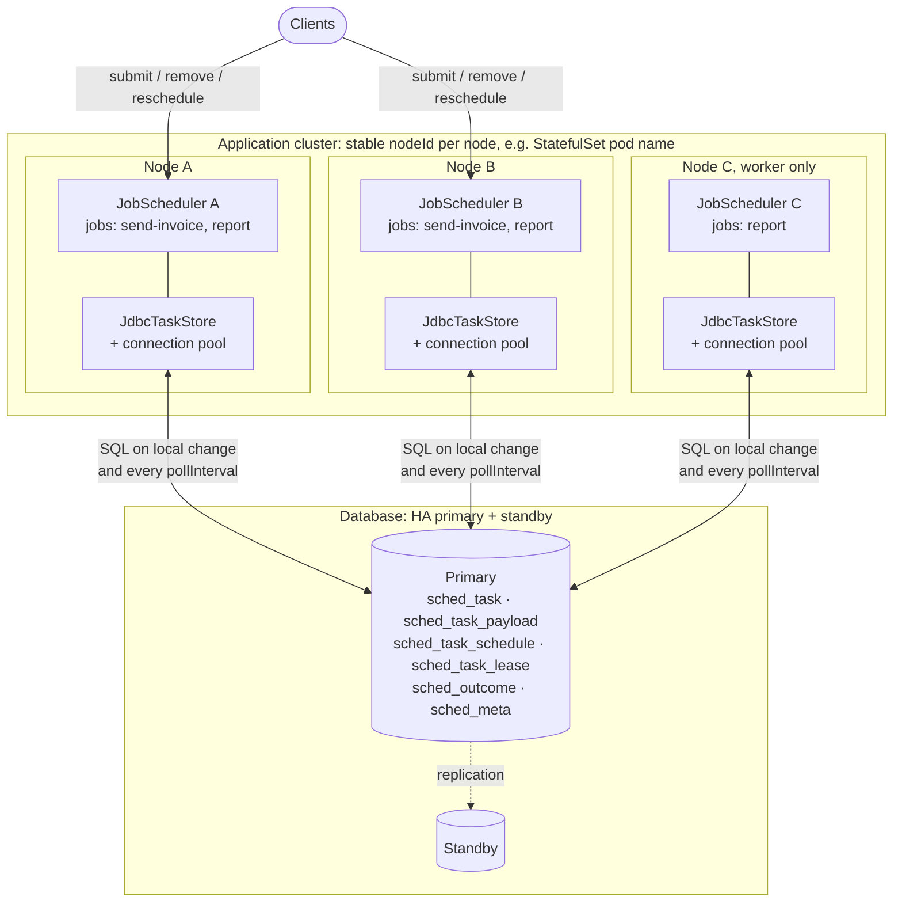

### What multi VM adds to single VM

Everything in the table is a property of the store. The engine and the API are the same in both columns.

| Concern | Single VM (`InMemoryTaskStore`) | Multi VM (`JdbcTaskStore`) | Requirement |
|---|---|---|---|
| Where tasks live | Heap: IPQs indexed by id | Six tables (see [Data model](#data-model-multi-vm)) | M10 |
| Survives a restart | No | Named tasks: yes. `Runnable` tasks: no (pinned) | M7 |
| Who runs a task | This node | Exactly one claiming node | M2 |
| How a claim works | Pop the head of the ready IPQ under the store lock | `UPDATE task_schedule … WHERE version = ?` + `INSERT task_lease` | M2 |
| If the runner dies | The process is gone, and so is everything else | The lease expires and another node reaps it as a timeout | M3 |
| Stale results | Can't happen | Rejected by the version check | M4 |
| `maxTasks` | `byId.size()` | `sched_meta.live` counter, cluster-wide | M5 |
| Handle completion | Local outbox | `sched_outcome` rows addressed to the submitter | M6 |
| Seeing new work | Change listener, right away | Local: right away. Other nodes: within `pollInterval`. | N15 |
| Node shutdown | Pending tasks dropped | Named recurring tasks stay for the other nodes. Pinned tasks are removed. | M9 |
| Clock | One clock | Wall clocks must be in sync, within `leaseGrace` | N13 |

### One task end to end (multi VM)

The task is submitted on node A, runs on node B, and its handle completes on node A.

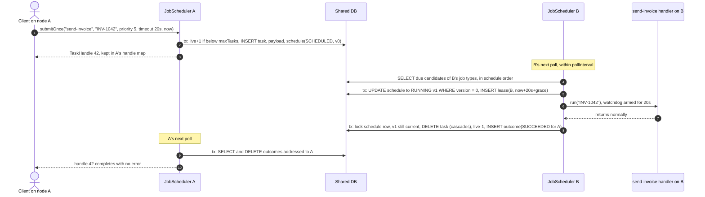

If B dies after step 5, the lease expires and any node settles task 42 as `LEASE_EXPIRED`. A
one-time task completes with `TimeoutException` on A. A's handle always completes, whatever happens to B.

### Component view of one node

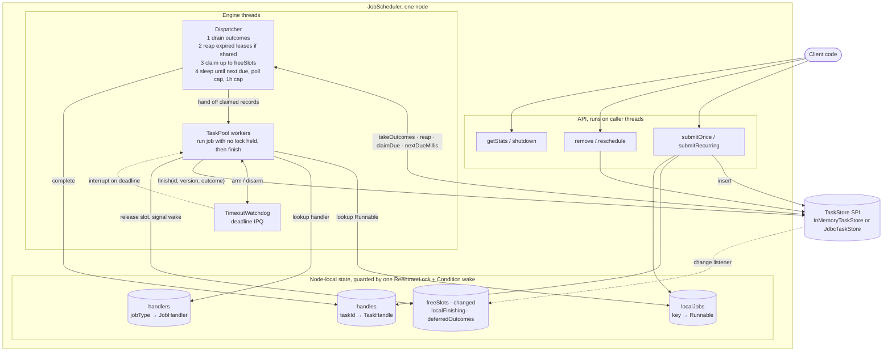

### Threads and locks

| Thread (single VM / node *X*) | Count | Runs user code? | Locks it takes |
|---|---|---|---|
| `scheduler-dispatcher` / `scheduler-X-dispatcher` | 1 | No | Scheduler lock, briefly. Store and pool calls are made without it. |
| `scheduler-pool-worker-i` / `scheduler-X-pool-worker-i` | `poolSize` | **Yes**, with no lock held | Pool, watchdog, store and scheduler locks, never more than one at a time |
| `scheduler-watchdog` / `scheduler-X-watchdog` | 1 | No | Watchdog lock |
| Caller threads (`submit*`, `remove`, …) | any | No | `submit*`: the scheduler lock, held across `store.insert`. `remove`/`reschedule`: the store first, then the scheduler lock briefly. |

All locks are taken in the order **scheduler → store** or **scheduler → pool**, never the reverse.
Store change listeners run after the store has released its lock. All engine threads are daemon threads (N12).

## Data model (multi VM)

### Why six tables

The first layout kept everything in one wide `sched_task` row. The fixed definition, the payload,
the queue fields that change on every run and the lease all sat in one row. So every claim and
finish rewrote that whole row, and the reaper had to scan the queue index to find running tasks.
Schema version 2 (`JdbcTaskStore.SCHEMA_VERSION`) splits the data **by how often each part changes
and who reads it**:

| Table | One row per | Written | Read by | Why it's separate |
|---|---|---|---|---|
| `sched_task` | Live task | Once, at submit | Claim filter (job type, pin), `find`, transitions | The definition never changes, so it's never rewritten |
| `sched_task_payload` | Live task that has a payload | Once, at submit | Building the record for a claim or `find` | It can be large (up to `MAX_PAYLOAD_CHARS` = 16 000), so it's kept out of the hot rows and the claim scan |
| `sched_task_schedule` | Live task | On claim, finish, reschedule and remove | Claim scan, `nextDueMillis`, `counts`, row locks | The **hot queue**: narrow rows behind the `(state, next_run_ms)` index |
| `sched_task_lease` | **Running** task | Inserted on claim, deleted when the run ends | Reaper, operations | The reaper scans only running tasks, through the `lease_until_ms` index. Also shows who runs what. |
| `sched_outcome` | Final result not yet collected | When a task ends | `takeOutcomes(submitter)` | The outbox. It outlives the task rows. |
| `sched_meta` | Named value | Every insert and terminal transition (`live`). Once (`schema_version`). | `insert`, `createSchema` | The cluster-wide capacity counter and the schema guard |

`sched_task_payload`, `sched_task_schedule` and `sched_task_lease` reference `sched_task` with
`ON DELETE CASCADE`. When a task ends, a single `DELETE FROM sched_task` removes all of its rows,
so there are no orphans. `sched_outcome` has no foreign key on purpose, because it has to outlive the task.

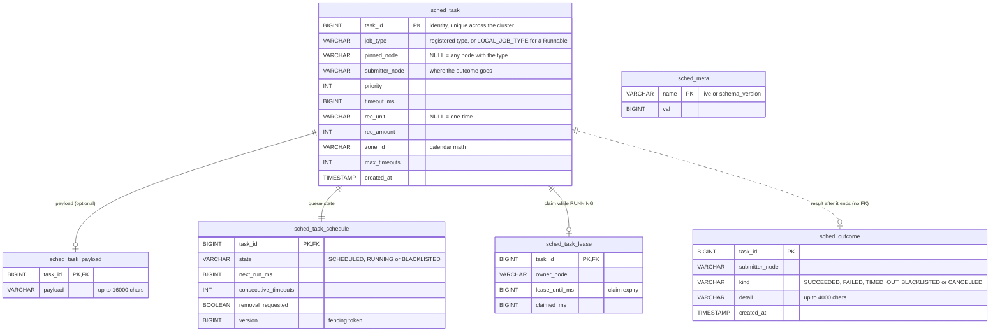

### Indexes and the queries they serve

| Index | Query |
|---|---|
| `sched_task_schedule_due (state, next_run_ms)` | Claim candidates: `WHERE state = 'SCHEDULED' AND next_run_ms <= now ORDER BY next_run_ms, priority DESC, task_id`, and `MIN(next_run_ms)` |
| `sched_task_lease_expiry (lease_until_ms)` | Reaper: `WHERE lease_until_ms < now` |
| `sched_task_lease_owner (owner_node)` | Operations: what's running on node X |
| `sched_outcome_sub (submitter_node)` | `takeOutcomes(submitter)` |
| Primary keys | Every single-task lookup, lock and join |

### Rows per state

| Task state | `task` | `task_payload` | `task_schedule` | `task_lease` | `outcome` | Counted in `live` |
|---|---|---|---|---|---|---|
| `SCHEDULED` | ✓ | if it has a payload | ✓ `SCHEDULED` | — | — | ✓ |
| `RUNNING` | ✓ | if it has a payload | ✓ `RUNNING` | ✓ | — | ✓ |
| `BLACKLISTED` | ✓ | if it has a payload | ✓ `BLACKLISTED` | — | ✓ until collected | ✓ |
| `COMPLETED` / `CANCELLED` | — | — | — | — | ✓ until collected | — |

`JdbcTaskStoreTest.rowsFollowTheLifecycle` and `recurringReleasesLease` check this table.

### DDL

`createSchema()` runs this (shown with the default prefix `sched_`). It's idempotent and works on H2
and PostgreSQL. Ship the same statements through your migration tool if your service doesn't run DDL at startup.

```sql
CREATE TABLE IF NOT EXISTS sched_task (
    task_id        BIGINT GENERATED BY DEFAULT AS IDENTITY PRIMARY KEY,
    job_type       VARCHAR(200) NOT NULL,
    pinned_node    VARCHAR(200),
    submitter_node VARCHAR(200) NOT NULL,
    priority       INT          NOT NULL,
    timeout_ms     BIGINT       NOT NULL,
    rec_unit       VARCHAR(16),
    rec_amount     INT,
    zone_id        VARCHAR(64)  NOT NULL,
    max_timeouts   INT          NOT NULL,
    created_at     TIMESTAMP DEFAULT CURRENT_TIMESTAMP NOT NULL);

CREATE TABLE IF NOT EXISTS sched_task_payload (
    task_id BIGINT PRIMARY KEY REFERENCES sched_task (task_id) ON DELETE CASCADE,
    payload VARCHAR(16000) NOT NULL);

CREATE TABLE IF NOT EXISTS sched_task_schedule (
    task_id              BIGINT PRIMARY KEY REFERENCES sched_task (task_id) ON DELETE CASCADE,
    state                VARCHAR(16) NOT NULL,
    next_run_ms          BIGINT      NOT NULL,
    consecutive_timeouts INT         NOT NULL,
    removal_requested    BOOLEAN     NOT NULL,
    version              BIGINT      NOT NULL);
CREATE INDEX IF NOT EXISTS sched_task_schedule_due ON sched_task_schedule (state, next_run_ms);

CREATE TABLE IF NOT EXISTS sched_task_lease (
    task_id        BIGINT PRIMARY KEY REFERENCES sched_task (task_id) ON DELETE CASCADE,
    owner_node     VARCHAR(200) NOT NULL,
    lease_until_ms BIGINT       NOT NULL,
    claimed_ms     BIGINT       NOT NULL);
CREATE INDEX IF NOT EXISTS sched_task_lease_expiry ON sched_task_lease (lease_until_ms);
CREATE INDEX IF NOT EXISTS sched_task_lease_owner  ON sched_task_lease (owner_node);

CREATE TABLE IF NOT EXISTS sched_outcome (
    task_id        BIGINT PRIMARY KEY,
    submitter_node VARCHAR(200) NOT NULL,
    kind           VARCHAR(16)  NOT NULL,
    detail         VARCHAR(4000),
    created_at     TIMESTAMP DEFAULT CURRENT_TIMESTAMP NOT NULL);
CREATE INDEX IF NOT EXISTS sched_outcome_sub ON sched_outcome (submitter_node);

CREATE TABLE IF NOT EXISTS sched_meta (name VARCHAR(32) PRIMARY KEY, val BIGINT NOT NULL);
-- inserted once, in one transaction, on a fresh database:
INSERT INTO sched_meta VALUES ('live', 0), ('schema_version', 2);
```

### Schema versioning

- `createSchema()` reads `sched_meta.schema_version`. If it's missing on a fresh database, the
  current version is written. If it's a **different** version, or the database predates
  versioning (`live` exists without `schema_version`), it throws `IllegalStateException`. A node
  can never run against a layout it doesn't understand (`JdbcTaskStoreTest.schemaVersionIsChecked`).
- Upgrades are **expand, then contract**:
  1. Add the new columns or tables in a backward-compatible migration.
  2. Roll the nodes.
  3. Bump `schema_version`.
  4. Drop the old structures in a later release.
  Every node must be stopped or upgraded before you bump the version. A node on the old code would
  refuse to start, which is the intent.
- Use `tablePrefix` to run several independent schedulers in one database, e.g. per service or per
  tenant tier. The prefix is checked against `[A-Za-z0-9_]*`, because table names can't be bound as SQL parameters.

## Shared state and consistency

### Who owns which state

The **store holds the truth about every task**: its schedule, state, current claim, and the result
waiting for the submitter. **Each node holds only what it can afford to lose**: handles, `Runnable`
objects, worker slots and counters. When a node dies, the store still has everything the other
nodes need to carry on.

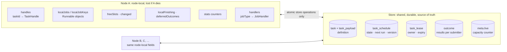

| State | Lives in | Changed by | If the node dies |
|---|---|---|---|
| Definition: type, pin, submitter, priority, timeout, recurrence, zone, blacklist limit | `sched_task` (+ `sched_task_payload`) | `insert` only | Kept. Any node with the type can run it. |
| `state`, `next_run_ms`, `consecutive_timeouts`, `removal_requested`, `version` | `sched_task_schedule` | Only through `TaskTransitions` (claim, finish, remove, reschedule), in one transaction | Kept |
| Owner and lease expiry | `sched_task_lease` | Inserted by a claim, deleted when the run ends | The lease expires and another node reaps the run (M3) |
| Results for the submitter | `sched_outcome` | Whichever node ends the task | Kept until the submitter (same `nodeId`) collects them |
| Live-task count | `sched_meta.live` | `insert` (+1) and terminal transitions (−1), in the same transaction as the rows | Always exact |
| `TaskHandle`s | Node | `submit*`; completed by `resolve` | Lost, along with the callers waiting on them |
| `Runnable` objects | Node | `submit*(Runnable…)` | Lost. That's why such tasks are pinned and then dropped (M7, M9). |
| `freeSlots`, `changed`, counters | Node | The dispatcher and workers, under the node lock | Lost. They only matter while the node runs. |
| `JobHandler` registry | Node | The builder | Each node declares which types it can run |

### Each operation is one transaction

| Operation | SQL in one transaction (JDBC) | In memory, under the store lock |
|---|---|---|
| `insert` | `UPDATE meta SET val = val + 1 WHERE name = 'live' AND val < max`. If no row is updated, throw `RejectedExecutionException`. Then `INSERT` into `task`, `task_payload` (if there's a payload) and `task_schedule (SCHEDULED, v0)`. | Size check, then `ready.offer` |
| `claimDue` | ① `SELECT s.task_id, s.version FROM task_schedule s JOIN task t …` for due, claimable tasks in schedule order, `FETCH FIRST limit`. ② For each candidate, its own transaction: `UPDATE task_schedule SET state = 'RUNNING', version = version + 1 WHERE task_id = ? AND version = ? AND state = 'SCHEDULED'`. On 1 row: `INSERT task_lease (owner, now + grace + timeout)`. On 0 rows, another node won it. | `ready.remove()` while the head is due |
| `finish` | `SELECT version FROM task_schedule WHERE task_id = ? FOR UPDATE`, then read the joined record. Check `RUNNING` and the version, then call `TaskTransitions.finish`. Terminal: `DELETE FROM task` (cascade) and `live − 1`. Otherwise: `UPDATE task_schedule` and `DELETE task_lease`. Then `INSERT outcome`, if there is one. | Same checks, `place()` + `publish()` |
| `reapExpiredLeases` | `SELECT … FROM task_lease JOIN task_schedule WHERE lease_until_ms < now`, then `finish(id, version, LEASE_EXPIRED)` for each. The version check means only one node reaps each lease. | Not needed (returns empty) |
| `remove` | Lock the schedule row, then `TaskTransitions.remove`, then write as for `finish`. A running task only gets `removal_requested = TRUE`, and keeps its version and lease. | Same |
| `reschedule` | `UPDATE task_schedule SET next_run_ms = ?, version = version + 1 WHERE task_id = ? AND state = 'SCHEDULED'` | `ready.update` |
| `takeOutcomes` | `SELECT` this submitter's outcomes, then `DELETE` exactly those ids | Drain the submitter's deque |
| `counts` | `SELECT state, COUNT(*) FROM task_schedule GROUP BY state` | IPQ sizes |

**Lock discipline:** every operation that changes an existing task locks or conditionally updates
its **`task_schedule` row first**. That row is the single point that serializes claim, finish,
remove and reschedule for one task. The task's other rows come next, and the shared `meta.live`
counter row comes last. `insert` takes the counter first, but the only other rows it touches are
new ones nobody else can hold yet. So there's no lock cycle, and concurrent operations on one task
queue up behind its schedule row instead of deadlocking.

### Invariants

| # | Invariant | Kept by |
|---|---|---|
| I1 | At most one live claim per task | The conditional `UPDATE` on `version` and `state`, a compare-and-set |
| I2 | Only the current claim can settle a run | `finish` checks the version under the row lock. A stale owner gets `FinishResult.stale()`. |
| I3 | `state = RUNNING` ⇔ a `task_lease` row exists | The claim inserts the lease in the same transaction. Every transition out of `RUNNING` deletes it. |
| I4 | `live` = number of `task` rows ≤ `maxTasks` | The counter changes in the same transaction as the task insert or delete |
| I5 | Every backend follows the same rules | Stores call `TaskTransitions` instead of re-implementing the rules |
| I6 | Each outcome is delivered once, to its submitter | It's written in the transaction that ends the task, and read and deleted in one `takeOutcomes` transaction |
| I7 | A removal during a run doesn't invalidate the run's token | `withRemovalRequested()` keeps the version, and the run's `finish` applies the removal |
| I8 | A pinned task runs only on its node | The claim filter `pinned_node = me` |
| I9 | No orphan rows | `ON DELETE CASCADE` from `sched_task` |

### Races and how each one ends

| Race | Resolution |
|---|---|
| Two nodes pick the same candidate | Both run the conditional `UPDATE`. The second waits for the row lock, sees the new version, updates 0 rows and skips the task. |
| The owner finishes just as another node reaps the expired lease | Both lock the schedule row first. The second sees a different version, or no row, and does nothing. |
| `remove()` on node B while node A runs the task | B sets `removal_requested` and keeps the version. A's `finish` applies and cancels the task. Its outcome goes to the submitter. |
| An outcome arrives before `submit` has registered the handle | `submit` holds the node lock from `insert` until `handles.put`, and `resolve` takes that same lock |
| A local run's outcome is drained from the outbox before the worker resolves it | The worker marks the id in `localFinishing`, and the dispatcher parks the outcome in `deferredOutcomes`. The handle gets the **real exception** (diagram below). |
| Nodes' clocks differ | Leases include `leaseGrace` (N13). Run times are absolute epoch milliseconds, so skew only shifts when a node thinks a task is due. |

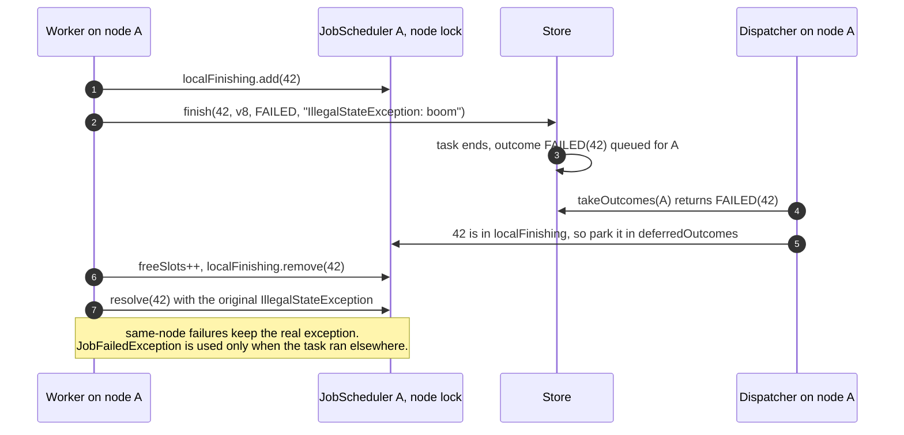

## Class diagram

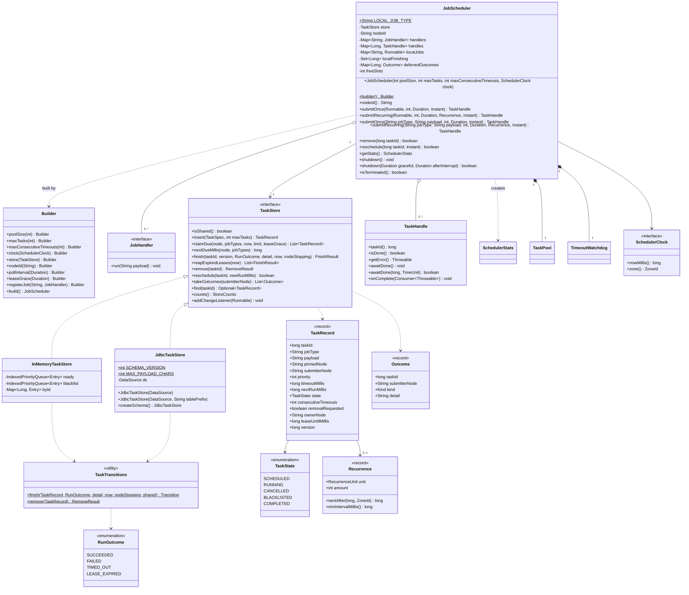

## Task lifecycle

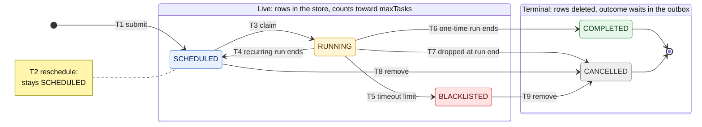

| # | Transition | When | Store effect | Handle |
|---|---|---|---|---|
| T1 | → `SCHEDULED` | `submitOnce` / `submitRecurring` accepted | Capacity +1. Version 0. | Returned to the caller |
| T2 | `SCHEDULED` → `SCHEDULED` | `reschedule(id, time)` | New `next_run`, version +1 | — |
| T3 | `SCHEDULED` → `RUNNING` | The task is due, a worker is free, and this node may run it (pinned here or a registered type) | Version +1 (the fencing token). Multi VM: lease row with owner and `now + timeout + leaseGrace`. | — |
| T4 | `RUNNING` → `SCHEDULED` | A **recurring** run ends: success, exception, or a timeout / lease expiry below the limit | Next run = `recurrence.nextAfter(finish time)`. Timeout streak +1 on a timeout, otherwise reset to 0. Lease released. | Stays open |
| T5 | `RUNNING` → `BLACKLISTED` | A **recurring** run times out (or its lease expires) and the streak reaches `maxConsecutiveTimeouts` | Lease released. **Still counts toward `maxTasks`.** | `TimeoutException` |
| T6 | `RUNNING` → `COMPLETED` | A **one-time** run ends in any way. A removal requested during the run doesn't change that. | Rows deleted, capacity −1, outcome to the outbox | `null`, the job's exception (or `JobFailedException` if it ran on another node), or `TimeoutException` |
| T7 | `RUNNING` → `CANCELLED` | A **recurring** run ends and: its removal was requested; or its node is stopping and no other node can take it (in-memory store, or a pinned `Runnable`); or the lease of a pinned task expired | Rows deleted, capacity −1, outcome to the outbox | `CancellationException` |
| T8 | `SCHEDULED` → `CANCELLED` | `remove(id)` while pending | Rows deleted, capacity −1, outcome to the outbox | `CancellationException` |
| T9 | `BLACKLISTED` → `CANCELLED` | `remove(id)` | Rows deleted, capacity −1 | Already completed at T5 |

Only `remove` (T8, T9) and `reschedule` (T2) are called from outside. Every other transition is
computed by `TaskTransitions` when a run ends, so all stores apply the same rules. For which JDBC
tables hold rows in each state, see [Rows per state](#rows-per-state).

## Key flows (sequence diagrams)

### Submit → claim → run → complete (one-time task, both modes)

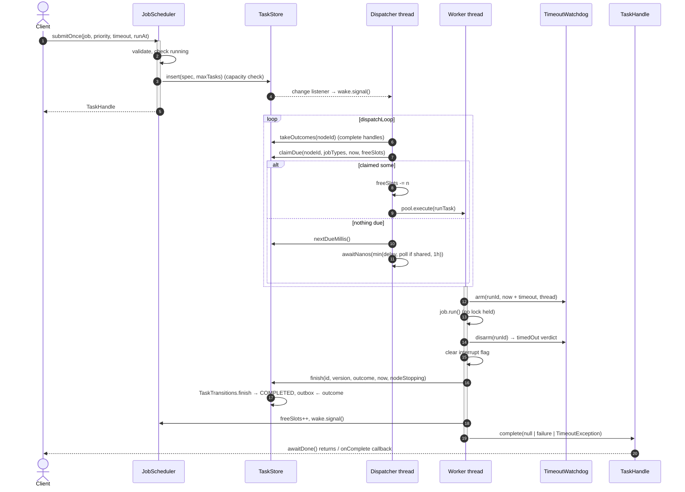

### Timeout and blacklisting (recurring task)

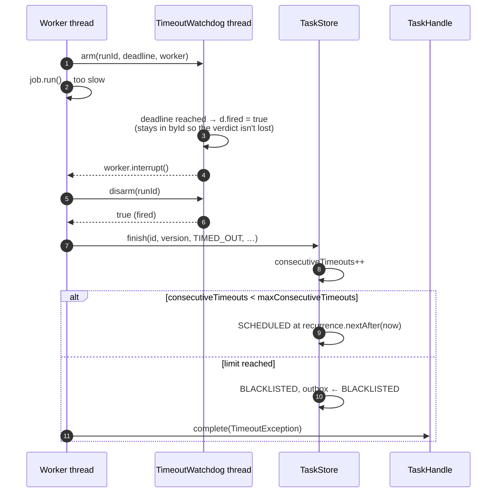

### Multi VM: exclusive claim and fencing

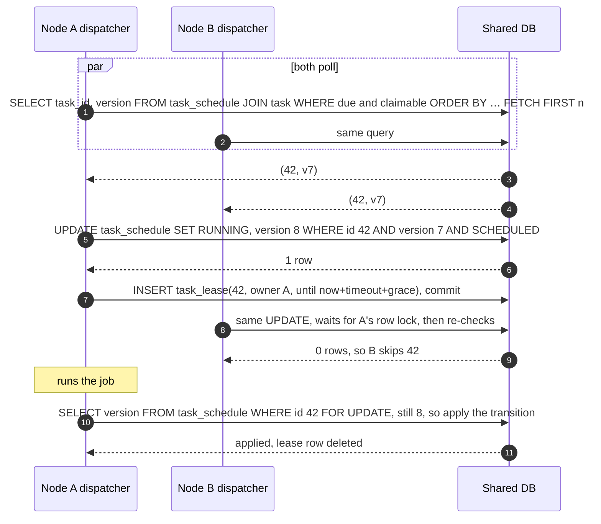

### Multi VM: crash, lease expiry and failover

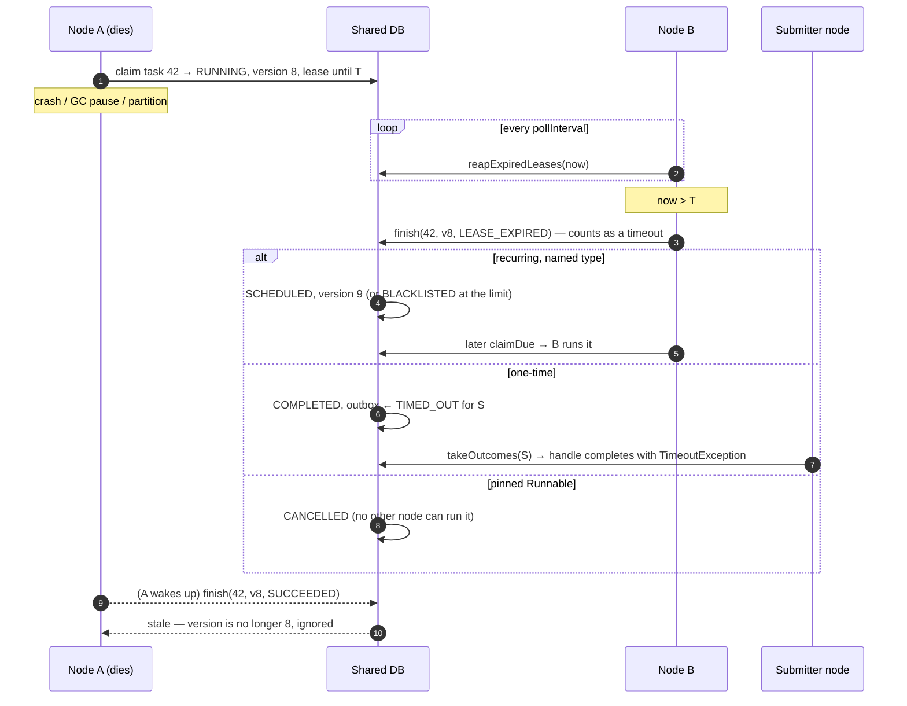

### Remove and reschedule

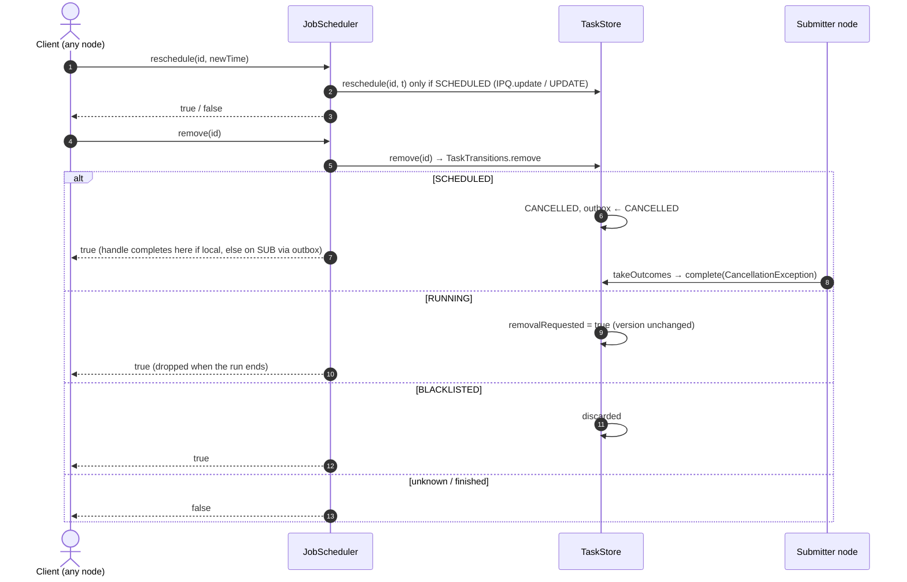

### Bounded shutdown

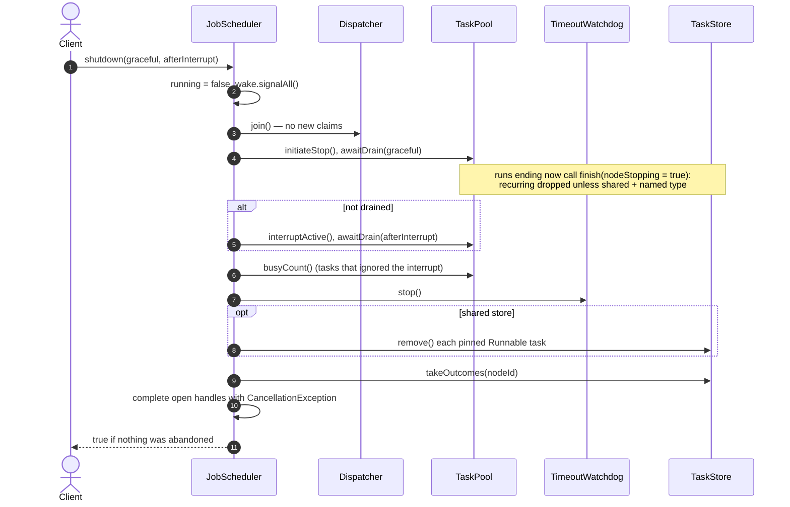

## Delivery guarantees and failure handling

### Guarantees

| Property | Single VM | Multi VM |
|---|---|---|
| One-time task execution | **At most once**. It runs once, or not at all if removed or shut down first. | **At most once**. A run whose node died is never retried: it completes as `TimeoutException`. |
| Recurring task: overlapping runs | Never (F6) | Never, **unless a lease is lost while the job still runs** (see below) |
| Task state after any failure | Consistent (one lock) | Consistent: every change is one transaction, fenced by version |
| Handle completion | Exactly once | Exactly once, on the submitting node, if that node is alive under the same `nodeId` |
| Order | Earliest due, then priority, then FIFO, among free slots | The same order within one claim. Across nodes it's approximate: each node claims its own batch. |
| Latency to start a due task | About 0 when a worker is free | Up to `pollInterval` for work submitted on another node |
| Durability | None | Named tasks: as durable as the database. `Runnable` tasks: none, by design. |

**When overlap can happen.** Leases are not renewed, so a run loses its lease once
`timeout + leaseGrace` passes, even if it's still running. Causes: a long GC pause, a network
partition, or a job that ignores its interrupt for longer than `leaseGrace`. Another node then reaps the lease. A recurring task may then start
its next run while the old one is still going. The old run's *result* is rejected (fencing), but its
*side effects* can't be. So **handlers must be idempotent**, or protect their own side effects
(unique keys, upserts, a version check downstream).

### Failure matrix

| Failure | Effect | Recovery |
|---|---|---|
| A node crashes mid-run | Its lease expires after `timeout + leaseGrace` | Any node reaps it as `LEASE_EXPIRED`. Recurring named task: rescheduled. One-time: completes as timed out. Pinned: dropped. |
| A node pauses or is partitioned, then returns | Same as a crash. Its late `finish` is stale. | Automatic. Side effects may repeat (idempotency). |
| A node shuts down gracefully | It stops claiming and drains its runs within `graceful + afterInterrupt` | Named recurring tasks go back to `SCHEDULED` for the other nodes. Pinned tasks are removed. Open handles complete with `CancellationException`. |
| The database is briefly unavailable | Store calls throw `TaskStoreException` and log a WARNING | The dispatcher retries every `pollInterval`. A failed `finish` leaves the lease to expire, and the reaper settles it. Callers of `submit*` get the exception. |
| Database failover | In-flight transactions fail | The same as an outage. Commits are atomic, so there are no half-written tasks. Use synchronous replication, or accept losing the last commits. |
| The submitter dies before collecting an outcome | The outcome stays in `sched_outcome` | A restart with the same `nodeId` collects it, without a handle to complete. Otherwise clean it up (see the runbook). |
| A task's type has no registered handler on any node | It stays `SCHEDULED`, overdue | Deploy a node that registers the type, or `remove` the task. Watch the overdue query. |
| A handler never honours its interrupt | Counted as a timeout. The worker stays busy until the job returns. | Fix the handler. At shutdown it is abandoned (daemon thread). |
| Clocks drift more than `leaseGrace` | Early reaps, so runs can overlap | Use NTP, and set `leaseGrace` well above the worst skew |

## Public API

### `JobScheduler`: single VM (unchanged)

```java
public JobScheduler(int poolSize, int maxTasks, int maxConsecutiveTimeouts, SchedulerClock clock)
```

| Parameter | Meaning | Constraint |
|---|---|---|
| `poolSize` | Worker threads, i.e. the maximum number of runs at once | `> 0` |
| `maxTasks` | Maximum tracked tasks (pending + running + blacklisted) | `> 0` |
| `maxConsecutiveTimeouts` | Consecutive timeouts before a recurring task is blacklisted | `> 0` |
| `clock` | Time source | non-null |

This is the same as `JobScheduler.builder()…build()` with the default `InMemoryTaskStore`. The constructor
starts the dispatcher, `poolSize` workers and the watchdog thread. All of them are daemon threads.

### `JobScheduler.builder()`: both modes

| Option | Default | Notes |
|---|---|---|
| `poolSize(int)` | CPU count | `> 0` |
| `maxTasks(int)` | 10 000 | `> 0`; cluster-wide with a shared store, so give every node the same value |
| `maxConsecutiveTimeouts(int)` | 3 | `> 0`; recorded on each task when it's submitted |
| `clock(SchedulerClock)` | `SystemClock(ZoneId.systemDefault())` | The zone is recorded on each task for calendar math |
| `store(TaskStore)` | `new InMemoryTaskStore()` | A shared store switches on multi-VM mode. An in-memory store serves one scheduler only. |
| `nodeId(String)` | `"local"`, or `node-<random>` with a shared store | Must be unique per node, and should be stable across restarts |
| `pollInterval(Duration)` | 500 ms | Multi VM: how quickly other nodes' changes are noticed |
| `leaseGrace(Duration)` | 30 s | Multi VM: lease = timeout + grace. It must cover the time to react to an interrupt, plus clock skew. |
| `registerJob(String type, JobHandler h)` | none | Lets this node run tasks of `type`. Duplicates and the reserved `LOCAL_JOB_TYPE` are rejected. |

### Methods

| Method | Returns | Throws | Notes |
|---|---|---|---|
| `submitOnce(Runnable job, int priority, Duration timeout, Instant runAt)` | `TaskHandle` | `NullPointerException` (job/runAt), `IllegalArgumentException` (timeout ≤ 0 or null), `RejectedExecutionException` (shut down or at `maxTasks`) | A `runAt` in the past means run as soon as possible. Runs on this node (pinned). |
| `submitRecurring(Runnable job, int priority, Duration timeout, Recurrence rec, Instant firstRunAt)` | `TaskHandle` | As above, but a null `timeout` or `rec` throws `NullPointerException`; `IllegalArgumentException` if `timeout ≥ rec.minIntervalMillis()` | The handle completes only on remove, blacklist or shutdown. |
| `submitOnce(String jobType, String payload, int priority, Duration timeout, Instant runAt)` | `TaskHandle` | As for the `Runnable` version, plus `IllegalArgumentException` for the reserved type, or for an unregistered type with a non-shared store | Runs on any node that registered `jobType`. |
| `submitRecurring(String jobType, String payload, int priority, Duration timeout, Recurrence rec, Instant firstRunAt)` | `TaskHandle` | As above | Survives the submitting node (M9). |
| `remove(long taskId)` | `boolean` | — | `true` if the task was found and pending, running or blacklisted. Works from any node. |
| `reschedule(long taskId, Instant newTime)` | `boolean` | `NullPointerException` (newTime) | `true` only if the task is currently `SCHEDULED`. |
| `getStats()` | `SchedulerStats` | — | Task gauges come from one store read; worker gauges and counters come from this node, read under its lock. |
| `nodeId()` | `String` | — | This node's identity in the store. |
| `shutdown()` | `void` | — | Same as `shutdown(30s, 5s)`, but the result is discarded. |
| `shutdown(Duration graceful, Duration afterInterrupt)` | `boolean` | — | `true` if every running task finished; `false` if some were given up on. Safe to call more than once. |
| `isTerminated()` | `boolean` | — | `true` once shutdown has completed. |

### `TaskHandle`

| Method | Description |
|---|---|
| `long taskId()` | The id to pass to `remove` and `reschedule` (unique across the cluster). |
| `boolean isDone()` | Whether the handle has completed. |
| `Throwable getError()` | `null` on success. Otherwise: `TimeoutException` (timed out, lease expired or blacklisted); `CancellationException` (removed or shutdown); the exception the job threw (same node); or `JobFailedException` (thrown on another node). |
| `void awaitDone()` | Blocks until the handle completes. |
| `boolean awaitDone(long timeout, TimeUnit unit)` | Blocks for up to `timeout`; returns `false` if it timed out first. |
| `void onComplete(Consumer<Throwable> listener)` | Runs once with the error (or `null`), outside any scheduler lock. If the handle is already done, it runs immediately. |

### `JobHandler` and `JobFailedException`

```java
@FunctionalInterface
public interface JobHandler { void run(String payload) throws Exception; }   // should be idempotent (multi VM)

public final class JobFailedException extends RuntimeException { ... }      // message = remote exception's toString()
```

### `Recurrence` (record) and `RecurrenceUnit`

```java
public record Recurrence(RecurrenceUnit unit, int amount)   // amount > 0, unit non-null
public enum RecurrenceUnit { SECOND, MINUTE, HOUR, DAILY, MONTHLY, YEARLY }
```

### `SchedulerClock`

```java
public interface SchedulerClock {
    long nowMillis();
    ZoneId zone();

    record SystemClock(ZoneId zone) implements SchedulerClock { ... }   // wall clock
    final class ManualClock implements SchedulerClock {                   // for deterministic tests
        public ManualClock(long startMillis, ZoneId zone);
        public void advance(long deltaMillis);
    }
}
```

The dispatcher and watchdog wait on real time, so advancing a `ManualClock` does not wake them.
Use `ManualClock` for recurrence math, and `SystemClock` with short durations for end-to-end
tests.

### `SchedulerStats`

An immutable snapshot with public final fields:

| Gauges | Counters (since start, this node) |
|---|---|
| `nodeId` | `submitted`: accepted by `submit*` on this node |
| `pending`: scheduled, not running (store-wide) | `completed`: runs that didn't time out (one-time: and didn't throw) |
| `running`: running on this node (`poolSize - idleWorkers`) | `timedOut`: runs that exceeded their timeout, including reaped leases |
| `clusterRunning`: claimed on any node (store-wide) | `rescheduled`: recurring tasks put back after a run |
| `blacklisted`: in the blacklist (store-wide) | `cancelled`: removed or dropped |
| `poolSize`, `idleWorkers` | `failed`: one-time runs that threw |
| `capacity` (`maxTasks`), `used`, `remaining` | `reclaimed`: expired leases this node settled (multi VM) |

The invariants are `used == pending + clusterRunning + blacklisted`, `running == poolSize - idleWorkers`
and `remaining == capacity - used`. In single-VM mode, `clusterRunning` equals `running` except for the
moment between a claim and the hand-off to a worker.

### The store SPI (`com.salesforce.einstein.scheduler.spi`)

| Type | Role |
|---|---|
| `TaskStore` | The interface, listed in the class diagram. Its Javadoc states the contract. |
| `TaskSpec` | What a submission asks for (job type, payload, pin, submitter, priority, timeout, recurrence, zone, blacklist limit, first run). |
| `TaskRecord` | An immutable snapshot of a stored task, including `ownerNode`, `leaseUntilMillis` and `version` (the fencing token). |
| `TaskTransitions` | The state machine as pure functions. Stores call these instead of re-implementing the rules. |
| `RunOutcome`, `Outcome`, `FinishResult`, `RemoveResult`, `StoreCounts`, `TaskState` | Value types used by the methods above. |
| `TaskStoreException` | An unchecked wrapper for backend failures. |

The **contract** every store must meet:

1. Every method is atomic.
2. `claimDue` is **exclusive**: no task is returned to two callers until it's settled. It claims in
   `SCHEDULE_ORDER`, and only tasks pinned to the caller, or unpinned tasks whose type is in
   `jobTypes`. A non-shared store may ignore the filter, because only one node ever uses it.
3. `finish` is **fenced**: it applies only if the task is `RUNNING` and its version is unchanged.
   Otherwise it returns `FinishResult.stale()`.
4. All state changes go through `TaskTransitions`, so every backend behaves the same.
5. `insert` enforces `maxTasks` over all live tasks in the store. Terminal tasks don't count.
6. Every `Outcome` is delivered **exactly once**, through `takeOutcomes(submitterNode)`.
7. Change listeners fire for local changes, after the store's locks are released.
8. `isShared()` is true if other processes can see the same tasks. That switches on reaping and
   polling, and lets tasks be handed over at shutdown.

## Usage

### Single VM

```java
JobScheduler scheduler = new JobScheduler(
        4,      // poolSize
        1_000,  // maxTasks
        3,      // maxConsecutiveTimeouts
        new SchedulerClock.SystemClock(ZoneId.of("UTC")));

// One-time, high priority, in 5 seconds
TaskHandle once = scheduler.submitOnce(
        () -> System.out.println("hello"), 10, Duration.ofSeconds(2), Instant.now().plusSeconds(5));
once.onComplete(err -> System.out.println(err == null ? "ok" : "failed: " + err));

// Every 15 minutes, starting now
TaskHandle report = scheduler.submitRecurring(
        this::buildReport, 0, Duration.ofMinutes(1),
        new Recurrence(RecurrenceUnit.MINUTE, 15), Instant.now());

scheduler.reschedule(once.taskId(), Instant.now());   // run it now instead
scheduler.remove(report.taskId());                    // stop the recurring job

System.out.println(scheduler.getStats());
boolean clean = scheduler.shutdown(Duration.ofSeconds(10), Duration.ofSeconds(2));
```

### Multi VM

Run the same code on every node. Point each node at the same database, give each one a unique,
stable `nodeId`, and register the job types it can run:

```java
DataSource ds = /* pooled DataSource for the shared DB, e.g. HikariCP over PostgreSQL */;

JobScheduler scheduler = JobScheduler.builder()
        .nodeId(System.getenv("POD_NAME"))                         // unique, stable per node
        .poolSize(8)
        .maxTasks(100_000)                                         // cluster-wide
        .store(new JdbcTaskStore(ds).createSchema())               // idempotent; or use your migrations
        .leaseGrace(Duration.ofSeconds(30))
        .registerJob("send-invoice", invoiceId -> invoices.send(invoiceId))   // idempotent!
        .registerJob("nightly-report", ignored -> reports.build())
        .build();

// Durable, runs on whichever node claims it first, and survives this node:
scheduler.submitRecurring("nightly-report", null, 0, Duration.ofMinutes(30),
        new Recurrence(RecurrenceUnit.DAILY, 1), tonightAt2am);
TaskHandle h = scheduler.submitOnce("send-invoice", "INV-1042", 5, Duration.ofSeconds(20), Instant.now());

// Still fine: a Runnable is pinned to this node.
scheduler.submitOnce(() -> cache.warm(), 0, Duration.ofSeconds(5), Instant.now());
```

To move a single-VM deployment to multi VM:
1. Turn each `Runnable` that must survive a restart, or be shared, into a `registerJob` type with a
   String payload (an id or JSON).
2. Make those handlers idempotent.
3. Pass a `JdbcTaskStore` to the builder.

Nothing else changes.

## Production readiness

### Readiness checklist

**Built in**: the library does it. **Operator**: you have to provide or configure it. **Gap**: not
provided yet (see [Known limitations and roadmap](#known-limitations-and-roadmap)).

| Area | Status | Notes |
|---|---|---|
| Exclusive execution across nodes | Built in | Conditional claim + fencing. `ClusterJobSchedulerTest.exactlyOnceAcrossNodes` runs 60 tasks on 3 nodes, each exactly once. |
| Failover after a node dies | Built in | Lease + reaper (M3), tested by `failoverAfterCrash` |
| Stale results rejected | Built in | Version fencing (M4) |
| Backpressure | Built in | `maxTasks` is cluster-wide. Beyond it, `submit*` throws `RejectedExecutionException`. |
| Bounded, graceful shutdown | Built in | `shutdown(graceful, afterInterrupt)`. Hand-over tested by `shutdownHandsOver`. |
| Schema creation and version guard | Built in | `createSchema()` is idempotent and refuses a schema of another version |
| Input limits | Built in | Payload ≤ 16 000 chars, checked before any SQL. Outcome detail cut at 4000. `tablePrefix` validated. |
| Idempotent side effects | **Operator** | Handlers must tolerate a repeat after a lease loss |
| Database HA, backups, failover | **Operator** | Named tasks are only as durable as the database |
| Running at shutdown | **Operator** | Call `shutdown(…)` from your shutdown hook or `preStop`. Make the platform's grace period larger than `graceful + afterInterrupt`. |
| Metrics export | **Operator** | `getStats()` is a snapshot. Publish it to Micrometer/Prometheus on a timer (below). |
| Schema migrations | **Operator** | Use Flyway/Liquibase with the DDL above if startup DDL isn't allowed |
| Tested against the production database | **Operator** | CI uses H2. Before going live, run `SharedTaskStoreContractTest` and `ClusterJobSchedulerTest` against your real database (e.g. PostgreSQL via Testcontainers). |
| Load testing | **Gap** | Not benchmarked yet (see [Capacity and performance](#capacity-and-performance)) |
| Run history / audit trail | **Gap** | Only the final outcome is kept, until it's collected |
| Node registry / heartbeats | **Gap** | Node liveness is inferred from leases only |
| Admin API (list, inspect, un-blacklist) | **Gap** | Use the SQL below plus `remove()` |
| Tracing | **Gap** | No trace context is carried from submit to run. Put a trace id in the payload if you need one. |

### Configuration guide

| Setting | Default | Recommendation |
|---|---|---|
| `nodeId` | `node-<random>` (shared) | **Set it.** Use a unique, stable id such as the StatefulSet pod name or hostname. A random id orphans outcomes on restart. |
| `poolSize` | CPU count | Concurrent jobs per node. CPU-bound jobs: about the core count. Jobs blocked on I/O: higher. |
| `maxTasks` | 10 000 | **The same value on every node.** It caps live rows, so size it to your database, not your heap. |
| `pollInterval` | 500 ms | The cross-node latency vs database load trade-off. Each idle node runs about 4 short transactions per interval. Use 1–5 s for large clusters. |
| `leaseGrace` | 30 s | At least: worst GC pause + worst clock skew + how long a job takes to react to an interrupt. Too small causes overlaps, too large delays failover. |
| Per-task `timeout` | — | A realistic upper bound for the job. Failover takes `timeout + leaseGrace`. |
| Connection pool size | — | At least `poolSize + 2 +` the number of threads calling `submit*`/`remove` at once. The dispatcher and each finishing worker hold one connection briefly. |
| Database timeouts | — | Set a lock timeout and a statement timeout (e.g. PostgreSQL `lock_timeout = 10s`, `statement_timeout = 30s`). A stuck lock then surfaces as `TaskStoreException` instead of a hung dispatcher. |
| Isolation level | DB default | `READ COMMITTED` is enough. Correctness comes from row locks and conditional updates, not from the isolation level. |

### Capacity and performance

Every scheduler operation is a database round-trip, so **the database sets the throughput ceiling**.
Per task:

| Step | Transactions | Statements |
|---|---|---|
| Submit | 1 | Counter update + 2–3 inserts |
| Claim | 1 per task, plus 1 candidate query per batch | Update + lease insert + record read (join of 4 tables, by primary key) |
| Finish | 1 | Lock + read + update or delete + optional outcome insert + counter update |
| Collect the outcome | Shared per poll | Select + batch delete |

Known pressure points, and what to do when you hit them:

1. **The `meta.live` counter row** is updated by every submit and every terminal finish, so it
   serializes them across the cluster. Fine for moderate rates. If it becomes the bottleneck,
   shard it into N rows (pick one at random on increment, sum them for the check), or drop the
   cluster-wide cap.
2. **Claim contention.** All nodes read the same candidates, and the losers waste an `UPDATE`. With
   many nodes, add `FOR UPDATE SKIP LOCKED` to the candidate query on PostgreSQL, so each node
   picks different rows.
3. **Filtered backlogs.** If many due tasks are of types a node can't run, its claim query scans
   past them. Move `job_type`/`pinned_node` into `task_schedule` and the due index, or use a
   `tablePrefix` per job family.
4. **Table churn.** `task_schedule` and `task_lease` get an update or delete on every run. On
   PostgreSQL, tune autovacuum for these two tables (lower the scale factor) to avoid bloat.

None of this has been load-tested yet. Measure on your own database and job mix before you size the cluster.

### Observability

**Metrics.** Publish `getStats()` on every node every 10–30 s, tagged with `nodeId`:

| Metric (`SchedulerStats` field) | Type | Alert when |
|---|---|---|
| `remaining` / `capacity` | gauge | Below 10 %: submits will start to be rejected |
| `pending`, `clusterRunning`, `blacklisted` | gauge, store-wide (one node is enough) | `blacklisted` increases |
| `running`, `idleWorkers` | gauge, per node | `idleWorkers == 0` for minutes: this node is saturated |
| `timedOut`, `failed` | counter | The rate rises above its baseline |
| `reclaimed` | counter | Any increase. A node died, or a run overran its lease and may overlap. |
| `submitted`, `completed`, `cancelled`, `rescheduled` | counter | Throughput dashboards |

**Logs.** The engine uses `System.Logger` (route it to SLF4J/Log4j with the usual bridge) and logs
a WARNING when:
- a store call fails in the dispatch loop (`store call failed, retrying`);
- a `finish` fails (the lease will expire and be reaped);
- the store is unavailable during shutdown.

Alert on a sustained rate of these. Log per-run detail inside your `JobHandler`.

**SQL for dashboards and on-call** (PostgreSQL, default prefix; `now_ms` = `(extract(epoch from now()) * 1000)::bigint`):

```sql
-- Overdue: due over a minute ago and not started. Usually means no node registers the job type, or the cluster is saturated.
SELECT t.job_type, count(*), min(s.next_run_ms)
FROM sched_task_schedule s JOIN sched_task t USING (task_id)
WHERE s.state = 'SCHEDULED' AND s.next_run_ms < now_ms - 60000
GROUP BY t.job_type;

-- Running per node, and leases that expired but haven't been reaped yet
SELECT owner_node, count(*), sum(CASE WHEN lease_until_ms < now_ms THEN 1 ELSE 0 END) AS expired
FROM sched_task_lease GROUP BY owner_node;

-- Blacklisted tasks
SELECT t.task_id, t.job_type, s.consecutive_timeouts
FROM sched_task_schedule s JOIN sched_task t USING (task_id) WHERE s.state = 'BLACKLISTED';

-- Uncollected outcomes per submitter. Old rows for a retired nodeId are orphans.
SELECT submitter_node, count(*), min(created_at) FROM sched_outcome GROUP BY submitter_node;

-- Counter check. Always 0 unless rows were edited by hand.
SELECT (SELECT val FROM sched_meta WHERE name = 'live') - (SELECT count(*) FROM sched_task) AS drift;
```

### Runbook

| Situation | Action |
|---|---|
| **Rolling deploy** | Each node calls `shutdown(graceful, afterInterrupt)` on stop. Its named recurring tasks are picked up by the others. Keep `nodeId` stable across the restart. |
| **Adding a job type** | Deploy handlers to the nodes **before** anything submits that type. Until then its tasks sit overdue, though multi-VM `submit*` accepts them. |
| **Removing a job type** | Stop submitting it, `remove()` its live tasks (overdue query), then remove the handler. |
| **A task is blacklisted** | Find out why it times out. Then `remove(taskId)` and resubmit it (there's no un-blacklist). |
| **A node died** | Nothing to do. Its leases expire after `timeout + leaseGrace` and are reaped, and `reclaimed` goes up on the reaping node. |
| **A run is stuck and its owner is gone** | Wait for the lease to expire. To reap it now: `UPDATE sched_task_lease SET lease_until_ms = 0 WHERE task_id = ?`. Fencing keeps that safe if the owner comes back. |
| **Outcomes for a retired `nodeId`** | `DELETE FROM sched_outcome WHERE submitter_node = ? ` (or `created_at < now() - interval '7 days'`) |
| **Counter drift ≠ 0** | Someone deleted rows by hand. In a quiet period: `UPDATE sched_meta SET val = (SELECT count(*) FROM sched_task) WHERE name = 'live'`. |
| **Database failover** | Nodes log WARNINGs and retry by themselves. Afterwards, check the overdue and expired-lease queries. |
| **Schema upgrade** | Expand, roll the nodes, bump `schema_version`, then contract (see [Schema versioning](#schema-versioning)) |

Change tables by hand only as shown above. Everything else goes through the API, so `TaskTransitions` stays the only writer of state.

### Security

- **Payloads and outcome details are stored as plain text.** Don't put secrets or personal data in
  a payload. Store a reference (an id) and load the data inside the handler. Outcome `detail` is
  the exception's `toString()`, so keep secrets out of exception messages.
- **Payloads are data, not code.** A payload can only reach a handler that a node registered, and
  it's a `String`, with no Java deserialization. The handler registry is the allow-list of what can run.
- **SQL injection:** every value is a bound parameter. The only text built into SQL is `tablePrefix`,
  which is validated against `[A-Za-z0-9_]*`.
- **Least privilege:** the runtime account needs only `SELECT, INSERT, UPDATE, DELETE` on the six
  tables. Give DDL rights only to the migration account, unless you call `createSchema()` at startup.
- **Tenant isolation** isn't built in. Use one `tablePrefix` or schema per isolation boundary, and
  validate tenant ids inside handlers.

### Known limitations and roadmap

| Limitation | Impact | Possible next step |
|---|---|---|
| Leases aren't renewed | A job that legitimately runs past `timeout + leaseGrace` loses its lease | A lease heartbeat from the worker (extend `lease_until_ms` while running) |
| No fencing token passed to handlers | A downstream system can't reject the older of two overlapping runs | `JobHandler.run(payload, RunContext)` with `taskId` and `version` |
| No run history | No audit of past runs | An optional `sched_run_log` table with retention |
| No node table | You can't list live nodes or their job types | A `sched_node (node_id, job_types, heartbeat_ms)` table |
| A named task of an unregistered type is accepted in multi VM | It sits overdue | Check against a node registry at submit |
| Claims take one transaction per task | Extra round-trips at high rates | A `SKIP LOCKED` batch claim on PostgreSQL |
| Global counter row | A write hotspot | A sharded counter |
| No fairness between job types or tenants | One busy type can starve the others among equal priorities | Per-type quotas in `claimDue` |
| CI runs on H2 only | Dialect differences surface late | Testcontainers PostgreSQL in CI |

## Extending the SPI (Quartz, ZooKeeper, other schedulers)

There are two extension points. Neither needs a change to `JobScheduler`:

| Extension point | Decides | Provided | Examples of new ones |
|---|---|---|---|
| `spi.TaskStore` | **Where task state lives** and how nodes coordinate | `InMemoryTaskStore` (single VM), `JdbcTaskStore` (multi VM) | Quartz job store bridge, ZooKeeper, Redis, DynamoDB, a `SKIP LOCKED` PostgreSQL store |
| `JobHandler` (via `builder().registerJob`) | **What code runs** for a named job type | — | Anything your application does |

The engine (dispatcher, pool, watchdog, handles, stats) is always ours. A store only stores and
coordinates. It never runs jobs, measures timeouts or computes recurrences. So F1–F12 behave the
same on every backend.

Put adapters for third-party systems in **their own Maven module** (e.g. `scheduler-quartz`,
`scheduler-zookeeper`). That keeps the core free of runtime dependencies (N1).

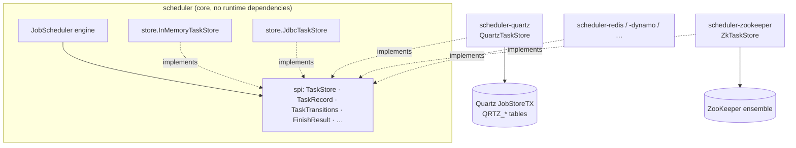

### Writing a store: checklist

1. **Pick `isShared()`.** Return `true` if more than one `JobScheduler` instance can see the same
   tasks. That turns on polling, lease reaping, the shutdown hand-over and cross-node outcomes.
2. **Store `TaskRecord` fields as they are.** Keep every field the record has. `version` is the
   fencing token: bump it on claim, settle and `reschedule`, but **not** on `withRemovalRequested()`.
3. **Make each method one atomic step**, as in [Each operation is one atomic step](#each-operation-is-one-atomic-step):
   - `insert`: check capacity and insert together.
   - `claimDue`: compare-and-set `SCHEDULED → RUNNING` on `version`. Honour the pin and job-type
     filter and `TaskRecord.SCHEDULE_ORDER`.
   - `finish`/`remove`: read the row under a lock or a CAS, call **`TaskTransitions`**, then write
     the new record and the outcome together. Delete the task if `after().state().isTerminal()`.
   - `reapExpiredLeases`: call your own `finish(id, version, LEASE_EXPIRED, …)` for each expired claim.
   - `takeOutcomes`: return and delete the submitter's outcomes in one step.
4. **Signal changes.** Call the change listeners after local writes. Remote changes are found by
   polling, or pushed sooner: ZooKeeper watches, PostgreSQL `LISTEN/NOTIFY`, a Quartz trigger.
5. **Wrap backend errors** in `TaskStoreException`. The engine logs them and retries on the next poll.
6. **Run the tests** (see [the test hierarchy](#test-hierarchy)).

Skeleton of the part every store shares: settle a run through `TaskTransitions` and persist the
result atomically.

```java
public final class MyTaskStore implements TaskStore {
    @Override public boolean isShared() { return true; }

    @Override
    public FinishResult finish(long taskId, long version, RunOutcome result, String detail,
                               long nowMillis, boolean nodeStopping) {
        return backend.atomically(tx -> {                        // a transaction, a CAS loop, a ZK multi-op…
            TaskRecord r = tx.readForUpdate(taskId);
            if (r == null || r.state() != TaskState.RUNNING || r.version() != version)
                return FinishResult.stale();                     // fenced: someone else owns this run now
            TaskTransitions.Transition t =
                    TaskTransitions.finish(r, result, detail, nowMillis, nodeStopping, isShared());
            if (t.after().state().isTerminal()) tx.deleteAndReleaseCapacity(taskId);
            else                                tx.write(t.after());
            if (t.outcome() != null) tx.appendOutcome(t.outcome());   // outbox for t.outcome().submitterNode()
            return new FinishResult(true, t.after(), t.outcome());
        });
    }

    @Override
    public RemoveResult remove(long taskId) {
        return backend.atomically(tx -> {
            TaskRecord r = tx.readForUpdate(taskId);
            if (r == null) return new RemoveResult(RemoveResult.Kind.NOT_FOUND, null, null);
            RemoveResult rr = TaskTransitions.remove(r);         // SCHEDULED → CANCELLED, BLACKLISTED → dropped, RUNNING → DEFERRED
            /* persist rr.after() and rr.outcome() exactly like finish */
            return rr;
        });
    }
    // insert, claimDue, nextDueMillis, reapExpiredLeases, reschedule, takeOutcomes, find, counts,
    // addChangeListener: see JdbcTaskStore for a complete reference implementation.
}
```

### Test hierarchy

A new store gets the whole behavioural test suite by adding two or three small subclasses:

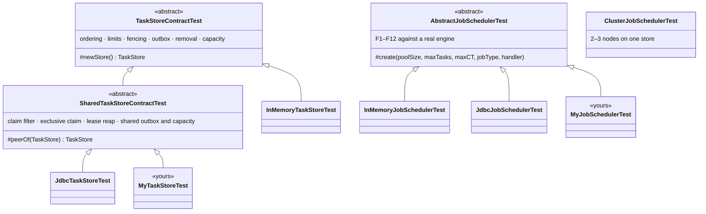

Copy `ClusterJobSchedulerTest` for the multi-node scenarios (exactly once, failover, hand-over).

### How the main backends map onto the contract

| Concept | JDBC (provided) | ZooKeeper (sketch) | Quartz bridge (sketch) |
|---|---|---|---|
| Task | Rows in `sched_task` (definition), `sched_task_payload` and `sched_task_schedule` (queue state) | Znode `/sched/tasks/<id>` holding the serialized record | Durable `JobDetail` (record in the `JobDataMap`) + one `SimpleTrigger` |
| Ids | Identity column | Sequential znode name | Our own counter (Quartz keys are strings) |
| Exclusive claim | `UPDATE … WHERE version = ?` | `setData(path, data, expectedVersion)`. The znode version is the fencing token. | Quartz fires each trigger on exactly one node (`QRTZ_LOCKS` row lock) |
| Lease | A `sched_task_lease` row, reaped by any node once `lease_until_ms` has passed | Ephemeral `/sched/claims/<id>`. It disappears with the owner's session. | `QRTZ_FIRED_TRIGGERS` + cluster check-in. Recovery re-fires the job. |
| Fencing | `version` column | Znode `version` / `stat` | `version` in the `JobDataMap`, `@PersistJobDataAfterExecution` |
| Capacity | Counter row with `val < max` | Counter znode with a versioned `setData` | Count query or counter row in the same transaction as `scheduleJob` |
| Outbox | `sched_outcome` table | `/sched/outcomes/<submitter>/<id>` children | Own table (Quartz has no result channel) |
| Change signal | Polling | Watches on `/sched/tasks` and `/sched/outcomes/<me>` | The Quartz fire itself |
| Ordering | `ORDER BY next_run_ms, priority DESC, task_id` | Sort children client-side (or bucket by due time) | Trigger `nextFireTime` + `priority` |

### Quartz in detail

Quartz is a scheduler itself, so the bridge has to settle **who decides when a task is due**. The
design below lets Quartz do clustering, durable triggers and misfire recovery, while our engine
keeps running, timing and settling the jobs. That way F1–F12 still hold.

- **Push turned into pull.** Quartz *pushes*: it calls `Job.execute` on its own thread. Our engine
  *pulls*: it calls `claimDue`. A `BridgeJob` reads the record and puts it in the adapter's
  hand-off queue. Then it fires the change listener and **blocks until our `finish` for that run**.
  `claimDue` takes records off the queue (up to `limit`, filtered by job type and pin).
  `nextDueMillis` returns `Long.MAX_VALUE`, because the Quartz fire is the wake-up.
- **The blocked Quartz thread is the lease.** While the job "executes" in Quartz, its
  `QRTZ_FIRED_TRIGGERS` row marks the claim. If the node dies, Quartz cluster recovery
  (`org.quartz.jobStore.isClustered=true`, `JobBuilder.requestRecovery(true)`) re-fires the job on
  another node with `context.isRecovering() == true`. The bridge turns that into
  `finish(id, version, LEASE_EXPIRED, …)` instead of a normal run. That's M3, and timeout counting
  and blacklisting still apply. `reapExpiredLeases` returns nothing; recovery does that job.
- **Fencing.** The bridge keeps `version` in the `JobDataMap` and marks the bridge job
  `@PersistJobDataAfterExecution @DisallowConcurrentExecution`. `finish` reloads the `JobDetail` in
  a `JobStoreTX` transaction and compares versions, so a late finish from a dead node is still stale.
- **Recurrence stays ours.** Don't map `Recurrence` to a repeating Quartz trigger: Quartz repeats
  from the *start* time and can overlap runs. Each task has a **one-shot** `SimpleTrigger`. `finish`
  computes `TaskTransitions.finish(…)`. If the result is `SCHEDULED`, it calls `rescheduleJob` with
  a new one-shot trigger at `after().nextRunMillis()`. That keeps finish-relative spacing, calendar
  months in the task's zone, and no overlap (F6).
- **Priority.** `TriggerBuilder.withPriority(priority)`. Quartz breaks ties on equal fire times by
  priority, the same as `SCHEDULE_ORDER`.
- **Remove/reschedule.** A pending task becomes `deleteJob` / `rescheduleJob`. A running task gets
  `removalRequested` in the `JobDataMap`, applied by its `finish` (I6).
- **Misfires** (Quartz fires late after downtime): use `withMisfireHandlingInstructionFireNow()`.
  This matches our "run as soon as possible if overdue" behaviour.
- **Thread counts.** Set `org.quartz.threadPool.threadCount` to at least our `poolSize`. A Quartz
  thread is parked for every run in progress.

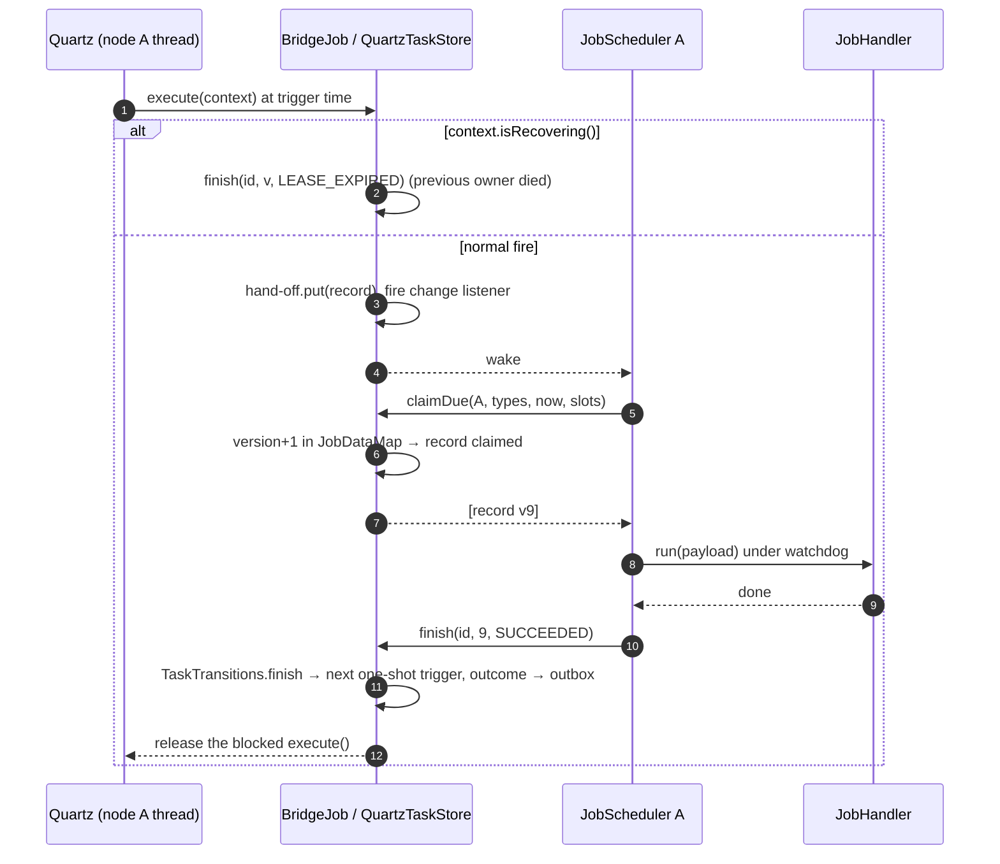

### ZooKeeper in detail

- **Layout:** `/sched/tasks/<id>` (record), `/sched/claims/<id>` (ephemeral, data = `nodeId`),
  `/sched/outcomes/<submitter>/<id>`, `/sched/live` (counter).
- **Claim:** `multi(check(task, v), setData(task, claimedRecord, v), create(claim, EPHEMERAL))`.
  The multi is atomic, so only one node wins. The znode version works as `version` for fencing.
- **Lease:** the ephemeral claim disappears when the owner's session expires. Every node watches
  `/sched/claims`. A deleted claim for a task that's still `RUNNING` is reaped through `finish(…, LEASE_EXPIRED)`.
  Keep `lease_until` in the record too, so a node that wakes up after its session is gone is fenced.
- **Signals:** watches on `/sched/tasks` and on its own outcome folder replace polling. Re-register
  each watch after it fires, as usual in ZooKeeper.
- **Scale:** ZooKeeper isn't a bulk store. Use it for up to tens of thousands of tasks and keep the
  payloads small (under about 1 MB per znode). For more, use JDBC.

### Other schedulers

- **db-scheduler, JobRunr:** both already own the polling and execution loop. Wrapping them as a
  `TaskStore` would duplicate our engine. Either use them directly instead of this library, or
  borrow their table design for a JDBC-style `TaskStore`.
- **Temporal / Cadence:** these are workflow engines. They're a poor fit for a `TaskStore`, but a
  `JobHandler` can *start* a workflow. Our scheduler then handles timing and Temporal handles execution.
- **PostgreSQL-specific store:** subclass or copy `JdbcTaskStore`. Add
  `FOR UPDATE SKIP LOCKED` to the candidate query and `LISTEN/NOTIFY` for change signals.
  **MySQL** needs `LIMIT` and `AUTO_INCREMENT` versions of two statements.

## Build and test

`scheduler` depends on the `ds` module. JUnit 5 comes from the parent pom; H2 is a test-only dependency.

```bash
JAVA_HOME=<path-to-jdk-17> mvn -pl scheduler -am test
```

81 tests, all of them run (none skipped): 20 per `AbstractJobSchedulerTest` subclass, 17 in
`JdbcTaskStoreTest`, 8 in `InMemoryTaskStoreTest`, 8 in `ClusterJobSchedulerTest`, 5 in
`TaskTransitionsTest` and 3 in `RecurrenceTest`. The abstract contract classes don't run by
themselves. Each concrete subclass runs every test it inherits.

| Test class | Store(s) | Covers |
|---|---|---|
| `RecurrenceTest` | — | Recurrence math (also with `ManualClock`), validation, overflow |
| `AbstractJobSchedulerTest` → `InMemoryJobSchedulerTest`, `JdbcJobSchedulerTest` | Both | The base requirements F1–F12, run unchanged against each store: argument validation and capacity, priority order, one-time success/failure/timeout, recurring reschedule and blacklist, remove while pending and while running, `reschedule`, graceful/default/bounded shutdown (including handles of abandoned tasks), stats invariants, named job types. The in-memory run uses the original 4-arg constructor. |
| `spi.TaskTransitionsTest` | — | The state machine as pure functions |
| `spi.TaskStoreContractTest` → `store.InMemoryTaskStoreTest` | Both | The store contract: ordering, limits, fencing, outbox, removal of each state, capacity |
| `spi.SharedTaskStoreContractTest` (extends the above) → `store.JdbcTaskStoreTest` | Shared stores | Also: claim filtering by pin and job type, exclusive claims between peers, lease reaping, outbox addressed to the submitter, store-wide capacity. JDBC only: schema idempotency and version guard, rows per table through the lifecycle (lease only while running, cascade on delete), payload limit. |
| `ClusterJobSchedulerTest` | JDBC, 2–3 nodes on one database | Exactly-once across nodes, remote failure → `JobFailedException`, pinning of `Runnable`s, job-type routing, remove from another node, cluster-wide `maxTasks`, crash → lease expiry → failover with a fenced stale finish, node shutdown handing over recurring tasks |
