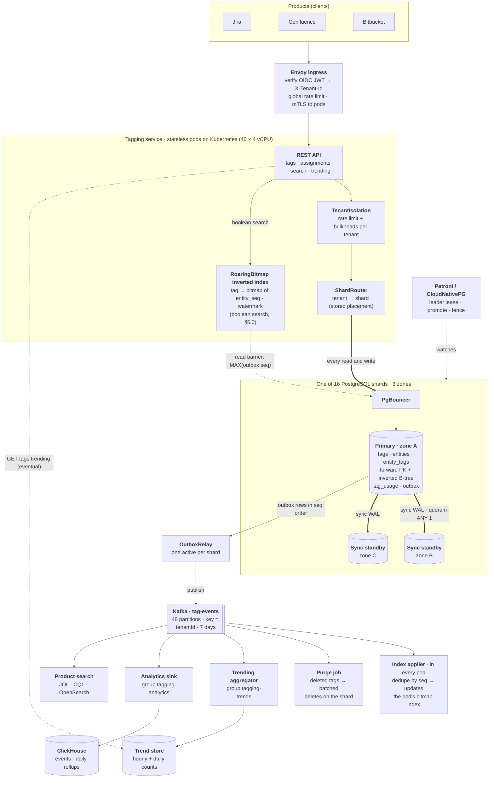
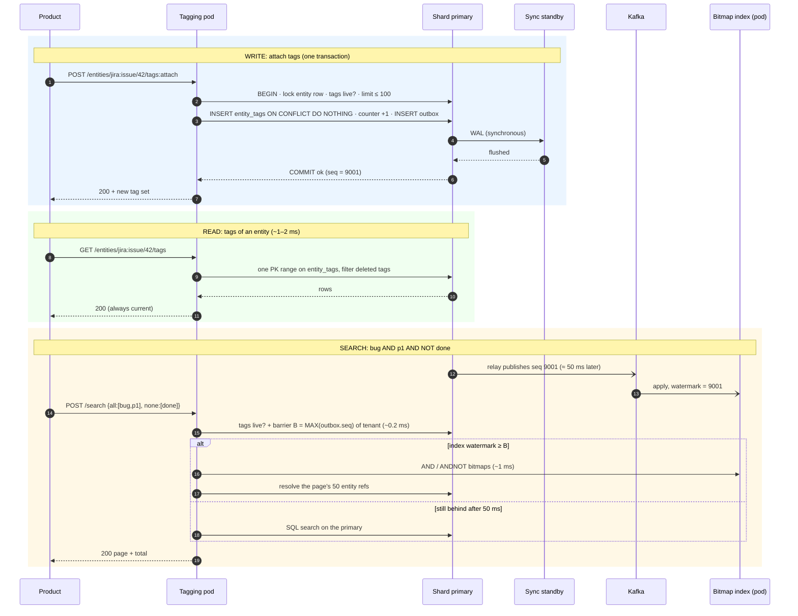
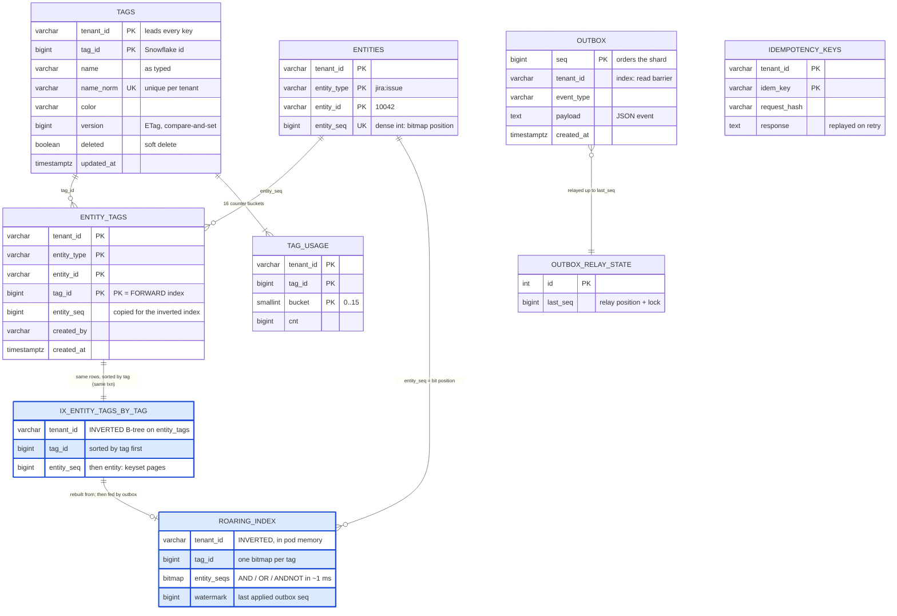
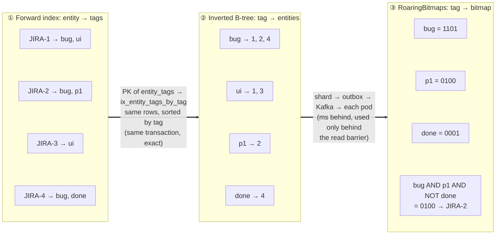
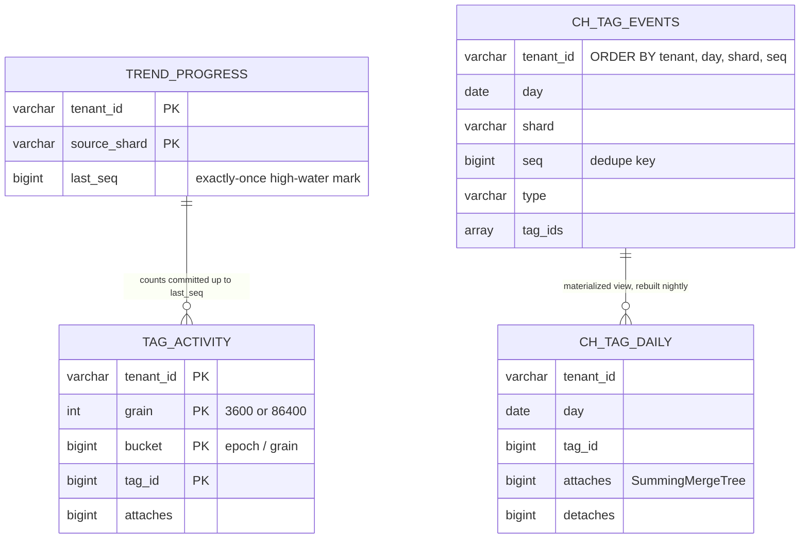

# Tagging Service: 60-minute system design interview

A presentation-ready version of the design, in the order you'd present it. The full reasoning,
proofs and code are in [README.md](README.md) and [docs/DESIGN-DETAILED.md](docs/DESIGN-DETAILED.md);
this page is the version you rehearse.

**Contents**

1. [Executive overview](#1-executive-overview)
2. [Requirements](#2-requirements)
3. [Sizing estimates](#3-sizing-estimates)
4. [High-level architecture](#4-high-level-architecture)
5. [DB model and the inverted index](#5-db-model-and-the-inverted-index)
6. [Technology choices and why](#6-technology-choices-and-why)
7. [Future enhancements](#7-future-enhancements)
8. [Review: the Medium article vs this design](#8-review-the-medium-article-vs-this-design)

---

## 1. Executive overview

**What it is.** A shared internal service that lets every product (Jira issues, Confluence pages,
Bitbucket pull requests) **create tags, attach them to entities, and search by them**. Products own
their entities; we store only references `(entity_type, entity_id)`.

**The scale.** 300k tenants, 4 B tagged entities, 20 B assignments, 300k reads/s and 30k writes/s at
peak. A few whale tenants hold 50M+ entities each.

**The hard requirement.** **Strong consistency for every read and write by default**: once a write
is acknowledged, every reader on every pod sees it. The service must also run on **AWS and GCP**,
and move to any other cloud, so nothing cloud-proprietary is allowed.

**The design in three decisions.**

| # | Decision | Why it matters |
|---|---|---|
| 1 | **Shard PostgreSQL by tenant** (16 shards, whales pinned to their own) | Every operation is one ACID transaction on one shard. No 2PC, no cross-shard query |
| 2 | **Every read and write goes to the shard primary**, which commits synchronously to a standby in another zone | Reads are linearizable without a cache-invalidation protocol. It's affordable: each primary carries only ~19k point reads/s (~25% of its capacity) |
| 3 | **Boolean search uses an in-memory RoaringBitmap inverted index, but only after a read barrier proves it's current** | `bug AND p1 AND NOT done` over million-entity tags takes ~1 ms instead of seconds, without weakening the guarantee |

Changes leave the database through a **transactional outbox** → Kafka. That stream feeds the
search index, the purge job, product search, **trending tags** and the **analytics database**. Only
the last two are allowed to lag, and their APIs say so.

> **The 30-second pitch:** "I shard Postgres by tenant so every write is one transaction on one
> shard. Every read goes to the primary, so reads are strong for free, and sharding keeps each
> primary at a quarter of its capacity. Boolean search is the one thing SQL is slow at, so each pod
> keeps bitmap posting lists fed from an outbox through Kafka, and a search uses them only after a
> 0.2 ms barrier proves they include every acknowledged write. Per-tenant quotas and dedicated
> shards for whales stop tenants hurting each other."

---

## 2. Requirements

### 2.1 Functional

| Area | Requirement |
|---|---|
| Tags | Create, rename, recolor, soft-delete. **Names unique per tenant**, ignoring case and spacing (`Bug`, `bug ` and `BUG` are one tag) |
| Assignments | Attach (by id, or by name with auto-create), detach, replace the whole set, **bulk attach** (≤ 500 entities × 50 tags) |
| Reads | Tags of an entity (the hot path), entities of a tag (paged), autocomplete by prefix, usage counts |
| Search | Boolean: `all` / `any` / `none` of tags, plus an entity-type filter, paged |
| Events | One event per change, in order per tenant, for downstream consumers |
| Trending | "Top tags in the last 24 h / 7 d" for a popular-tags widget (explicitly eventual) |
| Analytics | Adoption, unused tags, usage per product over months (offline, minutes behind) |

**Out of scope, out loud:** entity permissions (the product checks them before calling us),
full-text search of entity content (product search consumes our events), tag hierarchies and
approval workflows (see [§7](#7-future-enhancements)).

### 2.2 Non-functional

| Property | Target | What it forces |
|---|---|---|
| **Consistency** | Linearizable reads and writes per tenant; reads never go backwards; an acknowledged write is never lost | No stale copy on the read path; synchronous standby; fenced failover |
| Latency | p99 < 20 ms reads, < 50 ms writes | Every read is one index range on a warm primary |
| Availability | 99.95%; a failure only hits that shard's tenants | Independent shards; failover < 60 s |
| Multi-tenancy | 300k tenants, no noisy neighbours | Tenant from the verified JWT; per-tenant rate limits and bulkheads |
| Limits | ≤ 100 tags per entity, ≤ 10k tags per tenant | Bounded rows per transaction and per index |
| Portability | AWS, GCP, on-prem | Open protocols only: PostgreSQL, Kafka, Kubernetes |
| Security | OAuth2/OIDC JWT, TLS everywhere, encryption at rest, audit trail | Ingress verifies tokens; pods accept only ingress traffic (mTLS) |

---

## 3. Sizing estimates

### 3.1 Data

| Input | Value | Note |
|---|---|---|
| Tenants | 300k | whales have 50M+ entities |
| Tagged entities | 4 B | ~13k per tenant on average |
| Assignments | **20 B** | ~5 tags per entity |
| Tags | 300M | ~1k per tenant, cap 10k |

### 3.2 Traffic

| Operation | Peak QPS | Note |
|---|---|---|
| Tags of an entity | 285k | Rendered on every issue/page view: 95% of reads |
| Boolean search | 5k | Filter UIs, JQL `labels = x` |
| Other reads | 10k | Autocomplete, entities of a tag, get tag |
| **All reads** | **300k** | ~100k average, ~8.6 B/day |
| **Writes** | **30k** | ~5k average; bulk imports reach 100k assignments/s for one whale, 500 per transaction |
| Events | 30k/s × ~400 B = **12 MB/s** | Kafka input |

### 3.3 Storage

| Table | Size | How |
|---|---|---|
| `entity_tags` | ~4.5 TB | 20 B rows × (~110 B row + ~115 B for its two indexes) |
| `entities` | ~0.8 TB | 4 B rows |
| `tags`, `tag_usage` | ~0.5 TB | |
| `outbox` | ~0.2 TB | 24 h retention; Kafka keeps 7 days |
| **Total** | **≈ 6 TB** | × 3 copies (primary + 2 standbys) ≈ 18 TB provisioned |

### 3.4 What that buys

| Resource | Sizing | Utilisation at peak |
|---|---|---|
| **Shards** | **16** × (32 vCPU, 256 GB RAM), ~375 GB each | Reads ~19k/s of ~80–100k (≈ 25%); writes ~1.9k tx/s of ~5k (≈ 40%); hot set ~100 GB fits in RAM |
| Pods | 40 × 4 vCPU, 8 GB heap | Reads are I/O-bound: ~2.5k/s per vCPU |
| Bitmap index | ~130 KB typical tenant, ~10 MB at 1M entities, 100–300 MB for a whale | 1–3 GB per pod with LRU; whales on dedicated index pods |
| Kafka | 6 brokers, 48 partitions, RF 3, 7 d | 12 MB/s in, ~480 MB/s out (every pod reads for its index) |
| Trend store | ~200M rows, ~15 GB | ~60 small transactions/s |
| Analytics | ~17 GB/day compressed, ~6 TB/year | ClickHouse, 3 shards × 2 replicas |

**The sentences to say:**
- "6 TB and 30k write tx/s are beyond one primary (~1 TB, ~5k tx/s), so I shard by tenant: 16 shards with 2× headroom."
- "19k reads/s per shard is a quarter of one primary, so I don't need a cache or replicas to serve 300k reads/s. That's what makes strong reads cheap."
- "An AND over 5M- and 2M-entity tags reads every posting in SQL, which takes seconds. That's why I need bitmaps."

---

## 4. High-level architecture

### 4.1 The whole system



**How to read it.** **Thick arrows** are the strong path: every read and write goes to the shard
primary, which commits to a standby in another zone before acknowledging. **Thin arrows** are the
event path: the outbox row commits with the data, the relay publishes it in order, and every
consumer below Kafka is derived and can be rebuilt. **Dotted arrows** are the search read barrier
and the one explicitly eventual read (trending).

### 4.2 The three request paths



### 4.3 Why each box, and what we left out

| Component | Why it's there | Rejected alternative |
|---|---|---|
| Envoy ingress | Tenant identity must come from a verified token, and global quotas need one place | Trusting a client header: tenants leak |
| Stateless pods | Any pod serves any tenant; scale horizontally | Sticky tenant → pod routing complicates failover |
| PgBouncer | 40 pods × 20 connections = 800 per primary; Postgres wants ~200 | Raising `max_connections` costs memory |
| Shard primary | The only copy requests read, so it's always current | Reading copies needs a freshness proof per read |
| 2 sync standbys | An acknowledged write survives losing a zone (RPO 0) | Async standby: failover can lose acknowledged writes |
| Outbox + relay | The event commits *with* the data: no dual write, no lost event | "Commit, then publish": a crash in between loses the event |
| Kafka | Per-tenant order, fan-out, replay to rebuild projections | Every pod polling the DB for changes |
| Bitmap index | Boolean search in ~1 ms | SQL takes seconds on big tags; OpenSearch has ~1 s lag and can't prove freshness |
| **No cache on the read path** | A cache is a second copy; making it strong needs synchronous invalidation that Redis can lose on failover. The primary is only 25% busy | Redis with TTL + invalidation events: fast but stale |
| **No read replicas** | Async replicas lag, so reads would be stale | If needed later, read standbys behind an LSN barrier ([§7](#7-future-enhancements)) |

---

## 5. DB model and the inverted index

### 5.1 Access patterns first

Derive tables from the queries, not the nouns. Each pattern must be **one index range scan**.

| # | Access pattern | Peak rate | Answered by |
|---|---|---|---|
| Q1 | Tags of entity X | 285k/s | `entity_tags` PK: the **forward index** |
| Q2 | Entities with tag T, paged | high, on huge tags | `ix_entity_tags_by_tag (tenant_id, tag_id, entity_seq)`: the **inverted index** |
| Q3 | `bug AND p1 AND NOT done` | 5k/s | **RoaringBitmaps** built from Q2's postings; SQL as fallback |
| Q4 | Tag by name (uniqueness) | every write by name | unique `(tenant_id, name_norm)` |
| Q5 | Autocomplete `bu…` | per keystroke | same index, `LIKE 'bu%'` with `COLLATE "C"` |
| Q6 | Usage count | tag lists | `tag_usage`: sum of ≤ 16 bucket rows |
| Q7 | Changes after seq N; the read barrier | continuous | `outbox` PK `seq`; index `(tenant_id, seq)` |

### 5.2 The shard schema, with the inverted index in it

**This is where the inverted index enters the DB model.** `entity_tags` stores each assignment once,
and its primary key is sorted by **entity**: that's the forward index and it answers Q1. Q2 and Q3
ask by **tag**, so the model adds two inverted indexes over the same rows (blue in the diagram):

- **`IX_ENTITY_TAGS_BY_TAG`**, a B-tree on `entity_tags (tenant_id, tag_id, entity_seq)` in the shard. It's updated in the same transaction, so it's exact.
- **`ROARING_INDEX`**, one bitmap of `entity_seq` per (tenant, tag) in each pod's memory. It's fed from the outbox and trusted only behind the read barrier.

`ENTITIES.entity_seq` exists *because of* the inverted index: bitmaps need a dense integer per entity.
The reasoning is in [§5.3](#53-why-and-where-we-introduce-an-inverted-index).



```sql
CREATE TABLE entity_tags (
  tenant_id, entity_type, entity_id, tag_id, entity_seq, created_by, created_at,
  PRIMARY KEY (tenant_id, entity_type, entity_id, tag_id)          -- Q1: forward index
) PARTITION BY HASH (tenant_id);                                     -- 16 partitions per shard
CREATE INDEX ix_entity_tags_by_tag
  ON entity_tags (tenant_id, tag_id, entity_seq);                    -- Q2/Q3: inverted index
CREATE UNIQUE INDEX ux_tags_name ON tags (tenant_id, name_norm);     -- Q4/Q5
CREATE INDEX ix_outbox_tenant_seq ON outbox (tenant_id, seq);        -- Q7: read barrier
```

| Choice | Why |
|---|---|
| `tenant_id` leads every key | A tenant's rows are contiguous, and it's the shard key |
| Assignments hold `tag_id`, not the name | Renaming a 10M-entity tag updates one row |
| `entities` row per entity | It's the **lock** that makes "≤ 100 tags" exact, and it hands out the dense `entity_seq` that bitmaps need |
| `version` on tags | `PATCH` with `If-Match`: 412 instead of a lost update |
| 16 usage buckets | A popular tag would otherwise be the hottest row in the shard |
| Soft delete + batched purge | Deleting a tag used 10M times is instant; rows are purged in batches of 1000 |
| Outbox in the same database | The event commits with the data, and `seq` orders the shard's history |
| No foreign keys | They'd lock the tag row on every attach; the transaction checks liveness instead |

### 5.3 Why and where we introduce an inverted index

**When to introduce it in the talk:** right after the access-pattern table, at Q2. Say: "Q1 is
answered by the primary key. Q2 and Q3 ask the opposite direction, and nothing so far answers them,
so here is where I introduce an inverted index." Don't introduce it earlier (in the architecture it's
just "search"), and don't wait to be asked: it's the most important modelling decision after the
shard key.

**Why: the forward index answers only one direction.** Assignments are stored as `entity_tags`,
keyed `(tenant, entity, tag)`. That key is sorted **by entity**, so:

| Question | Direction | Rate | With only the forward PK |
|---|---|---|---|
| "Which tags does `JIRA-42` have?" (Q1) | entity → tags | 285k/s | **One short range**: fine |
| "Which issues have `bug`?" (Q2) | tag → entities | high, on huge tags | Rows aren't sorted by tag: **scan every assignment of the tenant**, 150M rows for a whale, tens of seconds |
| "`bug AND p1 AND NOT done`" (Q3) | tags → entities, combined | 5k/s | Three full scans, then a join |

So the requirement "entities of a tag, paged" and "boolean search" **cannot be served at all**
without storing the same pairs sorted the other way: **tag → sorted list of entities**. That is an
inverted index, exactly what a search engine keeps (term → sorted doc ids).

**Why two inverted indexes, not one.** Fixing direction isn't enough for boolean search:

1. **Introduce it in the shard first: a B-tree `(tenant_id, tag_id, entity_seq)` on `entity_tags`.**
   - *Why:* it makes Q2 one range read in entity order, so keyset pages need no sort and no `OFFSET`.
   - *Why there:* it's maintained **in the same transaction** as the row, so it's exact and strongly consistent, and it costs one extra index (~45 B per assignment).
2. **Then in each pod: RoaringBitmaps per (tenant, tag).**
   - *Why:* `bug`(5M) AND `p1`(2M) AND NOT `done`(3M) must intersect whole lists, not read one page. The first 50 results of `bug AND NOT done` may need millions of `bug` postings that turn out to be `done`. Over the B-tree that's ~10M postings and ~450 MB of index pages: **seconds**, on the primary that serves every strong read. As bitmaps it's 2–30 MB of compressed sets combined 64 bits per instruction: **~1 ms**, with the `total` count for free.
   - *Why in the pod, not the database:* set algebra is CPU work that would compete with the strong reads on the primary, and pods scale horizontally.
   - *Why it's still strong:* it's a copy fed from the outbox through Kafka, so a search uses it **only if** its watermark ≥ a read barrier (`MAX(outbox.seq)` of the tenant, ~0.2 ms on the primary). Otherwise the B-tree answers.
3. **Give every entity a dense integer `entity_seq`.** *Why:* bitmaps index integers, not strings like `jira:issue/10042`, and dense ids compress well. The same integer is the cursor for every paged list.

**Where each piece lives:**

| Tier | Lives in | Serves | Updated | Consistency |
|---|---|---|---|---|
| ① Forward index (PK of `entity_tags`) | Shard primary | Q1 tags of an entity | Write transaction | Exact |
| ② Inverted B-tree `ix_entity_tags_by_tag` | Shard primary, same table | Q2 entities of a tag; Q3 SQL fallback; source for rebuilding ③ | Write transaction | Exact |
| ③ RoaringBitmap index | Memory of every pod (whales on dedicated index pods) | Q3 boolean search | Outbox → Kafka, ms behind | Used only behind the read barrier |



| | ① Forward PK | ② Inverted B-tree | ③ RoaringBitmaps |
|---|---|---|---|
| Answers | Tags of an entity (Q1) | Entities of one tag, keyset pages (Q2) | Boolean `all`/`any`/`none` (Q3) |
| Updated | In the write transaction | In the write transaction | From outbox events via Kafka |
| Consistency | Exact | Exact | Used only if watermark ≥ barrier |
| Cost of `bug`(5M) AND `p1`(2M) AND NOT `done`(3M) | n/a | reads ~10M postings, ~450 MB: **seconds** | 2–30 MB of bitmaps: **~1 ms**, `total` count for free |
| Rebuilt from | n/a | n/a | snapshot scan of ② + the event stream |
| Without it | n/a | full tenant scan per lookup | seconds per search, load on the primary |

**Alternatives, and why not:**

- **No inverted index:** full tenant scan per query.
- **B-tree only, boolean in SQL:** seconds on big tags, and the load lands on the primary.
- **Postgres GIN over `tags[]`:** every attach rewrites the entity row and the GIN entry, and an AND still reads whole lists from disk.
- **OpenSearch `tags: keyword[]`:** ~1 s refresh lag and no exact watermark, so it can't prove it's current. It is the right tool for product full-text search downstream.

### 5.4 Derived stores outside the shards



- **Trend store** (built): counts attaches per hour and per day; the count and `last_seq` commit in
  one transaction, so redelivered events are skipped (exactly once). `GET /v1/tags:trending` returns
  `consistency: EVENTUAL`.
- **Analytics** (designed): ClickHouse, raw events deduplicated by `(tenant, shard, seq)`, daily
  rollups, a tenant row policy, 25-month TTL.

---

## 6. Technology choices and why

Rule: **open source with an open wire protocol**, run self-managed on Kubernetes or as a
protocol-compatible managed service. The code uses only JDBC/PostgreSQL SQL and the Kafka client.

| Need | Choice | Why | Rejected | Runs on AWS / GCP / anywhere |
|---|---|---|---|---|
| Source of truth | **PostgreSQL 15+**, sharded by tenant | ACID transactions, unique constraints, partial indexes, synchronous replication; one tenant per shard makes every write local | Cassandra/ScyllaDB (no multi-row transactions, LWT for uniqueness); DynamoDB / Spanner / Bigtable (cloud-proprietary) | RDS / Cloud SQL / CloudNativePG |
| HA and failover | **Patroni or CloudNativePG**, sync quorum `ANY 1 (b, c)` | Leader lease and fencing: no split brain, RPO 0, RTO < 60 s | Async replicas (lose acked writes) | Same on any Kubernetes |
| Connection pooling | **PgBouncer** | 800 client connections → ~200 server connections | Larger `max_connections` | Sidecar or Deployment |
| Event stream | **Apache Kafka** + transactional outbox | Per-tenant order (key = tenant), replay, many consumer groups | SQS/SNS, Pub/Sub (proprietary); dual write (loses events) | MSK / Confluent / Strimzi |
| Boolean search | **RoaringBitmap** (Java, in-process) | Compressed set algebra in ~1 ms; exact watermark; memory bounded per tenant | SQL joins (seconds); OpenSearch (lag, can't prove freshness); GIN (write amplification) | In the pod |
| Product full-text search | **OpenSearch** (downstream of Kafka) | Text + facets for product UIs, where ~1 s lag is fine | Elasticsearch licence; cloud search services | Amazon OpenSearch / self-managed |
| Trending | **PostgreSQL** (own small database) | Exactly-once counts in one transaction; a range scan answers "top 24 h" | Flink + Elasticsearch (a cluster for a `GROUP BY`); Redis ZSETs (no exactly-once) | Any PostgreSQL |
| Analytics | **ClickHouse** (+ optional Iceberg on object storage) | Columnar, ~10× compression, billions of rows/s, SQL | Querying the primaries; BigQuery / Redshift (proprietary) | Altinity operator / ClickHouse Cloud |
| Service | **Java 17 + Spring Boot 3**, JDBC, Flyway, Resilience4j, Micrometer | Mature, explicit SQL, per-tenant rate limiters and bulkheads, Prometheus metrics | ORM (hides locking order and SQL) | Container image |
| Compute and edge | **Kubernetes + Envoy**, OIDC JWT | Same deployment on EKS, GKE or on-prem; token verified once at the edge | Cloud API gateways | EKS / GKE / any |
| Observability | **OpenTelemetry, Prometheus, Grafana** | Vendor-neutral; metrics tagged by tier, never by tenant id | Cloud-native monitoring only | Managed or self-hosted |

**Two technology questions you'll get:**

- *"Why not Redis in front?"* The hot read is a point lookup on a warm primary that's 25% busy. A
  cache saves hardware but is a second copy. Making it strong needs synchronous invalidation before
  commit, and Redis loses writes on failover. Correctness costs more than the hardware saved.
- *"Why not Debezium CDC instead of an outbox relay?"* Equivalent guarantee. The outbox gives us a
  business event (not a row diff), a per-shard `seq` for the read barrier, and one less cluster to
  run. Debezium reading the outbox table is a drop-in swap.

---

## 7. Future enhancements

Ordered roughly by when you'd need them.

| # | Enhancement | Trigger | How |
|---|---|---|---|
| 1 | **Audit log** | Compliance asks "who removed this tag?" | Already in the outbox stream: persist it in ClickHouse with actor, before/after, 25-month TTL; expose `GET /v1/audit` |
| 2 | **Tag categories and hierarchy** (`priority/p1`) | Taxonomy requests | `tag_categories (tenant_id, category_id, parent_id)` + `tags.category_id`; search "any tag under a category" expands to an OR of bitmaps |
| 3 | **Tag governance**: approval workflow, locked tags, merge and synonyms | Admins fighting `bug` / `bugs` / `defect` | `tags.status (ACTIVE, PENDING, INACTIVE)`; merge = re-point assignments in batches + a redirect row; synonyms resolved at attach by name |
| 4 | **Read standbys behind an LSN barrier** | One whale's reads exceed one primary (~80k/s) | Fetch `pg_current_wal_lsn()` once per ~1 ms batch; a standby serves only once replay LSN ≥ it. 3× read capacity, still linearizable |
| 5 | **Relay latency**: `LISTEN/NOTIFY` wake-up | Searches of tenants that write constantly wait on the barrier | Relay wakes on commit instead of a 50 ms poll |
| 6 | **Dedicated index pods for whales** | Whale bitmaps (100–300 MB) evict others | Route `/v1/search` for those tenants to a separate Deployment |
| 7 | **Smarter trending** | `rising` favours big tags | Smoothed ratio `(cnt + α) / (prev + α)`, per-entity-type key, Flink if sliding windows are needed |
| 8 | **ML tag suggestions** | Inconsistent tagging | Co-occurrence from analytics + entity text embeddings; suggest at attach time, never auto-apply |
| 9 | **Cross-cloud DR** (warm standby on the other cloud) | Region loss | Postgres logical replication + Kafka MirrorMaker 2; RPO = replication lag, stated |
| 10 | **Cassandra/ScyllaDB tier** for the largest tenants | Writes exceed the biggest primary | The documented CQL key design, with `tag#bucket` partitions for hot tags |
| 11 | **Active-active per region for data residency** | EU/US residency | Cells per region, tenant → cell routed at the edge; tenants never span regions |
| 12 | **Tag-level permissions** | "Only admins can apply `security`" | Policy per tag checked in the attach transaction; the product still owns entity permissions |

---

## 8. Review: the Medium article vs this design

Source: [Designing an Enterprise-Grade Tag Management System for JIRA & Confluence](https://medium.com/@rahulgargblog/designing-an-enterprise-grade-tag-management-system-for-jira-confluence-2f3b5eef6a01).

**What the article proposes.** Microservices (Tag, Association, Jira and Confluence integration,
Search, Reporting, Cache Listener, UI) behind an API gateway. PostgreSQL holds `Tag`, `TagCategory`
(with a parent), `TagAssociation` and `AuditLog` (JSONB). Redis caches tags and entity → tags.
Elasticsearch holds denormalized entity documents for search. Kafka (ideally Debezium CDC)
propagates changes; Redis is kept fresh by direct invalidation, invalidation events, TTLs and
reconciliation jobs. Targets: < 200 ms, 99.9%, "millions of entities, billions of associations".

| Topic | Article | This design | Verdict |
|---|---|---|---|
| Consistency | Eventual: cache + Elasticsearch, TTLs and reconciliation as a safety net | **Strong by default**: primary reads; bitmaps only behind a read barrier | Ours meets the stated strong requirement; theirs can serve stale tags after a write |
| Multi-tenancy | Not addressed; names globally unique | `tenant_id` leads every key; names unique per tenant; per-tenant quotas | Required for 300k tenants |
| Scale | No QPS or storage numbers; one database | 300k/30k QPS, 6 TB, 16 tenant shards | Ours is sized; theirs would hit one primary's ceiling |
| Ids | UUID tags and associations, FK to category | Snowflake `tag_id`; composite natural PK; dense `entity_seq`; no FKs | Smaller indexes, no hot FK locks, bitmap-friendly ids |
| Inverted index | Implicit (Elasticsearch `tags` array) | Explicit three tiers: forward PK, inverted B-tree, RoaringBitmaps | Ours does boolean search exactly and in ~1 ms |
| Events | Kafka, Debezium CDC preferred | Transactional outbox → Kafka (Debezium-compatible) | Same guarantee; outbox adds the barrier `seq` |
| Latency / availability | < 200 ms, 99.9% | p99 < 20 ms reads, 99.95%, RPO 0 | Stricter |
| Categories, approval, audit, RBAC, UI | In scope | Future enhancements 1–3, 12 | **Adopt**: good product features we deferred |
| Permission check | Integration service calls Jira/Confluence to verify edit rights | The product checks before calling us | Both valid; theirs costs an extra call per write |
| Portability | Mentions AWS API Gateway | Open protocols only, AWS and GCP | Required by our constraint |

**Worth taking from the article:** the audit log as a first-class feature, tag categories, the
`status` lifecycle (active / inactive / pending approval), reconciliation jobs as a backstop for
derived stores, and a reporting API.
