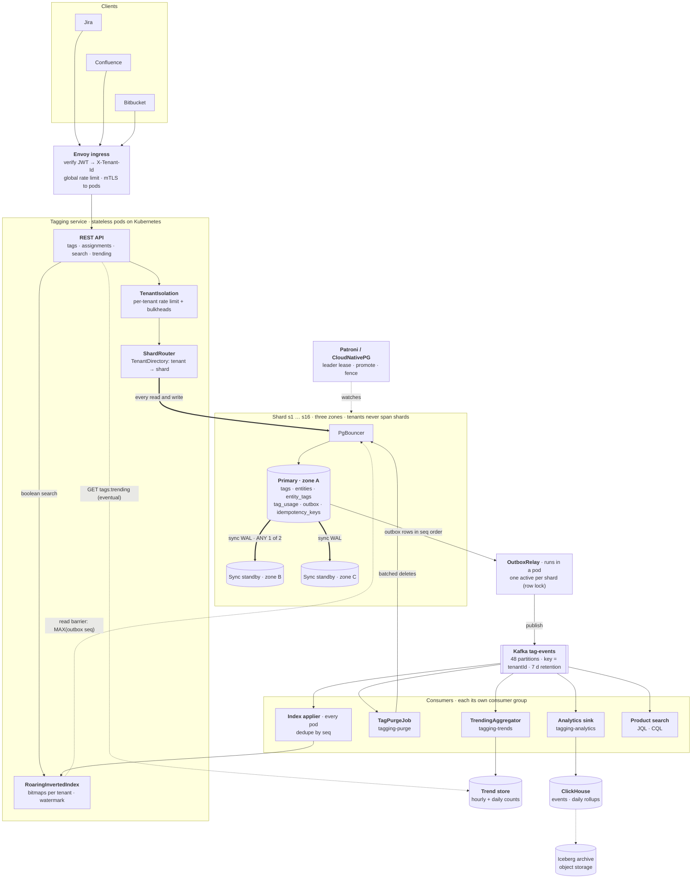
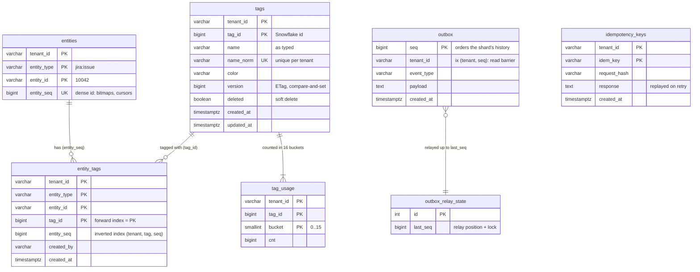
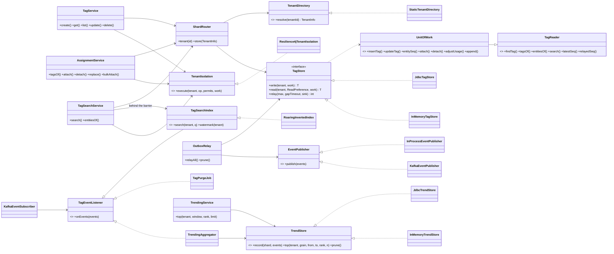
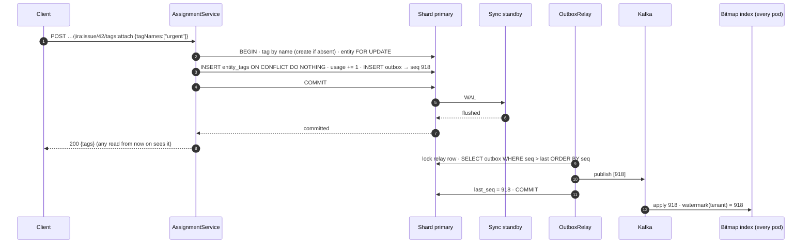
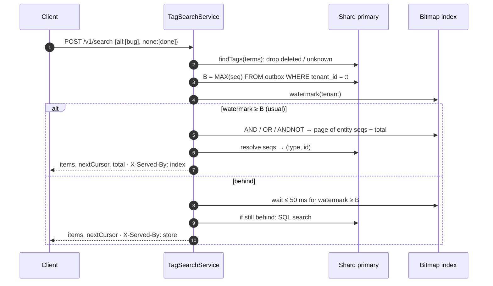
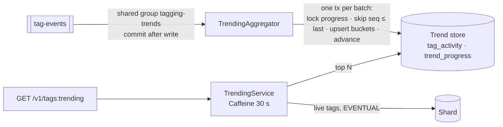
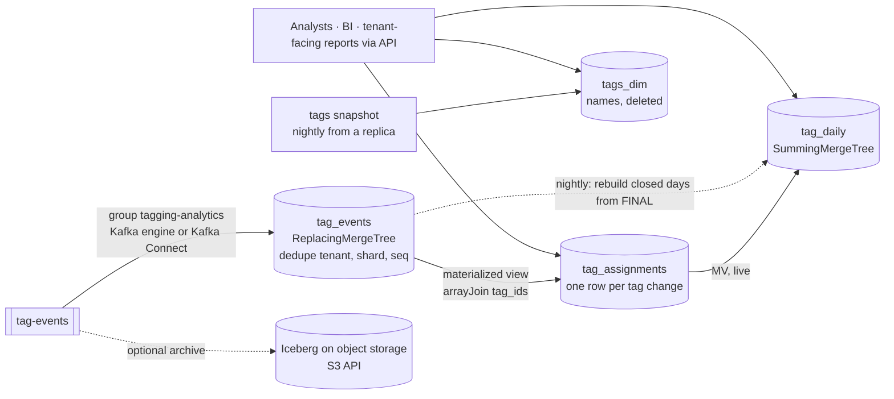

# Tagging Service: multi-tenant, strongly consistent (HLD + LLD)

An internal microservice that lets every product (Jira issues, Confluence pages, Bitbucket pull
requests) **attach, manage and search tags** on its entities. It serves **300k tenants**, whales with
50M+ entities, **300k reads/s and 30k writes/s** at peak, and gives **strong consistency on every
read and write by default**. It uses only open technology (PostgreSQL, Kafka, Kubernetes), so the
same build runs on **AWS, GCP or on-prem**.

Three decisions carry the whole design:

1. **Shard by tenant.** A tenant lives on exactly one PostgreSQL shard, so every operation is a
   single-shard ACID transaction. There is no 2PC and no cross-shard query, ever.
2. **Every request reads and writes the shard primary.** No cache, replica or projection sits on
   the default path, so reads are linearizable by construction. Performance comes from sharding
   (each primary carries ~19k reads/s) and from queries that are one index range, served from RAM.
3. **The one derived copy we do read, the search index, must prove it is current first.** A strong
   search takes a read barrier on the primary (~0.2 ms) and uses the in-memory bitmap index only
   once the index has caught up to it. Otherwise SQL on the primary answers.

**How to use this document**

- **Part 1, the interview presentation**: the talk, in order. Each step gives what to draw, what
  to say, and *why*. Rehearse this part.
- **Part 2, the reference**: the real implementation (classes, flows, a codable core, API, SPI,
  tests). Use it for follow-up questions and the coding round.
- **[INTERVIEW.md](INTERVIEW.md)**: the 60-minute version on one page (overview, requirements,
  sizing, large architecture and DB/inverted-index diagrams, technology choices, future work) and a
  review against the Medium enterprise tag-management article.
- **[docs/DESIGN-DETAILED.md](docs/DESIGN-DETAILED.md)**: full DDL, capacity math, proofs, failure
  modes, tenant moves, runbook, security, observability.

**Contents**

- [Part 1: The interview presentation](#part-1-the-interview-presentation)
  - [Flow](#flow) · [The 30-second pitch](#the-30-second-pitch)
  - [1. Requirements and scale](#1-requirements-and-scale)
  - [2. API and entities](#2-api-and-entities)
  - [3. High-level architecture](#3-high-level-architecture)
  - [4. Data model and the inverted index](#4-data-model-and-the-inverted-index)
    - [4.1 Why we need an inverted index](#41-why-we-need-an-inverted-index)
  - [5. Strong consistency for writes and reads](#5-strong-consistency-for-writes-and-reads)
  - [6. Sharding and scaling out](#6-sharding-and-scaling-out)
  - [7. Multi-tenancy and failures](#7-multi-tenancy-and-failures)
  - [8. Trade-offs and wrap-up](#8-trade-offs-and-wrap-up)
  - [Likely questions](#likely-questions) · [Pitfalls](#pitfalls-that-cost-points) · [Cheat sheet](#one-screen-cheat-sheet)
- [Part 2: Reference](#part-2-reference)
  - [9. Built vs designed](#9-built-vs-designed) · [10. Classes and packages](#10-classes-and-packages) ·
    [11. Key flows](#11-key-flows) · [12. The coding round](#12-the-coding-round)
  - [13. Inverted index internals](#13-inverted-index-internals) · [14. API reference](#14-api-reference) ·
    [15. Opt-in weaker reads](#15-opt-in-weaker-reads)
  - [16. Trending tags](#16-trending-tags) · [17. Analytics database](#17-analytics-database)
  - [18. Relational vs NoSQL](#18-relational-vs-nosql) · [19. Cloud portability](#19-cloud-portability) ·
    [20. Provider SPI](#20-provider-spi) · [21. Build and test](#21-build-and-test)

---

# Part 1: The interview presentation

## Flow

Present in this order; each step builds on the one before.

1. **[Requirements and scale](#1-requirements-and-scale)**: scope the problem and do the numbers. They drive every later choice.
2. **[API and entities](#2-api-and-entities)**: references not copies, set semantics, ids not names.
3. **[Architecture](#3-high-level-architecture)**: draw the diagram and justify every box, and every box you left out.
4. **[Data model](#4-data-model-and-the-inverted-index)**: access patterns → tables and keys, then [why an inverted index](#41-why-we-need-an-inverted-index).
5. **[Strong consistency](#5-strong-consistency-for-writes-and-reads)**: define it, achieve it, prove it, price it.
6. **[Sharding](#6-sharding-and-scaling-out)**: how it scales and where it breaks.
7. **[Tenancy and failures](#7-multi-tenancy-and-failures)**: no tenant hurts another; failover keeps the guarantee.
8. **[Trade-offs](#8-trade-offs-and-wrap-up)**: what you gave up.

Steps 3–5 are the core of the talk. **If asked to code**, write the core in
[§12](#12-the-coding-round): attach as one transaction, the outbox, bitmap search behind a barrier.

## The 30-second pitch

> "A tag service owns three things: tag definitions, entity-to-tag assignments, and search over
> them. I shard PostgreSQL by **tenant**, so every write is one ACID transaction on one shard. I make
> consistency **strong by default** in the simplest way possible: every read and write goes to the
> shard primary, which commits synchronously to a standby in another zone. No cache or replica can
> serve stale data because none is on the request path. That stays fast because sharding gives each
> primary only ~19k point reads a second, each one index range in RAM. Boolean search over huge tags
> is the one thing SQL is slow at, so each pod keeps an **inverted index of RoaringBitmaps** fed from
> a transactional outbox through Kafka. A search uses it only after a ~0.2 ms read barrier on the
> primary proves the index already holds every acknowledged write. Per-tenant quotas and dedicated
> shards for whales keep tenants from hurting each other."

## 1. Requirements and scale

**Functional.**

- Tags: create, rename, recolor, soft-delete. Names are unique per tenant, ignoring case and spacing.
- Assignments: attach by id or by name (auto-create), detach, replace the set, bulk attach.
- Reads: tags of an entity, entities of a tag (paged), and boolean search (`all` / `any` / `none` plus an entity-type filter). Also autocomplete and usage counts.
- Events for every change, for downstream consumers (product search, analytics).
- Trending tags ("top tags in the last 24 h / 7 d") for a popular-tags widget. This one may be **eventual**, and the API says so.

**Non-functional.** Ask, then state the assumption:

| Question | Assumption | Consequence |
|---|---|---|
| Consistency? | **Strong for reads and writes.** A read that starts after a write was acknowledged must see it, from any pod and any client. Two reads never go backwards. An acknowledged write is never lost | No stale copies on the read path; synchronous standby; fenced failover |
| Latency? | p99 < 20 ms for reads, < 50 ms for writes | Every read must be one index range on a warm primary |
| Availability? | 99.95%, a failure hits only its own shard's tenants | Shards are independent; failover in under a minute |
| Tenancy? | 300k tenants, a few whales, no noisy neighbours | Shard by tenant; per-tenant quotas |
| Ownership? | Products own entities; we store **references** `(type, id)` only | No entity sync, no cross-service transactions |
| Limits? | ≤ 100 tags per entity, ≤ 10k tags per tenant | Bounded rows per transaction and per index |
| Clouds? | AWS and GCP, portable | Open protocols only |

**Back-of-envelope, out loud** (every later choice falls out of it):

*Data.* 300k tenants · 4 B tagged entities (whales 50M+) · ~5 tags each → **20 B assignments** ·
300M tags.

*Traffic.*

| Operation | Peak QPS | Average | Note |
|---|---|---|---|
| Tags of an entity | 285k | ~95k | Rendered on every issue/page view: 95% of reads |
| Boolean search | 5k | ~1.7k | Filter UIs, `labels = x` |
| Other reads (autocomplete, entities of tag, get tag) | 10k | ~3k | |
| **All reads** | **300k** | **~100k** | ~8.6 B/day |
| **Writes** | **30k** | **~5k** | Bulk imports up to 100k assignments/s for one whale, batched 500 per transaction |

*Storage* (PostgreSQL is the only store of record):

| Table | Size | Note |
|---|---|---|
| `entity_tags` | ~4.5 TB | 20 B rows × (~110 B heap + ~115 B for two indexes) |
| `entities` | ~0.8 TB | 4 B rows: reference → dense `entity_seq` |
| `tags`, `tag_usage` | ~0.5 TB | |
| `outbox` | ~0.2 TB | 24 h retention; Kafka keeps 7 days |
| **Total** | **≈ 6 TB** | **16 shards × ~375 GB**; × 3 copies (primary + 2 standbys) ≈ 18 TB provisioned |

*Per shard, at peak* (this is the slide that justifies "strong reads straight from the primary"):

| | Per shard (÷ 16) | A 32 vCPU / 256 GB primary can do | Utilisation |
|---|---|---|---|
| Point reads (one PK range, buffer hit) | ~19k/s | ~80–100k/s | ~20–25% |
| Write transactions (sync commit, group commit) | ~1.9k/s | ~5k/s | ~40% |
| Searches (barrier + page resolve) | ~300/s | | negligible |
| Hot working set (entity PK + by-tag index, hot part) | ~100 GB | 256 GB RAM | fits |

| The number | What you say |
|---|---|
| 6 TB, 30k write tx/s | "One primary tops out around 1 TB and 5k tx/s, so I shard by tenant: 16 shards with 2× headroom." |
| 19k reads/s per shard | "That's a quarter of one primary, so I don't need a cache or replicas to hit 300k. That's what lets me make every read strong without paying for it." |
| Search over tags with millions of entities | "SQL reads every posting of every term. That's seconds for a whale, so I need an inverted index of bitmaps." |
| 12 MB/s of change events | "Kafka with 48 partitions, keyed by tenant, feeds the bitmap index and downstream." |

**Out of scope, out loud:** entity permissions (the product filters), full-text search over entity
content (the product's search consumes our events), tag hierarchies.

## 2. API and entities

```
Tag        { tenantId, tagId, name, nameNorm, color, version, deleted }
EntityRef  { type: "jira:issue", id: "10042" }          ← a reference to the product's entity, never a copy
Assignment { tenantId, entity, tagId, entitySeq }
Event      { seq, tenantId, type, entity, entitySeq, tagIds }   ← one outbox row per change
```

```
POST   /v1/tags                                  {name, color}        → 201, ETag "v1"
GET    /v1/tags?prefix=bu                        autocomplete
PATCH  /v1/tags/{tagId}          If-Match: "v3"  rename / recolor     → 412 if stale
DELETE /v1/tags/{tagId}                          soft delete, async purge
GET    /v1/entities/{type}/{id}/tags             ← the hot path
POST   /v1/entities/{type}/{id}/tags:attach      {tagIds, tagNames}   idempotent set-add
POST   /v1/entities/{type}/{id}/tags:detach      {tagIds}             idempotent set-remove
PUT    /v1/entities/{type}/{id}/tags             {tagIds}             replace the set
POST   /v1/tags:bulkAttach      Idempotency-Key  {entities[≤500], tagIds[≤50]}
GET    /v1/tags/{tagId}/entities?type=&cursor=   reverse lookup, keyset paged
POST   /v1/search                                {all, any, none, entityType, cursor, limit}
```

Three points to make:

- **Tenant from the token.** `X-Tenant-Id` is set by the ingress from the verified JWT and never taken from the body.
- **Writes are set operations.** Retrying an attach or detach is harmless. Only bulk attach needs an `Idempotency-Key`, because its response must replay identically.
- **Every read is strong unless the caller explicitly opts out.** The opt-out is `consistency=SESSION|EVENTUAL` for exports and analytics, [§15](#15-opt-in-weaker-reads).

## 3. High-level architecture



How to read it: **thick arrows are the strong path** (every read and write goes to the shard
primary, which commits to a standby in another zone before acking). **Thin arrows are the event
path**: the outbox commits with the data, the relay publishes it to Kafka in seq order, and every
consumer below Kafka is derived and rebuildable. **Dotted arrows** are the search read barrier and
the explicitly eventual trending read.

**Walk the boxes, giving the reason for each:**

| Component | Job | Why it's there | Why not the alternative |
|---|---|---|---|
| **Ingress (Envoy)** | Verify JWT, set `X-Tenant-Id`, global rate limit | Tenant identity must come from a verified token, and cluster-wide quotas need one place | Trusting a client header leaks tenants |
| **Stateless pods** | API, transactions, quotas, search | Scale horizontally; any pod serves any tenant | Sticky tenant-to-pod routing makes failover and deploys harder |
| **PgBouncer** | Pool connections per shard | 40 pods × 20 connections = 800 per primary; Postgres wants ~200 | Bigger `max_connections` costs memory and context switches |
| **Shard primary** | **The only thing requests read from or write to** | One copy that is always current, so linearizable reads cost nothing extra | Reading copies needs a freshness proof per read (see below) |
| **2 synchronous standbys** | Durability and failover, never read | An acked write survives losing a zone; failover promotes a standby that has every acked commit | Async standby: failover can lose acked writes |
| **Outbox + relay** | Turn commits into an ordered event stream | The event row commits *with* the data, so there is no dual write and no lost event | "Write the DB, then publish" loses events on a crash between the two |
| **Kafka** | Fan events out to every pod and downstream | Per-tenant order (key = tenant), replay for rebuilds | Pods polling the DB for changes multiplies load by pod count |
| **Bitmap index in each pod** | Boolean search in ~1 ms | SQL `A AND B` over million-row tags takes seconds | OpenSearch adds ~1 s of refresh lag and a network hop, and still can't prove freshness |

**Then say what you left out on purpose**, because the interviewer will ask:

- **No cache on the read path.** A cache is a second copy. To make it strong, every write would have to invalidate it synchronously, *before* commit, and a Redis failover can still lose that invalidation, since Redis replicates asynchronously. At ~19k reads/s per shard the primary is a quarter busy, so a cache would buy hardware savings at the cost of correctness risk. I'd rather spend the hardware.
- **No read replicas on the default path.** An async replica lags; reading it is stale by definition. If reads ever outgrow a primary, the upgrade is a **read barrier on the standbys** (§6, scale levers), which keeps reads linearizable. Before that, add shards: they scale reads and writes linearly.

**Then the two consumers that are allowed to lag**, because they're *derived and labelled*:

- **Trending tags.** A shared consumer group keeps hourly and daily attach counts per (tenant, tag) in
  its own small database, exactly once (a per-tenant seq high-water mark commits with the counts).
  `GET /v1/tags:trending` reads it and returns `"consistency": "EVENTUAL"`. A popular-tags widget
  doesn't need linearizability, and keeping it off the primaries keeps it from costing the strong path
  anything. Details: [§16](#16-trending-tags).
- **Analytics database.** Another consumer group lands every event in a column store (ClickHouse) for
  ad-hoc questions over months: adoption, unused tags, per-product usage. It is minutes behind and
  never on a request path. Design: [§17](#17-analytics-database).

**The three request paths** (draw them as three arrows):

```
WRITE   pod → primary: BEGIN · lock entity row · insert rows · counter · outbox row · COMMIT (waits for 1 standby) → ack
READ    pod → primary: one index range (tags of entity: PK of entity_tags) → answer          ~1–2 ms
SEARCH  pod → primary: tags live? + barrier B = MAX(outbox.seq) of tenant           ~0.2 ms
        pod: index watermark ≥ B ?  yes → bitmaps (~1 ms) → resolve page on primary
                                    no  → wait ≤ 50 ms, then SQL on primary
```

## 4. Data model and the inverted index

**Derive the tables from the queries, not the nouns.** List the access patterns first, then give each
one a key that answers it as **one index range scan**:

| # | Access pattern | Rate | Answered by |
|---|---|---|---|
| Q1 | Tags of entity X | 285k/s | `entity_tags` PK `(tenant_id, entity_type, entity_id, tag_id)`, the **forward index** |
| Q2 | Entities with tag T, paged | high, on huge tags | `ix_entity_tags_by_tag (tenant_id, tag_id, entity_seq)`, the **inverted index** |
| Q3 | `bug AND p1 AND NOT done` | 5k/s | bitmaps of the inverted index (in pods); SQL on Q2's index as fallback |
| Q4 | Tag by name (uniqueness, attach by name) | every write by name | unique `(tenant_id, name_norm)` |
| Q5 | Autocomplete `bu…` | per keystroke | same index, `LIKE 'bu%'` under `COLLATE "C"` |
| Q6 | Usage count of a tag | tag lists | `tag_usage (tenant_id, tag_id, bucket)`: sum ≤ 16 rows |
| Q7 | Changes after seq N; the read barrier | continuous | `outbox` PK `seq`; `ix_outbox_tenant_seq (tenant_id, seq)` |

**The DB model** (one shard; every table is keyed by `tenant_id` first, so a tenant's rows are
contiguous and never leave the shard):



Outside the shards, two derived stores are fed only from Kafka and may lag:
the trend store (`tag_activity`, `trend_progress`, [§16](#16-trending-tags)) and the analytics
database ([§17](#17-analytics-database)).

```sql
CREATE TABLE tags (
  tenant_id, tag_id BIGINT,                     -- Snowflake id, unique without coordination
  name, name_norm,                              -- name_norm = NFKC + trim + collapse spaces + lower
  color, version BIGINT,                        -- version = ETag, compare-and-set on update
  deleted BOOLEAN, created_*, updated_at,
  PRIMARY KEY (tenant_id, tag_id));
CREATE UNIQUE INDEX ux_tags_name ON tags (tenant_id, name_norm);                  -- Q4, Q5

CREATE TABLE entities (                          -- one row per tagged entity: the lock and the dense id
  tenant_id, entity_type, entity_id,
  entity_seq BIGINT GENERATED BY DEFAULT AS IDENTITY,
  PRIMARY KEY (tenant_id, entity_type, entity_id));
CREATE UNIQUE INDEX ux_entities_seq ON entities (tenant_id, entity_seq);          -- page → refs

CREATE TABLE entity_tags (                       -- the assignments; 20 B rows; PARTITION BY HASH (tenant_id) × 16
  tenant_id, entity_type, entity_id, tag_id, entity_seq, created_by, created_at,
  PRIMARY KEY (tenant_id, entity_type, entity_id, tag_id));                       -- Q1: forward index
CREATE INDEX ix_entity_tags_by_tag ON entity_tags (tenant_id, tag_id, entity_seq); -- Q2, Q3: inverted index

CREATE TABLE tag_usage (tenant_id, tag_id, bucket SMALLINT, cnt BIGINT,
  PRIMARY KEY (tenant_id, tag_id, bucket));                                       -- Q6: 16 buckets per tag

CREATE TABLE outbox (seq BIGINT IDENTITY PRIMARY KEY, tenant_id, event_type, payload, created_at);
CREATE INDEX ix_outbox_tenant_seq ON outbox (tenant_id, seq);                     -- Q7: the read barrier
CREATE TABLE outbox_relay_state (id INT PRIMARY KEY, last_seq BIGINT);           -- relay position + lock
CREATE TABLE idempotency_keys (tenant_id, idem_key, request_hash, response, created_at,
  PRIMARY KEY (tenant_id, idem_key));
```

**The reasoning, table by table** (say one line each):

| Choice | Why | Rejected alternative |
|---|---|---|
| `tenant_id` leads every key | A tenant's rows are contiguous; every query is a range on one tenant; it's the shard key | `tenant_id` as a trailing column: cross-tenant scans, no co-location |
| Assignments hold `tag_id`, never the name | A rename updates one row, whatever the tag's usage | Denormalized names: renaming a 10M-entity tag rewrites 10M rows |
| `entities` table with a row per entity | (1) Its row is the **lock** that serializes writes to one entity, making "≤ 100 tags" exact. (2) It assigns a dense integer `entity_seq` for bitmaps and cursors | Locking `entity_tags` rows: nothing to lock when the entity has no tags yet |
| `entity_seq` copied into `entity_tags` | The inverted index is ordered by it, so pages need no sort, and it's the bitmap's integer | Hash entity ids to ints: collisions, no stable order |
| Unique `(tenant_id, name_norm)` | The database enforces uniqueness, even for two concurrent auto-creates | App-level check-then-insert races |
| `version` on `tags` | Optimistic concurrency: `PATCH` with `If-Match`, 412 on a lost update | Last writer wins silently |
| `tag_usage` in 16 buckets | A popular tag would make one counter row the hottest lock in the shard | One row (serializes attaches) or async counting (stale counts) |
| Soft delete, name tombstoned | Delete is instant (reads filter `deleted`); the purge of 10M assignments runs in batches later; `name_norm` becomes `\u0001deleted:<id>` so the name is free at once | Synchronous delete: minutes of locks on a big tag |
| `outbox` in the same database | The event commits with the data; `seq` totally orders a shard's changes | Publishing to Kafka from the request: dual write |
| `ix_outbox_tenant_seq` | `MAX(seq)` of a tenant in one index probe: the read barrier for strong search | Scanning the outbox |
| Hash partitions on `entity_tags` | 1.25 B rows per shard → 16 partitions of ~80M keep vacuum and reindex short | One huge table |
| No foreign keys | They'd add a lock on the referenced tag per insert, so a hot tag would serialize; the service checks liveness in the transaction | FKs with `ON DELETE CASCADE`: a tag delete becomes one giant transaction |
| `COLLATE "C"` on keys | Byte order is stable across OS upgrades, and `LIKE 'pre%'` uses the index | Locale collation: silent index corruption risk on libc upgrades |

**Transition (say it, don't wait to be asked):** "Notice `entity_tags` has two indexes on the same
rows, and the pods hold a third copy as bitmaps. That's the inverted index, and it's the most
important modelling decision after the shard key, so let me justify it."

### 4.1 Why we need an inverted index

Interviewers almost always probe this. Present it as five steps, drawing as you talk, then name
the rejected alternatives.

**Step 1: the two directions of questions.** The products ask two kinds of question:

| Direction | Example | Who asks | Rate |
|---|---|---|---|
| entity → tags | "which tags does `JIRA-42` have?" | every issue/page view | 285k/s |
| tag → entities | "which issues have `bug`?", "`bug AND p1 AND NOT done`" | filters, JQL `labels = x`, boards, bulk edit | 5k/s searches + reverse lookups |

**Step 2: the natural table only answers the first one.** We store assignments as
`entity_tags`, keyed `(tenant, entity, tag)`. That key is the **forward index**: it's sorted by
entity, so "tags of `JIRA-42`" is one short range.

```
forward index (PK of entity_tags)          the tag → entity question against it
JIRA-1  → bug, ui                          "who has bug?"  →  look at EVERY entity's list
JIRA-2  → bug, p1                                              (the rows are sorted by entity,
JIRA-3  → ui                                                    not by tag)
JIRA-4  → bug, done                        whale: 150M assignments read to answer one tag
```

Without another index, every tag → entity query is a **full scan of the tenant's assignments**.
For a whale that's 150M rows, tens of seconds, at 5k searches/s. It can't be served at all.

**Step 3: flip it: that's the inverted index.** Store the same pairs sorted the other way,
tag → sorted list of entities. That's exactly what a search engine keeps (term → sorted doc ids):

```
inverted index  (ix_entity_tags_by_tag: tenant, tag_id, entity_seq)
bug  → 1, 2, 4          "who has bug?" = one range read, already in entity order
ui   → 1, 3             → keyset pages (entity_seq > cursor LIMIT 50), no sort, no OFFSET
p1   → 2
done → 4
```

In Postgres it costs one more B-tree on `entity_tags`, maintained in the same transaction as the
row, so it's exact and strongly consistent. This answers Q2 (entities of a tag, paged) in ms
regardless of tag size, because a page reads only 50 entries.

**Step 4: the B-tree still can't do boolean search fast.** `bug AND p1 AND NOT done` means
intersecting whole posting lists, not reading one page:

| `bug` (5M) AND `p1` (2M) AND NOT `done` (3M) | SQL over the B-tree inverted index | RoaringBitmap inverted index in memory |
|---|---|---|
| What it must read | all ~10M postings of the three lists, then a join/group-by | the three compressed bitmaps |
| How it combines | row-by-row merge, hash or group-by in the executor | AND/ANDNOT 64 bits per CPU instruction, 65 536 ids per container |
| Size of the lists | ~450 MB of index pages | ~2–30 MB |
| Time | seconds (and it loads the primary) | ~1 ms |
| `total` count | another full pass | `cardinality()`, free |

You can't page your way out of this: the first 50 results of `bug AND NOT done` may require reading
millions of `bug` postings that turn out to be `done`. So boolean search needs posting lists in a form
built for set algebra. That's **RoaringBitmaps over `entity_seq`**, which is why we give every
entity a dense integer id (`entities.entity_seq`): bitmaps index integers, not strings.

**Step 5: two inverted indexes, two jobs.**

| | B-tree `ix_entity_tags_by_tag` | RoaringBitmap index (`RoaringInvertedIndex`, each pod) |
|---|---|---|
| Role | Source of truth; single-tag pages; the SQL fallback | Boolean search (`all` / `any` / `none` + type) |
| Updated | In the write transaction (exact) | From outbox events via Kafka (milliseconds behind) |
| Strong because | It *is* the primary | Used only when its watermark ≥ the read barrier (§5.3); otherwise the B-tree answers |
| Rebuilt from | n/a | A snapshot scan of the B-tree + the event stream (§11.3) |

**Alternatives, and why not:**

| Alternative | Why rejected |
|---|---|
| No inverted index; scan `entity_tags` | Full tenant scan per query (Step 2) |
| Only the B-tree, boolean via SQL | Seconds for big tags, and the load lands on the primary that serves every strong read (Step 4) |
| `tags bigint[]` on the entity row + Postgres GIN | GIN is an inverted index too, but every attach rewrites the entity row and the GIN entry (write amplification, pending-list flushes). An AND still reads whole posting lists from disk, and the per-entity row is no longer the small lock we rely on |
| OpenSearch `tags: keyword[]` | Also an inverted index (Lucene), but ~1 s refresh lag, a network hop, and no exact watermark, so it can't prove it's current. Right for product full-text search downstream; wrong for strong tag search |
| Compute bitmaps per query from the B-tree | Still reads the 10M postings every time; the point is to keep them pre-built |

> **The 20-second answer:** "Assignments are stored entity-first, which answers 'tags of an
> entity'. The other direction, 'entities with these tags', is a full scan without an inverted
> index. A second B-tree keyed by tag fixes single-tag lookups and paging. Boolean queries over
> million-entity tags still have to intersect whole lists, so I keep the same postings as compressed
> bitmaps in memory: ~1 ms instead of seconds. The bitmaps are only used when they've provably caught
> up with the primary."

## 5. Strong consistency for writes and reads

This is the centerpiece. Give the definition first, then how writes achieve it, how reads achieve
it, the proof, and the cost.

### 5.1 The guarantee

| Property | Meaning |
|---|---|
| **Linearizable writes** | Each write takes effect atomically at one instant (its commit) between request and response. Concurrent writes to one entity are serialized; tag updates never lose an update |
| **Durable on ack** | An acknowledged write is on two machines in two zones. Losing the primary, or its zone, loses nothing |
| **Linearizable reads** | A read that starts after a write was acknowledged sees it (or something newer), whichever pod or client issues it. Reads never go backwards |
| **Scope** | Per tenant, which is per shard. There are no cross-tenant operations, so nothing larger is needed |

### 5.2 Writes: one transaction on one primary

```sql
BEGIN;                                                         -- on the tenant's shard primary
INSERT INTO entities (...) VALUES (...) ON CONFLICT DO NOTHING;
SELECT entity_seq FROM entities WHERE tenant_id=:t AND entity_type=:ty AND entity_id=:id FOR UPDATE;  -- ①
SELECT ... FROM tags WHERE tenant_id=:t AND tag_id IN (:ids);                                         -- ② live?
SELECT tag_id FROM entity_tags WHERE ... ;                     -- current set: limit check (≤ 100)
INSERT INTO entity_tags (...) VALUES (...) ON CONFLICT DO NOTHING;                                    -- ③
UPDATE tag_usage SET cnt = cnt + :n WHERE tenant_id=:t AND tag_id=:tag AND bucket=:random;            -- ④
INSERT INTO outbox (tenant_id, event_type, payload, created_at) VALUES (...) RETURNING seq;           -- ⑤
COMMIT;                                                        -- ⑥ returns after 1 of 2 standbys has the WAL
```

| Step | What it guarantees |
|---|---|
| ① Row lock on the entity | Writers to one entity run one at a time, so the limit check and the result are exact. Locks are taken in sorted order (entities, then names, then counters), so there are no deadlocks |
| ② Tags read in the transaction | No attach to an already deleted tag. An attach racing a concurrent delete can leave a row on the deleted tag; every read filters deleted tags, so it's invisible, and a reconciler removes it ([DESIGN-DETAILED §5.7](docs/DESIGN-DETAILED.md#57-delete-vs-concurrent-attach-known-gap)) |
| ③ `ON CONFLICT DO NOTHING` | Attach is a set-add: a retry adds nothing and emits no event |
| ④ Bucketed counter | Exact counts without a hot row |
| ⑤ Outbox row, last | The event exists if and only if the data committed, and its `seq` orders the shard's history |
| ⑥ `synchronous_commit = on`, `synchronous_standby_names = 'ANY 1 (b, c)'` | Durable on ack in a second zone. Quorum of 1 of 2, so one slow standby doesn't stall commits |
| Tag `PATCH`: `UPDATE … WHERE version = :expected` | Compare-and-set: 412 instead of a lost update |
| Unique index on `name_norm` | Two concurrent auto-creates of "urgent": one wins, the other retries and attaches the winner's tag |
| Ambiguous outcome (connection lost at commit) | The client retries; set semantics make that safe. Bulk attach replays its stored response by `Idempotency-Key` |

### 5.3 Reads: the primary, or a copy that proves it's current

**Rule:** a request may read a copy only if it can **prove**, at read time, that the copy contains
every write acknowledged before the request started. The primary needs no proof. Everything else
needs a barrier.

| Read | Served by | Why it's linearizable |
|---|---|---|
| Tags of entity, get tag, autocomplete, usage, entities of tag | **Primary**, one index range (READ COMMITTED) | The primary holds every committed write; a statement's snapshot includes every transaction committed before it started |
| Boolean search | **Bitmap index behind a read barrier**, else SQL on the primary | Below |

**The search read barrier** (built: `TagSearchService`, `TagReader.latestSeq`):

```
1. On the primary: are the query's tags live?                    (same read as today)
2. On the primary: B = SELECT MAX(seq) FROM outbox WHERE tenant_id = :t      ← index-only, ~0.1 ms
3. If index.watermark(tenant) ≥ B → evaluate bitmaps, resolve the page's entity refs on the primary
4. Else wait up to tagging.consistency.index-wait (50 ms) for the watermark, then step 3
5. Still behind → SQL search on the primary
```

*Proof sketch.* Take any write W acknowledged before the search started.

- W committed before step 2 ran, so its outbox row is visible there: `seq(W) ≤ B`.
- The relay publishes a shard's events in `seq` order, and Kafka keeps one tenant's events in order on one partition. The index applies them in that order and dedupes by seq.
- So once `watermark ≥ B`, the index has applied W.
- Step 1 runs on the primary too, so a tag deleted before the search is excluded even if the index hasn't seen the delete.

∎ (Full version and the one edge case, a relay gap skip, in [DESIGN-DETAILED §5.8](docs/DESIGN-DETAILED.md#58-strong-reads-proofs-and-scale-levers).)

**Why it's fast:** B only runs ahead of the index if the tenant wrote within the last relay interval
(~10–60 ms). For almost every search the barrier is already met: cost ~0.2 ms on top of a ~1 ms bitmap
evaluation. A tenant writing continuously waits up to the relay lag; past 50 ms SQL answers.

### 5.4 Strong across failover and tenant moves

A guarantee that breaks during failover isn't one. Two events change *where* the primary is:

| Event | Danger | How the guarantee holds |
|---|---|---|
| **Primary fails** | (a) acked writes lost; (b) two primaries for a moment (split brain), so a read hits the old one | (a) Only a **synchronous** standby is promotable, and it has every acked commit (RPO 0). (b) Patroni / CloudNativePG hold a **leader lease** in etcd or the Kubernetes API. The old primary demotes itself before its lease expires; the new one is promoted only after expiry. In between, the old primary can't ack writes, because it can't reach its sync standby. RTO 30–60 s; requests get 503 + `Retry-After` meanwhile |
| **Tenant moves to another shard** | A pod with a stale directory reads the old shard after cutover | Freeze the tenant's writes (< 2 s), copy the tail, flip the directory, and write a **fence row** on the old shard. Every transaction on the old shard checks the fence and fails with `TENANT_MOVED`, so the pod refreshes and retries. *(Fence: designed, DESIGN-DETAILED §8)* |

No clocks are involved anywhere in the guarantee. The lease timing assumes bounded clock *drift*,
which etcd and Kubernetes already assume.

### 5.5 What strong costs, in numbers

| | Cost | Why it's acceptable |
|---|---|---|
| Write latency | +1–2 ms for the cross-zone sync commit | p99 target is 50 ms; typical write ~5 ms |
| Read latency | none: one index range on a warm primary, ~1–2 ms end to end | p99 target is 20 ms |
| Primary load | all 300k reads/s hit primaries: ~19k per shard, ~25% of one | Sized in step 1; more shards scale it linearly |
| Search | ~0.2 ms barrier; occasionally ≤ 50 ms wait or a SQL fallback | Only for a tenant that wrote in the last few tens of ms |
| What we don't need | no cache invalidation protocol, no replica lag handling, no tokens on clients | Less code, fewer failure modes |

> "Strong consistency is cheap here because the hot read is a point lookup. The expensive query,
> boolean search, is the only one that uses a copy, and it proves freshness first."

## 6. Sharding and scaling out

**The shard key is `tenant_id`.** It's the only key that keeps every operation on one shard:

| Shard key | One-transaction attach? | Unique tag name | Boolean search | Verdict |
|---|---|---|---|---|
| **`tenant_id`** | yes: entity, tags, counters and outbox are all local | local unique index | one shard | **chosen** |
| hash(entity) | the assignment yes, but tag lookup and uniqueness are global | global index or 2PC | scatter-gather to every shard | rejected |
| `tag_id` | an attach of 3 tags touches 3 shards | fine | `A AND B` joins across shards | rejected |

The cost: a tenant must fit on one shard. It does with room to spare. The biggest whale (150M
assignments) is ~35 GB and a few hundred writes/s; a shard is good to ~1 TB and ~5k tx/s. Whales get
dedicated shards so they don't crowd anyone.

**What a shard is.** An independent PostgreSQL cluster: a primary and two synchronous-quorum standbys
in three zones, behind PgBouncer. It has its **own** outbox, relay position, identity sequences and
one active relay. Shards share nothing.

```
         ┌──────────────── shard s7 ─────────────────┐
pods ──► │ PgBouncer ─► primary (zone A) ══sync══► standby (B) │──► OutboxRelay ─► Kafka
         │                              ══sync══► standby (C) │    (one active per shard,
         │ outbox · outbox_relay_state · entity_seq identity  │     row-locked)
         └────────────────────────────────────────────────────┘
```

**Routing a request** (every request touches exactly one shard):

```
JWT → ingress → X-Tenant-Id: acme
  → ShardRouter.tenant("acme") → TenantDirectory → TenantInfo(acme, shard s7, tier PREMIUM)
  → TenantIsolation (acme's rate limiter and bulkhead)
  → ShardRouter.store(s7) → JdbcTagStore(s7) → Hikari → PgBouncer(s7) → s7 primary
```

**Placement (tenant → shard).** Built: `StaticTenantDirectory` uses a pin from config
(`tagging.tenants.<id>.shard`), otherwise **rendezvous hashing**. Each shard scores
`FNV-1a-64(tenantId + shardId)` and the highest wins: stable across JVMs, no coordination, even
spread.

> **Production rule:** placement must be **stored, not recomputed**. Rendezvous hashing over the
> shard list would silently move ~1/N tenants when a shard is added, onto a shard without their data.
> In production the directory is a replicated table,
> `tenant_placement(tenant_id, shard_id, state, epoch)`. Its row is written once at onboarding, using
> rendezvous hashing over only the shards *open for new tenants*, and pods cache it with a watch. Then
> adding a shard moves nobody; every move is explicit (designed; the `TenantDirectory` port is where
> it plugs in).

**Rebalancing moves whole tenants, online:** copy → catch up from the outbox → freeze writes (< 2 s)
→ flip the directory and fence the old shard → unfreeze → delete the source copy later. Trigger: a
shard above ~70% of its storage, tx/s or CPU budget. Split a hot shard by moving half its tenants;
isolate a whale by moving it to a new pinned shard. ([DESIGN-DETAILED §8](docs/DESIGN-DETAILED.md#8-moving-a-tenant-between-shards))

**Inside a shard:** `entity_tags` is hash-partitioned 16 ways. **Above shards:** cells. A cell is a
full stack (pods, shards, Kafka) in one region of one cloud, with tenant → cell routed at the edge
(also used for data residency).

**Scale levers, in the order you'd pull them:**

| Pressure | Lever | Keeps strong? |
|---|---|---|
| Storage, write tx/s or read QPS across many tenants | **Add shards** and move tenants (linear) | yes |
| One whale's reads exceed one primary (~80k/s) | **Read the standbys behind an LSN barrier**: the pod fetches `pg_current_wal_lsn()` from the primary once per ~1 ms batch, shared by every read in the batch that started before the fetch. A standby serves a read only once `pg_last_wal_replay_lsn() ≥` that LSN. 3× read capacity, +1 batched round trip *(designed)* | yes: an acked commit's WAL is ≤ the fetched LSN |
| One whale's writes exceed one primary | Dedicated larger shard; then the CQL key design (§18) for that tier | per-entity only |
| Search memory for whales | Dedicated index pods routed by tenant | yes (same barrier) |
| Relay latency makes searches wait | Relay woken by `LISTEN/NOTIFY` instead of a 50 ms poll *(designed)* | yes |

## 7. Multi-tenancy and failures

**Isolation, layer by layer:**

| Layer | Mechanism |
|---|---|
| Identity | Tenant from the verified JWT; pods accept traffic only from the ingress (mTLS) |
| Data | `tenant_id` in every key and every `WHERE`; a unit of work is bound to one tenant and rejects rows of another |
| Rate | Token bucket per tenant per op class (read, write, search), sized by tier → 429 + `Retry-After` |
| Concurrency | Per-tenant bulkheads: interactive and bulk, so an import can't starve the UI |
| Size | Max tags per tenant and per entity, bulk size, search terms, page size |
| Blast radius | A shard or cell failure hits only its tenants; whales on their own shards |
| Metrics | Tagged by tier, never by tenant id (300k series per metric otherwise) |

**Failures, and what happens to the guarantee:**

| Failure | Readers and writers see | Guarantee |
|---|---|---|
| Primary dies | 30–60 s of 503 on that shard; then the promoted sync standby serves | Intact (§5.4) |
| One standby dies | Nothing: quorum is 1 of 2 | Intact |
| Both standbys die | Writes block, then time out (503). Reads continue | Intact: no write is acked without a second copy |
| Kafka or relay down | Writes and point reads unaffected. Searches of tenants that wrote since the outage began miss the barrier and run SQL on the primary (slower) | Intact |
| A pod's index is behind or loading | That pod's searches run SQL | Intact |
| Hot tenant | That tenant gets 429 | Others unaffected |
| Region / cell down | That cell's tenants are down until DR cutover (cross-cloud warm standby) | RPO = async DR lag, stated |

## 8. Trade-offs and wrap-up

| Decision | Chosen | Cost | Alternative |
|---|---|---|---|
| Consistency | Strong by default, primary reads | Primaries sized for all reads | Cache/replicas + tokens: cheaper hardware, stale-read risk, more failure modes |
| Source of truth | Sharded PostgreSQL | Per-shard write ceiling; resharding by tenant moves | Cassandra fan-out: no transactions, LWT for uniqueness (§18) |
| Events | Transactional outbox + relay | Polling lag (~50 ms) and an outbox table | Dual write (rejected); Debezium CDC (equivalent) |
| Search | Bitmaps behind a barrier, SQL fallback | Memory per pod; a short wait for tenants that just wrote | SQL only (slow on big tags); OpenSearch (lag, no proof of freshness) |
| Shard key | Tenant | A tenant must fit on a shard | Entity hash: cross-shard uniqueness and search |
| Counters | 16 buckets per tag | Sum on read | One hot row |
| Delete | Soft delete + batched purge | Purge lag (invisible) | Synchronous delete: minutes of locks |
| Trending / analytics | Eventual consumers of the topic, own stores, labelled EVENTUAL | Seconds (trending) to minutes (analytics) behind | `GROUP BY` on the primaries: competes with strong reads |

> "To recap: tenant-sharded Postgres, one transaction per write committed to two zones, every read
> on the primary so it's linearizable for free, and one projection, the bitmap index, used only
> behind a read barrier. It scales by adding shards; if a whale outgrows a primary, standbys can
> serve reads behind an LSN barrier without weakening the guarantee."

## Likely questions

| Question | Answer |
|---|---|
| Isn't reading the primary for everything wasteful? | It's ~25% of one primary per shard at peak. A point lookup on a warm B-tree is the cheapest thing a database does. A cache would save some hardware but adds a second copy that has to be kept strongly consistent, which is the hard part. |
| How would you add a cache without losing strong reads? | Invalidate inside the write transaction, before COMMIT, with a versioned tombstone that rejects older fills. It's correct only while the cache doesn't lose writes, and Redis loses some on failover (async replication). I'd only do it with a measured need. |
| Why not read replicas? | Async replicas lag, so reading them breaks the guarantee. If needed: an LSN barrier per batch of reads (§6), which keeps them linearizable. |
| Why the outbox and not "publish to Kafka after commit"? | A crash between commit and publish loses the event forever, and the index silently diverges. The outbox makes the event part of the commit. |
| Exactly once? | At-least-once delivery, idempotent consumers deduping by seq. |
| How do you know the index isn't stale? | It doesn't need to be fresh in general; a search checks `watermark ≥ MAX(outbox seq of the tenant)` read on the primary just before. If not, SQL answers. |
| What if the relay skips a seq? | The relay skips a seq gap only after 30 s, and write transactions time out at 10 s, so a skipped seq is a rollback. A clock-free upgrade (xid horizon) is designed. |
| Hot tag on 50M entities? | Keyset pages on `entity_seq`, never `OFFSET`; 16 counter buckets; dense bitmaps are *smaller* (run containers). |
| Deleting a tag on 10M entities? | Soft delete is instant and hidden from reads; the index drops the posting list on the event; a purge job deletes assignments in batches of 1000. |
| Rename? | One row, compare-and-set on `version` with `If-Match`. |
| Two clients auto-create the same name? | The unique index rejects the second; it retries, finds the tag by name, attaches it. |
| Deadlocks? | Locks in a fixed order: entities sorted, tag names sorted, counters sorted. Deadlock victims → 503 + retry. |
| Adding a shard? | Moves nobody: placement is stored. Rebalancing is explicit tenant moves. |
| Failover during a write? | The client gets an error or a timeout and retries; set semantics make the retry safe. The promoted standby has every acked commit. |
| Trending tags? | A downstream consumer of `tag-events` counts attaches into hourly and daily buckets per (tenant, tag), exactly once via a seq high-water mark per tenant. "Top in 24 h" is one range scan over 24 hourly rows per tag. It's an explicitly eventual read, cached for 30 s. |
| Analytics? | Another consumer group into ClickHouse: raw events deduplicated by (tenant, shard, seq), daily rollups, tenant row policies, TTL retention. Minutes behind, never on a request path. |
| Why bitmaps need `entity_seq`? | Bitmaps index integers. `entity_seq` is a dense per-shard identity; it's also the cursor of every list. |

## Pitfalls that cost points

- Saying "strong" while drawing a cache or replica on the read path with no freshness proof.
- Publishing to Kafka outside the transaction (dual write).
- Storing tag names on assignments.
- One counter row per tag.
- `OFFSET` pagination over a 10M-row index.
- Computing tenant placement from the shard count, so that adding a shard silently moves tenants.
- Async standby plus "RPO 0".
- Tenant id as a metrics label.
- Letting the client name its tenant.

## One-screen cheat sheet

```
GUARANTEE  linearizable reads + writes per tenant · durable on ack in 2 zones
SHARDING   key = tenant_id · 16 shards · stored placement (HRW for new tenants) · whales pinned · move tenants, not rows
SHARD      primary + 2 sync standbys (ANY 1) · PgBouncer · own outbox, seq space, relay
WRITE TXN  upsert entity → FOR UPDATE → tags live? → INSERT … ON CONFLICT DO NOTHING
           → bucketed counter → INSERT outbox RETURNING seq → COMMIT (sync standby)
READS      every read on the primary: one index range, RAM-resident · ~19k/s per shard ≈ 25%
SEARCH     tags live? + B = MAX(outbox.seq | tenant) on primary → index watermark ≥ B ? bitmaps : wait 50 ms : SQL
KEYS       tags(t, tag_id) uniq(t, name_norm) · entities(t, type, id) → entity_seq
           entity_tags PK(t, type, id, tag) = forward · ix(t, tag, entity_seq) = inverted · outbox ix(t, seq)
INVERTED   forward PK answers entity→tags only; tag→entities = full scan without it · B-tree by tag = exact, paged
           AND/OR/NOT over 5M-entity tags: SQL seconds vs RoaringBitmaps ~1 ms · bitmaps trusted only at the barrier
FAILOVER   only sync standbys promotable · leader lease (Patroni / CNPG) · fence old primary · RTO < 60 s, RPO 0
SCALE      add shards → standby reads behind an LSN barrier → dedicated whale shards / index pods
TENANCY    rate limit per op class · interactive + bulk bulkheads · 429 · metrics by tier
EVENTUAL   only by label: trending (hour/day buckets, own DB, seq high-water = exactly once) · analytics (ClickHouse)
```

---

# Part 2: Reference

## 9. Built vs designed

| Piece | State |
|---|---|
| Tenant-sharded stores, one `JdbcTagStore` per shard (`tagging.shards.*`), `ShardRouter` | **Built** |
| Single-transaction writes: entity row lock, set-semantics attach/detach, bucketed counters, outbox, tag CAS, unique names, idempotency keys | **Built**, tested |
| **STRONG as the default** for every read (`Reads.preference`) | **Built** |
| **Search read barrier** (`TagReader.latestSeq`, `ix_outbox_tenant_seq`, `TagSearchService`) | **Built**, tested |
| Outbox relay: ordered, gap-aware, one active per shard; Kafka publisher/subscriber | **Built** |
| RoaringBitmap index: lazy per-tenant bootstrap, watermark, LRU | **Built** |
| Rendezvous placement + pins (`StaticTenantDirectory`) | **Built** (config-based; see below) |
| Per-tenant rate limits and bulkheads by tier | **Built** |
| Opt-in SESSION / EVENTUAL reads (replica, L1 cache) | **Built**, off the default path ([§15](#15-opt-in-weaker-reads)) |
| **Trending tags**: `TrendingAggregator` (shared group `tagging-trends`), `TrendStore` (`JdbcTrendStore`, `InMemoryTrendStore`), `TrendingService`, `GET /v1/tags:trending` | **Built**, tested ([§16](#16-trending-tags)) |
| Analytics database (ClickHouse sink, rollups, row policies, retention) | Designed ([§17](#17-analytics-database)) |
| Sync quorum standbys, Patroni/CNPG leader lease, PgBouncer | Deployment config |
| Persisted `tenant_placement` directory; tenant-move fence | Designed |
| Standby reads behind an LSN barrier; `LISTEN/NOTIFY` relay; xid-horizon relay | Designed |

## 10. Classes and packages



| Package (`com.salesforce.einstein.tagging`) | Contents |
|---|---|
| `api` | `TagController`, `EntityTagController`, `SearchController`, `TrendingController`, `ApiExceptionHandler` (RFC 7807), `CallerArgumentResolver`, `Http` |
| `domain` | `Tag`, `TagNames`, `EntityRef`, `TagQuery`, `TagEvent`, `Consistency`, `ConsistencyToken`, `TenantInfo`, `TrendWindow`, `TrendRank`, `Trending`, results, exceptions |
| `spi` | the ports ([§20](#20-provider-spi)) |
| `store` | `JdbcTagStore`, `InMemoryTagStore`, `JdbcTrendStore`, `InMemoryTrendStore`, `JdbcSchema` (Flyway per shard, and for the trend store) |
| `index` | `RoaringInvertedIndex` |
| `events` | `OutboxRelay`, `InProcessEventPublisher`, `KafkaEventPublisher`, `KafkaEventSubscriber` |
| `cache` | `TagCache`, `VersionedCache` (opt-in EVENTUAL/SESSION only), `NoopDistributedCache` |
| `tenant` | `StaticTenantDirectory`, `ShardRouter`, `Resilience4jTenantIsolation`, `SnowflakeIdGenerator` |
| `service` | `TagService`, `AssignmentService`, `TagSearchService`, `IdempotencyService`, `TagPurgeJob`, `TrendingAggregator`, `TrendingService`, `Reads` |
| `config` | `TaggingProperties`, `TaggingConfiguration`, `ShardStores` |

## 11. Key flows

### 11.1 Attach



### 11.2 Strong search



### 11.3 Index bootstrap without missing an event

1. Create the tenant's index state in **LOADING**; from now on its events are buffered.
2. Read `D`, the highest seq already delivered for the shard.
3. In one snapshot transaction on the primary, read `S = outbox_relay_state.last_seq` and scan all live postings.
4. If `S < D`, a delivered event's relay transaction hadn't committed when the snapshot began; retry (bounded).
5. Install the snapshot with watermark `S`, replay buffered events with seq > S, switch to **READY**.

Until READY, searches for that tenant run SQL. Proof: [DESIGN-DETAILED §5.3](docs/DESIGN-DETAILED.md#53-index-bootstrap-no-missed-event).

### 11.4 Delete a tag

One transaction tombstones the row (`deleted = true`, name freed) and appends `TAG_DELETED`. Reads
filter it at once (they read the primary); the index drops the posting list on the event, and the
search's liveness check on the primary covers the gap before that. `TagPurgeJob` then deletes the
assignments in batches and finally the counters.

### 11.5 Bulk import by a whale

`POST /v1/tags:bulkAttach` with `Idempotency-Key`: claim the key, sort entities, check tags once,
lock entities in sorted order, insert in batches, one sorted counter update, one event per changed
entity, store the response, commit. It costs `entities.size()` write permits and runs in the bulk
bulkhead. Same key and body → stored response; same key, different body → 422.

## 12. The coding round

If asked to code, write this in order: records → `createTag` → `attach` (the transaction) → `relay`
→ `apply` (dedupe by seq) → `search` (barrier, bitmaps, fallback). It compiles and runs with Java 17
and `org.roaringbitmap:RoaringBitmap`.

```java
import org.roaringbitmap.FastAggregation;
import org.roaringbitmap.RoaringBitmap;

import java.util.*;
import java.util.concurrent.locks.ReentrantReadWriteLock;

/** Whiteboard version: one shard. Strong by default: the index answers only once it has reached the barrier. */
public class MiniTagging {
    record Tag(long id, String name, boolean deleted) {}
    record Event(long seq, String tenant, boolean attach, int entitySeq, List<Long> tagIds) {}

    static final class Tenant {
        final Map<Long, Tag> tags = new HashMap<>();
        final Map<String, Long> byName = new HashMap<>();             // UNIQUE (tenant_id, name_norm)
        final Map<String, Integer> entitySeq = new HashMap<>();       // entities: "type/id" → dense int
        final Map<Integer, String> entityById = new HashMap<>();
        final Map<String, TreeSet<Long>> forward = new HashMap<>();   // entity_tags PK: entity → tags
        long latestSeq;                                               // MAX(outbox.seq) of the tenant = read barrier
    }

    private final ReentrantReadWriteLock lock = new ReentrantReadWriteLock();   // stands in for the primary
    private final Map<String, Tenant> tenants = new HashMap<>();
    private final List<Event> outbox = new ArrayList<>();             // written in the same "transaction"
    private long nextTagId = 1, nextSeq = 1;
    private int nextEntity = 1;

    // --- the bitmap index: a projection fed only by relayed events ---
    private final Map<String, Map<Long, RoaringBitmap>> postings = new HashMap<>();
    private final Map<String, Long> applied = new HashMap<>();        // per-tenant watermark

    public long createTag(String tenant, String name) {
        lock.writeLock().lock();
        try {
            Tenant t = tenants.computeIfAbsent(tenant, k -> new Tenant());
            String norm = name.trim().toLowerCase(Locale.ROOT);
            if (t.byName.containsKey(norm)) throw new IllegalStateException("409 duplicate name");
            Tag tag = new Tag(nextTagId++, name.trim(), false);
            t.tags.put(tag.id(), tag);
            t.byName.put(norm, tag.id());
            return tag.id();
        } finally {
            lock.writeLock().unlock();
        }
    }

    /** Idempotent set-add, one transaction. Returns the outbox seq, or 0 if nothing changed. */
    public long attach(String tenant, String entity, Collection<Long> tagIds, int maxPerEntity) {
        lock.writeLock().lock();   // = BEGIN; SELECT ... FROM entities WHERE ... FOR UPDATE
        try {
            Tenant t = tenants.computeIfAbsent(tenant, k -> new Tenant());
            for (Long id : tagIds) {
                Tag tag = t.tags.get(id);
                if (tag == null || tag.deleted()) throw new NoSuchElementException("404 tag " + id);
            }
            int seq = t.entitySeq.computeIfAbsent(entity, k -> nextEntity++);
            t.entityById.put(seq, entity);
            TreeSet<Long> current = t.forward.computeIfAbsent(entity, k -> new TreeSet<>());
            List<Long> added = new ArrayList<>();
            for (Long id : new TreeSet<>(tagIds)) {                    // ON CONFLICT DO NOTHING
                if (!current.contains(id)) added.add(id);
            }
            if (current.size() + added.size() > maxPerEntity) throw new IllegalStateException("422 limit");
            if (added.isEmpty()) return 0;
            current.addAll(added);
            return append(t, new Event(nextSeq++, tenant, true, seq, added));
        } finally {
            lock.writeLock().unlock();                                   // = COMMIT (+ sync standby)
        }
    }

    public long detach(String tenant, String entity, Collection<Long> tagIds) {
        lock.writeLock().lock();
        try {
            Tenant t = tenants.get(tenant);
            TreeSet<Long> current = t == null ? null : t.forward.get(entity);
            if (current == null) return 0;
            List<Long> removed = new ArrayList<>();
            for (Long id : new TreeSet<>(tagIds)) if (current.remove(id)) removed.add(id);
            if (removed.isEmpty()) return 0;
            return append(t, new Event(nextSeq++, tenant, false, t.entitySeq.get(entity), removed));
        } finally {
            lock.writeLock().unlock();
        }
    }

    private long append(Tenant t, Event e) {
        outbox.add(e);                                                   // same transaction: no dual write
        t.latestSeq = e.seq();
        return e.seq();
    }

    /** STRONG read: the source of truth, never a copy. */
    public Set<Long> tagsOf(String tenant, String entity) {
        lock.readLock().lock();
        try {
            Tenant t = tenants.get(tenant);
            return t == null ? Set.of() : Set.copyOf(t.forward.getOrDefault(entity, new TreeSet<>()));
        } finally {
            lock.readLock().unlock();
        }
    }

    /** The relay: publish in seq order; the index dedupes by seq (at-least-once delivery). */
    public void relay() {
        lock.writeLock().lock();
        try {
            for (Event e : outbox) apply(e);
            outbox.clear();
        } finally {
            lock.writeLock().unlock();
        }
    }

    private void apply(Event e) {
        if (e.seq() <= applied.getOrDefault(e.tenant(), 0L)) return;     // duplicate delivery
        Map<Long, RoaringBitmap> p = postings.computeIfAbsent(e.tenant(), k -> new HashMap<>());
        for (Long tag : e.tagIds()) {
            RoaringBitmap b = p.computeIfAbsent(tag, k -> new RoaringBitmap());
            if (e.attach()) b.add(e.entitySeq()); else b.remove(e.entitySeq());
        }
        applied.put(e.tenant(), e.seq());
    }

    /** STRONG search: all ∧ (any₁ ∨ …) ∧ ¬(none₁ ∨ …), from the index only if it has reached the barrier. */
    public List<String> search(String tenant, Set<Long> all, Set<Long> any, Set<Long> none) {
        lock.readLock().lock();
        try {
            Tenant t = tenants.get(tenant);
            if (t == null) return List.of();
            long barrier = t.latestSeq;                                  // read on the primary, after the request arrived
            if (applied.getOrDefault(tenant, 0L) < barrier) return scan(t, all, any, none);   // index behind: SQL
            Map<Long, RoaringBitmap> p = postings.getOrDefault(tenant, Map.of());
            RoaringBitmap acc = null;
            if (!all.isEmpty()) {
                List<RoaringBitmap> lists = new ArrayList<>();
                for (Long id : all) lists.add(p.getOrDefault(id, new RoaringBitmap()));
                acc = FastAggregation.and(lists.iterator());
            }
            if (!any.isEmpty()) {
                RoaringBitmap u = or(p, any);
                acc = acc == null ? u : RoaringBitmap.and(acc, u);
            }
            if (acc == null) throw new IllegalArgumentException("all or any is required");
            if (!none.isEmpty()) acc.andNot(or(p, none));
            List<String> out = new ArrayList<>();
            acc.forEach((int seq) -> out.add(t.entityById.get(seq)));
            return out;
        } finally {
            lock.readLock().unlock();
        }
    }

    private static RoaringBitmap or(Map<Long, RoaringBitmap> p, Set<Long> ids) {
        List<RoaringBitmap> lists = new ArrayList<>();
        for (Long id : ids) lists.add(p.getOrDefault(id, new RoaringBitmap()));
        return FastAggregation.or(lists.iterator());
    }

    private static List<String> scan(Tenant t, Set<Long> all, Set<Long> any, Set<Long> none) {
        List<String> out = new ArrayList<>();
        t.entitySeq.entrySet().stream().sorted(Map.Entry.comparingByValue()).forEach(en -> {
            Set<Long> tags = t.forward.getOrDefault(en.getKey(), new TreeSet<>());
            if (tags.containsAll(all) && (any.isEmpty() || any.stream().anyMatch(tags::contains))
                    && none.stream().noneMatch(tags::contains) && !tags.isEmpty()) out.add(en.getKey());
        });
        return out;
    }

    public static void main(String[] args) {
        MiniTagging m = new MiniTagging();
        long bug = m.createTag("acme", "bug"), ui = m.createTag("acme", "UI"), p1 = m.createTag("acme", "P1");
        m.attach("acme", "jira:issue/1", List.of(bug, ui), 100);
        m.attach("acme", "jira:issue/2", List.of(bug, p1), 100);
        m.attach("acme", "jira:issue/3", List.of(ui), 100);
        System.out.println(m.search("acme", Set.of(bug), Set.of(), Set.of(p1)));   // not relayed → scan: [jira:issue/1]
        m.relay();
        System.out.println(m.search("acme", Set.of(), Set.of(bug, ui), Set.of())); // index: [1, 2, 3]
        m.detach("acme", "jira:issue/1", List.of(bug));
        System.out.println(m.search("acme", Set.of(bug), Set.of(), Set.of()));     // detach not relayed → scan: [2]
        System.out.println(m.tagsOf("acme", "jira:issue/1"));                      // [ui id], straight away
        if (m.attach("acme", "jira:issue/2", List.of(bug), 100) != 0) throw new AssertionError("not idempotent");
    }
}
```

| Whiteboard | Production | Why it differs |
|---|---|---|
| One `ReentrantReadWriteLock` | Postgres transaction + `FOR UPDATE` on the entity row | Per-entity serialization instead of global |
| `List<Event> outbox` | `outbox` table, `OutboxRelay`, `outbox_relay_state` row lock | Durable, ordered, gap-aware, safe with many pods |
| `t.latestSeq` | `SELECT MAX(seq) FROM outbox WHERE tenant_id = ?` on `ix_outbox_tenant_seq` | No hot per-tenant counter row |
| `applied` per tenant | `RoaringInvertedIndex`: LOADING → READY, buffered bootstrap, LRU | Lazy load, bounded memory, no missed events |
| `int` entity ids | `entity_seq` identity per shard, unsigned 32-bit in bitmaps | Up to 2³² entities per shard |
| No quotas | `Resilience4jTenantIsolation` | Noisy-neighbour protection |

## 13. Inverted index internals

Why it exists: [§4.1](#41-why-we-need-an-inverted-index). This section is how it works.

| Tier | Query shape | Latency | Consistency |
|---|---|---|---|
| SQL on `ix_entity_tags_by_tag` | one tag, paged; any query as fallback | 1–10 ms; boolean joins slow on big tags | exact (primary) |
| `RoaringInvertedIndex` (in each pod) | boolean over tags + type | ~1 ms for the algebra + one batched lookup for the page | strong, behind the read barrier |

- One `RoaringBitmap` per (tenant, tag) over `entity_seq`, one per entity type for the type filter, and a set of deleted tags.
- `evaluate`: `FastAggregation.and(all)` → `and(or(any))` → `andNot(or(none))` → `and(type)`. Pages use `advanceIfNeeded(cursor + 1)`; `total` is the cardinality.
- Per-tenant `ReentrantReadWriteLock`: events take the write lock, searches the read lock, so no tenant blocks another.
- Tenants load lazily on first search and are evicted LRU (`tagging.index.max-tenants`). Memory: ~130 KB for a typical tenant, 100–300 MB for a whale ([DESIGN-DETAILED §2.5](docs/DESIGN-DETAILED.md#25-bitmap-index-memory)).
- Product search with text and facets (OpenSearch) is downstream: it consumes our events and is owned by the product's search team. It is not on our read path.

## 14. API reference

| Method | Path | Request | Success | Errors |
|---|---|---|---|---|
| POST | `/v1/tags` | `{name, color?}` | 201, `ETag`, `Location` | 400, 409, 422 (tenant limit), 429 |
| GET | `/v1/tags?prefix&cursor&limit` | | 200 `{items, nextCursor}` | 400 |
| GET | `/v1/tags/{tagId}` | | 200 + `ETag`, with `usage` | 404 |
| PATCH | `/v1/tags/{tagId}` | `If-Match`, `{name?, color?}` | 200, new `ETag` | 404, 409, 412, 428 |
| DELETE | `/v1/tags/{tagId}` | `If-Match?` | 204 | 404, 412 |
| GET | `/v1/tags/{tagId}/entities?type&cursor&limit` | | 200 `{items, nextCursor}` | 404 |
| POST | `/v1/tags:bulkAttach` | `Idempotency-Key`, `{entities[≤500], tagIds[≤50]}` | 200 `{entities, attached}` | 400, 404, 422, 429 |
| GET | `/v1/entities/{type}/{id}/tags` | | 200 `{entityType, entityId, tags}` | 400 |
| POST | `/v1/entities/{type}/{id}/tags:attach` | `{tagIds?, tagNames?}` | 200 `{tags}` | 404, 422 |
| POST | `/v1/entities/{type}/{id}/tags:detach` | `{tagIds}` | 200 `{tags}` | 400 |
| PUT | `/v1/entities/{type}/{id}/tags` | `{tagIds}` | 200 `{tags}` | 404, 422 |
| POST | `/v1/search` | `{all?, any?, none?, entityType?, cursor?, limit?}` | 200 `{items, nextCursor, total?}`, `X-Served-By` | 400 |
| GET | `/v1/tags:trending?window=24h\|7d&rank=popular\|rising&limit` | | 200 `{window, rank, consistency: EVENTUAL, asOf, items[{tag, count, previousCount}]}` | 400, 429 |

- **Identity**: `X-Tenant-Id` (required) and `X-Actor-Id`, set by the ingress from the verified JWT. The ingress strips client copies; pods accept only ingress traffic.
- **Consistency**: every read is STRONG unless the request sets `consistency=SESSION|EVENTUAL` ([§15](#15-opt-in-weaker-reads)). Writes return `X-Consistency-Token: <shard>:<seq>`, used only by SESSION reads.
- **Ids are strings** in responses (Snowflake ids exceed JavaScript's 2⁵³).
- **Errors** are RFC 7807 `application/problem+json`: 400, 404 (also for other tenants' ids), 409, 412, 422, 428, 429 + `Retry-After`, 503 + `Retry-After` (failover, deadlock victim).
- **Pagination** is keyset: opaque `cursor`, `limit` ≤ 200 (default 50). OpenAPI at `/v3/api-docs`.

```bash
curl -s -XPOST localhost:8080/v1/tags -H 'X-Tenant-Id: acme' -H 'Content-Type: application/json' \
     -d '{"name":"bug","color":"#d04437"}' -i
curl -s -XPOST 'localhost:8080/v1/entities/jira:issue/10042/tags:attach' -H 'X-Tenant-Id: acme' \
     -H 'Content-Type: application/json' -d '{"tagNames":["urgent"]}'
curl -s localhost:8080/v1/entities/jira:issue/10042/tags -H 'X-Tenant-Id: acme'      # sees "urgent": strong
curl -s -XPOST localhost:8080/v1/search -H 'X-Tenant-Id: acme' -H 'Content-Type: application/json' \
     -d '{"all":["<bug id>"]}' -i                                                    # X-Served-By: index | store
curl -s 'localhost:8080/v1/tags:trending?window=7d&rank=rising' -H 'X-Tenant-Id: acme'   # eventual, by design
```

## 15. Opt-in weaker reads

Some callers don't need strong reads and would rather not load the primary: bulk exports, analytics
dashboards, background reconcilers. They can ask for less, **explicitly**. A request without
`consistency` is always STRONG.

| Level | Served by | Guarantee |
|---|---|---|
| `STRONG` (default) | primary; index behind the read barrier | linearizable |
| `SESSION` + `X-Consistency-Token` | an async replica whose `last_seq ≥` token (checked in the same transaction), a pod-local cache entry stamped `asOfSeq ≥` token, or the index at watermark ≥ token; otherwise primary | the token holder sees its own writes |
| `EVENTUAL` | any of those as-is | typically < 1 s stale |

These are in the code (`Reads.preference`, `JdbcTagStore` replica path, `TagCache`/`VersionedCache`)
and covered by tests, but no product UI path uses them, and no capacity in step 1 depends on them.
Mechanics: [DESIGN-DETAILED §5.4](docs/DESIGN-DETAILED.md#54-opt-in-session-reads).

## 16. Trending tags

"Top tags in the last 24 h / 7 d" for a popular-tags widget. The usage counters (`tag_usage`) are
all-time totals, so they can't answer it. This needs **time-windowed** counts, and it is the one read
we deliberately make **eventual**, labelled as such in the response.

**Why a downstream consumer and not SQL on the shard.** `SELECT tag_id, COUNT(*) FROM entity_tags
WHERE created_at > now() - 24h GROUP BY tag_id` scans every assignment the tenant made in the window,
on the primary that serves strong reads. Run on each page view, it is the most expensive query in the
system, and it can't see detach-then-reattach. The event stream already carries every attach, in
order, with its time.



| Piece | Design | Why |
|---|---|---|
| Where | Own database (`tagging.trending.url`; H2 in local runs), **never the shard primaries** | Derived and rebuildable from the topic; its writes and `GROUP BY`s shouldn't compete with strong reads |
| Rows | `tag_activity (tenant_id, grain, bucket, tag_id) → attaches`; grain 3600 s (24 h window) and 86 400 s (7 d window); `bucket = epoch / grain` from the **event time** | A window is one PK range: ≤ 48 hourly or 14 daily rows per tag, including the previous window. Consumer lag doesn't move counts to the wrong hour |
| Exactly once | `trend_progress (tenant_id, source_shard) → last_seq`, locked `FOR UPDATE` and advanced **in the same transaction** as the counts; events with `seq ≤ last_seq` are skipped | Delivery is at-least-once and per-tenant ordered, so a seq high-water mark per tenant is an exact dedupe. Keyed by source shard because a moved tenant starts a new seq space |
| Delivery | Shared Kafka group `tagging-trends`, offsets committed only after `record` returns | Counted once cluster-wide, durable before the commit; a crash replays and dedupes. Its own group, so a slow trend store never delays purges or indexes |
| Deletes | `TAG_DELETED` drops the tag's counters; reads also filter non-live tags (EVENTUAL tag lookup) | The read filter covers the consumer lag |
| Ranking | `popular`: attaches in the window. `rising`: `count − previousCount`, growers only | One query: `SUM(CASE WHEN bucket >= :first …)` for both windows, `ORDER BY` the score, `LIMIT 2n` (over-fetch for just-deleted tags) |
| Read cost | Caffeine per (tenant, window, rank, limit), 30 s TTL; READ quota | A widget on every page costs one range scan per tenant per 30 s per pod |
| Retention | Hourly rows 3 d, daily 15 d (two windows + the current bucket); hourly `prune()` | Bounded table: ~2M active (tenant, tag, hour) rows/h × 72 + daily ≈ 200M rows, ~15 GB |

Sizing: 30k events/s at peak arrive in batches of ~500, so about **60 small transactions/s**, each a
batched upsert of the batch's distinct (grain, bucket, tag) cells. One modest PostgreSQL is enough. Partitioning by tenant in the topic means one consumer owns a
tenant at a time, so the progress lock is uncontended except during a rebalance, which is when it
matters.

Failure behaviour: if the trend store is down, the consumer retries without committing (lag grows,
nothing is lost) and the endpoint returns 5xx after the cache expires; the widget hides itself. With
the in-process publisher (single node), the aggregator is wrapped **best-effort** so a trend-store
outage can't stall the relay that feeds the index.

Alternatives. **Flink** with windowed aggregation and exactly-once checkpoints (the usual article
answer) is open source and portable, and it's the upgrade path for sliding windows or more
dimensions, but at ~5k events/s it's a cluster to run for a `GROUP BY`. **Redis sorted sets**
(`ZINCRBY trend:{tenant}:{hour}`, `ZUNIONSTORE` over 24 keys) are faster to read but lose increments
on failover (async replication) and can't commit a dedupe mark atomically with the count across
keys without Lua. They fit behind the same `TrendStore` port if exactness is relaxed.

Code: `TrendingAggregator`, `TrendStore` + `TrendStoreContractTest`, `JdbcTrendStore`,
`TrendingService`, `TrendingController`, schema `db/trends/<vendor>`. Proof and runbook:
[DESIGN-DETAILED §16](docs/DESIGN-DETAILED.md#16-trending-tags).

## 17. Analytics database

Questions the product and data teams ask: tag adoption per product over a year, tags never used
after creation, which automation tags most, tags per project, per-tenant usage for capacity and
billing. They are ad hoc, scan months of history, and tolerate minutes of lag, so they belong in a
**column store fed from the topic**, not on the shards and not in the trend store.



| Decision | Choice | Why |
|---|---|---|
| Engine | **ClickHouse** (Apache 2.0) on Kubernetes (Altinity operator), or a managed ClickHouse on AWS/GCP | Columnar, compresses events ~10×, scans billions of rows per second, SQL; same protocol everywhere. Apache Pinot or Druid if the main use becomes user-facing, sub-second dashboards |
| Ingest | Its own consumer group, `tagging-analytics` | Fully decoupled: an analytics outage only grows its lag. Kafka retains 7 d, so that's the outage budget |
| Dedupe | `ReplacingMergeTree`, sort key `(tenant_id, toDate(at), shard, seq)` | At-least-once delivery; duplicates share the key and merge away. Exact reads use `FINAL` |
| Rollups | MV into `tag_daily (tenant_id, day, tag_id, entity_type) → attaches, detaches`; **closed days rebuilt nightly** from the deduplicated raw table | An MV sees an insert before deduplication, so a redelivery can double-count today. Today is labelled provisional; yesterday and earlier are exact |
| Tag names | `tags_dim (tenant_id, tag_id, name, deleted, created_at, version)` from a nightly snapshot of `tags` off an opt-in replica (or carry `name` on `TAG_CREATED/UPDATED` events) | Events carry ids only, by design; names are a dimension |
| Tenancy | `tenant_id` leads every sort key; tenant-facing queries go through an API that sets `SQL_tenant`, enforced by `CREATE ROW POLICY … USING tenant_id = getSetting('SQL_tenant')`; per-tenant quotas | One query plan per tenant prefix; no cross-tenant read path for tenant traffic. Internal analysts get a separate role |
| Retention | Raw events `TTL at + 25 MONTH`, rollups 5 years, monthly partitions | Year-over-year questions; dropping a partition is free |
| Deletion | Tenant offboarding: `ALTER TABLE … DELETE WHERE tenant_id = ?` on every table. User erasure: `actor` is a pseudonymous id; a batched mutation rewrites it | GDPR within the 30-day window without rewriting the hot path |
| Archive (optional) | Kafka → Iceberg tables on object storage (S3 API: S3, GCS, MinIO), queried by Trino or Spark | Replay beyond 7 d; rebuild ClickHouse from scratch |

```sql
CREATE TABLE tag_events (
    tenant_id String, shard LowCardinality(String), seq UInt64,
    type Enum8('TAG_CREATED'=1, 'TAG_UPDATED'=2, 'TAG_DELETED'=3, 'TAGS_ATTACHED'=4, 'TAGS_DETACHED'=5),
    tag_id UInt64, entity_type LowCardinality(String), entity_id String, tag_ids Array(UInt64),
    actor String, at DateTime64(3, 'UTC'), ingested_at DateTime DEFAULT now()
) ENGINE = ReplicatedReplacingMergeTree(ingested_at)
PARTITION BY toYYYYMM(at)
ORDER BY (tenant_id, toDate(at), shard, seq)
TTL toDateTime(at) + INTERVAL 25 MONTH;

-- Tags created more than 30 days ago and never attached since (cleanup suggestions)
SELECT d.tag_id, d.name FROM tags_dim d FINAL
LEFT JOIN (SELECT DISTINCT tag_id FROM tag_daily WHERE tenant_id = {t:String} AND day >= today() - 30) u
  ON u.tag_id = d.tag_id
WHERE d.tenant_id = {t:String} AND NOT d.deleted AND d.created_at < now() - INTERVAL 30 DAY AND u.tag_id = 0;
```

Sizing: ~430M events/day on average × ~40 B compressed ≈ **17 GB/day, ~6 TB/year** of raw events, plus
small rollups. Three shards × two replicas. Not built in this repo: it needs no service code, only the
consumer group, the DDL above, and the nightly jobs. Details:
[DESIGN-DETAILED §17](docs/DESIGN-DETAILED.md#17-analytics-database).

## 18. Relational vs NoSQL

| Concern | Sharded PostgreSQL (chosen) | Cassandra / ScyllaDB fan-out |
|---|---|---|
| Unique tag name | Unique index, same transaction | LWT (Paxos) on a `tag_names` table |
| Attach = forward + reverse + counter + event | One ACID transaction | Logged batch (atomic, not isolated); counters in a separate table; events via CDC |
| Per-entity limit | Exact (row lock) | Read-then-write race; exact only with LWT |
| Linearizable reads | Read the primary | `QUORUM` reads + writes; still no multi-row isolation |
| Write ceiling | ~5k tx/s per shard; add shards | Near-linear with nodes |
| Boolean search | Bitmaps + SQL fallback | App-side merge, or the same bitmaps |

**Decision:** PostgreSQL, because the hard requirements (uniqueness, limits, outbox atomicity, strong
reads) are single-transaction problems there. The CQL design is the escape hatch for a tier whose
write rate outgrows one primary:

```sql
CREATE TABLE tags_by_entity (tenant_id text, entity_type text, entity_id text, tag_id bigint,
  PRIMARY KEY ((tenant_id, entity_type, entity_id), tag_id));
CREATE TABLE entities_by_tag (tenant_id text, tag_id bigint, bucket smallint, entity_seq bigint,
  entity_type text, entity_id text,
  PRIMARY KEY ((tenant_id, tag_id, bucket), entity_seq));      -- bucket = hash(entity) % 16
```

## 19. Cloud portability

| Layer | Technology (portable) | AWS | GCP | Self-managed |
|---|---|---|---|---|
| Compute | Kubernetes + Helm, HPA | EKS | GKE | any K8s |
| Ingress / auth | Envoy, OIDC JWT | NLB + Envoy | GCLB + Envoy | Envoy |
| Source of truth | **PostgreSQL 14+**, Patroni or CloudNativePG for HA | RDS PostgreSQL Multi-AZ cluster* / self on EKS | Cloud SQL HA* / self on GKE | CloudNativePG |
| Pooling | PgBouncer | sidecar / RDS Proxy* | sidecar | PgBouncer |
| Events | **Kafka protocol** | MSK | Managed Kafka | Strimzi |
| Global rate-limit counters (ingress only) | Redis protocol | ElastiCache | Memorystore | Valkey |
| Secrets | External Secrets Operator | Secrets Manager | Secret Manager | Vault |
| Observability | Micrometer → Prometheus, OpenTelemetry | AMP | GMP | Prometheus |

\* Use only what vanilla PostgreSQL also offers. The guarantee needs synchronous commit to a standby
in another zone and fenced failover; check that a managed offering provides both (RDS Multi-AZ
*cluster* and Cloud SQL HA do), or run CloudNativePG. The code depends on JDBC + standard SQL, the
Kafka client protocol, and nothing cloud-specific. Cross-cloud DR: logical replication + MirrorMaker
2 to a warm cell on the other cloud ([DESIGN-DETAILED §9](docs/DESIGN-DETAILED.md#9-cloud-portability-and-aws--gcp-disaster-recovery)).

## 20. Provider SPI

| Port (`spi/`) | Responsibility | Built in | Example extensions |
|---|---|---|---|
| `TagStore` (+ `UnitOfWork`, `TagReader`) | One transaction per call, outbox, relay, `latestSeq` barrier | `JdbcTagStore`, `InMemoryTagStore` | `CassandraTagStore`, `SpannerTagStore` |
| `EventPublisher` | Durable, per-tenant-ordered publish | `InProcessEventPublisher`, `KafkaEventPublisher` | Pub/Sub, SNS/SQS |
| `TagEventListener` | Consume events into a projection | index, purge job, cache | downstream indexers |
| `TagSearchIndex` | Boolean search + per-tenant watermark | `RoaringInvertedIndex` | — |
| `TenantDirectory` | tenant → shard, tier | `StaticTenantDirectory` | JDBC `tenant_placement`, etcd |
| `TenantIsolation` | quotas, bulkheads | `Resilience4jTenantIsolation` | Envoy RLS |
| `IdGenerator` | 64-bit ids | `SnowflakeIdGenerator` | DB sequence |
| `DistributedCache` | L2 for opt-in reads | `NoopDistributedCache` | Redis |
| `TrendStore` | Exactly-once windowed counts, top-N per tenant | `JdbcTrendStore`, `InMemoryTrendStore` | Redis sorted sets, ClickHouse |

To add an adapter (for example a Spanner store for a GCP-only cell): new module depending on
`tagging` and its `test-jar`; implement the port; subclass the contract test
(`TagStoreContractTest`, `TagSearchIndexContractTest`, `EventPublisherContractTest`, `TrendStoreContractTest`) and make it
pass; register it with `@ConditionalOnProperty("tagging.providers.store", havingValue = "spanner")`.
Passing the TCK is the definition of "safe to swap".

## 21. Build and test

```bash
export JAVA_HOME=$(echo ~/.sdkman/candidates/java/openjdk_17*/zulu-17.jdk/Contents/Home)
mvn -pl tagging test                                    # 89 tests
mvn -pl tagging spring-boot:run                         # H2 shard s0, in-process events, :8080
SPRING_PROFILES_ACTIVE=prod TAGGING_S0_URL=jdbc:postgresql://... KAFKA_BOOTSTRAP_SERVERS=... java -jar tagging/target/tagging-*.jar
```

| Test | What it proves |
|---|---|
| `TagStoreContractTest` → `InMemoryTagStoreTest`, `JdbcTagStoreTest` | Uniqueness, CAS, idempotent set ops, paging, SQL search, rollback, relay order, at-least-once, `latestSeq`, isolation, snapshot scan |
| `JdbcTagStoreTest` (extra) | Relay waits on a young seq gap and skips an aged one; one active relay; concurrent attach on one entity |
| `TagSearchIndexContractTest` → `RoaringInvertedIndexTest` | Bootstrap; index answers equal SQL answers; redelivery; deleted tags; buffering while loading; stale-snapshot refusal |
| `EventPublisherContractTest` → `InProcessEventPublisherTest` | Per-tenant order; failures propagate so the relay retries |
| `AssignmentServiceTest` | Exact per-entity limit under 8 concurrent writers; bulk idempotency; **strong search uses the index only at the barrier, SQL before**; opt-in session reads; delete + purge |
| `TrendStoreContractTest` → `InMemoryTrendStoreTest`, `JdbcTrendStoreTest` | Counts per grain in the event-time bucket; **redelivery counted once**; progress per source shard; tenant isolation; popular vs rising; delete drops counters; prune per grain |
| `TrendingServiceTest` | Writes → relay → aggregator → top: deleted tags filtered within the lag, windows slide (24 h vs 7 d, previous window), cache TTL, limits |
| `TaggingApiTest` (`@SpringBootTest` + MockMvc) | Full HTTP flow; ETag 428/412; 409; cross-tenant 404; 429 for a throttled tenant while others are unaffected; trending over HTTP (eventual, tenant-scoped, 400 on bad params) |
