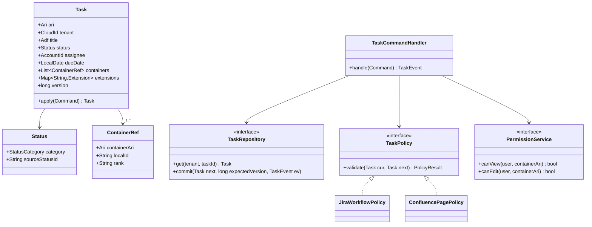
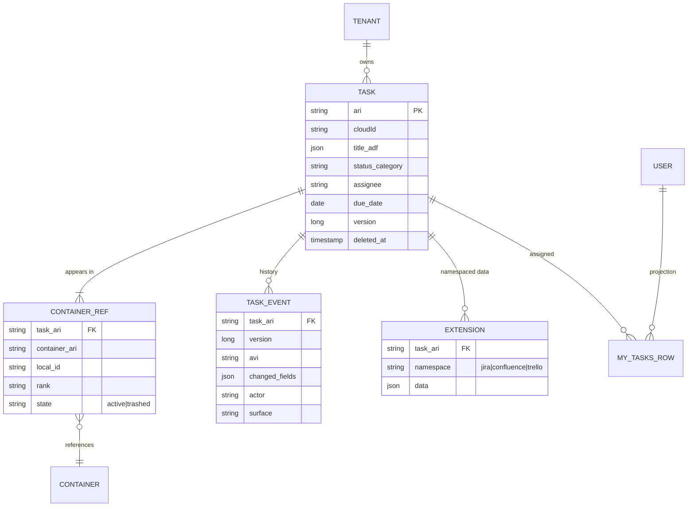
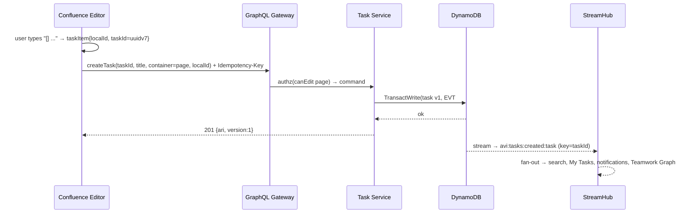
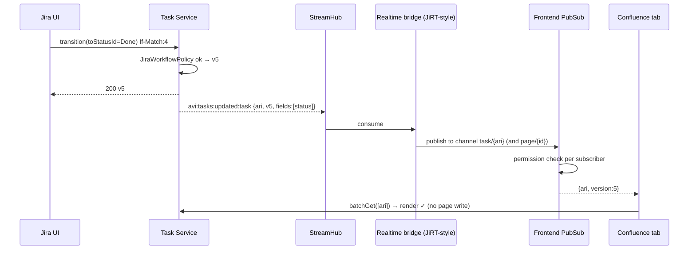
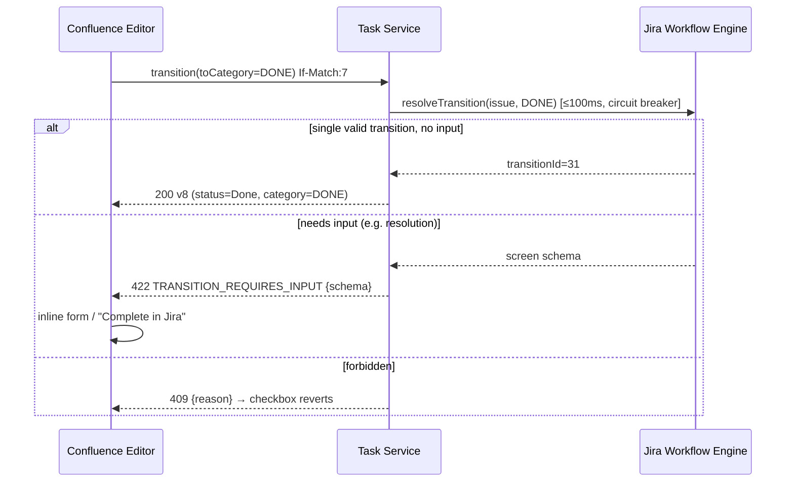
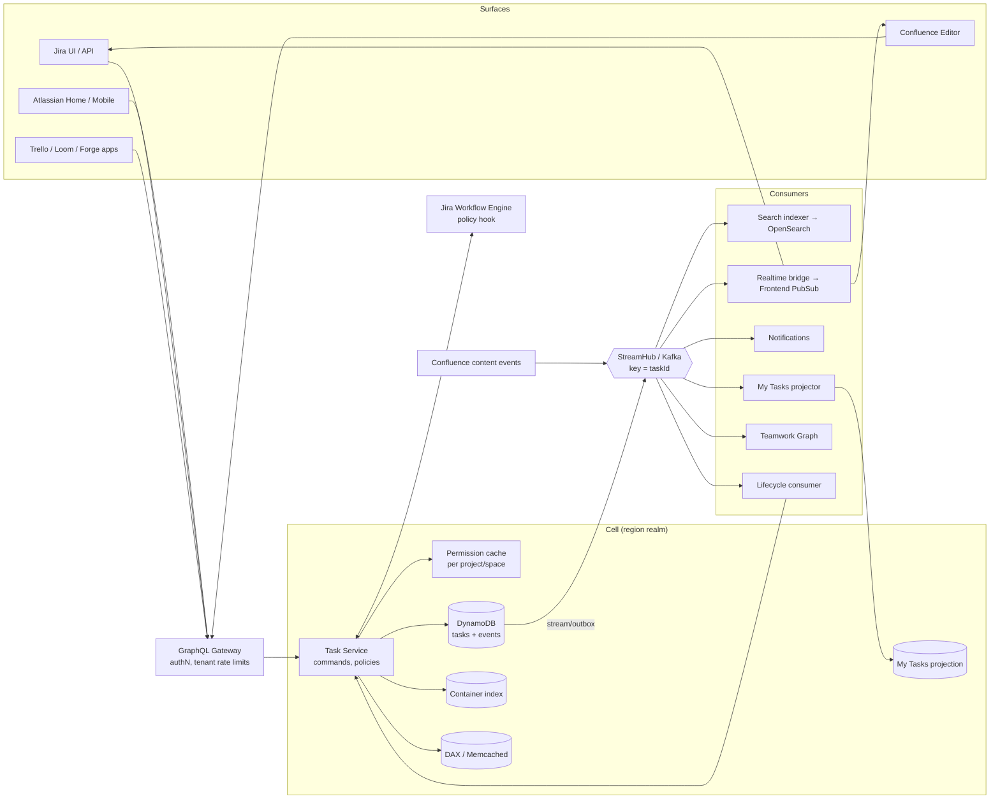

# Task Abstraction Layer (Jira + Confluence): 60-minute system design interview

The presentation version, in the order you'd give it. It starts from the **one idea that makes the
problem tractable** (a task has exactly one owner; products are views), builds the **low-level
model and write path**, works through the **hard problems** (tasks embedded in pages, Jira
workflows vs. a checkbox, conflicts, permissions), then **scales it out** one use case at a time.

Grounded in Atlassian's own published architecture (Atlassian Resource Identifiers and Atlassian Event Identifiers, StreamHub, JiRT, Jira service
sharding, Confluence's cc-ledger decomposition, Teamwork Graph). See [§17 References](#17-references).

**Contents**

1. [The one-minute pitch](#1-the-one-minute-pitch)
2. [Time plan](#2-time-plan)
3. [Requirements](#3-requirements-05-min)
4. [Sizing](#4-sizing-58-min)
5. [API and the sync vs async boundary](#5-api-and-the-sync-vs-async-boundary-814-min)
6. [Low-level design: entities, classes, the write path](#6-low-level-design-1422-min)
7. [The hard problems](#7-the-hard-problems-2236-min)
8. [DB model](#8-db-model-3641-min)
9. [High-level design, one use case at a time](#9-high-level-design-one-use-case-at-a-time-4150-min)
10. [The big picture](#10-the-big-picture)
11. [Scaling, failures and scenarios](#11-scaling-failures-and-scenarios-5055-min)
12. [Migration: getting there from today](#12-migration-getting-there-from-today-5557-min)
13. [Trade-offs and wrap-up](#13-trade-offs-and-wrap-up-5760-min)
14. [Likely questions](#14-likely-questions) · [Pitfalls](#15-pitfalls-that-cost-points) · [Cheat sheet](#16-one-screen-cheat-sheet)
15. [References](#17-references)

---

## 1. The one-minute pitch

> "The obvious design is to keep one copy of each task in Jira and another in Confluence, and sync
> them. I'd avoid that. When both copies can be edited, every edit has to be copied to the other
> side, and that copy can bounce back and trigger another copy. Sooner or later the two copies
> disagree, and nobody can tell which one is right.
>
> So I keep **only one copy**. A new **Task Service** stores every task, whichever product it was
> created in. Jira and Confluence don't keep their own copy. They just **display** the task from the
> Task Service. It's like one shared document embedded in two websites: edit it in either place and
> both show the change, because there's only one document.
>
> Inside a Confluence page, the task is a small **placeholder** that says "task #123 goes here".
> When the page loads, it asks the Task Service for the current status and assignee. So if someone
> closes the task in Jira, the page shows it as done, and pages that are already open get a live
> update. The page itself never has to be edited.
>
> Every change goes through the Task Service. Each task has a **version number**. If two people save
> at the same moment, the second save is rejected and retried on the newer version, so nobody
> silently overwrites anyone. Each change and a record of **what changed** are saved together in
> one database write. That record is then published on Atlassian's event bus (StreamHub, built on
> Kafka). Search, the My Tasks list, notifications and live page updates each listen for it and
> update themselves.
>
> There's one exception. A Jira project can have rules about how a task gets to Done, for example
> 'you must choose a resolution'. So when someone ticks a Jira-linked task in Confluence, the Task
> Service **asks Jira first** whether that's allowed. That's the only place the two products are
> tightly linked.
>
> To scale it, data is **split by customer** and kept in the **customer's region**. The service runs
> as several independent copies (**cells**), each serving a group of customers, so an outage affects
> only some of them. Who can see a task follows the **page or project it's in**, and that's checked
> every time the task is read."

**The pitch's terms, mapped to the jargon used in the rest of the doc:**

| Plain words above | Term used later | Section |
|---|---|---|
| only one copy, products display it | single source of truth; products are *views* | §7.1 |
| task #123 | **Atlassian Resource Identifier**, Atlassian's global ID for any resource, e.g. `ari:cloud:tasks:{cloudId}:task/{uuid}` | §5.2 |
| placeholder in the page | **reference node** `taskItem {localId, taskId}` | §7.1 |
| version number, second save rejected | **optimistic concurrency**, `If-Match` → `412` | §7.3 |
| change and record saved together | **transactional outbox** | §6.3, §8.1 |
| listen and update themselves | **event consumers / projections** | §7.4, §9 |
| ask Jira first | **synchronous workflow policy hook** | §7.2 |
| split by customer | **partition by tenant** (`cloudId`) | §8.2 |
| independent copies | **cells**, to limit blast radius | §11.1 |
| follows the page or project | **permissions inherited from the container** | §7.5 |

---

## 2. Time plan

| Min | Phase | On the whiteboard |
|---|---|---|
| 0–5 | Requirements | functional, non-functional, out of scope, questions |
| 5–8 | Sizing | writes/s, reads/s, fan-out, storage |
| 8–14 | API | commands vs queries, idempotency, `If-Match` versioning |
| 14–22 | **LLD** | Task model, status categories, providers, the write path |
| 22–36 | **Hard problems** | page embedding, Jira workflow, conflicts, permissions, lifecycle, promotion |
| 36–41 | DB model | single-table layout, container index, My Tasks projection |
| 41–50 | **HLD** | use cases A–G, then the big picture |
| 50–55 | Scale and failure | cells, hot tenants, outages, replay |
| 55–57 | Migration | federate → shadow → flip ownership (cc-ledger style) |
| 57–60 | Trade-offs | what you'd revisit |

For a 45-minute slot, compress the LLD into the data model and run only use cases A, B, C and D.

---

## 3. Requirements (0–5 min)

### 3.1 Functional

- Create, edit, assign, set a due date on, and complete a task from a **Jira project** or
  **inside a Confluence page**.
- A change made on any surface appears on every other surface. Open tabs update in real time.
- **Promote** a Confluence task to a Jira work item without copying it.
- A unified **My Tasks** view across products (Atlassian Home and Teamwork Graph).
- Search and filter by assignee, status, due date, container and text.
- Notifications for assignment, @mention, due soon and completion.
- History and audit: who changed what, when, and from which surface.

### 3.2 Non-functional

- **Multi-tenant**, with about 260K+ tenants and hard isolation by `cloudId`.
- **Read-your-writes** for the writer. Other surfaces become consistent within **2s at p99**.
- **Availability of 99.95%** for the Task API. If the Task Service is down, **page editing must
  still work**.
- **Data residency**: task data stays in the tenant's region.
- **Extensible**: Trello, Loom, Bitbucket and third-party apps can plug in as surfaces or providers.

### 3.3 Questions to ask

1. Is a Confluence task the same thing as a Jira work item, or a lighter-weight thing that can be
   *promoted*? *(Assume lighter-weight with promotion. Both share one core.)*
2. Must Jira's custom workflows (validators, required fields) hold when someone completes the
   task from Confluence? *(Assume yes. This drives §7.2.)*
3. Can one task appear in multiple places, such as a page and a project? *(Assume yes.)*
4. Offline and mobile? *(Mobile yes; offline creates should be safe, so taskIds are generated on
   the client.)*
5. Is the scope Cloud only, or also Data Center? *(Assume Cloud only.)*

**Out of scope:** Jira boards, sprints and JQL internals; the Confluence editor's collaboration
engine itself; billing.

---

## 4. Sizing (5–8 min)

| Quantity | Estimate | Result |
|---|---|---|
| DAU | 50M | |
| Task writes | ~10 / user / day | **500M/day ≈ 6k/s avg, ~30k/s peak** |
| Task reads (page renders, boards, My Tasks) | ~40× writes | **~250k/s avg, ~1M/s peak** |
| Reads reaching the DB | 95% cache hit | ~50k/s at peak |
| Event deliveries | 500M × ~6 consumers | ~3B/day, small next to StreamHub's ~145B/day |
| Live tasks | ~20B × ~1 KB core | **~20 TB**, sharded |
| History | 500M × ~300 B | ~150 GB/day → hot for 90 days, then object storage |
| Tasks per page (p99) | ~300 | so **batch get is mandatory** |

What the numbers say: the system is **read-heavy and fan-out heavy**. The write rate is modest per
tenant. The real problems are **render-time fill-in** and **permission-filtered aggregation**, not
write throughput.

---

## 5. API and the sync vs async boundary (8–14 min)

### 5.1 The boundary

- **Synchronous:** the command to the Task Service. It validates, runs the policy hook, commits
  with the outbox, and returns the new version. The writer sees the change immediately.
- **Asynchronous:** everything else (search, My Tasks, notifications, real-time push, Teamwork
  Graph, analytics), driven by events.

### 5.2 Endpoints

All IDs are Atlassian Resource Identifiers: `ari:cloud:tasks:{cloudId}:task/{uuidv7}`.

| Method | Path | Notes |
|---|---|---|
| `POST` | `/v1/tasks` | `taskId` is generated on the client and sent with an `Idempotency-Key` |
| `GET` | `/v1/tasks/{ari}` | returns the task plus a `version` ETag |
| `POST` | `/v1/tasks:batchGet` | up to 500 Atlassian Resource Identifiers, used for page renders; skips items the caller can't see |
| `PATCH` | `/v1/tasks/{ari}` | `If-Match: <version>`, field-level patch |
| `POST` | `/v1/tasks/{ari}/transitions` | `{toCategory: DONE}` or `{toStatusId}`; may return `422 TRANSITION_REQUIRES_INPUT` |
| `POST` | `/v1/tasks/{ari}/containers` | attach, i.e. promote to a Jira project or embed in another page |
| `DELETE` | `/v1/tasks/{ari}/containers/{containerAri}` | detach; deleting the last container soft-deletes the task |
| `GET` | `/v1/me/tasks?status=&dueBefore=&cursor=` | My Tasks, permission-filtered |
| `GET` | `/v1/tasks/{ari}/history` | audit log |

These are also exposed through the Atlassian GraphQL gateway for the frontends.

### 5.3 Request and responses

```http
POST /v1/tasks
Idempotency-Key: 7f3c...                       # same as taskId is fine
{
  "taskId": "0192f3a4-...-uuidv7",
  "title": { "type": "doc", "content": [ ... ADF ... ] },
  "assignee": "aaid:5b10...",
  "dueDate": "2026-10-11",
  "container": { "ari": "ari:cloud:confluence:{cloudId}:page/12345", "localId": "t-9a1" }
}

201 Created
ETag: "1"
{ "ari": "ari:cloud:tasks:{cloudId}:task/0192f3a4...", "version": 1, "status": { "category": "TODO" }, ... }
```

```http
PATCH /v1/tasks/{ari}
If-Match: "4"
{ "assignee": "aaid:77c2..." }

412 Precondition Failed      # someone else wrote v5
{ "current": { "version": 5, ... }, "conflictingFields": [] }   # empty means the client may simply retry on v5
```

---

## 6. Low-level design (14–22 min)

### 6.1 Entities

| Entity | What it is |
|---|---|
| **Task** | The common core: title (ADF), status, assignee, reporter, due date, priority, containers, version |
| **StatusCategory** | `TODO`, `IN_PROGRESS` or `DONE`. The language every surface understands |
| **ContainerRef** | Where the task appears: `{containerAri, localId?, rank}`. A task can have several |
| **Extension** | Namespaced product-specific data, e.g. `jira: {issueKey, statusId, workflowId, customFields}` |
| **TaskEvent** | An immutable change record: `{ari, version, avi, changedFields, actor, surface, ts}` |
| **TaskPolicy** | A hook a container type registers to validate or shape a command (Jira workflow) |

### 6.2 Class diagram



### 6.3 The write path (what to code)

```java
TaskEvent handle(Command cmd) {
    Task cur = repo.get(cmd.tenant(), cmd.taskId());          // null on create
    authz.requireEdit(cmd.actor(), cur == null ? cmd.container() : cur.containers());

    if (cmd.isCreate() && cur != null) return idempotentReplay(cur, cmd); // retry of same create
    if (!cmd.isCreate() && cur.version() != cmd.expectedVersion())
        throw new Conflict(cur);                              // 412, client rebases

    Task next = (cur == null ? Task.empty(cmd) : cur).apply(cmd); // pure, field-level

    for (TaskPolicy p : policies.forContainers(next.containers()))
        p.validate(cur, next).orThrow();                      // e.g. Jira workflow transition

    TaskEvent ev = TaskEvent.diff(cur, next, cmd.actor(), cmd.surface());
    repo.commit(next, cmd.expectedVersion(), ev);             // ONE conditional transaction:
                                                              //   task row (version check) + event row
    return ev;                                                // event row's change stream = outbox
}
```

Three properties to say out loud:
1. **One writer per task.** No multi-master setup, so there's nothing for a sync engine to resolve.
2. **The task and its event commit together**, so there are no dual writes to the DB and the bus.
3. **`apply` is pure**, so it's trivially unit-testable and the same code can replay history.

---

## 7. The hard problems (22–36 min)

### 7.1 How a Confluence page holds a task: reference, not copy

A page is a collaborative ADF document. There are two options:

| | **Copy state into the page** | **Reference node (chosen)** |
|---|---|---|
| Page body holds | title, status, assignee | `taskItem {localId, taskId}` plus a title snapshot |
| A Jira-side change means | rewriting the page, a new page version, merging into live collab sessions | nothing in the page; render-time fill-in and a real-time push |
| Page history | polluted by remote edits | clean |
| Render cost | none | one batched `batchGet` per page (cached) |

- The **title snapshot** in the node is used for page search indexing, exports, and as the
  fallback when the Task Service is unreachable. It's refreshed lazily the next time the page is
  saved.
- **Editing inside the page:** the editor sees the task node's fields. Changes are debounced
  (around 500ms) into `PATCH` calls carrying `If-Match`. Status and assignee changes are sent
  immediately.
- **A remote change while the page is open** arrives through real-time push (§9-B). The editor
  applies it as a **non-persisted decoration**, so it doesn't create a new document step.

### 7.2 Jira workflow vs. a checkbox

Confluence has a binary checkbox. Jira has custom workflows with validators, required fields and
several statuses in the Done category.

- The common language is the **StatusCategory**. Ticking the box means `transition {toCategory: DONE}`.
- `JiraWorkflowPolicy` (synchronous, with a budget under 100ms) resolves the transition:
  - Exactly one valid transition into DONE that needs no extra input → apply it and record
    `extensions.jira.statusId`.
  - Several transitions, or required fields such as resolution → return `422
    TRANSITION_REQUIRES_INPUT` with the transition screen schema. Confluence shows an inline
    "Complete in Jira" form or deep-links to Jira.
  - The workflow forbids the transition → `409`, and the checkbox reverts with a reason.
- **Why synchronous:** a workflow is a correctness constraint. Validating it asynchronously means
  showing "Done" and then quietly reverting it, which is worse than a clear error.
- **Limiting the coupling:** a circuit breaker. If Jira's workflow engine is unhealthy, status
  transitions on Jira-backed tasks fail fast, while all other fields still work.

### 7.3 Concurrency and conflicts

- **Optimistic concurrency per task** with `version`. On a `412`, the client gets the current
  state and the list of conflicting fields.
- **Merging per field.** If two edits touch different fields (one person changes the assignee,
  another the due date), the client simply re-applies its patch on the new version. Only a real
  same-field collision reaches the user.
- **Title collisions** while someone is typing in a page and someone else edits in Jira are rare.
  Keep the local text, show "edited elsewhere", and let the user choose. Don't use a CRDT for a
  one-line title. Mention that you would add one if titles became long-form descriptions.
- **Echo suppression is free.** Each event carries `surface` and `version`, and a surface ignores
  events at or below the version it already holds.

### 7.4 Ordering, delivery and idempotency

- StreamHub/Kafka is partitioned by **`taskId`**, so events for one task arrive **in order**.
- Delivery is **at least once**, so every consumer is **idempotent on `(ari, version)`**: it keeps
  the last applied version per task and drops anything at or below it.
- Payloads are **thin** (Atlassian Resource Identifier, version, Atlassian Event Identifier, changed field names, no content), following the JiRT
  pattern. Consumers that need content refetch it under their own permissions, so no data leaks
  through fan-out.
- A consumer that sees a **gap** (got v7 while holding v5) refetches the current state. Projections
  converge to the latest state; they don't need every intermediate step.
- **Poison events** go to a per-consumer dead-letter queue with alerts. They never block a
  partition.

### 7.5 Permissions

- A task **inherits** access from its containers: view if you can view **any** container, and the
  same for edit. Document this union rule. (The alternative, "most restrictive", breaks promotion:
  a page task you can see would vanish once it's promoted into a private project.)
- **Check at read time** against a container-permission cache, per project and per space, with
  multiple cache levels. Jira's permission service targets **under 10ms**.
- **My Tasks and search** over-fetch, then post-filter in batches with one permission call per
  distinct container, not per task.
- **Don't precompute per-user ACLs on tasks.** A single space permission change would fan out to
  millions of rows.
- When a container's permissions change, emit an event that invalidates the cache and refreshes
  the access fields in search documents asynchronously. The read-time check stays the safety net.

### 7.6 Lifecycle: delete, restore, move, copy

| Action | Effect on the task |
|---|---|
| Page deleted (to trash) | That container is marked `trashed`. If it was the only container, the task is soft-deleted |
| Page restored | The container is restored and the task is undeleted |
| Page copied or created from a template | **New tasks with new taskIds** (copy semantics, like the text). The editor remaps `localId`s |
| Page moved to another space | Permissions change. Reindex the page's tasks for access |
| Task node deleted from a page | Detached from that container. Soft-deleted if no containers remain |
| Jira work item deleted | Detached from the project. The task survives if it's still embedded in a page |

Purge after the trash retention period, and honour GDPR deletion of the user identifiers.

### 7.7 Promotion: Confluence task → Jira work item

- **No copy.** Attach a `JIRA_PROJECT` container and add `extensions.jira` (issueKey, workflow,
  initial status mapped from the category). **The taskId and Atlassian Resource Identifier stay the same.**
- The page node doesn't change. It now renders the Jira key and status as well.
- This replaces today's one-shot "create Jira issue from page", which leaves two diverging copies
  and is the long-standing user complaint on the Atlassian Community forums.

---

## 8. DB model (36–41 min)

### 8.1 Access patterns, then stores

| Access pattern | Store | Key |
|---|---|---|
| Get or update one task (versioned) | **DynamoDB** (the pattern Confluence uses for new services) | `PK=T#{cloudId}#{taskId}`, `SK=META` |
| Task history and audit | same table | `SK=EVT#{version:012d}`, TTL into S3 after 90 days |
| Outbox | **DynamoDB Streams** on that table, relayed to StreamHub | the change stream of `EVT#` items |
| All tasks on a page or in a project, ordered | container index table | `PK=C#{cloudId}#{containerAri}`, `SK={rank}#{taskId}` |
| My Tasks | projection table | `PK=U#{cloudId}#{aaid}`, `SK={category}#{dueDate}#{taskId}` |
| Full-text and faceted search | **OpenSearch**, index per tenant group | doc = task + container Atlassian Resource Identifiers + access keys |
| Idempotency | DynamoDB with TTL | `PK=IDEMP#{cloudId}#{key}`, kept 24h |
| Hot read cache | Memcached/DAX in front of `batchGet` | `ari@version` |

The task row and the event row are written in **one `TransactWriteItems`**, with the condition
`version = :expected` on the task row. The stream then carries the event, so the outbox comes for
free.

### 8.2 Partitioning

- The partition key always begins with `cloudId`, so tenants are isolated by key prefix.
- Big tenants don't create hot partitions, because the key includes `taskId` and hashes evenly.
  The only per-container hot key is one huge page, and that's served from cache.
- **Region first:** each data-residency realm has its own table and stream. **Then cell:** a
  tenant is assigned to a deployment cell, and enterprise tenants can get dedicated cells.

### 8.3 ER diagram



---

## 9. High-level design, one use case at a time (41–50 min)

#### A. Create a task inside a Confluence page



On a network failure the editor keeps the node and retries. The client-generated `taskId` makes
the retry safe.

#### B. Completed in Jira → an open Confluence tab updates live



#### C. Checkbox in Confluence on a Jira-backed task



#### D. My Tasks across products

- `My Tasks projection consumer`: when the assignee changes, delete the old user's row and upsert
  the new user's row, sorted by `category#dueDate`.
- Read path: query `U#{cloudId}#{me}`, then a batch permission check per distinct container, then
  `batchGet` the cards through the cache, then return the page.
- The rows are a **hint** and the permission check is the **truth**. A stale row costs one wasted
  fetch, never a leak.
- Teamwork Graph consumes the same events, which is how tasks appear in Atlassian Home and Rovo.

#### E. Promote a Confluence task to Jira

`POST /containers {jira project}` → `JiraProjectPolicy` assigns an issue key and an initial
status → event → Jira indexes it into boards and JQL through its consumer. The page node is
untouched. One task, two containers.

#### F. Search

The search consumer refetches the task plus its containers' access keys, then indexes it. A query
filters by tenant and access keys first, then by text, and re-checks the top N against the
permission cache before returning.

#### G. Page lifecycle

The Confluence content service emits `page trashed/restored/copied/moved` on StreamHub. A
**lifecycle consumer** in the Task Service applies the rules in §7.6. Page deletion never waits on
the Task Service.

---

## 10. The big picture



---

## 11. Scaling, failures and scenarios (50–55 min)

### 11.1 Scaling out

- **Stateless Task Service** that scales horizontally per cell. Tenants are assigned to cells
  (Jira's service-sharding model), and enterprise tenants get dedicated cells.
- **Reads:** cache keyed by `ari@version`, so writes never need explicit invalidation; a new
  version is simply a new key. Concurrent `batchGet`s for the same page are coalesced
  (single-flight).
- **Events:** separate topics or quotas for **interactive** and **bulk** traffic, so an import
  can't starve real-time updates. StreamHub uses quotas exactly this way, as blast-radius control.
- **Per-tenant rate limits** at the gateway, and a separate lane for bulk APIs.

### 11.2 Failure handling

| Failure | Behaviour |
|---|---|
| Task Service down | Pages render from title snapshots with the status shown as "unavailable". Editing still works. Creates are queued on the client (safe because taskIds are client-generated) |
| Jira workflow engine slow | The circuit breaker opens. Only status transitions on Jira-backed tasks fail fast. Everything else works |
| StreamHub lag | Projections fall behind but stay correct. The writer still sees the change (it got the response). The UI may show a "syncing" hint |
| Consumer bug corrupts an index | Fix it, then **replay** from the event log or a DynamoDB export. Projections can always be rebuilt |
| Region outage | Recover within the realm (multi-AZ). Data-residency rules forbid cross-realm failover |

### 11.3 Scenario: a meeting-notes page with 2,000 tasks and 50 live viewers

One `batchGet`, split into chunks of 500, served from cache. 50 viewers means 1 origin fetch per
version thanks to single-flight. Real-time push goes to a **page channel**, so it's one fan-out per
change rather than per task.

### 11.4 Scenario: a tenant bulk-imports 5M Jira issues

Use the bulk lane (separate topic and quota), throttle by cell capacity, and batch-build the
projections. Interactive traffic for every other tenant in the cell is unaffected.

### 11.5 Scenario: a user is removed from a space

A permission event invalidates the cache, so that user is denied on their next read; the read-time
check guarantees this. Search access keys are refreshed asynchronously. If the stale index briefly
returns a task, the final permission re-check drops it.

---

## 12. Migration: getting there from today (55–57 min)

Today Jira issues live in Jira's store, Confluence tasks live inside page bodies, and "create Jira
issue from page" makes a copy. Get there the way Confluence decomposed its monolith (cc-proxy and
cc-ledger):

1. **Federate.** The Task API sits in front of both. A `JiraProvider` adapter reads and writes
   through Jira, and Confluence tasks are backfilled into the Task Service. A **ledger**
   (`cloudId:taskId → owner`) routes each request. Clients move to Atlassian Resource Identifiers and the new API right away.
2. **Shadow.** Dual-read and compare, measure drift, and fix the status-mapping edge cases.
3. **Flip ownership tenant by tenant.** The Task Service becomes the owner of the core fields, and
   Jira keeps its workflow and custom fields as `extensions.jira` plus the policy hook. Roll out
   progressively, detect anomalies, and keep a rollback path per tenant through the ledger.

---

## 13. Trade-offs and wrap-up (57–60 min)

| Decision | Chosen | Alternative | Why |
|---|---|---|---|
| Sync model | one owner, products are views | sync both ways between products | no dual writes, no echo loops, no drift |
| Page embedding | reference node plus render-time fill-in | copy state into the doc | clean page history, no collisions with co-editing; costs one batch read |
| Jira workflow | synchronous policy hook | eventual validation | correctness over decoupling, isolated by a circuit breaker |
| Concurrency | optimistic concurrency, field-level rebase | CRDT for every field | titles are short; a CRDT is overkill (revisit for descriptions) |
| My Tasks | fan-out on write plus permission check at read | query at read time | fast reads; permission check keeps it safe |
| Permissions | check at read time with a cached container ACL | precomputed per-user ACLs | a space permission change would fan out to millions of rows |
| Store | DynamoDB with stream as outbox | Postgres plus a CDC tool | matches Atlassian's newer services, free CDC, even partitioning |

What I'd revisit: CRDT descriptions, using Teamwork Graph as the read model for My Tasks, and
opening the provider SPI to third-party task sources.

---

## 14. Likely questions

- **"Why not just sync Jira and Confluence?"** Two writable copies means conflict resolution
  forever and echo loops. One owner removes the whole class of problem.
- **"What if the Task Service becomes a bottleneck or a single point of failure?"** It's stateless,
  cell-sharded and multi-AZ, and the page degrades to title snapshots. Writes are about 30k/s
  across all cells, which is modest.
- **"How do you guarantee the event is published if the write succeeds?"** The event row is in the
  same transaction, and the stream relays it. It's at-least-once, and consumers are idempotent on
  version.
- **"Two people edit the same task simultaneously?"** Version check, then a 412, then a field-level
  rebase. Only same-field collisions are shown to a user.
- **"A task in a public page and a private project?"** Union rule, documented. Show the trade-off
  with promotion.
- **"Why not let Confluence store the task in the page doc?"** Every Jira edit would rewrite the
  page, creating versions and collab merges.
- **"How does this fit Atlassian's platform?"** Atlassian Resource Identifiers and Atlassian Event Identifiers, StreamHub, a real-time bridge and
  PubSub, and Teamwork Graph as a consumer.

## 15. Pitfalls that cost points

- Proposing sync both ways and then spending 20 minutes on conflict resolution.
- Ignoring Jira's workflows ("just set status = done").
- Writing remote changes into the page document.
- Precomputing ACLs per task per user.
- Dual-writing to the DB and Kafka without an outbox.
- Partitioning Kafka by tenant (hot partitions) instead of by taskId.
- Forgetting copy, template and trash semantics for pages.
- Forgetting data residency in a multi-tenant SaaS answer.

## 16. One-screen cheat sheet

```
ONE OWNER: Task Service. Jira issue & Confluence task = views. ID = Atlassian Resource Identifier.
PAGE: taskItem{localId, taskId} + title snapshot; render-time batchGet; no page rewrites.
WRITE: authz → version check → apply (pure) → policy hooks → Tx{task, EVT#} → stream = outbox.
STATUS: category TODO/IN_PROGRESS/DONE; Jira workflow = sync hook; 422 needs input; breaker.
EVENTS: StreamHub/Kafka key=taskId; thin payloads; at-least-once; idempotent on (ari,version).
REALTIME: consumer → realtime bridge → PubSub (perm check) → tab refetches.
READS: cache ari@version; single-flight; My Tasks projection + read-time perm filter (<10ms).
PERMS: inherited from containers (union); container ACL cache; no per-task ACLs.
SCALE: PK starts with cloudId; region realm → cell; bulk vs interactive lanes.
MIGRATE: federate (ledger) → shadow → flip per tenant.
```

---

## 17. References

- [Using an event-driven architecture to improve Jira responsiveness](https://www.atlassian.com/blog/how-we-build/using-an-event-driven-architecture-to-improve-jira-software-responsiveness): StreamHub, JiRT, Frontend PubSub, Atlassian Resource Identifiers and Atlassian Event Identifiers, thin payloads
- [Scaling StreamHub: Kinesis → Kafka, 145B daily events](https://www.atlassian.com/blog/how-we-build/scaling-streamhub-transitioning-from-kinesis-to-kafka-for-145-billion-daily-events): quotas as blast-radius control
- [How we unlocked performance at scale with Jira platform](https://atlassian.com/blog/atlassian-engineering/how-we-unlocked-performance-at-scale-with-jira-platform): service sharding, permission checks under 10ms
- [Scaling, rearchitecting and decomposing Confluence Cloud](https://www.atlassian.com/blog/atlassian-engineering/scaling-rearchitecting-and-decomposing-confluence-cloud): cc-proxy, cc-ledger, DynamoDB plus Kafka for new services
- [How we build data residency for Atlassian Cloud](https://www.atlassian.com/blog/atlassian-engineering/how-we-build-data-residency-for-atlassian-cloud): realms and shards
- [Teamwork Graph](https://www.atlassian.com/platform/teamwork-graph): unified work data, permission checks at the point of delivery
- [Creating Jira tasks in Confluence (Community)](https://community.atlassian.com/forums/Confluence-articles/Creating-Jira-tasks-in-Confluence-is-now-new-and-improved/ba-p/2843224) and [Connect all Confluence tasks to Jira](https://community.atlassian.com/forums/Confluence-questions/Connect-All-Confluence-Tasks-to-Jira/qaq-p/2196712): the user-facing problem today
