# Distributed Web Crawler: 60-minute system design interview

The presentation version, in the order you'd give it. It starts from the **low-level design** (the
classes and the one loop that crawls a graph correctly) and then **scales that same loop out** into
a distributed system, drawing one diagram per use case before the big picture.

- Code: [`core/src/main/java/.../webcrawler`](core/src/main/java/com/salesforce/einstein/webcrawler). It runs
  and is tested; [README.md](README.md) maps every class to the design.
- Deep reference: [docs/DESIGN-DETAILED.md](docs/DESIGN-DETAILED.md) has the full DDL, every API
  request and response, capacity math, failure modes, security and observability.

**Contents**

1. [The 30-second pitch](#1-the-30-second-pitch)
2. [Time plan](#2-time-plan)
3. [Requirements](#3-requirements-05-min)
4. [Sizing](#4-sizing-58-min)
5. [API and the sync vs async boundary](#5-api-and-the-sync-vs-async-boundary-814-min)
6. [Low-level design: entities, classes, the crawl loop](#6-low-level-design-1424-min)
7. [The graph problems](#7-the-graph-problems-2436-min): depth · cycles · URL params · assets · already visited · serving and rewriting links · [what runs in parallel](#77-what-can-be-processed-in-parallel)
8. [DB model](#8-db-model-3642-min): [where the graph and content live](#81-where-the-graph-and-the-content-live)
9. [High-level design, one use case at a time](#9-high-level-design-one-use-case-at-a-time-4252-min)
10. [The big picture](#10-the-big-picture) · [cloud-agnostic](#101-cloud-agnostic-by-construction)
11. [Scaling, failures and three scenarios](#11-scaling-failures-and-three-scenarios-5257-min) · [scaling out](#111-partitioning-and-scaling-out)
12. [Trade-offs and wrap-up](#12-trade-offs-and-wrap-up-5760-min)
13. [Likely questions](#13-likely-questions) · [Pitfalls](#14-pitfalls-that-cost-points) · [Cheat sheet](#15-one-screen-cheat-sheet)
14. Comparisons: [systemdesignsandbox](#16-comparison-with-the-systemdesignsandbox-reference) · [gauravaryal.com](#17-comparison-with-the-gauravaryalcom-reference)

---

## 1. The 30-second pitch

> "A crawler is a BFS over a graph we discover as we walk it, and the graph fights back: cycles,
> endless URL parameters, redirect loops, traps. So first I make one loop correct. I
> **canonicalize** every URL and run one **atomic seen-test** per job that also enforces the
> **depth and page budgets**. Images, video and audio are **leaves**, and bytes go into a
> **content-addressed** store, so a duplicate is just a pointer.
>
> Then I scale that loop out. The frontier is a durable log **keyed by host**, so each host has one
> owner and **politeness** is a local decision. Fetchers and parsers scale separately. A KV cache
> holds the seen-sets, a wide-column store the graph, and an object store the bytes. Each sits behind
> a port with an open-protocol default, so the design runs on AWS, GCP or Azure.
>
> The API is **async by default**; sync is the same pipeline plus a bounded wait. When users view or
> download results, links are **rewritten at read time** to point at our copies."

---

## 2. Time plan

| Min | Phase | On the whiteboard |
|---|---|---|
| 0–5 | Requirements | functional, non-functional, out of scope |
| 5–8 | Sizing | pages/s, fetches/s, TB/day, seen-tests/s |
| 8–14 | API | `POST /v1/crawls`, sync vs async, results and content endpoints |
| 14–24 | **LLD** | entities, class diagram, the crawl loop and the `admit()` seen-test |
| 24–36 | **Graph problems** | depth, cycles, params, assets, already visited, link rewriting |
| 36–42 | DB model | worked example of graph rows and blobs, ER diagram, which store and why |
| 42–52 | **HLD** | use-case diagrams A–G, then the big picture |
| 52–57 | Scale and failure | sharding, worker crash, a 10M-page domain |
| 57–60 | Trade-offs | what I gave up and why |

If the interviewer wants code, write the core: `CrawlEngine.process()`, `follow()` and
`JobStore.admit()` ([§6.4](#64-the-core-loop-what-to-code)).

---

## 3. Requirements (0–5 min)

### 3.1 Functional

| # | Requirement |
|---|---|
| F1 | Submit a crawl: seed URLs, **max depth**, **max pages**, scope (same host / same domain / any), asset policy |
| F2 | **Sync** for tiny crawls (answer in the HTTP response), **async** for everything else (job id, poll or webhook) |
| F3 | Visit every in-scope page **at most once per job**, however many links, cycles or URL spellings lead to it |
| F4 | Store HTML and **static assets** (images, CSS, fonts); **record** video and audio, and download them only if asked |
| F5 | Status and live counters; cancel |
| F6 | Results: the crawl graph (nodes + edges, paged), each node's bytes, and an **offline download** in which links point at the crawled copies |
| F7 | Reuse **already-crawled** content across jobs while fresh; revalidate it with conditional GET |

### 3.2 Non-functional

| Property | Target | What it forces |
|---|---|---|
| Politeness | ≤ 1 req/s per host by default; honour `robots.txt`, `Crawl-delay` and `<meta robots>` | Per-host scheduling, so only one owner per host |
| Termination | Every job ends, whatever the site does | Budgets, depth, canonicalization, trap detection |
| Throughput | 100M pages/day plus assets ([§4](#4-sizing-58-min)) | Horizontal fetchers, a partitioned frontier |
| Durability | An accepted job is never lost; a worker crash loses no URL | Frontier acked after processing; idempotent steps |
| Latency | Sync: answer within `syncTimeoutMs` (default 10 s, max 30 s), else fall back to 202. Async status: < 100 ms | Bounded sync path, a separate API tier |
| Isolation | One tenant's 1M-page job doesn't starve the others | Per-tenant quotas, fair scheduling across jobs |
| Safety | We never become an SSRF or XSS vector | Egress filter; crawled HTML served sandboxed from another origin |

**Out of scope, said out loud:** JavaScript rendering (optional headless-Chrome pool, [§13](#13-likely-questions)),
login-walled crawling, full-text search and ranking (downstream consumers), and CAPTCHA or
anti-bot evasion (never).

### 3.3 Questions to ask

1. Is it a service for tenants ("crawl my site"), or a web-scale search crawler? *(This design: a
   multi-tenant crawl service. The web-scale differences are in [§16](#16-comparison-with-the-systemdesignsandbox-reference).)*
2. Do they need the media bytes, or just references? *(References by default.)*
3. Freshness: may a result reuse a copy from an hour ago? *(Yes, through `maxAgeSeconds`.)*
4. Do results have to be browsable offline? *(Yes, so we need link rewriting.)*

---

## 4. Sizing (5–8 min)

| Input | Value |
|---|---|
| Jobs | 50k/day, avg 2k pages, so **100M pages/day ≈ 1.2k pages/s**, peak ×3 ≈ **3.5k pages/s** |
| Asset fetches | ~3 per page after per-job dedup, so ≈ 3.5k/s avg; **total fetches ≈ 4.6k/s avg, ~14k/s peak** |
| Links | ~50 per page, so **5 B seen-tests/day ≈ 58k/s avg, ~175k/s peak** |
| HTML | 100 KB raw, ~20 KB gzip. ~50% new content after dedup gives ~1 TB/day |
| Images and CSS | ~50 KB each, ~50M new/day gives ~2.5 TB/day |
| Bandwidth | 4.6k × ~60 KB ≈ **2.2 Gbps avg, ~7 Gbps peak** |

| Store | Size | Note |
|---|---|---|
| Blobs (object store) | ~3.5 TB/day, **~315 TB** at 90-day retention | content-addressed; lifecycle to IA after 30 d |
| `job_pages` | 400M rows/day × ~300 B ≈ 120 GB/day, ~11 TB / 90 d | wide-column store, partition = job |
| `page_links` | 5 B edges/day × ~40 B (compressed) ≈ 200 GB/day, ~18 TB / 90 d | the biggest table |
| `url_records` | ~2 B distinct URLs × 300 B ≈ 600 GB | global "already crawled" |
| Seen-sets (KV cache) | active jobs only: ~5k × ~10k nodes × 40 B ≈ 2 GB | TTL = job lifetime + 1 day |
| Bloom filter | 2 B URLs at 1% ≈ **2.4 GB**, k = 7 | negative cache in front of `url_records` |

| Fleet | Sizing |
|---|---|
| Fetchers | async I/O, ~400 fetches/s per node (200 sockets × ~0.5 s) → 14k/s peak ≈ 35 nodes; **run 50** |
| Parsers | jsoup ~5 ms CPU per 100 KB page, so ~200/s/core. 3.5k/s needs ~18 cores; **run 6 × 8 vCPU** |
| Durable log (Kafka API) | 6 brokers, `frontier` topic with 96 partitions, RF 3 |

**The sentences to say:**
- "Politeness, not hardware, sets the speed of a job: a 10k-page single-host crawl at 1 req/s takes
  about 3 hours. So anything beyond a handful of pages **has to be async**."
- "There are 175k seen-tests a second, mostly answering 'already seen'. That's an in-memory atomic
  set per job, not a database round trip."

---

## 5. API and the sync vs async boundary (8–14 min)

### 5.1 The boundary

**Why offer two modes?** Because callers wait for different things.

- **Sync is for a caller who is waiting on the answer**: a UI preview ("show me this page and its
  links"), an AI agent's tool call, or a CI link check. Their crawl is a handful of pages that
  finishes in seconds. Making them submit, poll and then fetch results is three round trips and
  extra client code for no benefit.
- **Async is for everything else**, because **politeness sets the pace, not our hardware**. At
  1 req/s per host, a 10k-page site takes about 3 hours. No HTTP client, load balancer (often a
  60 s idle timeout) or user should hold a connection that long, and a dropped connection must not
  lose the work. So a big crawl returns a job id at once; the client polls or gets a webhook.
- **Why not only one?** Async-only makes small calls clumsy. Sync-only can't serve real crawls
  and ties up API threads and connections.

The sync limits follow from politeness: 25 pages on one host at 1 req/s is about 25 s, which still
fits the 30 s ceiling.

| | SYNC | ASYNC (default) |
|---|---|---|
| Allowed when | `maxDepth ≤ 1` **and** `maxPages ≤ 25` (else 400) | always |
| Response | **200** with the job and every node, if it finishes inside `syncTimeoutMs` (≤ 30 s). Otherwise **202**, and the crawl continues | **202** + `Location`, then poll or receive a webhook |
| Implementation | *the same pipeline*, in an interactive priority lane, plus a bounded wait for the job-done event | the pipeline |

**Why sync is not its own code path:** a "mini-crawler inside the API pod" would skip the shared
politeness, robots and seen state. Instead, sync is async plus a wait with a deadline. If the
deadline passes, the caller gets exactly what an async caller gets (202 + job id), so clients
handle one contract.

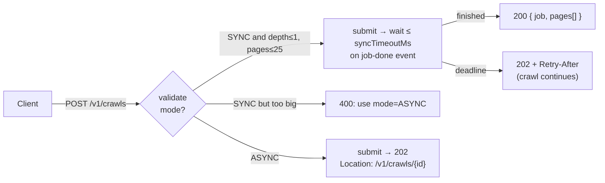

### 5.2 Endpoints

| Method and path | Purpose |
|---|---|
| `POST /v1/crawls` | create. `Idempotency-Key` header; the same key with a different body is 422 |
| `GET /v1/crawls/{id}` | status + live counters |
| `POST /v1/crawls/{id}/cancel` | stop; queued URLs are dropped without touching their hosts |
| `GET /v1/crawls/{id}/pages?type=&cursor=&limit=` | graph nodes in BFS order, keyset-paged |
| `GET /v1/crawls/{id}/pages/{urlHash}` | one node + its out-edges |
| `GET /v1/crawls/{id}/pages/{urlHash}/content?links=snapshot\|absolute\|raw` | the bytes, links rewritten ([§7.6](#76-serving-crawled-content-do-we-rewrite-child-references)) |
| `GET /v1/crawls/{id}/export` | offline ZIP with relative links |
| `GET /v1/pages?url=` | "have we crawled this?": the calling tenant's latest copy of a URL across its own jobs (never another tenant's) |

The tenant comes from the gateway-verified token (`X-Tenant-Id` here). Another tenant's job is a
**404**, never a 403, so job ids can't be probed. Errors are RFC 7807 problems.

### 5.3 Request and responses

```http
POST /v1/crawls
Idempotency-Key: 7d1c…
Content-Type: application/json

{
  "seeds": ["https://docs.example.com/"],
  "maxDepth": 3,                       // 0..50; seeds are depth 0
  "maxPages": 5000,                    // HTML pages; 1..1,000,000
  "maxAssets": 20000,                  // stored + referenced assets
  "scope": "SAME_HOST",                // SAME_HOST | SAME_DOMAIN | ANY (for pages; assets may be on CDNs)
  "downloadAssets": ["IMAGE", "CSS"],  // other types (VIDEO, AUDIO, …) are recorded, not downloaded
  "maxAssetBytes": 10485760,
  "maxAgeSeconds": 86400,              // reuse a snapshot younger than this; 0 = always revalidate
  "respectRobots": true,
  "mode": "ASYNC",                     // or SYNC
  "callbackUrl": "https://hooks.example.com/crawl-done",
  "syncTimeoutMs": 10000               // SYNC only, ≤ 30000
}
```

```http
HTTP/1.1 202 Accepted
Location: /v1/crawls/9b2f…

{
  "jobId": "9b2f…", "status": "RUNNING", "createdAt": "2026-10-03T10:00:00Z",
  "request": { …echo with defaults filled… },
  "stats": { "discovered": 1, "pending": 1, "pages": 0, "assets": 0, "reused": 0,
             "duplicates": 0, "failed": 0, "edges": 0, "truncated": 0 },
  "links": { "self": "/v1/crawls/9b2f…", "pages": "/v1/crawls/9b2f…/pages",
             "export": "/v1/crawls/9b2f…/export", "cancel": "/v1/crawls/9b2f…/cancel" }
}
```

```http
GET /v1/crawls/9b2f…/pages?type=PAGE&limit=2

{
  "items": [
    { "urlHash": "a1f3…", "url": "https://docs.example.com/", "type": "PAGE", "depth": 0,
      "status": "FETCHED", "httpStatus": 200, "contentType": "text/html; charset=utf-8",
      "contentHash": "5e88…", "size": 48211, "fetchedAt": "2026-10-03T10:00:01Z",
      "contentUrl": "/v1/crawls/9b2f…/pages/a1f3…/content" },
    { "urlHash": "77c0…", "url": "https://docs.example.com/guide?view=print", "type": "PAGE",
      "depth": 1, "parentHash": "a1f3…", "status": "DUPLICATE", "duplicateOf": "c9d2…",
      "contentHash": "5e88…", "contentUrl": "/v1/crawls/9b2f…/pages/77c0…/content" }
  ],
  "nextCursor": "eyJpIjoyfQ"
}
```

A node's `status` is one of `QUEUED`, `FETCHED`, `REUSED`, `DUPLICATE`, `REDIRECT`, `REFERENCED`,
`BLOCKED_ROBOTS`, `TOO_LARGE` or `FAILED`, so the result explains *why* each URL looks the way it
does. Every error response is in [DESIGN-DETAILED §2](docs/DESIGN-DETAILED.md#2-api-reference).

---

## 6. Low-level design (14–24 min)

### 6.1 Entities

| Entity | Key | What it is |
|---|---|---|
| `CrawlJob` | `job_id` | request, status, timestamps |
| `CanonicalUrl` | `url_hash` = 128-bit SHA-256 prefix | **the node id**. Every spelling of one resource maps here |
| `CrawlTask` | — | one frontier item: (job, url, depth, parent, expectedType, redirectHops, attempt) |
| `JobPage` | `(job_id, url_hash)` | a node *in one job's graph*: status, depth, parent, `content_hash`, `duplicate_of`, `redirect_to` |
| `LinkEdge` | `(job_id, from_hash, to_hash)` | an edge, recorded **even if the target was visited or not followed** |
| `PageSnapshot` | `url_hash` | the latest *global* fetch (any job): `content_hash`, ETag, Last-Modified, `fetched_at`. Stored as `url_records` |
| Blob | `content_hash` = SHA-256 | immutable bytes of a page **or** an asset, in the object store, shared by every job that saw them |

The key split: **`JobPage` (per job) vs `PageSnapshot` (global) vs blob (by content).** The graph
is `JobPage` + `LinkEdge` rows; the bytes are blobs. A job's result never changes when someone
re-crawls the URL later, because it points at an immutable content hash. Concrete rows:
[§8.1](#81-where-the-graph-and-the-content-live).

### 6.2 Class diagram

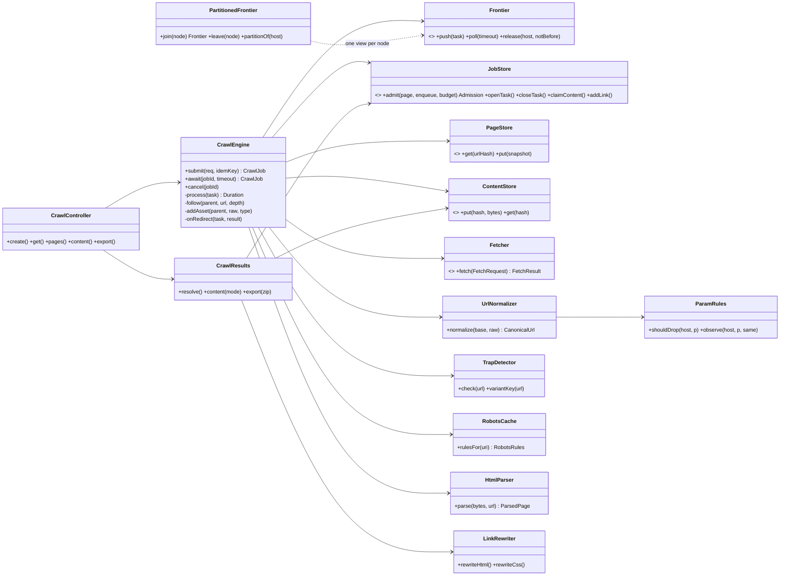

Every box with `<<interface>>` is an SPI. In-memory implementations run the single-process build
and the tests; the distributed build swaps in log, cache, wide-column and object-store adapters, chosen by
`crawler.adapters.*`, without touching `CrawlEngine` ([docs/PORTABILITY.md](docs/PORTABILITY.md)).
**`CrawlEngine` holds no per-job state**: scope, budgets, seen-sets, trap counters and task
accounting are all in `JobStore`. So N engines on N machines can work on one job.
`DistributedCrawlTest` runs three of them in one JVM against a `PartitionedFrontier`, and
`TwoNodeCrawlTest` runs two Spring Boot nodes on the real adapters: Kafka for the frontier;
Redis, Cassandra and Postgres for the job store ([§11.1](#111-partitioning-and-scaling-out)).

### 6.3 One task, end to end

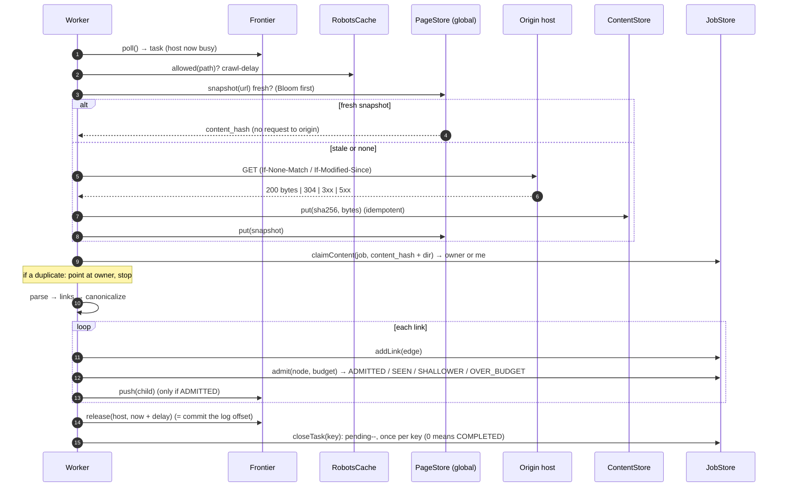

### 6.4 The core loop (what to code)

From [`CrawlEngine.java`](core/src/main/java/com/salesforce/einstein/webcrawler/engine/CrawlEngine.java),
trimmed:

```java
/** A link to a page. The edge is already recorded; this decides whether it becomes a node. */
private void follow(CrawlTask parent, CanonicalUrl c, int depth, int hops, CrawlRequest req) {
    if (depth > req.maxDepth()) return;                  // too deep: edge kept, node not created
    Optional<JobPage> known = jobs.page(parent.jobId(), c.hash());
    if (known.isPresent()) {
        if (known.get().depth() <= depth) return;        // already reached by a path this short
    } else {
        if (outOfScope(parent.jobId(), req.scope(), c)) return;
        if (traps.check(c).isPresent()) return;          // /a/a/a/…, 20+ segments, 10+ params
        if (!admitVariant(parent.jobId(), c)) return;    // ≤ 50 query variants per path
    }
    // hops: 0 for a link (it costs depth), +1 for rel=canonical (same depth, so it costs a redirect hop)
    enqueue(new CrawlTask(parent.jobId(), c, depth, parent.url().hash(), PAGE, hops, 0), req.maxPages());
}

private void enqueue(CrawlTask t, long budget) {
    switch (jobs.admit(JobPage.queued(t), true, budget)) {   // atomic: seen-test + budget + open task
        case ADMITTED    -> frontier.push(t);
        case SHALLOWER   -> relax(t);                         // shorter path to a known page (§7.7)
        case OVER_BUDGET -> jobs.markTruncated(t.jobId());
        case SEEN        -> { }                               // cycle or second link: nothing to do
    }
}
```

**`admit` is the whole correctness argument.** It is one atomic step: *if `(job, url_hash)` is
absent and the budget isn't spent, insert the node, bump the counter and open its task
(`pending++`)*. Two workers that discover the same URL at the same moment can't both win.
Completion is `pending == 0`. Each task is closed **once per key** (`url_hash#depth#attempt`),
however many times the log delivers it, so a replayed task can't end a job early.

---

## 7. The graph problems (24–36 min)

### 7.1 Large depth

| Guard | Where |
|---|---|
| **BFS, never recursion.** The frontier is a queue ordered by depth, so there's no stack, and memory is the frontier (the durable log, or disk), not the heap | `InMemoryFrontier` (depth, then FIFO) |
| **Depth is the shortest path**, not the first one found. Across hosts and nodes BFS is only approximate, so a later, shorter path lowers a node's depth and its children are re-followed ([§7.7](#77-what-can-be-processed-in-parallel)) | `relax()` |
| **`maxDepth`** is checked when a link is *discovered*. A too-deep link is kept as an **edge** but never becomes a node, so the result shows what lies beyond the boundary | `follow()` |
| **`maxPages`** is checked *in the same atomic step* as the seen-test, so the budget can't be overshot by races. BFS means a cut-off loses only the deepest, least valuable pages | `JobStore.admit()` |
| **Redirects don't consume depth**, but a chain is capped at 5 hops | `onRedirect()` |
| **Traps** are infinite *acyclic* graphs: calendars, `/a/a/a/…` relative-link bugs, faceted search. We cap path segments (20), repeated segments (3), query params (10) and **query variants per path (50 per job)** | `TrapDetector` |
| Assets are **leaves** at their page's depth, so `maxDepth` counts link hops between pages only | `addAsset()` |

> "Depth limits bound the graph *in hops*, budgets bound it *in size*, and trap detection bounds
> it where neither works: a site that generates a new URL on every page."

### 7.2 Circular dependencies

A → B → C → A, self-links, `../` loops and redirect loops all end the same way: **the second
arrival at a node is a `SEEN` from `admit()`**.

1. **Canonicalize first** (`UrlNormalizer`). `HTTPS://Site.com:443/a/./b#top`, `https://site.com/a/b`
   and `/a/b` relative to the page are one node. Without this the seen-test is useless.
2. **The atomic seen-test** per job: a cache `SADD` (returns 0 or 1) in production, `putIfAbsent`
   here.
3. **Keep the back-edge.** We still record A → C, so the result *shows* the cycle and the link
   rewriter can point it at our copy.
4. **Redirect loops** (A→B→A): the redirect target goes through the same seen-test; on top of
   that, a chain is capped at 5 hops.
5. **Content cycles** (the same page under endless URLs): the content-seen test, [§7.3](#73-same-page-content-varies-by-url-params).

Tested in `CrawlEngineTest.cyclesAreVisitedOnceButEdgesAreKept` and `redirectLoopTerminates`.

### 7.3 Same page, content varies by URL params

The hard truth is that the URL alone can't tell you. `?id=7` selects different content,
`?utm_source=x` doesn't, and `?sort=price` changes the order of the *same* items. So there are
four layers, from cheapest to most thorough:

| Layer | What it does | Catches |
|---|---|---|
| 1. **Normalize** | lower-case host, sort params, drop the fragment and default port, decode unreserved `%XX` | spelling variants |
| 2. **Static deny-list** | drop `utm_*`, `gclid`, `fbclid`, `sessionid`, `jsessionid`, … everywhere | tracking and session params |
| 3. **Learned per host** | `/p?x=1` returns **the same bytes** as `/p`: one vote that `x` is irrelevant on this host. Votes from **3 distinct values** and no counter-example drop `x` there; **one** counter-example keeps it forever. (Distinct values, so `?page=1` matching no `page` can't hide `?page=2`.) | site-specific junk (`ref`, `view`, `src`) |
| 4. **Content-seen test** | per job, insert-if-absent on `(content_hash, directory)`. The loser becomes `DUPLICATE → duplicateOf` and **is not parsed again**. The directory is in the key because relative links resolve against it | everything else: `/index.html` vs `/`, `?view=grid` |

Plus `<link rel=canonical>` (same depth, but it costs a redirect hop, so a canonical chain can't
walk the whole site at depth 0) and the trap detector's cap of 50 query variants per path.

**When the content *does* differ** (`?id=1` vs `?id=2`), they're separate nodes, as they should
be. When it differs only slightly (a timestamp, ads), an exact hash misses it. The production
answer is **SimHash** over the visible text (Hamming distance ≤ 3 out of 64 bits = near-duplicate),
stored next to the exact hash and used to flag rather than drop.

Storage stays sane either way: blobs are **content-addressed**, so 100 variants with identical
bytes are 1 blob and 100 small rows.

### 7.4 Static content: images, video, audio, CSS

| Decision | Why |
|---|---|
| Classify by element (`img`/`srcset` → IMAGE, `video` → VIDEO, `audio` → AUDIO, stylesheet → CSS, CSS `url()` → asset); the response **`Content-Type` wins** | `srcset`, CSS backgrounds and fonts are where regex crawlers miss assets |
| **Assets are leaves**: never parsed for links (except CSS, for `url()`/`@import`) and they **don't consume depth** | a page at `maxDepth` still renders with its images |
| **Scope applies to pages, not assets**: an in-scope page may load images from `cdn.other.com` | CDNs |
| **Policy per type**: `downloadAssets` (default IMAGE, CSS). Anything else is **`REFERENCED`**: URL, type and referrer recorded, never downloaded | a 2 GB video per page would dominate cost; most users need only the reference |
| **Size cap** (`maxAssetBytes`); the body is streamed and cut, and the node marked `TOO_LARGE` | memory safety. Production streams to the object store with multipart upload |
| **Content-addressed**: the logo on 1M pages is one blob, fetched **once per job** (seen-test) and **once globally while fresh** (snapshot reuse) | dedup at the storage and network layer |
| Streaming formats (`.m3u8`, `.mpd`) are recorded as VIDEO references; segment download is opt-in | HLS/DASH are thousands of files |

### 7.5 Already-visited content

Two different questions:

| Scope | Question | Answer |
|---|---|---|
| **Within a job** | have we seen this node? | the atomic seen-test (`admit` → `SEEN`). Exact, never a Bloom filter: a false positive would silently drop a page from a customer's result |
| **Across jobs** | did *anyone* fetch this URL recently? | ① the **Bloom filter** says "never crawled", so skip the lookup (most URLs). ② Otherwise read `url_records`; younger than `maxAgeSeconds` means **reuse the bytes without contacting the origin** (`REUSED`). ③ Otherwise a **conditional GET** with `If-None-Match`/`If-Modified-Since`; a `304` means reuse (cheap for the origin and for us) |

So a second job over the same site within the freshness window makes **zero** requests to the
origin (`CrawlEngineTest.secondJobReusesFreshSnapshotsWithoutTouchingTheOrigin`). Reused HTML is
reparsed from the stored blob, because *this* job's scope and depth may differ, so its children
are its own.

> **Tenancy caveat:** the global snapshot cache is for *public, anonymous* fetches only. A crawl
> with credentials or cookies gets a tenant-scoped `url_records` namespace, so one tenant's private
> page never satisfies another tenant's job. The cache is also never exposed through the API:
> `GET /v1/pages?url=` answers from `tenant_pages`, so a tenant can't learn what others crawl.

### 7.6 Serving crawled content: do we rewrite child references?

**Yes, but at read time, never in storage.** This covers both "view a crawled page" and "download
the crawled site and browse it". Every link, image, stylesheet, font and `srcset` inside a page
should open **our** copy whenever this crawl stored one, and the live site otherwise.

**Why not rewrite when we store the page?**
1. **The children don't exist yet.** BFS stores a page *before* its links are crawled, so at write
   time we don't know which references will have a local copy.
2. **The bytes are shared.** One content-addressed blob serves every job that crawled that page,
   and each job has a different set of crawled children (different depth, scope, budget). There is
   no single correct rewritten version.
3. **Fidelity.** The stored bytes are exactly what the origin sent: evidence, reparsing, diffing,
   reprocessing with a better parser later.

Rewriting is a **pure function of `(content_hash, job_id, mode)`**, so its output is cached at the
CDN and computed once.

**How a reference resolves:** canonicalize it exactly as the crawler did, look it up in **this
job's graph**, and follow `REDIRECT → redirect_to` and `DUPLICATE → duplicate_of` to the node that
holds bytes.

| Target in this job | Rewritten to |
|---|---|
| `FETCHED` / `REUSED` page | `/v1/crawls/{job}/pages/{hash}/content?links=snapshot` (export: `{hash}.html`) |
| `REDIRECT` (e.g. `/old` → `/new`) | our copy of `/new` |
| `DUPLICATE` (`/p?sessionid=9`) | the one stored copy of `/p` |
| `FETCHED` image / font / CSS | `/v1/crawls/{job}/pages/{hash}/content` (export: `../assets/{sha256}.png`) |
| not in the crawl (too deep, out of scope, `REFERENCED` video, failed) | **absolute URL to the live site**, using the author's original URL, not our canonical form |
| `#fragment`, `mailto:`, `javascript:`, `data:` | untouched; a fragment is kept on rewritten links (`guide.html#install`) |

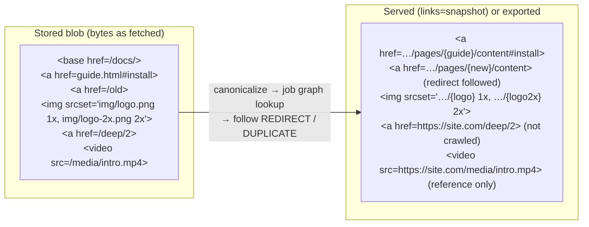

**Details that matter:**
- Remove `<base href>` once every reference has been rewritten, or the browser resolves our local
  links against it.
- Rewrite **CSS too**, both stylesheets and inline `style`/`<style>`: `url()` and `@import`
  are how fonts and background images load.
- Strip `integrity=` (SRI) and `crossorigin=` on any reference rewritten to our copy: rewritten CSS
  no longer matches the hash, and the copy is same-origin, so no CORS mode is needed.
- **Serve sandboxed from a separate origin** (`*.crawlcontent.example`, like `googleusercontent.com`)
  with `Content-Security-Policy: sandbox` and `nosniff`. Crawled pages contain arbitrary JavaScript,
  and on our API origin that would be stored XSS.
- **Offline export** (`GET /export`, async to the object store + a signed URL at scale) has this layout:
  `index.html`, `manifest.json` (URL → file), `pages/{urlHash}.html`, `assets/{urlHash}.css`, `assets/{sha256}.{ext}`.
  It uses relative links (`other.html`, `../assets/x.png`). Identical asset bytes are one file,
  and redirects and duplicates are pointers, not files.
- **Limit:** URLs that JavaScript builds at runtime can't be rewritten statically. Archive-grade
  replay (pywb/wombat) injects a client-side shim that patches `fetch`/`XMLHttpRequest`. Name it
  as an extension.

Tested in `CrawlResultsTest` (snapshot, absolute and raw modes; redirects; duplicates; CSS; export ZIP).

### 7.7 What can be processed in parallel?

**A link is not a dependency.** Fetching `/b` needs only `/b`'s URL; it does not wait for the page
that linked to it, or any other page, to *finish*. So **every discovered URL is ready at once**, on
whichever node owns its host. The graph only tells us *what exists*; it imposes no processing order.

| Work | Independent? | What coordinates it |
|---|---|---|
| Two pages on **different hosts** | **yes**, fully parallel, on any nodes | nothing |
| Two pages on the **same host** | no: one at a time, spaced by the delay | the host's single owner (frontier partition), not a lock |
| Two parents linking to the **same child** | the parents yes; the child is created once | atomic `admit()` (seen-test) |
| Two URLs with the **same bytes** | yes; only one is expanded | atomic `claimContent()` |
| Children vs the **budget** | yes; the last slots are raced for fairly | budget counter inside `admit()` |
| A **cycle** A → B → A | yes; the second arrival is a no-op | `admit()` returns `SEEN` |
| A node's **depth** | no: it's the shortest path, which may show up later | `admit()` returns `SHALLOWER` + **relaxation** |
| Job **completion** | n/a | `pending` per task key, the last close wins the CAS |

So the only shared state is a handful of **atomic, per-job operations** (`admit`, `claimContent`,
`openTask`/`closeTask`, the variant counter), all on one cache shard per job. Everything else
(fetch, parse, store bytes, write edges) is embarrassingly parallel and idempotent.

**The one real ordering problem is depth.** One worker on one host gives exact BFS. Many hosts
and many nodes give only *roughly* BFS: a fast chain `S → A1 → A2 → T` can reach `T` at depth 3
before a slow page `B` reports `S → B → T` (depth 2). If depth were "first path found", `T`'s
children would be cut by `maxDepth` depending on which server was quicker. We define depth as the
**shortest path** and fix it incrementally, like an edge relaxation in Dijkstra/Bellman-Ford:

1. `admit()` sees a known page at a smaller depth: it lowers the depth and returns `SHALLOWER`
   (no budget charged, no new node).
2. `relax()`: if the page was already expanded, it is **re-expanded from its stored bytes** (no
   refetch) so its children are offered the shorter path too. A duplicate or redirect passes the
   depth to its target.
3. If the page is still queued, or **being fetched right now**, the discoverer can't relax anything:
   the page has no children yet. So the fetching worker does the other half (`catchUp()`): *after*
   writing the final status (FETCHED / DUPLICATE / REDIRECT) it re-reads the depth, and relaxes if
   it dropped. The discoverer lowers the depth and then reads the status; the worker writes the
   status and then reads the depth. Both go through the same row, so at least one of them sees the
   other's write, and a drop can't fall in the gap.
4. **A depth is never raised.** Lowering is atomic on the current row (not a write-back of a copy
   read earlier, which could erase a FETCHED written meanwhile), and a worker's status write
   never sets the depth column.
5. It terminates: a depth only decreases, at most `maxDepth` times per node.

Tested in `DistributedCrawlTest`: `aShorterPathFoundWhileFetching…` (the drop arrives mid-fetch),
`aPageProcessedAtTheWrongDepthIsReExpanded` (after expansion), and
`aRedirectWhoseDepthDropsMidFetchPassesItToTheTarget`.

**Why not SCC + topological sort (Tarjan, then Kahn's waves)?** That technique schedules a
**dependency graph**: build targets or module imports, where a node can't start until everything
it depends on is done. Two things would have to hold for it to help a crawl, and neither does.

**1. Can we build the graph before processing?** Extracting a page's links gives its out-edges,
but only *after* that page is fetched. The children's own links are unknown until *they* are
fetched. So "extract first, then schedule" means fetching every page to learn the graph, and that
is the crawl itself. Done one level at a time it becomes "fetch level k, extract, schedule level
k+1", which is exactly the BFS the frontier already does. Sorting adds nothing on top.

Sometimes part of the graph *is* known up front: a `sitemap.xml`, or the previous run of a
recurring job. Even then we just enqueue those URLs, because of point 2.

**2. Even with the whole graph, an edge is not a dependency.** `A → B` means "A mentions B". To
fetch B we need only B's URL, which we have the moment A is parsed. B never waits for A to
*finish*, or for A's other children. With no "must finish before" relation there's nothing to
order, so every discovered URL is ready immediately. That's finer-grained than Kahn's waves, which
would hold B back until its whole level is done.

Kahn's waves would also compute the **wrong depth**. A node's wave is its *longest* path from the
seeds (it waits for all its parents), but `maxDepth` is about the *shortest* path: "within 2
clicks of the seed". If `S → A → B` and `S → B`, B is at depth 1 for the crawl, but at wave 2.

**What really constrains the order** is shown below. None of these is a precedence between pages:

| Constraint | Kind | How we handle it |
|---|---|---|
| One request at a time per host, plus the delay | a **resource** limit (mutual exclusion), not an order | one partition owner per host + back queues |
| Depth ≤ `maxDepth` | a **shortest path**, found incrementally | BFS order + relaxation (above) |
| Cycles | would loop forever | the seen-test turns the second arrival into a no-op, so there's no need to collapse cycles |

**Where an SCC really would be needed.** Rewriting links for offline browsing is the one place
where a page needs something from its children: their final addresses. If a rewritten page were
named by its own content hash (as in a Merkle tree), a page would need its children's names before
its own name existed. A cycle `A ↔ B` would make that impossible without first collapsing the SCC.
We avoid the problem by naming files by **`url_hash`**, which is known before anything is fetched,
and by rewriting at read/export time ([§7.6](#76-serving-crawled-content-do-we-rewrite-child-references)).
So that dependency never reaches the scheduler.

SCCs *are* useful **after** the crawl, on the stored `page_links`: a huge SCC of query-string
variants points to a trap, and the condensation (the DAG of SCCs) is a good site map for
analytics. That is a batch job over the stored graph, not part of the crawl.

---

## 8. DB model (36–42 min)

### 8.1 Where the graph and the content live

**Two rules.** The **graph** is two wide-column tables: one row per node (`job_pages`) and one row
per edge (`page_links`, an adjacency list keyed by the source node). **All bytes** (HTML, CSS,
images, video, audio) go into the **object store**, keyed by their SHA-256. Graph rows hold only
a pointer (`content_hash`) to the bytes, never the bytes themselves.

**Worked example.** Job `J1` crawls `https://example.com/` with `maxDepth = 1`. The home page links
to `/about`, `/logo.png`, `/style.css` and `https://other.com/`, which is out of scope. `/about`
links back to `/` and also shows `/logo.png`.

**Nodes:** `job_pages`, one row per URL in this job (hashes shortened).

| job_id | url_hash | url | type | depth | status | content_hash |
|---|---|---|---|---|---|---|
| J1 | `h_home` | `https://example.com/` | PAGE | 0 | FETCHED | `c_9f2a` |
| J1 | `h_about` | `https://example.com/about` | PAGE | 1 | FETCHED | `c_41bd` |
| J1 | `h_logo` | `https://example.com/logo.png` | IMAGE | 0 | FETCHED | `c_77e0` |
| J1 | `h_css` | `https://example.com/style.css` | CSS | 0 | FETCHED | `c_d3c1` |

`https://other.com/` has **no node**. It is out of scope, so it exists only as an edge.

**Edges:** `page_links`, one row per link found, *including* the back-edge and the out-of-scope link.

| job_id, from_hash (partition) | to_hash | raw_href | type |
|---|---|---|---|
| J1, `h_home` | `h_about` | `/about` | PAGE |
| J1, `h_home` | `h_logo` | `logo.png` | IMAGE |
| J1, `h_home` | `h_css` | `/style.css` | CSS |
| J1, `h_home` | `h_other` | `https://other.com/` | PAGE (no node: served as the live absolute URL) |
| J1, `h_about` | `h_home` | `/` | PAGE (back-edge, not re-fetched) |
| J1, `h_about` | `h_logo` | `/logo.png` | IMAGE (already seen: edge only) |

**Bytes:** the object store holds four immutable objects, whatever their type.

| Object key | Bytes | Referenced by |
|---|---|---|
| `9f/9f2a…` | home page HTML, exactly as fetched | `job_pages(J1, h_home)` |
| `41/41bd…` | `/about` HTML | `job_pages(J1, h_about)` |
| `77/77e0…` | the PNG | `job_pages(J1, h_logo)`, and every later job that sees this logo |
| `d3/d3c1…` | the CSS | `job_pages(J1, h_css)` |

The object has no metadata of its own that we depend on. `content_type`, `size` and
`http_status` sit on the `job_pages` row, which is where the API reads them.

**Where the other tables fit:**
- `url_records` (the `PageSnapshot` entity) is the **global** "latest fetch of this URL" row:
  `url_hash → content_hash, etag, fetched_at`. When job `J2` crawls `example.com` an hour later, it
  finds a fresh row, writes its own `job_pages` rows pointing at the **same** `c_9f2a` object, and
  never contacts the origin (`REUSED`).
- `tenant_pages` is the same idea per tenant, for the API's "have we crawled this?".
- A duplicate (`/index.html` with the same bytes as `/`) gets a node row with
  `status = DUPLICATE, duplicate_of = h_home`, and no new object.

**Reading it back:**
- *List the graph:* scan `job_pages` for `J1`, in BFS order through `job_pages_by_order`.
- *A node and its out-links:* one point read on `job_pages`, plus one partition read on
  `page_links (J1, h_home)`.
- *View the page:* `content_hash → GET 9f/9f2a…`, then rewrite each `raw_href` using J1's
  graph ([§7.6](#76-serving-crawled-content-do-we-rewrite-child-references)).
- *Download:* the export job walks the same rows and writes one ZIP back to the object store
  (`exports/{job}.zip`), handed out as a signed URL.

**Why not a graph database?** We never run multi-hop queries over stored data. The BFS happens
in the frontier *while crawling*. Afterwards there are only two reads: "a job's nodes, paged" and
"one node's out-edges". Both are single-partition reads in a wide-column store, which also absorbs
~20k writes/s and drops a whole job at retention. A graph DB adds cost and no capability we use.
(If analysts want PageRank-style queries, export `page_links` to a warehouse.)

### 8.2 Access patterns, then stores

| Access pattern | QPS (peak) | Store and key |
|---|---|---|
| Seen-test + budget per discovered link | ~175k/s | **KV cache** (Redis protocol) `admit.lua` on `wc:{job}:nodes` + counters, one atomic script, hash-tagged by job |
| Write a node / update its status | ~20k/s | **Wide-column** (CQL) `job_pages` PK `((job_id, bucket), url_hash)`, bucket = `url_hash[0:2]` |
| List a job's nodes in BFS order (paged) | low | `job_pages_by_order` PK `((job_id, bucket), seq)` |
| Out-edges of a node | ~3.5k/s write, low read | **Wide-column** `page_links` PK `((job_id, from_hash), to_hash)` |
| "Already crawled?" by URL (engine, all tenants) | ~14k/s | **Bloom** → **Wide-column** `url_records` PK `url_hash` |
| "Have *we* crawled this?" (API, one tenant) | low | **Wide-column** `tenant_pages` PK `(tenant_id, url_hash)` |
| Store or read bytes (pages *and* assets) | ~7k/s | **Object store** key `sha256[0:2]/sha256` |
| Jobs: create, status, idempotency, list per tenant | low, transactional | **Relational** (PostgreSQL) `crawl_jobs`, unique `(tenant_id, idempotency_key)` |
| robots.txt and per-host politeness state | per host | **KV cache** + `hosts` table |
| Learned param rules | rare writes, hot reads | `url_param_rules`, cached in every worker |

**Why this split:** jobs are few, relational and need uniqueness and CAS on status, so a relational database.
The graph is huge, append-mostly, always read by `job_id` and never joined, so a wide-column store
partitioned by job. Bytes are immutable and large, so object storage. The seen-test is the hottest
path and needs atomic set-insert, so an in-memory key-value cache with atomic scripts.
The table names capabilities on purpose: [PORTABILITY §2](docs/PORTABILITY.md#2-mapping-to-providers)
maps each to AWS, GCP, Azure and self-hosted products.

### 8.3 ER diagram

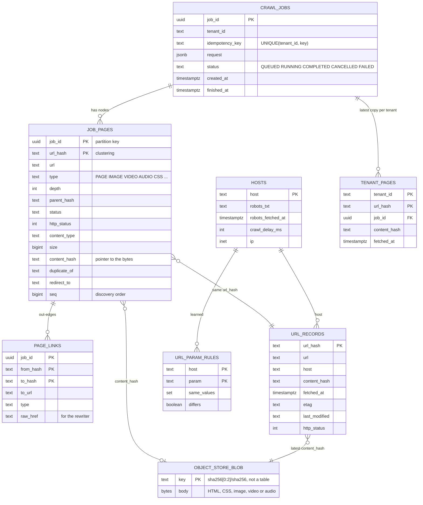

`OBJECT_STORE_BLOB` is drawn for clarity; it is an object in the bucket, not a database table.
Full DDL (PostgreSQL + CQL) is in [DESIGN-DETAILED §3](docs/DESIGN-DETAILED.md#3-data-model-ddl).

**Things to say:**
- "`job_pages` stores a **pointer** (`content_hash`), not the bytes, so a duplicate costs one row."
- "`page_links` keeps `raw_href`, which is exactly what the rewriter must replace."
- "Partition by `job_id` everywhere: one job's graph is one range scan, and deleting a job at
  retention is dropping its partitions. A 1M-page job is too wide for one partition, so `job_pages`
  is bucketed: `(job_id, url_hash[0:2])` for point reads, and `job_pages_by_order` uses
  `(job_id, seq / 10k)` for ordered listing."
- "`url_records` is global and keyed by `url_hash`. That's the cross-job dedup, and also where a
  continuous recrawler would keep `next_fetch_at`."

---

## 9. High-level design, one use case at a time (42–52 min)

Draw each in turn; each adds only the boxes it needs. [§10](#10-the-big-picture) merges them.

| View | Use case | Adds |
|---|---|---|
| A | Submit a crawl (sync / async) | gateway, API tier, relational DB, frontier topic, job-done bus |
| B | Schedule: priority and politeness | front queues, host-partitioned back queues, robots/DNS cache |
| C | Fetch and parse | fetchers, the `fetched` topic, parsers, object store |
| D | Dedup and already-visited | KV-cache seen-sets, content claims, Bloom, `url_records` |
| E | Assets (image, video, audio) | asset policy, the leaf path, multipart to the object store |
| F | View and download results | results API, rewriter, CDN, export workers |
| G | Completion, cancel, webhooks | pending counters, reconciler, webhook outbox |

#### A. Submit a crawl

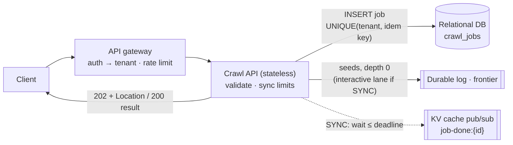

#### B. Scheduling: priority and politeness

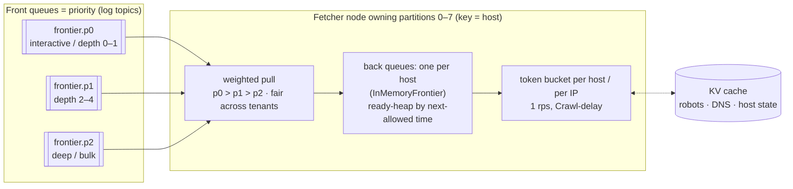

The frontier topics are **keyed by host**, so one partition (and therefore one fetcher) owns each
host. Politeness is then a local, in-memory decision, with no distributed lock. That is exactly
what `InMemoryFrontier` implements for the partitions a node owns. `KafkaFrontier` adds the
host → partition → node mapping and the handover on a real log, and `PartitionedFrontier` does the
same in-process for the tests ([§11.1](#111-partitioning-and-scaling-out)).

> **As built:** the Kafka adapter has **one** topic (`crawl.frontier`) keyed by host. BFS order
> within a host comes from the back queue, which serves the shallowest task first. The p0/p1/p2
> lanes above are a deployment option: one `KafkaFrontier` per band, behind a weighted pull. They
> matter once interactive and bulk crawls compete for the same hosts, and they are not built.

#### C. Fetch and parse

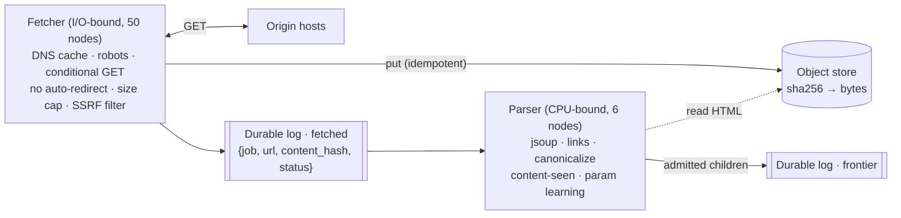

Fetching and parsing are split because they scale on different resources (sockets vs CPU), and so
a parser bug or a slow parse never holds a host's politeness slot.

#### D. Dedup and already-visited

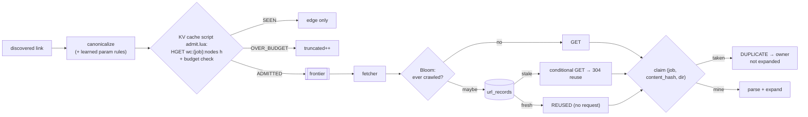

#### E. Assets

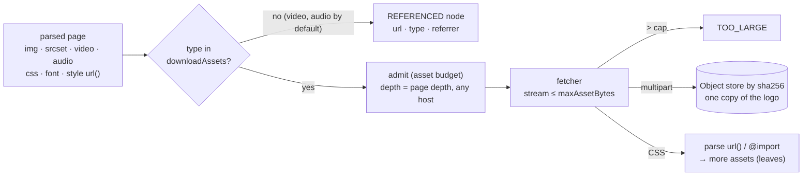

#### F. View and download results

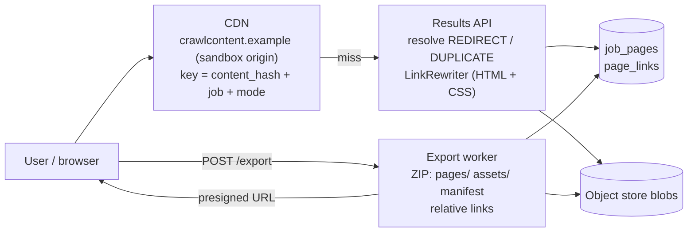

#### G. Completion, cancel, webhooks

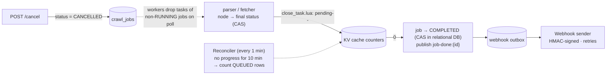

---

## 10. The big picture

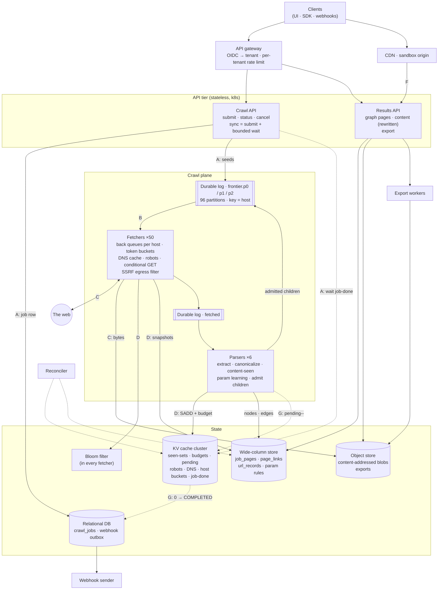

### 10.1 Cloud-agnostic by construction

Every box above is a **capability**, not a product. The engine talks to ports (`Frontier`,
`JobStore`, `PageStore`, `ContentStore`, `Fetcher`), and `crawler.adapters.*` picks the
implementation. The defaults use **open wire protocols that every cloud sells as a managed
service**, so the adapter for each is the same code everywhere. Only the object store needs one
small adapter per cloud.

| Capability (contract) | Default protocol | AWS | GCP | Azure / self-hosted |
|---|---|---|---|---|
| Durable log: partition by key, one consumer per partition | Kafka API | MSK | Managed Service for Apache Kafka | Event Hubs (Kafka API) / Strimzi |
| KV cache: atomic scripts, TTL | Redis protocol | ElastiCache / MemoryDB | Memorystore | Azure Cache for Redis / Valkey |
| Wide-column: range scan, conditional write | CQL | Keyspaces | Astra / Scylla on GKE (or Bigtable adapter) | Cosmos DB Cassandra API / Cassandra |
| Relational: unique, CAS | PostgreSQL | RDS / Aurora | Cloud SQL / AlloyDB | Azure Database for PostgreSQL |
| Object store: put/get/exists, signed URL | **per-cloud adapter** | S3 | Cloud Storage | Blob Storage / MinIO |
| Compute and egress | Kubernetes + NAT | EKS | GKE | AKS / k8s |

> "Switching from AWS to GCP is a different adapter jar and a Spring profile. The engine, API, data
> model and diagrams don't change. Where providers differ in *semantics*, the port absorbs it. For
> example, Pub/Sub has no exclusive consumer per key, so a Pub/Sub frontier adapter would add a
> per-host lease in the cache to keep politeness."

The full mapping, semantic differences, adapter skeletons and contract tests are in
[docs/PORTABILITY.md](docs/PORTABILITY.md).

---

## 11. Scaling, failures and three scenarios (52–57 min)

### 11.1 Partitioning and scaling out

| Thing | Partition key | Why |
|---|---|---|
| Frontier | **host** → one of P partitions (fixed hash); partition → node by the consumer group | one owner per host means politeness without coordination |
| Seen-sets, budgets, pending | **job** (cache hash tag `{job}`) | the seen-test + budget is one atomic Lua script on one shard |
| `job_pages`, `page_links` | **job** (+ bucket) | results are read per job; retention drops partitions |
| `url_records`, Bloom | **url_hash** | uniform; the global lookup is a point read |
| Blobs | **content_hash** | the object store spreads keys by prefix |

**Yes, the crawl is distributed, and this is what makes it scale.** Two levels of mapping:

1. **Host → partition** is a fixed hash, like a producer's record key (P = 96). It never changes,
   so a host's tasks always land in one partition, in order.
2. **Partition → node** is the consumer group's assignment. `KafkaFrontier` uses Kafka's
   **cooperative sticky assignor**; `PartitionedFrontier` uses **rendezvous (highest-random-weight)
   hashing**. Both give the property consistent hashing gives: adding a 5th node moves only about
   1/5 of the partitions, all *to* the new node; removing one moves only its partitions. Nothing
   else reshuffles (`DistributedCrawlTest.addingANodeMovesOnlyItsShare`). Because the assignor is
   cooperative, the other nodes keep fetching during a rebalance.

**The cluster.** Fetcher nodes own partitions, not jobs. One job's pages spread over every node
whose partitions hold its hosts. The nodes never talk to each other: they meet only in the log and
in the shared stores.

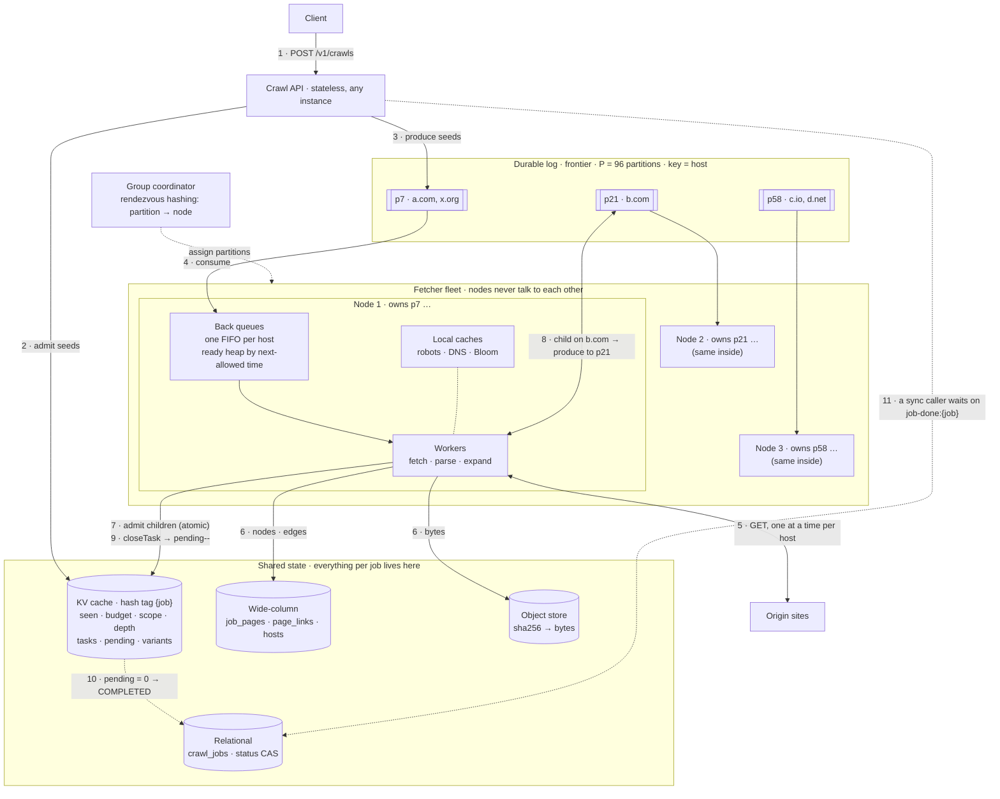

How one job moves through it:

1. The API admits the seeds in the KV cache and produces one task per seed, keyed by host. It
   stores nothing locally, so any API instance can take any request.
2. `a.com` hashes to p7, which rendezvous hashing assigns to node 1. Node 1's back queue for
   `a.com` gives one task at a time, no earlier than the host's next-allowed time.
3. A worker fetches the page, stores the bytes, parses it, and admits every link in one atomic
   script (seen-test + budget + depth + open task). An admitted link to `b.com` is produced to
   **p21**, so **node 2** crawls it. Node 1 never contacts `b.com`, which is how per-host
   politeness holds without a distributed lock.
4. Node 1 then releases `a.com` (sets its next-allowed time), commits the offset, and closes the
   task (step 9).
5. When the last open task closes, `pending` hits 0. The status CAS in the relational DB completes
   the job exactly once, and `job-done:{job}` wakes a synchronous caller wherever it is waiting.

Parsing is drawn inside the worker for brevity; in production it runs on its own CPU-bound tier
([§9C](#c-fetch-and-parse)).

**What runs this in the repo.** The engine is the same in every row; only `crawler.adapters.*`
changes.

| Port | Distributed adapter (module) | In-process stand-in | Tested by |
|---|---|---|---|
| `Frontier` | `KafkaFrontier` (`webcrawler-adapter-kafka`): a consumer in a group on one topic keyed by host, feeding an `InMemoryFrontier` as the node's back queues. An offset is committed only after `release`, at the lowest offset still outstanding | `PartitionedFrontier` | `KafkaFrontierTest` (3 nodes on a real broker: spread, a node killed mid-fetch, politeness across a handover) |
| `JobStore` | `RedisCqlJobStore` (`webcrawler-adapter-redis-cql`): Lua scripts on Redis for the hot state; Cassandra for `job_pages`, `job_pages_by_order`, `page_links`, `tenant_pages`; Postgres for `crawl_jobs` | `InMemoryJobStore` | `JobStoreContract`: the same 15 tests against both stores |
| `HostSchedule` | `RedisHostSchedule`: `wc:host:{host}` → next-allowed time, expiring when it passes | `InMemoryHostSchedule` | `RedisCqlJobStoreTest`, `KafkaFrontierTest` |
| `ContentStore` | `FileSystemContentStore` on a shared volume (an object-store adapter per cloud is the production one) | `InMemoryContentStore` | `FileSystemContentStoreTest` |
| all of them | `TwoNodeCrawlTest` (`webcrawler-it`): two Spring Boot nodes of the unchanged app on Kafka + Redis + Cassandra + Postgres. A job posted to node A is crawled by both nodes, read back over HTTP on node B, and is idempotent across them | | |

The Lua scripts do what the in-memory store does under one lock, and they do it atomically:
- `admit.lua`: the seen-test, the budget, lowering the depth, and opening the task.
- `open_task.lua` and `close_task.lua`: `pending` changes once per task key.
- `node_state.lua`: exact per-status counters.

Every key of a job is `wc:{job}:…`. The hash tag puts them on one Redis Cluster slot, which is
what lets one script touch all of them. Depth has a subtlety: Redis is authoritative while the
job runs. Cassandra's copy is written with a timestamp derived from the depth (a smaller depth
gets a larger timestamp), so last-write-wins keeps the shortest path whatever order the writes
land in.

Each node runs an `InMemoryFrontier` over the partitions it owns (its back queues), plus its own
workers, robots cache and Bloom filter. Everything that must be *shared* is in the stores:

| State | Where | Why it can't be node-local |
|---|---|---|
| Seen-set, budgets, scope, variant counts, task keys, `pending` | KV cache, `{job}` hash tag | a job's pages are on many nodes |
| Job status, terminal event | relational CAS + `job-done:{job}` pub/sub | a sync caller waits on node A while node B finishes |
| Graph, snapshots, bytes | wide-column, object store | read by the API tier |
| Host's next-allowed time | `HostSchedule` (cache key `wc:host:{host}`) | survives a partition handover, so a rebalance can't burst a host. While a fetch is in flight it holds a **lease** (now + 30 s), so the new owner waits out a request the old owner may still be making |

**To scale:** add fetcher nodes (they join the group and take their share), add log partitions
only when nodes outnumber them (P bounds parallelism, so we start with 96), and shard the cache
by job. There's no coordinator in the hot path. Fetchers can also run **in several regions**, each
consuming the partitions of hosts near it, with job state in the tenant's home region.

**A node dies mid-fetch.** Its partitions move to a live node, and its uncommitted work is
replayed there. Task keys make the replay safe:

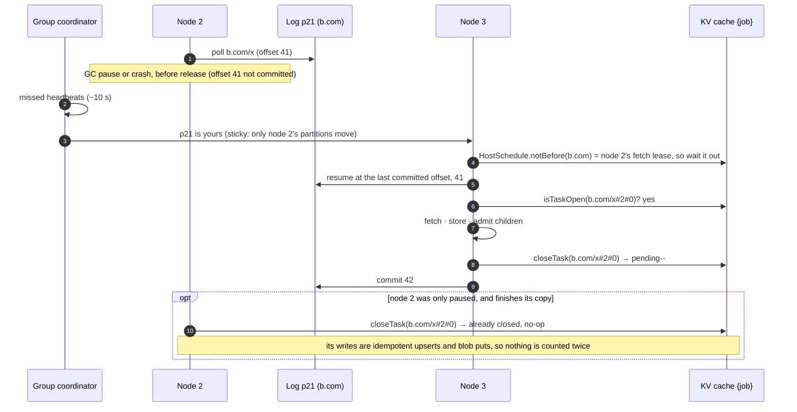

Adding a node is the same handover without the failure. The new node takes ~1/N of the
partitions; the old owners finish (drain) what they already hold, and the new owner skips those
offsets.

Tested in `DistributedCrawlTest` (in-process) and in `KafkaFrontierTest` (a real broker):
- Three engines share one job.
- Every host is fetched by exactly one node, the owner of its partition, and never twice at once.
- Every page is fetched once cluster-wide, and `await` on one node returns when another finishes.
- A node killed mid-fetch loses no work and counts nothing twice. Its survivor waits out the lease
  before touching the host.

### 11.2 Failure handling

| Failure | What happens |
|---|---|
| **Fetcher crashes mid-task** | Offsets weren't committed, so its partitions move to another fetcher and the tasks are redelivered. Every step is idempotent (blob put by hash, upserts), and `pending--` happens *once per task key* (`closeTask`), so a redelivery, or the "dead" node waking up and finishing too, can't decrement twice |
| Parser crashes | the same: `fetched` is redelivered, and the blob is already in the object store |
| 5xx / timeout / 429 | retried ≤ 3 times with exponential backoff **on the host** (2 s, 4 s, 8 s), so we don't hammer a struggling site. 404/403 are final |
| robots.txt 5xx | treat as disallow-all for 10 min (RFC 9309), then retry. A robots.txt redirect is followed up to 5 hops |
| Cache shard lost | seen-sets rebuilt from `job_pages` for running jobs. During the gap a URL may be fetched twice, which is a duplicate *fetch*, never a wrong result (upserts are idempotent) |
| Lost `pending` counter / stuck job | the **reconciler** counts `QUEUED` rows for jobs with no progress for 10 min and repairs or completes them |
| Hostile site (slowloris, 10 GB response) | an overall deadline covering headers **and** body, size cap, stream cancelled at the cap, `TOO_LARGE` |
| Seed or redirect to `169.254.169.254`, `10.x`, `localhost` | **SSRF egress filter** on the resolved IPs, on every redirect hop and on webhook callbacks; fetchers egress from a subnet with no internal routes (closes DNS rebinding) |

### 11.3 Scenario: a new URL is discovered

The parser extracts `href="../guide?utm_source=x#top"` and canonicalizes it to
`https://docs.example.com/guide`. It writes the edge row, then runs `admit.lua`:
`wc:{job}:nodes` has no entry for the URL and the budget is OK, so it records the depth, opens the
task key and does `pending++`. Then it produces to the frontier topic, keyed by host, and ACKs. The fetcher that owns the host's partition adds it to the host's back
queue. When the host's token bucket allows, it fetches, stores the blob, and publishes to
`fetched`.

### 11.4 Scenario: one domain with 10M pages

- **Politeness is the bottleneck:** at 1 rps, 10M pages take 115 days. The levers: robots
  `Crawl-delay` (if lower), a **verified-owner fast lane** (the tenant proves ownership with a DNS
  TXT record, and we allow N concurrent connections), **sitemaps** for discovery without crawling
  every list page, and `maxAgeSeconds` reuse for unchanged pages (304s are cheap).
- **The hot partition:** one host is one partition, and its back queue would hold millions of
  tasks. The fetcher **spills** the per-host queue to local disk and **pauses** the log
  partition (backpressure) rather than buffering in heap.
- **Fairness:** that tenant's job doesn't block others. Different hosts are on different
  partitions, and the front queues are drained with weighted fair queuing per tenant.

### 11.5 Scenario: a worker dies holding 200 in-flight URLs

The consumer-group rebalance moves its partitions within the session timeout (~10 s). The new owner
re-reads from the last committed offset, so a few already-done tasks repeat. A repeat whose task key
is already closed is skipped; one that was really in flight is redone, idempotently. No URL is
lost, and no counter is double-decremented, even if the "dead" worker was only paused and finishes
its copy later (`DistributedCrawlTest.aNodeDyingMidFetchLosesNoWorkAndCountsNothingTwice`).

---

## 12. Trade-offs and wrap-up (57–60 min)

| Decision | Gave up | Why it's right here |
|---|---|---|
| Async by default; sync only within hard limits, then fallback | simplicity of "just return the result" | politeness makes real crawls take hours; small interactive calls still get a one-shot answer |
| **Exact** per-job seen-set (KV cache) instead of a Bloom filter | memory (~40 B/URL vs ~1.2 B) | a Bloom false positive silently drops a customer's page. Bloom is used only as a *negative cache* for the global lookup |
| BFS | DFS's tiny frontier | shallow pages first; budget cut-offs lose the least valuable pages |
| Canonicalize aggressively + learn params | may merge two pages that really differ (rare; one counter-example reverses it) | without it, parameter spaces are infinite |
| Content-addressed blobs | can't delete one job's bytes in isolation (refcount or retention by last reference) | massive dedup; idempotent writes; no coordination |
| Rewrite links at read time | CPU per view (cached at CDN) | stored bytes stay faithful and shareable; the result is correct for each job |
| Host-partitioned frontier | hot partitions for huge sites | politeness with no distributed locks |
| Ports + open protocols instead of each cloud's native services | some managed-service conveniences (e.g. DynamoDB on-demand, Pub/Sub push) | the same design and code run on AWS, GCP, Azure or on-prem; only the blob adapter is per cloud |
| No JS rendering by default | SPAs show little content | 10–50× cost; opt-in headless pool |

> **Close:** "The crawl is one loop made correct with canonical URLs and an atomic seen-test that
> also enforces depth and budget. Scale comes from partitioning that loop by host for politeness
> and by job for state. The user sees a graph they can browse offline, because links are rewritten
> against that job's graph when they read it."

---

## 13. Likely questions

**Why not a Bloom filter for the seen-set, like the textbook?** For a web-scale search crawler,
skipping 1% of URLs is fine. For a customer's crawl it isn't: the result would silently miss pages.
The per-job set is bounded by `maxPages + maxAssets`, so it's affordable as an exact set. We use
Bloom where false positives are harmless: as a negative cache in front of `url_records`.

**How do you know the crawl is finished?** `pending` counts open tasks. Admission opens a task in
the same atomic step as the seen-test; a retry opens a new key; and each key is closed at most
once, however often the log redelivers it. Children are admitted *before* the parent's task is
closed, so the counter can't touch zero while work remains. The reconciler is the safety net.

**JavaScript-heavy sites?** An opt-in `render: true` sends PAGE tasks to a headless-Chromium pool
(≈ 1–3 s and ~200 MB per page, 10–50× the cost of a plain fetch). It captures the post-render DOM
and any XHR/fetch URLs as additional links. It's priced and quota'd separately.

**Recrawl and freshness for a continuous crawler?** `url_records.next_fetch_at` is driven by the
observed change rate: halve the interval when the content hash changed, double it when it didn't
(bounded 1 h to 30 d). A scheduler scans due URLs into `frontier.p2`. A conditional GET makes an
unchanged page nearly free.

**Same content on http and https, or www and non-www?** Different canonical URLs, so the
content-seen test makes one of them `DUPLICATE`. Optionally the host-alias rule is learned like a
param rule.

**How would you move this from AWS to GCP?** Nothing in the engine or API changes. The Kafka,
Redis, CQL and PostgreSQL adapters talk open protocols, so they point at the GCP managed equivalents.
`content-store: object-store` picks the GCS adapter instead of the S3 one. The blobs copy over
unchanged because every adapter uses the same `ab/{sha256}` key layout. The same contract tests
run against both.

**Why record edges to nodes you didn't visit?** The result is a graph, so users want to see what's
beyond the boundary. And the rewriter needs the edges to make those links absolute.

**Multi-region?** Fetchers run near the hosts they crawl (geo-partitioned frontier); job state stays
in one home region per tenant. Bytes are written to the local region's bucket and replicated
asynchronously.

**Legal and ethical?** We honour robots and `<meta robots>`, identify ourselves in the `User-Agent`
with a contact URL, respect 429/`Retry-After`, have no CAPTCHA bypass, and keep a takedown and
opt-out list per host.

---

## 14. Pitfalls that cost points

1. **No politeness**: per-host rate and robots are non-negotiable.
2. **Seen-test after the fetch**, or not atomic: two workers fetch the same page; budgets overshoot.
3. **No canonicalization**: the seen-test can't catch `?utm_source` or `#frag` variants.
4. **Recursion or DFS for depth**: stack overflow, or a budget spent in one deep branch.
5. **Following redirects inside the HTTP client**: redirect targets skip the seen-test, and loops spin.
6. **Treating images and video like pages**: they eat depth, get parsed, and 2 GB videos get
   downloaded.
7. **Rewriting links in the stored bytes**: wrong for every other job, and impossible before the
   children are crawled.
8. **Serving crawled HTML from the API origin**: stored XSS.
9. **A sync API with no bound**: connections held for hours.
10. **Forgetting SSRF**: a seed of `http://169.254.169.254/` steals cloud credentials.

---

## 15. One-screen cheat sheet

```
NODE ID       canonical URL → 128-bit hash     (lower host, sort params, drop frag/tracking/learned)
SEEN-TEST     admit.lua: seen + budget + depth + open task      → ADMITTED | SEEN | SHALLOWER | OVER_BUDGET
DEPTH         shortest path (relaxed if a shorter one arrives); depth+1 > maxDepth → edge only; assets = parent's depth
PARALLEL      links aren't dependencies: every URL is ready when found; same host = serialized; no SCC/topo sort
CYCLES        second arrival = SEEN; back-edge kept; redirect hops ≤ 5
PARAMS        normalize → deny-list → learned (same bytes ×3) → content-seen (DUPLICATE, not expanded)
TRAPS         ≤20 segments, ≤3 repeats, ≤10 params, ≤50 variants/path/job
ASSETS        leaves; scope = pages only; IMAGE+CSS downloaded; VIDEO/AUDIO referenced; size cap; sha256
REVISIT       job: exact seen-set | global: Bloom → url_records fresh? reuse : conditional GET (304)
SERVE         read-time rewrite via job graph; REDIRECT/DUPLICATE followed; else absolute live URL
EXPORT        ZIP: pages/{urlHash}.html, assets/{urlHash}.css, assets/{sha256}.ext, relative links, manifest.json
SYNC/ASYNC    SYNC ≤ depth 1, ≤ 25 pages, ≤ 30 s → else 202 + jobId (same pipeline)
FRONTIER      KafkaFrontier: host → partition (fixed) → node (sticky assignor) · back queue per host, depth-first-served · ~1/N moves per node · lease in HostSchedule
STORES        relational: jobs · KV cache: seen/budgets/pending · wide-column: graph = job_pages (nodes) + page_links (edges), url_records · object store: ALL bytes (HTML+assets) by sha256
PORTABLE      ports + crawler.adapters.* · open protocols (Kafka API, Redis, CQL, Postgres) · only blob adapter per cloud
SCALE         ~14k fetch/s peak · 50 fetchers · 6 parsers · ~3.5 TB/day blobs · 175k seen-tests/s
FAILURE       commit after release · replay to new owner · idempotent steps · pending-- once per task key
```

---

## 16. Comparison with the systemdesignsandbox reference

The [reference design](https://www.systemdesignsandbox.com/learn/design-web-crawler) targets a
**web-scale search crawler**. This design is a **multi-tenant crawl service**. Both share the core
pillars; the differences come from who consumes the output.

| Topic | Reference | This design | Why the difference |
|---|---|---|---|
| Frontier | two-level: priority front queues, per-domain back queues | same (`KafkaFrontier` on one topic keyed by host; back queue per host = `InMemoryFrontier`; p0/p1/p2 lanes optional) | — |
| Politeness | 1 rps/domain, robots, Crawl-delay | same, plus a per-IP bucket, backoff on 5xx/429, and a verified-owner fast lane | shared hosting puts many domains on one IP |
| URL dedup | global Bloom filter (10 B URLs ≈ 12 GB) | **exact per-job set**; Bloom only as a negative cache for the global lookup | a false positive is acceptable for search, not for a customer's result |
| Content dedup | SimHash / SHA-256, store a reference | SHA-256 content-addressed blobs + per-job claim → `DUPLICATE` (not expanded); SimHash flags near-dups | — |
| DNS | custom caching resolver, prefetch | same (`CachingDnsResolver` caches hits and misses); prefetch lives in the production resolver tier | — |
| Fetcher / parser split | yes | yes, via the log's `fetched` topic | — |
| Depth / budget | `maxDepth`, `maxPages` | same, **enforced atomically inside the seen-test**, plus traps and redirect-hop limits | concurrent workers would overshoot otherwise |
| Assets | not covered | leaves, per-type policy, size caps, CSS `url()`, content-addressed | the result must render |
| API | `POST /crawl-jobs` (201), `GET` status | sync vs async boundary, idempotency, graph and content endpoints, export | interactive users and integrations |
| Serving results | not covered | **read-time link rewriting** + offline ZIP | the user browses the crawl |
| Freshness | not covered | `maxAgeSeconds` reuse, conditional GET, adaptive `next_fetch_at` | — |
| Crash recovery | requeue un-acked, log offsets, Bloom snapshots | same, plus **idempotent pending accounting** and a reconciler | job completion must be exact |

---

## 17. Comparison with the gauravaryal.com reference

The [reference](https://www.gauravaryal.com/system-design/design-a-web-crawler/) is the classic
search-engine crawler: 1B HTML pages a month (~400 pages/s, 800 peak), 500 KB per page, 30 PB over
5 years, duplicates ignored.

| Topic | Reference | This design | Why the difference |
|---|---|---|---|
| Distribution | partition the URL space across servers; **consistent hashing** spreads load over downloaders and allows adding/removing servers | host → fixed partition → node by **rendezvous hashing** (same ~1/N movement); one owner per host | a host must never be split across nodes, or politeness needs a lock |
| Coordination | not specified | none in the hot path: per-job atomic ops in the KV cache; the log is the only queue | — |
| Failure | "persist crawl state for restart" | at-least-once log, commit after `release`, replay to the new owner, **exactly-once `pending` per task key**, reconciler | a job must end, and end exactly |
| Frontier | front queues (prioritizer: PageRank, traffic) + back queues (one FIFO per host, mapping table) | the same two levels; priority = depth band (p0/p1/p2) + tenant fairness | no global PageRank in a per-job crawl |
| Frontier storage | mostly on disk, in-memory buffers | the durable log *is* the disk; the per-node back queues spill to local disk for hot hosts | — |
| Politeness | per-host queue + delay | same, plus `Crawl-delay`, per-IP bucket, backoff, and the delay survives a handover | — |
| URL dedup | Bloom filter or hash table | **exact per-job set**; Bloom only as a negative cache for the global lookup | a false positive silently drops a customer's page |
| Content dedup | hash/checksum, ~30% of the web is duplicate | SHA-256 + directory claim → `DUPLICATE`, not expanded; content-addressed blobs | — |
| Graph handling | URL seen-test against loops | seen-test + **depth as shortest path** (relaxation) + traps + redirect-hop cap | many nodes make BFS approximate |
| Traps | max URL length; manual blocklists | length, segments, repeats, params, **variants per path** (counted cluster-wide) | automatic, per job |
| DNS, robots | local caches | same (`CachingDnsResolver`, `RobotsCache`) + SSRF filter on resolved IPs | multi-tenant: seeds are untrusted |
| Freshness | periodic recrawl by change history and importance | `maxAgeSeconds` reuse, conditional GET (304), adaptive `next_fetch_at` | — |
| Geography | crawl servers near hosts | fetchers per region consume the partitions of nearby hosts; job state in the home region | — |
| Extensibility | pluggable modules (e.g. JS rendering) | ports and adapters; opt-in headless render pool | — |
| Output | HTML for an index | per-job graph, rewritten content, offline ZIP; images/CSS/video as leaves | the user browses the crawl |
