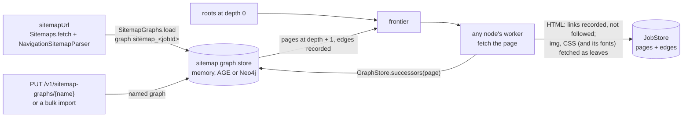

# webcrawler

A distributed web crawler / URL scraping service: a working **low-level design** (single process,
Spring Boot API) whose interfaces are the seams of the **high-level design**. The design is
cloud-agnostic: components are capabilities behind ports (a durable log, a KV cache, a wide-column
store, a relational DB, an object store), and configuration picks the implementation.

| Document | Use it for |
|---|---|
| [INTERVIEW.md](INTERVIEW.md) | the 60-minute walkthrough: requirements, sizing, API, LLD, graph problems, DB model, use-case diagrams, the big picture, trade-offs |
| [docs/PORTABILITY.md](docs/PORTABILITY.md) | AWS / GCP / Azure / self-hosted mapping, semantic differences, adapter modules, switching provider |
| [docs/DESIGN-DETAILED.md](docs/DESIGN-DETAILED.md) | the full API reference, DDL, capacity math, failure modes, security, distributed adapters |

## Build, run, test

Requires JDK 17+.

```bash
cd webcrawler
mvn -pl core test              # 142 tests, no network beyond loopback: an in-memory FakeWeb plays the internet
mvn -pl core spring-boot:run   # http://localhost:8080, Swagger UI at /swagger-ui.html
```

`webcrawler/` is a multi-module build (`webcrawler-parent`). The distributed adapters are separate modules, so the core
never depends on them:

| Module | What | Tests (Testcontainers; skipped without Docker) |
|---|---|---|
| `core` (artifact `webcrawler`) | engine, API, ports, in-memory and filesystem adapters | 142 |
| `adapter-kafka` | `KafkaFrontier`: the frontier as a consumer group on one topic keyed by host | `KafkaFrontierTest` (3), on `cp-kafka` |
| `adapter-redis-cql` | `RedisCqlJobStore` (Redis Lua + Cassandra + Postgres) and `RedisHostSchedule` | `RedisCqlJobStoreTest` (17 = the 15-test `JobStoreContract` + 2), on `redis`, `cassandra`, `postgres` |
| `adapter-graph-age` | `AgeSitemapGraphs`: sitemap graphs in Apache AGE (`crawler.adapters.sitemap-graph=age`), with its catalog | `AgeSitemapGraphsTest` (9, the `SitemapGraphsContract`), on `apache/age` |
| `adapter-graph-neo4j` | `Neo4jSitemapGraphs`: the same in Neo4j (`sitemap-graph=neo4j`) | `Neo4jSitemapGraphsTest` (9), on `neo4j:5` |
| `it` | two Spring Boot nodes of the unchanged app on Kafka, redis-cql and AGE | `TwoNodeCrawlTest` (3: a seed crawl, a `sitemapUrl` crawl, a slice of a `sitemapGraph`) |

```bash
# from webcrawler/: the reactor builds core first (the adapters use its test-jar), then the adapters and the e2e test
mvn install
# or from the repo root
mvn -pl webcrawler -amd install
```

To run a node distributed, add both adapter jars to the classpath and select them:

```bash
--crawler.adapters.frontier=kafka --crawler.adapters.job-store=redis-cql \
--crawler.adapters.content-store=filesystem --crawler.adapters.content-root=/shared/blobs \
--crawler.kafka.bootstrap-servers=… --crawler.kafka.client-id=$(hostname) \
--crawler.redis-cql.redis-uri=… --crawler.redis-cql.cassandra-contact-points=… --crawler.redis-cql.jdbc-url=…
```

Every property is listed in [PORTABILITY §5](docs/PORTABILITY.md#5-adapter-modules).

```bash
# async (default): 202 + Location
curl -si -X POST localhost:8080/v1/crawls -H 'X-Tenant-Id: t1' -H 'Content-Type: application/json' \
  -d '{"seeds":["https://example.com/"],"maxDepth":2,"maxPages":50}'

# sync: 200 with the whole graph, or 202 if it doesn't finish within syncTimeoutMs
curl -s -X POST localhost:8080/v1/crawls -H 'X-Tenant-Id: t1' -H 'Content-Type: application/json' \
  -d '{"seeds":["https://example.com/"],"maxDepth":1,"maxPages":10,"mode":"SYNC"}'

curl -s  localhost:8080/v1/crawls/{jobId}                     -H 'X-Tenant-Id: t1'
curl -s 'localhost:8080/v1/crawls/{jobId}/pages?type=PAGE'    -H 'X-Tenant-Id: t1'
curl -s 'localhost:8080/v1/crawls/{jobId}/pages/{hash}/content?links=snapshot' -H 'X-Tenant-Id: t1'
curl -so site.zip localhost:8080/v1/crawls/{jobId}/export      -H 'X-Tenant-Id: t1'
```

Settings are under `crawler.*` in [`application.yml`](core/src/main/resources/application.yml)
(workers, politeness delay, retries, redirect limit, page size cap, user agent, timeouts, max sync
wait, `adapters.*`, and `egress.*`, the SSRF guard). To keep blobs on disk instead of in memory:

```bash
mvn -pl core spring-boot:run -Dspring-boot.run.arguments=--crawler.adapters.content-store=filesystem
```

## Code map

Package `com.salesforce.einstein.webcrawler`:

| Package | Classes | Design role |
|---|---|---|
| `model` | `CrawlRequest`, `CrawlJob`, `CrawlTask`, `CanonicalUrl`, `JobPage`, `LinkEdge`, `PageSnapshot`, `JobStats`, enums | entities ([INTERVIEW §6.1](INTERVIEW.md#61-entities)). `CrawlRequest.validate()` holds the sync vs async boundary |
| `url` | `UrlNormalizer`, `ParamRules`, `TrapDetector`, `BloomFilter`, `Hashing` | canonical node ids, tracking and learned params, spider traps, the global negative cache |
| `parse` | `HtmlParser`, `CssParser` | links and assets from `a`, `img`/`srcset`, `video`/`audio`/`source`, `link`, `style`, CSS `url()`/`@import`; canonical and meta robots |
| `fetch` | `Fetcher`, `HttpFetcher`, `EgressPolicy`, `EgressFilteringFetcher`, `RobotsRules`, `RobotsCache`, `CachingDnsResolver` | no automatic redirects, size cap, one deadline over headers and body, SSRF guard, conditional GET, RFC 9309 robots |
| `frontier` | `Frontier`, `InMemoryFrontier`, `PartitionedFrontier` | two-level frontier: BFS queue per host, a ready heap by next-allowed time, one request in flight per host; `PartitionedFrontier` spreads hosts over several nodes (host → partition → node by rendezvous hashing) with at-least-once delivery and replay when a node leaves |
| `store` | `JobStore`, `PageStore`, `ContentStore`, in-memory implementations, `FileSystemContentStore` | `JobStore.admit()` is the atomic seen-test + budget + open task; `closeTask()` decrements `pending` once per task key; `claimContent()` is the content-seen test. All per-job state (scope, variant counts, terminal events) lives here, so several engines can share a job |
| `engine` | `CrawlEngine`, `EngineConfig` | the crawl loop: `process()` → `onContent()` → `follow()` / `addAsset()` → `enqueue()`; for a sitemap job, `expandFromSitemap()` instead of the page links |
| `render` | `CrawlResults`, `LinkRewriter`, `LinkMode` | read-time link rewriting (`RAW` / `ABSOLUTE` / `SNAPSHOT`), redirect and duplicate resolution, offline ZIP export |
| `api` | `CrawlController`, `PageController`, `ApiModels`, `ApiExceptionHandler`, `WebhookNotifier` | REST API, RFC 7807 problems, sandboxed content serving |
| `sitemap` | `NavigationSitemapParser`, `NavigationSitemap`, `Sitemaps`, `SitemapGraphs`, `InMemorySitemapGraphs`, `CanonicalUrlCodec` | the optional sitemap crawl: the sitemap's graph, read through graphexecutor's `GraphStore` ([below](#sitemap-crawl-optional)) |
| `config` | `CrawlerProperties`, `CrawlerConfiguration` | wiring. `crawler.adapters.*` picks the implementation for each port; provider modules register beans for their own values ([PORTABILITY §5](docs/PORTABILITY.md#5-adapter-modules)) |

## Design → code

| Design question | Where it's answered |
|---|---|
| Sync vs async boundary | `CrawlRequest.validate()`, `CrawlController.create()` (bounded wait, then 202) |
| Large depth | BFS order in `InMemoryFrontier`; the depth check in `CrawlEngine.follow()`; shortest-path depth via `SHALLOWER` + `CrawlEngine.relax()`; budgets in `JobStore.admit()`; `TrapDetector` |
| Cycles | `UrlNormalizer` + `JobStore.admit()` → `SEEN`; edges are always recorded; redirect hop limit in `CrawlEngine.onRedirect()` |
| Same page, different URL params | `UrlNormalizer` (sort, tracking list), `ParamRules` (learned per host), `claimContent()` → `DUPLICATE`, `rel=canonical` |
| Images, video, audio | `HtmlParser` classification, `CrawlEngine.addAsset()` (leaf, `downloadAssets` policy, `REFERENCED`), `maxAssetBytes` |
| Already visited | per job: `admit()`. Across jobs: `BloomFilter` → `PageStore` snapshot (`REUSED`) → conditional GET (304). For the API: `GET /v1/pages?url=` → `JobStore.latestForTenant()`, the tenant's own crawls only |
| Serving and downloading with links to our copies | `CrawlResults.content()` and `export()`, `LinkRewriter` |

## Tests

| Class | Covers |
|---|---|
| `CrawlEngineTest` (27) | cycles, redirect loops, depth, page budget, scope, seed redirect to another host, canonical chains, spider traps, tracking params, duplicates under params, same bytes in different directories, param learning, assets and media references, embed later linked as a page, asset budget, oversized assets, cross-job reuse, 304 revalidation, retries, 404, robots (and robots redirects), nofollow, idempotency (and concurrent submits), sync bounds, cancel |
| `CrawlResultsTest` (6) | snapshot rewriting, absolute fallback, duplicate resolution, CSS rewriting, raw/absolute modes, ZIP export with relative links |
| `RewriteEdgeCasesTest` (4) | crawl-time edges win over later param rules, malformed `<base>`, `<base>` without a path, identical CSS at two URLs in the export |
| `EgressTest` (5) | SSRF: loopback, metadata, private, CGNAT, IPv6 ULA, NAT64, split DNS answers, ports, schemes; blocked requests never sent or retried |
| `HttpFetcherTest` (2) | size cap and a slow-drip body hitting the deadline, against a loopback server |
| `UrlNormalizerTest` (9) | normalization, relative resolution, empty base path, learned params (distinct values), trap detector |
| `DistributedCrawlTest` (7) | three nodes on one job: only ~1/N partitions move when a node joins, one node per host and no overlap, a node dying mid-fetch (no loss, no double count), depth lowered by a shorter path found mid-fetch or after expansion (re-expanded from stored bytes), and passed through a redirect; a sitemap job shared by all three |
| `InMemoryFrontierTest` (3) | one in flight per host, politeness delay, BFS within a host |
| `RobotsAndBloomTest` (2) | robots longest match and agent groups; Bloom false-positive rate |
| `InMemoryContentStoreTest` (5), `FileSystemContentStoreTest` (6) | the `ContentStoreContract` every blob adapter must pass |
| `InMemoryJobStoreTest` (15) | the `JobStoreContract` every job store must pass: idempotent create, status CAS and broadcast, admit (seen, shallower, upgrade, budgets, a 16-thread race), exactly-once task close under redelivery, content claims, exact stats, edges, BFS cursor, tenant-scoped latest |
| `AdapterSelectionTest` (1) | a config value alone switches the `ContentStore` implementation |
| `CrawlControllerTest` (5) | sync and async over HTTP, tenant isolation of jobs and of `GET /v1/pages`, validation problems, a SYNC sitemap crawl and its validation (`@SpringBootTest` + MockMvc, `FakeWeb` as the fetcher) |
| `NavigationSitemapParserTest` (6) | edges, relative hrefs, marked roots, plain sitemap (all roots), foreign-namespace links ignored, DOCTYPE/XXE refused, bad URLs |
| `NavigationSitemapTest` (2) | default roots: sources, then one page per component they don't reach (a pure cycle); marked roots |
| `InMemorySitemapGraphsTest` (9) | the `SitemapGraphsContract` every sitemap-graph store must pass: successors read back, exists until dropped, `open` cached, graphs isolated, pages sharded by host; the catalog: registered once, read back as written, updated only by the same load, apart from the graphs |
| `SitemapGraphServiceTest` (8) | `PUT /v1/sitemap-graphs` loads in the background: LOADING → READY with roots, a repeat is harmless, a name in use (another URL, another tenant, a bulk import) is a conflict, another tenant's graph doesn't exist, bad names and URLs, an unusable sitemap ends FAILED with no graph, a graph deleted mid-load isn't left behind |
| `SitemapGraphControllerTest` (3) | the same over HTTP: 202 + `Location`, polled to READY, 200 on a repeat, 409, 404 for another tenant, crawled, deleted (`@SpringBootTest` + MockMvc) |
| `SitemapCrawlTest` (17) | only sitemap pages fetched (HTML links recorded, not followed), BFS depth and `maxDepth`, the sitemap is the scope (cross-host, redirects), a redirected page's successors, same-bytes pages both expanded, default and seed roots, images, CSS and its fonts, `maxPages` and `max-pages-per-job`, bad requests make no job, idempotency, the per-job graph dropped and a named graph kept; a loaded graph crawled by its tenant only, not while LOADING or FAILED, `sitemap_` names reserved |

## Sitemap crawl (optional)

**Opt-in.** When a caller already has a sitemap that describes the navigation, the pages to crawl
come from it, not from link discovery. A request without `sitemapUrl` or `sitemapGraph` runs no
sitemap code, and the crawl behaves as before.

The format is a standard sitemap with navigation edges in their own namespace, so the file stays a
valid sitemap for other consumers:

```xml
<urlset xmlns="http://www.sitemaps.org/schemas/sitemap/0.9" xmlns:nav="urn:webcrawler:sitemap-nav">
  <url nav:root="true">
    <loc>https://example.com/</loc>
    <nav:link href="/about"/>   <!-- "about is linked from /"; relative to <loc> -->
  </url>
  <url><loc>https://example.com/about</loc><nav:link href="/"/></url>   <!-- cycles are fine -->
</urlset>
```

```bash
# a sitemap fetched for this job; seeds are optional (the sitemap's roots by default)
curl -si -X POST localhost:8080/v1/crawls -H 'X-Tenant-Id: t1' -H 'Content-Type: application/json' \
  -d '{"sitemapUrl":"https://example.com/nav.xml","maxDepth":5,"maxPages":10000}'

# a slice of a named graph (see "Large sitemaps"): seeds are required, and are the slice's roots
curl -si -X POST localhost:8080/v1/crawls -H 'X-Tenant-Id: t1' -H 'Content-Type: application/json' \
  -d '{"sitemapGraph":"catalog","seeds":["https://example.com/shoes/"],"maxDepth":3,"maxPages":100000}'
```



- **A streamed BFS in `CrawlEngine`.** A sitemap job is seeded with its roots. When a worker on any
  node fetches a page, it reads the page's successors from the graph store and follows them at
  depth + 1, so each page gets its BFS depth from the roots and `maxDepth` cuts the walk. A shorter
  path found late lowers the depth through the usual `SHALLOWER` relaxation. The graph is never
  loaded on one node.
- **Pages only from the graph.** The links in a page's HTML are recorded (so the content can be
  rewritten and the job graph shows them), but they are not followed, and neither is
  `rel=canonical`. A failed page doesn't expand. A redirected page fetches its target at the same
  depth, and its successors come from the original URL.
- **Assets as leaves.** Images, stylesheets and the fonts and images a stylesheet references are
  fetched under `downloadAssets` and `maxAssets`, as in a seed crawl. An asset in the sitemap is a
  leaf too.
- **Edges.** Every sitemap edge is a `LinkEdge` of the job, next to the page's HTML links (an edge
  in both is recorded once), so `GET /v1/crawls/{id}/pages/{hash}` shows both.
- **The sitemap is the scope.** `scope`, the trap detector and the variant limits don't apply to
  sitemap edges. `scope` still applies to redirects, and a redirect within the source page's host
  is in scope. Robots, politeness, reuse, `maxPages`, cancel and webhooks are unchanged. Two pages
  with the same bytes both expand, because their successors differ.
- **Roots.** The seeds, which must be in the sitemap. Without seeds (`sitemapUrl` only): the
  `nav:root` pages, or else the pages nothing links to plus one page of each component they don't
  reach (`NavigationSitemap.defaultRoots()`).
- **Lifetime.** A `sitemapUrl` graph is loaded after the job is created and dropped when the job
  ends. A bad sitemap (not 200, not XML, larger than `crawler.max-sitemap-bytes`, no pages, a seed
  not in it) is a 400 and makes no job. A named `sitemapGraph` is never dropped by a job.
- **Single node and cluster.** The graph name is derived from the job, and the request (stored by
  every `JobStore`) says which sitemap it is, so whichever node fetches a page can expand it. With
  the `memory` store, nodes must share one `InMemorySitemapGraphs` (in-process tests). Across
  machines, select `age` or `neo4j`: every node reads the same database.

### Large sitemaps: the graph store and bounded slices

A sitemap of ~100B pages can't be one XML file or one job. It lives in AGE or Neo4j as a named
graph, and each job crawls a **bounded slice**: its `seeds`, out to `maxDepth`, capped by `maxPages`,
whose upper bound is `crawler.max-pages-per-job` (default 1,000,000; raise it with the `redis-cql`
JobStore).

| `crawler.adapters.sitemap-graph` | Store | Settings |
|---|---|---|
| `memory` (default) | `InMemorySitemapGraphs`, one per process | `crawler.sitemap.shards` (16), `crawler.sitemap.load-threads` (2) |
| `age` | `AgeSitemapGraphs` (`adapter-graph-age`) | `crawler.sitemap.age.{url, user, password, pool-size, batch-size}` |
| `neo4j` | `Neo4jSitemapGraphs` (`adapter-graph-neo4j`) | `crawler.sitemap.neo4j.{uri, user, password, database, batch-size}` |

The **store layout**, which a bulk import must produce (`SitemapGraphs` documents it):

- one vertex per page, `key` = the URL normalized by the crawler's `UrlNormalizer`
  (`CanonicalUrl.value()`), `shard` = `CanonicalUrlCodec.shardByHost(crawler.sitemap.shards)`;
- one edge per navigation link, from the linking page;
- AGE: the graph `<name>`, labels `V` and `E`, with `AgeGraphLoader.create()`'s indexes. Neo4j:
  label `<name>`, relationship type `<name>_EDGE`, the constraint `<name>_key` and the index
  `<name>_shard_key`.

**Loading a named graph through the API.** `PUT` fetches one XML sitemap (through the same egress
check as a crawl) and writes it as graph `{name}` in the background; any node can answer `GET` and
`DELETE` for it, because the status lives in the graph store:

```bash
curl -si -X PUT localhost:8080/v1/sitemap-graphs/catalog -H 'X-Tenant-Id: t1' -H 'Content-Type: application/json' \
  -d '{"sitemapUrl":"https://example.com/nav.xml"}'           # 202 + Location, status LOADING
curl -s localhost:8080/v1/sitemap-graphs/catalog -H 'X-Tenant-Id: t1'
# {"name":"catalog","status":"READY","pages":…,"edges":…,"roots":["https://example.com/"],"rootCount":1,…}
curl -si -X POST localhost:8080/v1/crawls -H 'X-Tenant-Id: t1' -H 'Content-Type: application/json' \
  -d '{"sitemapGraph":"catalog","seeds":["https://example.com/"],"maxDepth":3}'
curl -si -X DELETE localhost:8080/v1/sitemap-graphs/catalog -H 'X-Tenant-Id: t1'   # 204
```

- **Statuses.** `LOADING`, then `READY` (with `pages`, `edges`, and the sitemap's roots, at most 100
  of `rootCount`, to use as `seeds`) or `FAILED` (with `error`: not 200, not XML, too large, no
  pages). A failed load leaves no graph; `DELETE` it and `PUT` again.
- **Ownership.** The graph belongs to the tenant that loaded it. To another tenant it doesn't exist:
  `GET` and `DELETE` are 404, and a crawl naming it is a 400 `unknown sitemapGraph`. A crawl of a
  graph that isn't `READY` is a 400.
- **Names.** `[A-Za-z_][A-Za-z0-9_]{2,62}`; `sitemap_…` is reserved for per-job graphs. Repeating the
  same `PUT` (same tenant and URL) returns the entry (200 once it has finished); a name already in
  use, by another URL, another tenant or a bulk import, is a 409.
- **Deleting** works in any state. A load still running drops what it wrote when it ends; a node
  that died mid-load leaves its entry `LOADING` until it's deleted. Crawls still reading a deleted
  graph stop finding successors.
- **The catalog** is the table `public.webcrawler_sitemap_graphs` in AGE, or nodes labelled
  `` `webcrawler-sitemap-graph` `` in Neo4j. `crawler.sitemap.load-threads` (2) loads run at once per
  node; more wait their turn.

For billions of pages, bulk-import the layout instead: `neo4j-admin database import`, or Postgres
`COPY` into AGE's label tables, then the indexes, with the same `crawler.sitemap.shards`. A
bulk-imported graph has no catalog entry, so any tenant can crawl it, and the API can't load over
its name or delete it.

> **Neo4j Community** is one server: the sitemap graph must fit one database (see
> `graphexecutor-neo4j`'s README).

## Not in the single-process build

These are in the design but not implemented here:
- the object-store adapters and the CQL `PageStore` (`url_records`)
  ([PORTABILITY §5](docs/PORTABILITY.md#5-adapter-modules),
  [DESIGN-DETAILED §7](docs/DESIGN-DETAILED.md#7-distributed-adapters));
- the p0/p1/p2 priority lanes and the reconciler;
- connecting to the exact IP the egress check approved (the HTTP client resolves again, so DNS
  rebinding is left to the network layer);
- webhook retries and signatures, SimHash near-duplicates and JavaScript rendering.

With the default `memory` adapters, jobs and the frontier are lost on restart, and blobs survive
with `content-store: filesystem`. With `kafka` and `redis-cql` selected, jobs, the frontier and the
graph are durable.

Known simplifications: learned parameter rules are global and never expire; frontier entries of a
cancelled job are dropped lazily; `PartitionedFrontier` is an in-process stand-in for the log and
its consumer group (nodes are engines in one JVM sharing the in-memory stores).
