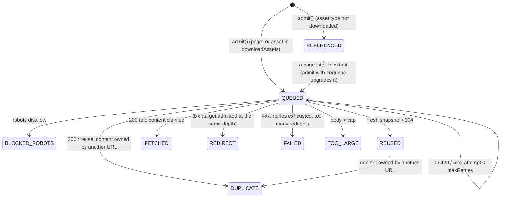

# Web crawler: detailed design

This is the reference behind [INTERVIEW.md](../INTERVIEW.md). Use it for the depth an interviewer
probes for: every API contract, the DDL, the capacity math, failure modes, security, and how each
in-memory SPI maps onto a distributed store.

1. [Crawl semantics](#1-crawl-semantics)
2. [API reference](#2-api-reference)
3. [Data model DDL](#3-data-model-ddl)
4. [Capacity math](#4-capacity-math)
5. [Failure modes](#5-failure-modes)
6. [Security](#6-security)
7. [Distributed adapters](#7-distributed-adapters)
8. [Observability](#8-observability)
9. [Extensions](#9-extensions)
10. Cloud portability: [PORTABILITY.md](PORTABILITY.md)

---

## 1. Crawl semantics

### 1.1 Node lifecycle



Every QUEUED node reaches exactly one final state. `pending` counts **open tasks**: admission opens
one under the key `url_hash#depth#attempt`, a retry opens the next attempt's key, and processing
closes the key, at most once however often the log redelivers it. A job is `COMPLETED` when
`pending` reaches 0.

**Depth is the shortest path.** With many nodes the BFS order is only approximate, so a page can
be reached at depth 4 before its depth-2 path is found. The seen-test then returns `SHALLOWER`:
it lowers the stored depth, and the engine re-expands the page from its stored bytes (no refetch),
so children cut by `maxDepth` are admitted. A `DUPLICATE` or `REDIRECT` node passes the new depth to
its target. If the drop arrives while the page is being fetched, the discoverer finds no children
to relax; the worker re-reads the depth after writing the final status and relaxes itself
(`catchUp`), so one side always sees the other. A depth is never raised. In `RedisCqlJobStore`,
the depth lives in `wc:{job}:nodes` and only `admit.lua` lowers it (`if new < old`); while the job
runs, that copy is authoritative. Cassandra's `job_pages.depth` and `parent_hash` are written with
`USING TIMESTAMP (2 000 000 − depth)` (`1 000 000 − depth` for a referenced-only node). So
last-write-wins keeps the smallest depth whatever order concurrent writers land in, with no LWT
round trip. A worker writing back a stale, deeper copy simply loses.

`CANCELLED` jobs drain: their tasks are dropped on poll, without any request to the origin.

### 1.2 Canonicalization rules (`UrlNormalizer`)

| Rule | Example |
|---|---|
| Only `http`/`https` become nodes; `mailto:`, `javascript:`, `data:`, `tel:` are ignored | — |
| Lower-case scheme and host; IDN → punycode; strip a trailing dot | `HTTP://Ex.COM.` → `http://ex.com` |
| Drop the default port | `:443` on https, `:80` on http |
| Resolve dot segments (RFC 3986 §5.2.4); an empty path becomes `/` | `/a/./b/../c` → `/a/c` |
| Normalize percent-encoding: decode unreserved, upper-case the hex | `%7e` → `~`, `%2f` stays (as `%2F`) |
| Drop the fragment | `#top` |
| Drop tracking params (`utm_*`, `gclid`, `fbclid`, `msclkid`, `mc_eid`, `_ga`, `sessionid`, `jsessionid`, `phpsessid`, `sid`, …) and **learned** params for the host | — |
| Sort the remaining params by name, then value; keep empty values | `?b=2&a=1` → `?a=1&b=2` |
| **Keep** path case and trailing slashes: servers differ, so merging them is the content-seen test's job | — |
| Reject URLs longer than 2048 characters | trap guard |
| `url_hash` = first 128 bits of SHA-256(canonical), hex | 2⁶⁴ birthday bound: no realistic collisions |

### 1.3 Parameter learning (`ParamRules`)

When `onContent` stores page `u?…&p=v…`, it looks up whether the job has also seen `u` *without*
`p`, with the same content hash. Same bytes is a vote for "p is irrelevant on host h"; different
bytes marks p as relevant **permanently**. Votes count **distinct values** of `p`: after 3 distinct
values with the same bytes and no counter-example, `p` is dropped in canonical URLs for host `h`.
One value seen many times (`?page=1`, which often equals the bare URL) can't condemn `p`, and a
`REUSED` snapshot doesn't vote at all. URLs that were admitted before then stay as they are; their
duplicates are caught by the content-seen test. Rendering uses the edges recorded at crawl time
(`raw_href → to_hash`), so a rule learned later never changes how an old job's pages link.

### 1.4 Trap limits (`TrapDetector`)

| Limit | Default |
|---|---|
| path segments | 20 |
| one segment repeated | 3 (`/a/b/a/b/a/b/a` is a trap) |
| query params | 10 |
| distinct query variants of one path, per job | 50 |

### 1.5 Robots (RFC 9309)

- Group selection: the longest product token matching our agent (`EinsteinCrawler`), else `*`.
- Within a group, the **longest matching** rule wins, and `Allow` wins a tie. Supports `*` and `$`.
- `Crawl-delay` raises the politeness delay for that host (it never lowers it).
- `robots.txt` 2xx → parse; 3xx → follow up to 5 hops (more → allow all); 4xx → allow all; 5xx,
  network error or an egress refusal → disallow all for 10 min.
- Cached for 24 h per scheme+host+port.
- Per page: `<meta name=robots content=nofollow>` means edges are recorded and nothing is
  followed; `noindex` is recorded.

### 1.6 Redirects

The HTTP client never follows redirects automatically. A 3xx creates a `REDIRECT` node with
`redirect_to`, and the target goes through `admit()` **at the same depth** with `redirectHops + 1`,
so it's a node like any other. A chain longer than 5 hops is `FAILED` ("too many redirects").
A redirect loop ends at the seen-test. `rel=canonical` is treated the same way: same depth, one hop.
When a **seed** redirects to another host (`example.com → www.example.com`), the destination joins
the job's scope, since that is the site the user asked for.

---

## 2. API reference

All endpoints need `X-Tenant-Id` (in production, derived by the gateway from a verified token).
Another tenant's job is **404**. Errors are `application/problem+json`:

```json
{ "type": "https://crawler.example/problems/invalid-request", "title": "Bad Request", "status": 400,
  "detail": "SYNC is limited to maxDepth ≤ 1 and maxPages ≤ 25; use mode=ASYNC", "instance": "/v1/crawls" }
```

| Problem type | Status | When |
|---|---|---|
| `invalid-request` | 400 | bean validation, a bad seed, SYNC over its limits, an unknown `type` or `links` value |
| `not-found` | 404 | no such job for this tenant; no such node; node has no content |
| `idempotency-conflict` | 422 | the `Idempotency-Key` was used before with a different body |
| — | 409 | `export` before the job is terminal |
| `internal` | 500 | anything else (generic body; details only in logs) |
| *(prod)* `rate-limited` | 429 | per-tenant submit rate or concurrent-job quota, with `Retry-After` |

### 2.1 `POST /v1/crawls`

| Field | Type | Default | Constraint |
|---|---|---|---|
| `seeds` | string[] | — | 1..100, each ≤ 2048 chars, http(s) |
| `maxDepth` | int | 2 | 0..50; SYNC ≤ 1 |
| `maxPages` | int | 1000 | 1..1,000,000; SYNC ≤ 25 |
| `maxAssets` | int | 5000 | ≥ 0 |
| `scope` | enum | `SAME_HOST` | `SAME_HOST`, `SAME_DOMAIN` (registrable domain), `ANY` |
| `downloadAssets` | enum[] | `[IMAGE, CSS]` | of `IMAGE, VIDEO, AUDIO, CSS, SCRIPT, FONT, DOCUMENT, OTHER`; `[]` = reference only |
| `maxAssetBytes` | long | 10 MiB | ≥ 0 |
| `maxAgeSeconds` | long | 86400 | 0 = always revalidate |
| `respectRobots` | bool | true | in production, `false` needs verified site ownership |
| `mode` | enum | `ASYNC` | `SYNC`, `ASYNC` |
| `callbackUrl` | string | — | `https://` only |
| `syncTimeoutMs` | long | 10000 | 100..30000, capped by `crawler.max-sync-wait` |

Header `Idempotency-Key` (optional): the same tenant and key with the same body return the
original job; a different body is 422.

| Outcome | Status | Headers | Body |
|---|---|---|---|
| ASYNC accepted | 202 | `Location` | `JobView` |
| SYNC finished in time | 200 | `Location` | `{ "job": JobView, "pages": PageView[] }` |
| SYNC deadline passed | 202 | `Location`, `Retry-After: 2` | `JobView` (status `RUNNING`) |

### 2.2 `GET /v1/crawls/{jobId}` → `JobView`

```json
{
  "jobId": "4c1f…", "status": "COMPLETED",
  "createdAt": "2026-10-03T10:00:00Z", "finishedAt": "2026-10-03T10:04:12Z",
  "request": { "seeds": ["https://docs.example.com/"], "maxDepth": 3, "maxPages": 5000, "maxAssets": 20000,
               "scope": "SAME_HOST", "downloadAssets": ["IMAGE", "CSS"], "maxAssetBytes": 10485760,
               "maxAgeSeconds": 86400, "respectRobots": true, "mode": "ASYNC" },
  "stats": { "discovered": 412, "pending": 0, "pages": 180, "assets": 150, "reused": 40,
             "duplicates": 12, "failed": 3, "edges": 9120, "truncated": 0 },
  "links": { "self": "/v1/crawls/4c1f…", "pages": "/v1/crawls/4c1f…/pages",
             "export": "/v1/crawls/4c1f…/export", "cancel": "/v1/crawls/4c1f…/cancel" }
}
```

`stats.discovered` counts nodes (every status). `pages` and `assets` count nodes that have content.
`truncated` counts admissions refused by a budget.

### 2.3 `POST /v1/crawls/{jobId}/cancel` → `JobView`

Idempotent. A job that's already terminal is returned unchanged.

### 2.4 `GET /v1/crawls/{jobId}/pages?type=&cursor=&limit=` → `PageList`

`limit` is 1..1000 (default 100). The order is discovery order, which is BFS. `nextCursor` is
opaque, and `null` on the last page. The cursor is stable while the crawl is still running, because
nodes are only ever appended.

### 2.5 `GET /v1/crawls/{jobId}/pages/{urlHash}` → `PageDetail`

```json
{
  "page": { "urlHash": "a1f3…", "url": "https://docs.example.com/", "type": "PAGE", "depth": 0,
            "status": "FETCHED", "httpStatus": 200, "contentHash": "5e88…",
            "contentUrl": "/v1/crawls/4c1f…/pages/a1f3…/content" },
  "outLinks": [
    { "toUrl": "https://docs.example.com/guide", "toHash": "c9d2…", "type": "PAGE",
      "rawHref": "guide?utm_source=nav#top", "inCrawl": true },
    { "toUrl": "https://docs.example.com/deep/9", "toHash": "0b7e…", "type": "PAGE",
      "rawHref": "/deep/9", "inCrawl": false }
  ]
}
```

### 2.6 `GET /v1/crawls/{jobId}/pages/{urlHash}/content?links=snapshot|absolute|raw`

| `links` | References in HTML and CSS become |
|---|---|
| `snapshot` (default) | our copy (`/v1/crawls/{job}/pages/{hash}/content`, plus `?links=snapshot` for pages and CSS) when this job stored the target (following redirects and duplicates); otherwise absolute live URLs |
| `absolute` | every reference absolute to the origin (resolved against `<base>` and the page URL) |
| `raw` | the bytes exactly as fetched |

Response headers: the original `Content-Type`; `Content-Security-Policy: sandbox`;
`X-Content-Type-Options: nosniff`; `Cache-Control: private, max-age=3600`. A `REDIRECT` or
`DUPLICATE` node serves the content of the node it resolves to.

### 2.7 `GET /v1/crawls/{jobId}/export` → `application/zip`

409 until the job is terminal. The layout:

```
index.html                       → a list of every page (depth, status), linked to its file
manifest.json                    → { url: { status, type, depth, file } } for every node; file is "" if none
pages/{urlHash}.html             → each page with content; links → other.html / ../assets/…
assets/{urlHash}.css             → each stylesheet, rewritten relative to its own URL (so one per URL)
assets/{contentHash}.{ext}       → every other stored asset, once per content
```

At production scale this becomes `POST /export` → 202, run by an export worker, which writes to the object store
and returns a signed URL in the job view.

### 2.8 `GET /v1/pages?url=` → `SnapshotView`

"Have we already crawled this?" for the **calling tenant**: its most recent copy of the
canonicalized URL across its own jobs, or 404. Another tenant's crawl of the same URL is invisible,
even though the global snapshot cache (`url_records`) is shared for reuse; exposing that cache
would tell one tenant what others crawl.

```json
{ "urlHash": "9f2c…", "url": "https://example.com/a", "jobId": "6c1e…", "status": "FETCHED",
  "fetchedAt": "2026-10-03T09:12:44Z", "httpStatus": 200, "contentType": "text/html; charset=utf-8",
  "contentHash": "4b7d…", "size": 18342,
  "content": "/v1/crawls/6c1e…/pages/9f2c…/content" }
```

### 2.9 Webhook

On a terminal status we `POST callbackUrl` with the `JobView`. In production the body is signed
`X-Signature: sha256=HMAC(tenant secret, body)` and delivered at-least-once from an outbox, with
exponential retries for 24 h. Receivers dedupe on `jobId` + `status`.

---

## 3. Data model DDL

The stores are named by capability. The DDL uses each capability's default open protocol (PostgreSQL,
CQL, the Redis protocol), and every major cloud offers a managed service for each. The provider mapping
and the semantic differences (DynamoDB, Bigtable, Cosmos DB) are in [PORTABILITY.md](PORTABILITY.md).

### 3.1 Relational (PostgreSQL dialect): jobs

```sql
CREATE TABLE crawl_jobs (
  job_id          uuid PRIMARY KEY,
  tenant_id       text        NOT NULL,
  idempotency_key text,
  request_hash    bytea       NOT NULL,          -- detects a key reused with a different body
  request         jsonb       NOT NULL,
  status          text        NOT NULL CHECK (status IN ('QUEUED','RUNNING','COMPLETED','CANCELLED','FAILED')),
  error           text,
  stats           jsonb,                         -- final counters, frozen on completion
  created_at      timestamptz NOT NULL DEFAULT now(),
  finished_at     timestamptz,
  UNIQUE (tenant_id, idempotency_key)
);
CREATE INDEX crawl_jobs_tenant_created ON crawl_jobs (tenant_id, created_at DESC);
CREATE INDEX crawl_jobs_running ON crawl_jobs (status) WHERE status IN ('QUEUED','RUNNING');

-- transitions are CAS:  UPDATE crawl_jobs SET status=$to, finished_at=now()
--                       WHERE job_id=$1 AND status=$from;   -- 1 row = we won

CREATE TABLE webhook_outbox (
  id          bigserial PRIMARY KEY,
  job_id      uuid NOT NULL REFERENCES crawl_jobs,
  payload     jsonb NOT NULL,
  attempts    int  NOT NULL DEFAULT 0,
  next_at     timestamptz NOT NULL DEFAULT now(),
  delivered   boolean NOT NULL DEFAULT false
);
CREATE INDEX webhook_due ON webhook_outbox (next_at) WHERE NOT delivered;
```

### 3.2 Wide-column (CQL): the graph and global records

```sql
-- As shipped in webcrawler-adapter-redis-cql (src/main/resources/webcrawler/schema/cassandra.cql).
-- One row per node of one job's graph, in its own partition: it is always read by key, and listing
-- goes through job_pages_by_order, so no partition ever grows with the job.
-- depth and parent_hash are written USING TIMESTAMP derived from the depth (see §1.1).
CREATE TABLE job_pages (
  job_id text, url_hash text,
  url text, type text, depth int, parent_hash text, status text, http_status int,
  content_type text, content_hash text, size bigint, fetched_at timestamp,
  duplicate_of text, redirect_to text, error text,
  PRIMARY KEY ((job_id, url_hash))
);

-- BFS-ordered listing for the pages API; seq comes from admit.lua (HINCRBY wc:{job}:ctr seq)
CREATE TABLE job_pages_by_order (
  job_id text, chunk bigint, seq bigint, url_hash text,
  PRIMARY KEY ((job_id, chunk), seq)       -- chunk = (seq - 1) / 10000
);

-- Two spellings of one target are two rows: the link rewriter needs each raw href.
CREATE TABLE page_links (
  job_id text, from_hash text, to_hash text, raw_href text,
  to_url text, type text,
  PRIMARY KEY ((job_id, from_hash), to_hash, raw_href)
);

-- per tenant "have we crawled this?" (GET /v1/pages): the job whose node has the newest content.
-- Written USING TIMESTAMP fetched_at, so the latest fetch wins; the node itself is read from job_pages.
CREATE TABLE tenant_pages (
  tenant_id text, url_hash text, job_id text,
  PRIMARY KEY ((tenant_id, url_hash))
);
-- Retention: add WITH default_time_to_live = 7776000 (90 days) to the four tables above in production.

-- Not built yet (PageStore, ParamRules and robots stay in memory per node):
-- global "already crawled?" for reuse by the engine (never exposed directly): the latest public fetch
CREATE TABLE url_records (
  url_hash text PRIMARY KEY,
  url text, host text, http_status int, content_type text, content_hash text, size bigint,
  etag text, last_modified text, fetched_at timestamp,
  change_interval_s int, next_fetch_at timestamp     -- for continuous recrawl
);

CREATE TABLE url_param_rules (
  host text, param text, same_values set<text>, differs boolean,   -- same_values capped at 3
  PRIMARY KEY (host, param)
);

CREATE TABLE hosts (
  host text PRIMARY KEY,
  robots_txt text, robots_status int, robots_fetched_at timestamp,
  crawl_delay_ms int, ip inet, last_error text, error_streak int
);
```

`url_records` upserts are last-write-wins with `USING TIMESTAMP fetched_at`, so a slow worker can't
overwrite a newer snapshot (the in-memory `PageStore.merge` does the same).

### 3.3 KV cache (Redis protocol): hot per-job state (hash-tagged by `{job}`)

Every key of a job is `wc:{job}:<name>`. The braces are the Redis Cluster hash tag, so a job's
keys share a slot and one script can touch them all.

| Key | Type | Purpose |
|---|---|---|
| `wc:{job}:nodes` | HASH url_hash → `depth\|flags` | the seen-set, each node's shortest depth, and flags: `p`/`a` (page or asset), plus `r` while it is only referenced (may be upgraded) |
| `wc:{job}:ctr` | HASH | `pages_used`, `assets_used` (budgets), `seq` (discovery order), `pending` (open tasks), and the exact counters `pages`, `assets`, `reused`, `duplicates`, `failed`, `edges`, `truncated` |
| `wc:{job}:tasks` | HASH task key → 1 open / 0 closed | exactly-once `pending` under redelivery |
| `wc:{job}:state` | HASH url_hash → counters it is in | moves a node between the exact counters when its status changes |
| `wc:{job}:content` | HASH content_hash + dir → url_hash | the content-seen claim (`HSETNX`) |
| `wc:{job}:scope` | SET of host or domain | the job's scope; a seed redirect adds its target |
| `wc:{job}:variants` | HASH path → count | trap variant cap |
| `wc:host:{host}` | STRING epoch ms, `PX` until then | `HostSchedule`: the host's next-allowed time, or the lease of a fetch in flight. Not job-scoped |
| channel `job-done:{job}` | pub/sub | wakes `await` and terminal listeners on every node (`PSUBSCRIBE job-done:*`) |

On a terminal transition the job's keys get `EXPIRE` (`hot-state-ttl`, 1 day). After that, reads
fall back to Cassandra (depth) and Postgres (the stats frozen in `crawl_jobs.stats`).

Four scripts in `src/main/resources/webcrawler/lua/`. Each one is a single atomic step on one shard:

| Script | Does |
|---|---|
| `admit.lua` | seen-test, budget, `SHALLOWER`, referenced → queued upgrade, `seq`, open the first task. Returns `{status, seq}` |
| `open_task.lua` | `HSETNX tasks key 1`, and `pending++` only if it was new |
| `close_task.lua` | `1 → 0` and `pending--`, returning `{1, pending}`; a duplicate gets `{0, 0}` |
| `node_state.lua` | moves a node from its old status's counters to the new one's (`stats` is exact, not a scan) |

```lua
-- admit.lua. KEYS: nodes, ctr, tasks   ARGV: url_hash, depth, is_asset, enqueue, budget, task_key
local depth = tonumber(ARGV[2])
local asset = ARGV[3] == '1'
local enqueue = ARGV[4] == '1'
local upgrade = false
local cur = redis.call('HGET', KEYS[1], ARGV[1])
if cur then
  local bar = string.find(cur, '|', 1, true)
  local known = tonumber(string.sub(cur, 1, bar - 1))
  local flags = string.sub(cur, bar + 1)
  upgrade = enqueue and string.find(flags, 'r', 1, true) ~= nil
  if not upgrade then
    if (not enqueue) or string.find(flags, 'a', 1, true) or depth >= known then return {'SEEN', 0} end
    redis.call('HSET', KEYS[1], ARGV[1], depth .. '|' .. flags)
    return {'SHALLOWER', 0}
  end
end
local used = asset and 'assets_used' or 'pages_used'
if tonumber(redis.call('HGET', KEYS[2], used) or '0') >= tonumber(ARGV[5]) then return {'OVER_BUDGET', 0} end
redis.call('HINCRBY', KEYS[2], used, 1)
redis.call('HSET', KEYS[1], ARGV[1], depth .. '|' .. (asset and 'a' or 'p') .. (enqueue and '' or 'r'))
local seq = 0
if not upgrade then seq = redis.call('HINCRBY', KEYS[2], 'seq', 1) end   -- an upgrade keeps its old seq
if enqueue and redis.call('HSETNX', KEYS[3], ARGV[6], '1') == 1 then redis.call('HINCRBY', KEYS[2], 'pending', 1) end
return {'ADMITTED', seq}
```

The caller then writes the `job_pages` row (QUEUED) and the `job_pages_by_order` row, waits for
both, and only then produces the task, so a worker always finds the row. If the
caller crashes between the script and the produce, the node is QUEUED with no task; the
reconciler re-enqueues QUEUED rows of jobs that have made no progress.

### 3.4 Object store

Key `{sha256[0:2]}/{sha256}` (`ContentStore.key`) in one bucket, on any provider. Objects are immutable, so a `PUT` of an existing key is
harmless and the write is idempotent. A lifecycle rule moves them to IA after 30 days. Deletion is
by **retention of the last reference**: a weekly job scans `job_pages`/`url_records` content hashes
into a set and deletes unreferenced blobs older than the retention period (mark-and-sweep). That
avoids refcounting on the hot path.

---

## 4. Capacity math

| Quantity | Derivation | Value |
|---|---|---|
| Pages/s | 100M/day ÷ 86,400 | 1,160 avg, ~3.5k peak |
| Asset fetches/s | 3 per page | 3.5k avg, ~10k peak |
| Seen-tests/s | 50 links per page × 3.5k | ~175k peak; a Redis-protocol cache does ~100k ops/s per shard, so **4–8 shards** |
| Fetch concurrency | 14k/s × 0.5 s avg latency (Little's law) | ~7k sockets in flight → 50 fetchers × 150 |
| Hosts in flight | at 1 rps per host, 3.5k pages/s needs ≥ 3.5k distinct hosts active | fine for many tenants; the 10M-page single-host case is politeness-bound ([INTERVIEW §11.4](../INTERVIEW.md#114-scenario-one-domain-with-10m-pages)) |
| Frontier backlog | the worst case is the queued nodes of all running jobs ≈ 5k jobs × 10k = 50M × ~200 B | 10 GB in the log; trivial |
| Blob ingest | (50M HTML × 20 KB) + (50M assets × 50 KB) | ~3.5 TB/day ≈ 40 MB/s; object-store PUT ~1.4k/s |
| `page_links` | 5 B edges/day × 40 B | 200 GB/day; wide-column at 20k writes/s, ~12 nodes with RF 3 |
| Bloom | m = −n ln p / (ln 2)² with n = 2 B, p = 0.01 | 19.2 Gbit = 2.4 GB; k = 7 |

---

## 5. Failure modes

| # | Failure | Detection | Handling | Result |
|---|---|---|---|---|
| 1 | Fetcher dies | log consumer session timeout | its partitions are reassigned (rendezvous: only its share moves); uncommitted tasks are redelivered; the host's next-allowed time goes with them | some duplicate fetches; idempotent writes; no loss (`DistributedCrawlTest`) |
| 2 | Parser dies | same | `fetched` is redelivered; the blob is already in the object store | — |
| 3 | Double processing of one task | `wc:{job}:tasks` key already closed (`isTaskOpen`); `closeTask` is a CAS `1 → 0` | a redelivered copy of finished work is dropped; two live copies both finish idempotently, and only one decrements `pending` | exact counters |
| 4 | Cache shard failover loses writes | replica lag | `wc:{job}:nodes` may forget recent URLs, so one is admitted again: the `job_pages` upsert hits the same key (still one node), but it gets a second `seq` and is listed twice until the job ends; a lost `pending` change is the reconciler's case | a duplicate fetch and listing entry, never a wrong count once reconciled |
| 5 | `pending` drifts | reconciler: RUNNING, no progress for 10 min | count QUEUED rows; 0 → complete, else re-enqueue them | jobs always end |
| 6 | Origin slow or hostile | 5 s connect, a 30 s deadline over headers and body (a byte-a-second drip can't hold a worker), size cap with the stream cancelled | `FAILED` / `TOO_LARGE`; host error streak → back off the whole host | one bad host never blocks others (back queue per host) |
| 7 | Origin returns 429/503 | status | honour `Retry-After`, exponential host backoff, ≤ 3 retries | polite |
| 8 | robots.txt unreachable | 5xx / timeout | disallow all, retry in 10 min | never crawl when unsure |
| 9 | Hot partition (one giant host) | consumer lag per partition | spill the back queue to disk; pause the partition; owner fast lane | others unaffected |
| 10 | Log unavailable | produce errors | the API returns 503 for new jobs; fetchers pause | no acceptance without durability |
| 11 | Object store errors | PUT failure | retry; on persistent failure the task is not acked, so it's redelivered | — |
| 12 | Webhook endpoint down | non-2xx | outbox retries with backoff for 24 h, then dead-letter | at-least-once |
| 13 | Region loss | — | jobs in flight in that region resume from log and wide-column replicas, or are marked FAILED with a resubmit hint | RPO ≈ replication lag |

---

## 6. Security

| Threat | Mitigation |
|---|---|
| **SSRF** through seeds, redirects or links (`http://169.254.169.254/`, `http://10.0.0.5/admin`, `http://localhost`, DNS rebinding) | resolve once, **check the IP** (block private, loopback, link-local, CGNAT, metadata ranges, IPv6 equivalents), connect to that exact IP with the Host/SNI header; recheck on every redirect hop; fetchers in a dedicated egress VPC with no routes to internal networks. *Single-process build:* `EgressFilteringFetcher` + `EgressPolicy` check scheme, port (80/443/8080/8443) and every resolved address before each request; the HTTP client then resolves again, so DNS rebinding is left to the network layer |
| **Stored XSS** from crawled HTML | serve content from a separate registrable domain (`crawlcontent.example`), with `CSP: sandbox` and `nosniff`; never on the API or UI origin |
| Webhook SSRF and spoofing | `https://` only, the same IP filter (`WebhookNotifier` checks `EgressPolicy`), no redirects, HMAC-signed bodies |
| Tenant isolation | tenant from the verified token only; job lookups filtered by tenant, returning 404; `GET /v1/pages` reads only the tenant's own `tenant_pages`; global snapshot reuse only for anonymous public fetches; credentialed crawls use a tenant-scoped namespace |
| Abuse (using us to DoS a site) | per-host politeness is global across tenants (the host-partitioned frontier enforces it no matter who asked); per-tenant quotas; `respectRobots=false` only with verified ownership |
| Decompression bombs | cap *decoded* bytes; limit nesting in CSS `@import` (assets are leaves) |
| Parser exploits | jsoup in a memory-limited pod; size cap before parsing; time budget per parse |
| Legal | identify in the `User-Agent` with a contact URL; takedown list per host; honour `noindex` downstream |

---

## 7. Distributed adapters

The adapters below use the default open protocols. [PORTABILITY.md](PORTABILITY.md) maps them to
AWS, GCP, Azure and self-hosted products, and covers alternatives such as Pub/Sub or DynamoDB.

The engine depends only on SPIs, so production swaps implementations without changing the engine:

| SPI | In-memory | Distributed adapter (built: `webcrawler-adapter-kafka`, `webcrawler-adapter-redis-cql`) |
|---|---|---|
| `Frontier.push` | `InMemoryFrontier`; `PartitionedFrontier` for several nodes in one JVM (host → partition → node by rendezvous hashing, replay on leave, commit on release) | `KafkaFrontier`: async produce to **one** topic (`crawl.frontier`), key = host, `acks=all` + idempotent producer. The send is awaited by the worker's `release` (or `flush` after the seeds), so a task is acknowledged only once its children are durable. The p0/p1/p2 lanes are one `KafkaFrontier` per band; they are not built |
| `Frontier.poll` / `release` | a ready heap per host in memory | a consumer in a group (cooperative sticky assignor, manual commit) feeds a local `InMemoryFrontier` (the same class), which is the back-queue layer. The committed offset per partition is the **lowest offset not yet released**. Tasks of a revoked partition are dropped on poll (the new owner replays them). Partitions are paused at `max-buffered`. A poll writes a fetch **lease** to the `HostSchedule`, and `release` writes the host's next-allowed time; the first task of a host after a handover waits for whichever is stored |
| `JobStore.admit` | `synchronized` + maps | `admit.lua` ([§3.3](#33-kv-cache-redis-protocol-hot-per-job-state-hash-tagged-by-job)), then the `job_pages` row (`SHALLOWER`: only the depth cells, timestamped by depth) and the `job_pages_by_order` row |
| `JobStore.claimContent` | `putIfAbsent` | `HSETNX wc:{job}:content` |
| `JobStore.openTask` / `closeTask` / `isTaskOpen` | map of key → open | `open_task.lua` / `close_task.lua` / `HGET wc:{job}:tasks` |
| `JobStore.addScopeKey` / `hasScopeKey` | set | `SADD` / `SISMEMBER wc:{job}:scope` |
| `JobStore.countVariant` | map | `HINCRBY wc:{job}:variants` |
| `JobStore.onTerminal` | listeners | `PUBLISH job-done:{job}` after the Postgres CAS; every node `PSUBSCRIBE`s |
| `JobStore.update` | map put | plain CQL upsert of the row (no LWT: the task keys already make a final transition once per task), with depth/parent timestamped by depth so they can't be raised, then `node_state.lua`, and the `tenant_pages` row `USING TIMESTAMP fetched_at` when it has content |
| `JobStore.page` | map | the `job_pages` row, with the depth from `wc:{job}:nodes` while the job is live |
| `JobStore.addLink`, `outLinks` | lists | `page_links`, and `HINCRBY ctr edges` |
| `JobStore.latestForTenant` | map per tenant, latest `fetchedAt` wins | `tenant_pages` → `job_pages` |
| `JobStore.pages` | discovery list + index cursor | `job_pages_by_order`, chunk by chunk. The cursor is the next `seq` |
| `JobStore.transition` | `synchronized` CAS | Postgres `UPDATE crawl_jobs … WHERE job_id = ? AND status = ?`. A terminal status also freezes `stats` (jsonb) and sets an `EXPIRE` on the job's Redis keys |
| `JobStore.createOrGet` | map + `putIfAbsent` per (tenant, key) | `INSERT … ON CONFLICT (tenant_id, idempotency_key) DO NOTHING`, then `SELECT` |
| `PageStore` | map, newer `fetchedAt` wins | `url_records` with `USING TIMESTAMP` |
| `ContentStore` | map, or a directory (`filesystem`) | object-store adapter: the only per-cloud class (S3 / Cloud Storage / Blob Storage / MinIO), multipart for > 8 MB, with an LRU of hot blobs in the results API |
| `Fetcher` | `HttpFetcher` (JDK HttpClient) | Netty/async-http with the SSRF-checked DNS resolver, a connection pool per host, HTTP/2 |
| `BloomFilter` | in process | the same class in every fetcher, rebuilt from `url_records` nightly and updated through a `fetched` topic consumer; snapshotted to the object store |
| `ParamRules` | map | `url_param_rules` + a cache in every parser, refreshed every minute |
| `CrawlEngine.await` | condition variable | the same `onTerminal`: `job-done:*` pub/sub, then a read of the job |
| `WebhookNotifier` | async POST | the relational outbox + a sender service |

**Splitting the engine:** `process()` up to storing the blob runs in the **fetcher**, and
`onContent()` onward (claim, parse, follow, assets) runs in the **parser**, connected by the
`fetched` topic. Redirects are handled in the fetcher because they need no parsing.

---

## 8. Observability

| Signal | Why |
|---|---|
| fetches/s by status class; p50/p99 fetch latency by host bucket | health of the crawl plane |
| consumer lag per frontier partition | hot hosts, under-provisioned fetchers |
| `pending` and `discovered` per running job; jobs with no progress for 10 min | stuck jobs (the reconciler's input) |
| seen-test outcomes (ADMITTED / SEEN / OVER_BUDGET) | a sudden rise in ADMITTED from one host is a trap the detector missed |
| duplicate ratio per host | parameter junk that should be learned |
| robots disallow / 5xx rates | our politeness, and site health |
| bytes stored/day, dedup ratio | cost |
| SSRF filter blocks | attack attempts |
| traces: submit → first fetch → done, with `job_id` and `url_hash` as attributes | debugging a single crawl |

---

## 9. Extensions

- **JavaScript rendering:** `render: true` routes PAGE tasks to a headless-Chromium pool. It
  captures the post-render DOM plus every request the page makes, and those requests become links
  and assets.
- **Near-duplicates:** a 64-bit SimHash over the visible text; Hamming distance ≤ 3 flags
  `NEAR_DUPLICATE` without dropping the page.
- **Sitemaps:** `RobotsRules.sitemaps()` already parses them. Enqueue sitemap URLs at depth 1 for
  discovery without crawling every index page.
- **Continuous recrawl:** adaptive `next_fetch_at` (halve the interval on change, double it
  otherwise, clamped to 1 h–30 d), with a scheduler feeding `frontier.p2`.
- **WARC output:** export to WARC/WACZ for archive tooling, and replay with a client-side rewrite
  shim for links built at runtime.
- **Change notifications:** diff the content hash of each node between two jobs over the same seeds.
